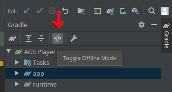

# Welcome to AGS Android

If you have questions, feel free to ask in the [Forum thread](https://www.adventuregamestudio.co.uk/forums/index.php?topic=59751.0), which also contains additional information.

If you are using the AGS Editor, [check the manual page](https://adventuregamestudio.github.io/ags-manual/BuildAndroid.html).

## Building

There are three projects here, in three different directories:

- `agsplayer/` : App AGS Player for running `.ags` games on your phone.
- `library/runtime/` : Module AGS Runtime for building AGS based Apps.
- `mygame/` : App MyGame you can customize for shipping your AGS game on Android, see it's own [`README`](mygame/README.md) file.

If you load the `agsplayer` directory on Android Studio, it will pickup and use the `library/runtime` module.

Additionally, there are other directories too:

- `gradle` : to hold shared gradle scripts when needed
- `misc` : has an example `android.cfg` file 
- `plugins` : this is an empty directory for placing prebuilt plugins that will be used by the project in `mygame/` dir.

### Building Requirements

Building should be done using Android Studio 4.1.2 or above. For the native parts, you will also need:

- CMake 3.16.3, which has to be added to PATH
- Ninja (at least 1.10.0 should be good), also needs to be added to PATH

In the Android Studio 4.2 and above, CMake 3.18+ and ninja are included, if you are using it, there's no need to install them externally - In Android Studio, see Tools, SDK Manager, SDK Tools and select and install CMake.

You can use other versions of CMake locally, you will need to adjust the version number `ags/Android/library/runtime/build.gradle`.

Once you open one of the above projects, wait for gradle to sync and the files to index. The first time it builds, an 
internet connection is required since gradle and CMake will fetch dependencies and download them to appropriate directories.

### Building tips

If you want to skip native builds, you can unzip the prebuilt libraries available on the project Releases and place them in place them in `library/runtime/libs`, which will allow to build only the Java parts and skip the native builds. 
A text file on the directory has more information.

You can also make a runtime library `uk.co.adventuregamestudio.runtime.aar` that will have all you need for making AGS based Android Apps.
Go the the `library/runtime` directory and run `./gradlew assembleRelease`, this should produce the desired artifact in `library/runtime/build/outputs/aar`.

If you want to write, build and debug Java, Kotlin and Cpp code seamlessly, remove the binary library files from the `library/runtime/libs` directory so that 
Android Studio integrates the build tasks and you can change and debug native code on your phone or the emulator with expected behavior. A file describing the expected files is placed there.
 
If your internet connection is not great, you can enable Android Studio Gradle plugin Offline mode after one successful dependency download 
and build has been made, by clicking in the severed connection button for Offline Mode in the gradle plugin menu. See picture below.

### Packaging

Release builds of the `agsplayer` app are done using a debug key so it's easier to install. Notice that each machine debug keys
are different, so it's necessary to uninstall the player before installing a new version or Android will fail to check the keys.
If you don't have auto-generated debug keys yet, they are automatically created the first time a debug build is finished on the computer.

If you want to build from the command line, you can run `./gradlew assembleRelease` or `./gradlew assembleDebug` from the `agsplayer` directory to produce a build of the apk in `agsplayer/app/build/outputs/apk`.

---

## Touch controls

By default the Android port provides a touch-to-mouse emulation, where certain taps and moves are translated into the pseudo-"mouse" input in game. Using game config file (or Preferences menu in the AGS Player) you may choose between 2 control schemes and additionally enable relative cursor mode. It's also possible to disable touch-to-mouse emulation completely: this option is left for the future games which might have proper touch controls implemented in the game script.

The 2 touch-to-mouse schemes follow:

### One Finger

This is a simple reimplementation of the default SDL2 touch-to-mouse emulation.

In this scheme holding a finger down translates into Left mouse button down, while releasing a finger would release the "mouse button".

Moving finger translates into mouse cursor motion with Left button pressed.

This scheme might work well for games with one-click style controls and/or drag'n'drop mechanics, but may be inconvenient for others. Also it's not possible to move the cursor without having a LMB not pressed (so impossible to just "hover" the cursor around hotspots, for example).

### Two Fingers

This is a reimplementation of an older AGS Android touch-to-mouse controls, with minor differences.

* Single tap with one finger = LMB click (the click occurs when the finger is *released*).
* Hold finger and drag = move mouse cursor around *without* any button press (useful for hovering cursor above the hotspots).
* Two fingers tap (or, hold one finger and tap with another) = RMB click (the click occurs when the second finger is released).
* Double tap + drag (tap once then hold down again quickly and drag) = move mouse cursor with LMB pressed (useful for drag'n'drop action).

---

## Using the AGS Player

### Adding games to the game list

By default games have to be placed into the external storage device. This is
usually the SD-card, but this can vary.

Place the game into the directory

    <EXTERN>/ags/<GAME NAME>/

<GAME NAME> is what will be displayed in the game list.

### Game options

Global options can be configured by pressing the MENU button on the game list
and choosing the "Preferences" item. These settings apply to all games unless
they have their own custom preferences set.

By performing a longclick on a game entry in the list, a menu opens that lets
you choose custom preferences specifically for that game.

In the same menu you can also choose "Continue" to resume the game from
your last savegame.

### Preferences

The preferences modifies the `android.cfg` file, either the local or global one.

#### General `[misc]`

- **Enable config** : yes or no - Uses per game config instead of the global one, _available only in per game config_.  
  `config_enabled = 0, 1`  
- **Lock screen orientation** : None, Portrait, Landscape  
  `rotation = 0, 1, 2`  

#### Controls `[controls]`

- **Touch-to-mouse emulation** : Off, One Finger, Two Fingers
  `mouse_emulation = 0, 1, 2`  
- **Relative mouse control** : yes or no  
  `mouse_method = 0, 1`  
- **Mouse speed in relative control** : a multiplier to the cursor speed
  `mouse_speed = a floating-point value`  

#### Sound `[sound]`

- **Enabled** : yes or no  
  `enabled = 0, 1`  

#### Video `[video]`

- **Drop frames if necessary** : disabled, to be removed  
  `framedrop = 0, 1`

#### Graphics `[graphics]`

- **Renderer** : Software (SDL2) or Hardware (OpenGL ES2)  
  `renderer = 0, 1`  
- **Screen Scaling** : No scaling, Fullscreen Preserving Aspect Ration, Fullscreen Stretch.  
  `scaling = 0, 1`  
- **Linear Filtering** :  yes or no  
  `smoothing = 0, 1`  
- **Super Sampling** : yes or no
  `super_sampling = 0, 1`
- **Smooth Scaled Sprites** : yes or no  
  `smooth_sprites = 0, 1`
  
#### Debug `[debug]`

- **Show framerate** : yes or no  
  `show_fps = 0, 1`
- **Log debug messages** : yes or no  
  `logging = 0, 1`  

---

## Links

Android Studio: https://developer.android.com/studio/

Android NDK: https://developer.android.com/ndk/

Android thread on the AGS forum: https://www.adventuregamestudio.co.uk/forums/index.php?topic=44768.0
