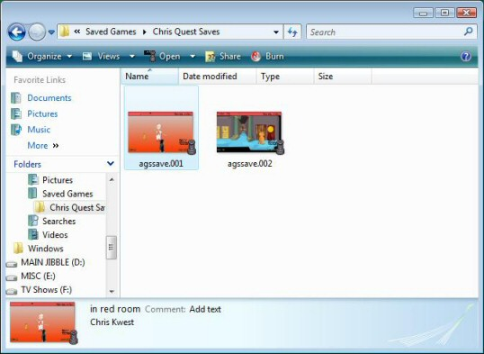
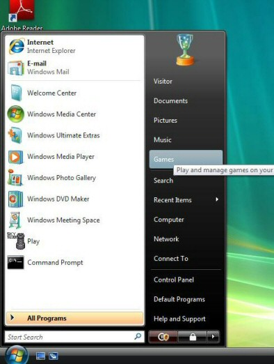
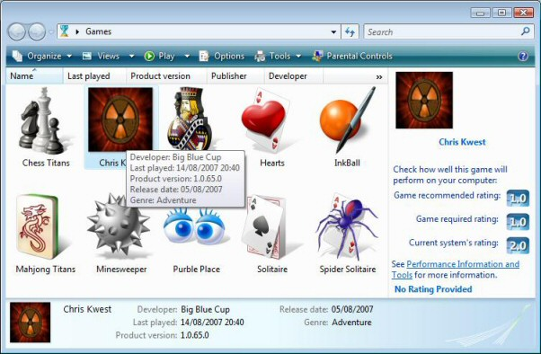

Other Features
##############

This section describes AGS features that were not covered in the tutorial.

.. _MusAndSound:

.. index::
   Sound effects
   Audio

Music and sound
===============

Sound and music are an essential part of any gameplay experience, and AGS 3.2 and higher
provides a re-written audio system giving you full control over your game audio.

File formats
------------

AGS is able to play the following types of audio file: OGG, MP3, MIDI, WAV (uncompressed),
MOD, XM, IT, S3M and VOC.

The only limitation to this is that AGS is only able to play one MIDI file at a time.
If you attempt to play two MIDI music files simultaneously, the first one will be cut
off when the second one starts playing.

If you haven't heard of OGG before, it's a digital music format, similar to MP3, but achieving
better compression and higher quality. More importantly, it is a totally free format
so no royalty payments or licenses are required to use it. For more information and
programs to encode your music to OGG, see http://www.vorbis.org/

Audio in the Editor
-------------------

Look under the "Audio" branch in the project tree. Here you'll find sub-nodes called
"Speech", "Types" and two default folders called "Music" and "Sounds".

Speech
------

At the moment, voice speech files are not setup within the editor. See the :ref:`Speech <VoiceSpeech>`
help page to find out more about adding speech to your game.

Audio Types
-----------

Audio Types allow you to group together similar types of audio files. The standard
distinction here is between Sound and Music, whereby you usually only want one Music
file to be playing at any one time; whereas you might have several simultaneous sound
effects.

Double-click on an Audio Type and it will open up; you can see its properties in the
Property Grid. Here, the "MaxChannels" setting allows you to specify how many audio
clips of this type are allowed to play at the same time. The "VolumeReductionWhenSpeechPlaying"
setting allows you to have AGS automatically reduce the volume of these audio clips while
speech is playing, to make it easier for the player to hear the speech over the background
music.

You'll probably find that the default settings here are fine, and in many games you won't
need to change them.

Importing audio files
---------------------

Now let's get on to the important question -- how do you add sound and music to your game?
Well, if you right-click on the "Sound" or "Music" folders (or any other folders that
you create yourself), you'll see an option called "Add Audio Files".

Select this option, and you'll be given a dialog box to find the audio files that you
want to import. Once imported, they'll be assigned script names automatically.

Double-click an audio file in the project tree to open a window where you can preview
it, as well as change its properties in the Property Grid.

Playing audio in the game
-------------------------

The script to play an audio clip in the game is very simple. For example::

   aExplosion.Play();

plays the audio clip called *aExplosion*.

Priorities and channels
-----------------------

AGS currently has an 8-channel audio system, which means that up to 8 sounds can be
playing at the same time. With the default Audio Types settings, one channel is reserved
for speech, one for music and one for ambient sounds; thus leaving 5 available for
sound effects.

If you try to play an audio clip and there are no channels available, then an existing
one will be stopped and the new one will take its place. However, this will only
happen if the new audio clip has an **equal or higher** priority than one of the currently
playing sounds.

Thus, the priority allows you to decide which audio clips are more important than others.
For example, you might set a footstep sound as low priority, and a door opening as
high priority. This can be configured at the folder level in the editor, and also by
changing the properties of an individual audio clip (by default they will inherit from
their containing folder).

Sometimes you might not want the priority of the sound to be fixed in the editor -- you
might want to decide it at run-time in the script. For this reason the *Play* command
has an optional parameter which allows you to explicitly specify the priority when you
play it, for example::

   aExplosion.Play(eAudioPriorityLow);

Seeking and changing volume
---------------------------

So, how do you change a sound once it is playing? Well, there are no methods on the
Audio Clip to do this, because you might be playing two copies of the same sound at
once, and then AGS wouldn't know which one you wanted to access. That's where **Audio
Channels** come to the rescue.

When you use the Play() command, AGS returns to you an AudioChannel* instance representing
the channel on which the sound is playing. You can store this to a global variable and
access it later on. For example::

   AudioChannel* chan = aExplosion.Play();
   chan.Volume = 20;

This will start the *aExplosion* audio clip playing, and then change its volume to ``20%``.

Using Audio Channels
--------------------

Supposing you want to start playing a sound now, and then change its volume or panning later on.
How would you do that? Well, you'd need to keep the AudioChannel around, so that you can access
it later. The easiest way to do that is to make it a Global Variable; if you open the Global Variables
editor, you can create a new AudioChannel* variable (let's call it *longWindedSound*). Then when
you play the sound you set it like this::

   longWindedSound = aExplosion.Play();

later on, elsewhere in the script, you can change the volume by doing::

   if (longWindedSound != null)
   {
     longWindedSound.Volume = 20;
   }

Note the check for null here -- this makes sure that your game won't crash if the sound isn't
playing (it might have finished, or not have been started yet).

Overall system volume
---------------------

There is a property called :ref:`System.Volume <System.Volume>` that controls the
overall game volume, which you can use with some sort of volume control slider for the
player. All individual sound volumes work within the overall system volume.

Conclusion
----------

The new audio system in AGS gives you much more control over your game audio.
Please see the following sections for a complete list of the supported commands:

:ref:`AudioClip reference <AudioClipCommands>`,
:ref:`AudioChannel reference <AudioChannelCommands>`

.. _VoiceSpeech:

.. index::
   Speech

Voice speech
------------

With AGS you can link a line of dialog to a speech file, to enable "talkie"-
style games. Suppose you have a dialog script with the following::

   ego: "Hi! How are you?"
   david: "I'm fine."

Normally this would display the words in the speech text above the characters
heads. However, you can add the special character '&' to symbolise that a
voice file should also be played. The file name is made up of the **first four
letters** of the character's **script name**, then an ID number. For example,

::

   ego: &10 "Hi! How are you?"
   david: &7 "I'm fine."

This would play EGO10.WAV with the first line, and DAVI7.WAV with the second.
When a line of text has a voice linked to it, the text on the screen will not
be removed until the voice file has finished playing. If the player interrupts
it by clicking the mouse or pressing a key, the text and voice will be stopped.
Voice files must be placed in the "Speech" sub-directory of the game folder.

You can also use speech with Say script function.

::

   cEgo.Say("&10 Hi! How are you?");
   cDavid.Say("&7 I'm fine.");

*NOTE:* WAV, OGG and MP3 format files can be used for speech.

*NOTE:* You cannot use speech file numbers above 9999. That is, you can
have EGO1.OGG all the way up to EGO9999.OGG, but not EGO10000.OGG or higher.

Speech is compiled into a file called SPEECH.VOX and is separate
from the rest of your game data so that you can offer it as an optional extra
download to the player. The game will function correctly if the file is not
present.

*SeeAlso:* :ref:`Speech.VoiceMode <Speech.VoiceMode>` script property.

.. _AudioCache:

.. index::
   AudioCache folder

The AudioCache folder
---------------------

When you import audio files into AGS, you'll probably notice that a folder
inside your game folder, called AudioCache, starts to fill up with files. What
is it and why is it there?

Well, when you import audio into AGS, you might be importing it from anywhere --
it could be off your hard drive, but it might also be off a USB stick or a CD.
AGS can't rely on the audio files always being there because you might remove
the USB stick or delete the files on it.

Therefore, when you import audio into AGS it makes a copy of the file in the AudioCache
folder. AGS also remembers where the file came from, and when you compile your game
it will check if the file has been updated in its original location -- if so it will
copy the latest version to the AudioCache.

But if the source file no longer exists, your game will continue to build just fine
because AGS has its own copy of the file.

This allows AGS to stick to one of its core principles, that all the files you need
to build your game are within the game's folder. That way, you have complete security
in knowing that by backing up your game folder, your game will be safe if the worst happens.

.. index::
   GUI

Editing the GUIs
================

The game interface is split up into GUIs. Each GUI is a
rectangular region on the screen which is drawn on top of the background
scene. Each can be set to either:

* be always displayed (for example the Sierra status-line)
* pop-up when the mouse moves to a certain position (eg. Sierra icon-bar)
* pop-up on script command only

The default interface is made up of two GUIs - the status line, and the
icon bar.

Go to the "GUIs" node in the main tree. Under this all the GUIs in the game
are listed -- double-click one to edit it. To create a new one, right-click
on the main "GUIs" node and choose "New GUI".

Once you've opened up a GUI, you'll notice the GUI itself in the main window,
and its settings can be edited in the Properties grid. This allows you to change the
background colour of the GUI, set a background picture, and set the
location and width/height amongst other things.

The "Visibility" property allows you to set when the GUI is displayed. The
default is "Normal", which means that the GUI will initially be visible,
though you can turn it off with a GUI.Visible=false command in game_start if you need to.

The "Popup modal" option means that the GUI will be initially
off and must be turned on by a script command. With this option,
the game will be paused while the GUI is displayed, during which time the
on_mouse_click  and  on_key_press  functions will not get run.

The "Mouse YPos" option means that the GUI only appears when the mouse vertical
position moves above the y-coordinate set with the "Popup-YP" option.

"Persistent" is like "Normal", except that this GUI will not be removed
during a cutscene when the setting "GUIs turn off when disabled" is set in
the general settings. Useful if you want most of your GUIs to turn off, except
a status line or whatever.

The "Z-Order" setting allows you to set which order the GUIs are drawn in - ie. when
there are two GUIs that overlap, which is drawn in front. The Z-order setting is an
arbitrary number between 0 and 1000. AGS draws the GUIs in order, from the lowest numbered
at the back to the highest numbered at the front.

The "Clickable" setting allows you to set whether the GUI and buttons on it
respond to mouse clicks. This is on by default, but if you turn it off and
the player clicks on the GUI, the game will actually process the click as if
they clicked behind the GUI onto the actual screen. Useful for transparent GUIs
which are only used to display information.

You'll notice that the GUIs have names. These can be used in the script in the
same way as character names. For example, if a GUI is called "gIconBar", you can use
scripts such as::

   gIconBar.Visible = true;

.. index::
   Buttons

GUI buttons
-----------

To provide interactivity with the interface, you use buttons.

To add a button, click the "Add button" button in the toolbar, and then drag a rectangle
with the mouse onto the GUI. You will see it displayed as a text button, with
the text "New button" on. Notice that the Properties window is now displaying
properties for your new button rather than the GUI.

Using the Properties window, you can set a picture for the button instead,
and you can also set various other self-explanatory attributes.
You set what happens when the player clicks on the button by using the "Click
Action" attribute. This can be set to "Run Script" (the default), and also "Set
mode", which changes the cursor mode to the mode specified in the "New mode number"
property.

To delete a GUI button, right-click it and choose Delete.

.. index::
   Labels

Interface text
--------------

You can easily display static text on interfaces. For example, the Sierra-style
interface displays the score in the status bar.

To show text to a GUI, you need a label. Click the "Add label" button in the
toolbar, then drag out a rectangle like you did when adding a button. You can change the
text displayed in the label by editing the "Text" property. Notice that the
text automatically wraps round to fit inside the rectangle you drew.

As well as typing normal text into the label, you can add some special markers
which allow the text to change during the game. The following tokens will be
replaced with the relevant values in the game:

* *@GAMENAME@* -- The game's name, specified on the Game Settings pane
* *@OVERHOTSPOT@* -- Name of the hotspot which the cursor is over
* *@SCORE@* -- The player's current score
* *@SCORETEXT@* --  The text "Score: X of XX" with the relevant numbers filled in.
* *@TOTALSCORE@* -- The maximum possible score, specified on the Game Settings pane

Example: You have *@SCORE@* out of *@TOTALSCORE@* points.

The Properties window also allows you to align the text to left, right or
centre, as well as change its font and colour.

.. _TextWin:

.. index::
   Text windows; customizing

Customized Text Windows
-----------------------

If you want to add a personal touch to the standard white text-boxes which
display all the messages during the game, you can create a border using the
GUI Editor. Right-click the "GUIs" node, and choose "New Text Window GUI".

The element will be resized to about 1/4 of the screen, and you will see 8
pictures - one in each corner and one on each side. These are the border
graphics. You change the graphic for a corner in the normal way.

In the game, the corner graphics will be placed in the respective corners of
the text window, and the side graphics will be repeated along the edge of
the window. To tell the game to use your custom text window style, go to the
General Settings pane, and check the "Text windows use GUI" box. Then, enter
the number of the GUI which you used.

You can also set a background picture for the text window. In the GUI editor,
simply set a background picture for the GUI element. The graphic you specify
will not be tiled or stretched in the game; however, it will be clipped to
fit the window. You should use a graphic of at least about 250x80 pixels to
make sure that it fills up the whole window.

To set the text colour in the window, simply set the Foreground Colour of
the GUI and that will be used to print the message text in.

.. index::
   Inventory; Lucasarts-style

Custom inventory
----------------

Another option you may have noticed in the GUI editor is the Add Inventory
button. This allows you to drag out a rectangle which will display the
player's current inventory, in the same way as the Lucasarts games did. To
make the inventory window scrollable, you will need to add Up and Down arrow
buttons, and attach script code to those buttons to use the available
functions such as :ref:`InvWindow.ScrollUp <InvWindow.ScrollUp>` and
:ref:`InvWindow.ScrollDown <InvWindow.ScrollDown>`.

To see a full list of commands available for inventory windows, see
the :ref:`GUI Inv Window Functions and Properties <GUIInvFuncs>` section.

Sliders
-------

You can now add sliders to your GUIs. This allows you to have a nice interface
for the player to change settings such as volume and game speed.
To add a slider, click the "Add slider" button and drag out its rectangle just
like you would for a button. You can also resize it by dragging the bottom-
right hand corner out in the same way as a button.

Sliders can be either vertical or horizontal. The direction that it is drawn
in is automatic depending on the size that you stretch the slider box to - if
it is wider than it is tall you will get a horizontal slider, otherwise you'll
get a vertical slider.

For the properties of a slider you can set the minimum, maximum and current
values that the slider can have. In the game, the user will be able to drag
the handle from MIN to MAX, and the slider will start off set to VALUE.
For horizontal sliders, MIN is on the left and MAX on the right, for vertical
sliders MAX is at the top and MIN is at the bottom.

Whenever the user moves the handle's position on the slider, the OnChange event is
called. This means that if they continually drag the handle up and down,
the event will get called repeatedly.

Your script can find out the value of the slider using the Slider.Value script property.

Text Boxes
----------

A text box is a simple device that allows the player to type information into
your game. Adding a text box works like adding the other types of control.

If a text box is on a currently displayed GUI, all standard keypresses (ie.
letter keys, return and backspace) are diverted to the textbox instead of
being passed to the on_key_press function. When the player presses Return in
the text box, the OnActivate event is called. You can then use the TextBox.Text
property to retrieve what they typed in.

List Boxes
----------

List box controls allow you to add a list of items to your GUI. This could
be useful for doing a custom save/load dialog box, allowing the user to
choose between various options, and so forth.

You use the ListBox script functions to manipulate the list box - for
example, ListBox.AddItem to add an item, or ListBox.SelectedIndex to get the current
selection.

The ListBox.Translated property defines whether the translation will be applied
to list items or not. It is recommended to disable translation for lists containing saved games.

The OnSelectionChanged event is fired when the player clicks on an item in the list.
You may wish to ignore this or to do something useful with it.

.. _DistGame:

.. index::
   Compiling the game
   Splash screen; creating
   Loading screen; creating

Distributing your game
======================

When you choose the "Build EXE" option in the Editor, a "Compiled" sub-directory
is created in your game's folder, with all the files that you need to distribute
your game. At its simplest this will just be your game executable and the setup
program, but you may also have audio and speech libraries (AUDIO.VOX and
SPEECH.VOX); and if you have selected to split resources files, you will also
have several files named "game.001", "game.002", and so forth.

So, when you want to upload your game to the internet, just zip up the files in
the Compiled folder, and there you go!

*NOTE:* It is not possible to load the exe file back into the AGS Editor. This
means two things when only the EXE file is available: (1) other people can't
edit your game's data, and (2) you can't either. Always keep a backup of the
other files produced (\*.CRM, GAME.AGF, etc) as they are what the Editor
needs to be able to load your game for editing.

*TIP:* You can make a "Loading..." style splash screen to be displayed while your game starts
up. To do so, simply save the image as  PRELOAD.PCX (must be the same resolution and colour depth
as the game) in the game folder, and build the game. It should then display while the game is loading.

*NOTE:* Due to the licenses of code used by AGS, your documentation should acknowledge the
following:

TrueType font display uses ALFont by Javier Gonzalez and the Freetype project. Distributed
under the terms of the FreeType project license.

OGG player is alogg by Javier Gonzalez, using the Ogg Vorbis decoder, which is available
from http://www.xiph.org/  Copyright (c) 2002-2008, Xiph.org Foundation

MP3 player is almp3, by Javier Gonzalez and the FreeAmp team. It uses the mpg123 MP3 decoder,
and is distributed under the terms of the GNU Lesser General Public License version 2.1.

You should also include all the license_* files from the DOCS directory with your game.

**IMPORTANT:** If you intend to make money for your game, be it shareware or commercial,
it is imperative that you read the Legal Information page on the AGS website, currently
at http://www.bigbluecup.com/aclegal.htm

*NOTE:* The AUDIO.VOX file contains audio clips that you have marked as "InSeperateVOX"
in the editor. This allows you to have an optional audio download, if your game uses lots
of sound files but you don't want the player to have to download them.

.. index::
   Icon

Custom icon
-----------

If you wish, you can use your own custom icon when you build a Windows EXE
file. To do this, simply place your icon in your game's folder, and name
it USER.ICO. Then, load the editor and save the game.

AGS is only able to build your custom icon if you are running the editor on
Windows 2000 and later. If you're using Windows 98 then your game will be
built with the standard AGS icon.

*NOTE:* The icon **must** be a proper Windows .ICO file, **not** just a renamed
BMP file. Icon editors, such as AX-Icons from http://www.axialis.com, will convert
it for you.

You can also have a custom icon for the Setup program generated. To do so, create
your icon as above but name it **setup.ico** in the game folder.

.. _SplitRes:

Splitting resource files
------------------------

Some people found that once their game became large, the single EXE file
was slow to load due to anti-virus checkers scanning the whole file.
AGS includes an option to split up the resource files into smaller chunks
to avoid this happening. On the General Settings pane you'll notice a
setting "Split resource files into X Mb sized chunks".

If you tick this, then type in a number such as 1 or 2, then save the game,
the game data will be split up into chunks that size, named GAME.001,
GAME.002 and so on.

Some resources are still combined into the EXE file but
all the rooms will be placed into the other files.
If you use this option, you need to distribute your game's EXE file plus
all the GAME.00? files.

Backing up your game
====================

You will no doubt want to back up your game files, and should do so regularly during
your game development. But which files should you back up?

When taking a backup, make sure you copy **ALL** the files listed below:

* *GAME.AGF* -- this is the main data file for your game and contains almost
  all of the game settings. Without it, your game is lost.
* *ACSPRSET.SPR* -- this is your game's sprite file, containing all the sprites
  from the sprite manager.
* *ROOM\*.CRM* -- all the ROOM*.CRM files are your room files, and obviously without
  one of them you wouldn't be able to go into that room any longer.
* *\*.ASC, \*.ASH* -- these are your script files, and contain all of your
  scripting handywork.
* *\*.TRS* -- translation source files. They contain any translations that you've
  had done.
* *AGSFNT\*.TTF, AGSFNT\*.WFN* -- these files contain any fonts you have imported.

Also remember to back up any sound, music and video files you are using.

.. _TextParser:

.. index::
   Text parser
   Parser

The text parser
===============

You can now use a text parser in your games if you wish to, much as the older
Sierra games did.  Go to the "Text parser" pane in the editor. There, you
will see a short list of words which are provided for you. Each word has a
number beside it.

Basically, you add words you want to use by right-clicking the list, and
selecting "Add word".
However, the real beauty of the parser is its ability to recognise synonyms -
that is, two words that mean the same thing. So, for example, if you wanted
the player to type "look at fence", they might well type "look at wall"
instead, if that's how they see the drawing. Or, a British person might type
"colour" whereas an American might type "color", both of which should have
the same effect.

To add a synonym for an existing word, highlight the current word, right-click it
and choose "Add synonym". You'll notice that the new word is given the same
number as the old one. All words with the same number are considered identical
by the parser.

You will notice that the provided list has a lot of words with number 0. This
is a special number, that indicates that the parser should ignore the word
completely. In our previous example, the player might type "look at the fence",
"look at fence", or just "look fence". By adding words like "at" and "the" to
the ignore list, they get stripped out of the user's input automatically. To
add new ignore words, just select an existing one and add a synonym.

So, how do you use the text parser? Well, you'll need a text box GUI control
somewhere in order for the user to type in their input, or you could just
use the InputBox command (but it has quite a short line length).

When the user has typed in their text (you'll probably know this by the text
box's event being activated), you call the  Parser.ParseText  script
function which tells AGS what input string to use in subsequent commands.
You then simply use the Said command to test what the player typed in.

You type the whole sentence (but NOT including any ignore words), and AGS will
compare it to the user's string, considering all synonyms identical.
For example (assuming our text box is called "txtUserInput")::

     String input = txtUserInput.Text;
     Parser.ParseText(input);
     if (Parser.Said("look fence")) {
       Display("It's an old wooden fence.");
     }
     if (Parser.Said("eat apple")) {
       Display("You'd love to, but you don't have one.");
     }

There are a couple of special words you can use with the Said command.
"anyword" will match any word that the user types in. For example,
Said("throw anyword away")  will match if they type "throw dagger away",
or "throw trash away".
"rol" (short for Rest-of-Line) will match the rest of the user's input. So,
you might want to do::

   if (Parser.Said("kill rol")) {
     Display("You're not a violent person.");
   }

This way if they try to kill anything they will get the generic response.

Sometimes, you want to accept two different words that are not synonyms as
the same thing. For example, the words "take" and "eat" normally have totally
different meanings, so you wouldn't make them synonyms of each other. However,
if the player has a headache tablet, for instance, then "take tablet" and
"eat tablet" would both be valid. This is where the comma "," comes in - if
you include a comma in your input, all synonyms of all words separated by
the comma will match. So::

   if (Parser.Said("eat,take tablet"))

will match eat or take and all their synonyms, then tablet and its synonyms.

Another fairly common task with a parser is to check for optional words - for example,
if there is a brick wall on the screen, you want the player to be able to type "look wall"
and "look brick wall". Although this can be done with two OR'ed Said commands, AGS makes it
easier. You can use [brackets] to signify an optional word. So::

   if (Parser.Said("look [brick] wall"))

will match "look wall" and "look brick wall".

Now this is all very well, but in different rooms you have different items to interact
with - for example, in one room there might be a tree that the player should be able
to type "look at tree" to look at, and so on. Putting all this in your global script would make
a big mess. So, enter the :ref:`CallRoomScript <CallRoomScript>` function. Using this,
you can do::

     Parser.ParseText(input);
     String badWord = Parser.SaidUnknownWord();
     if (badWord != null)
       Display("You can't use '%s' in this game.", badWord);
     else if (Parser.Said("eat apple")) {
       Display("You'd love to, but you don't have one.");
     }
     ... // other game-wide commands
     else
       CallRoomScript (1);

Then, the room script can check for things that the player can do in the current room.
See the :ref:`CallRoomScript <CallRoomScript>` description for more information.

Translations
============

AGS now makes it easy for you to create translations of your games.
Right-click the "Translations" node in the tree, and choose "New translation". Once
you've named it, AGS will ask if you want to populate the file now. Say yes.

Creating the translation writes all lines of game text to the file - no script
sources, just all the displayable text from the game. The file is generated with
each line of text separated by a blank line.

You can now give this file to your translators. They should **fill in each blank line
with the corresponding translation of the English line above it (DO NOT REPLACE THE
ORIGINAL ENGLISH LINES WITH THE TRANSLATION)**. If a line is left blank, it will simply
not be translated.

Once the translation is done, right-click the translation and choose "Compile".
It will be converted into a compiled translation (``.TRA``) file in the
Compiled folder, which can be used with the game engine.

Run the game Setup program, and select the translation from the drop-down box.
Then, run the game, and all the text should be translated.

*NOTE:* With SCI fonts, only 128 characters are available, so many of the extended
characters needed for non-english translations are not available. You may need to use
substitute characters, or consider using TTF fonts for international applications. However,
bear in mind that TTF rendering slows down the engine.

While most in-game text is translated automatically, there are a few instances when
this is not possible. These are when a script uses functions like Append to build
up a string, or CompareTo to check some user input. In these cases, you can use the
:ref:`GetTranslation <GetTranslation>` function to make it work.

You'll also have noticed a "Update" option when right-clicking a translation. This is useful if you've
got a translated version of your game, but you want to update the game and add a few bits in.
Once you've updated your game, run the Update Translation option and the translation file
you select will get any new bits of text added to it at the bottom -- then you can just ask
your translator to additionally translate these lines.

.. _GlobalVariables:

Global variables
================

The Global Variables pane allows you to easily add variables to your game which
can then be accessed from all your scripts.

In previous versions of AGS, declaring a global variable in the script involved
defining it in three different places, with import and export clauses in the
appropriate locations. Now, this whole process is vastly simplified with the new
Global Variables Editor.

When should I use a global variable?
------------------------------------

Use a global variable when you need to store some information that you need
to access from different scripts. For example, if you want to store the player's
health and you want all your different scripts to be able to access this value,
then use a global variable.

If you just need to store some information locally (for example, a "door opened" flag
that only applies to one particular room) then you should declare the variable
manually at the top of the room's script file instead.

What about GlobalInts and Graphical Variables?
----------------------------------------------

GlobalInts and Graphical Variables were ways in which previous versions of AGS
provided global variable capabilities. They are now considered obsolete, and are
replaced with this new Global Variables system instead.

How do I use global variables?
------------------------------

The Global Variables Editor is pretty self-explanatory. To add a variable, right-click
and choose "Add". You can name the variable, and choose its type and initial value.
Most of the time you'll probably be using the *int* and *String* types. Optionally,
you can also set a default value for the variable.

Then, in your scripts it's a simple matter of just using the variable with the name
that you gave it. Simple! So, for example if you add an int global variable called
"myVariable", then in your script you can just do things like this::

   if (myVariable == 3)
   {
     myVariable = 4;
   }

or

::

   Display("myVariable: %d", myVariable);

That's it! Just use it as you'd use any other variable declared in the script.

Note that some of the types available are managed instance pointers, like "GUI",
"DynamicSprite" and "Character". These are for more advanced users only.
If you create one of these you cannot set a default value, and it will initially
be set to *null*. You will need to initialize the pointer in your script to
point to something before you use it.

.. index::
   Properties

Custom Properties
=================

What are custom properties?
---------------------------

Suppose you're making a Lucasarts-style game, and you want all your hotspots to have
a default event (so if the player right-clicks a window, for example, "Open" will be
the default, but if they click on a pen, "Pick up" will be the default).

To do that, surely you would have to script in lots of code to change the default mode
over each different object?

This is where Custom Properties come to the rescue. You can create a custom property
for "Default event", for example, and then have some simple code in the global script
to use the setting accordingly.

How do I use them?
------------------

You'll notice that characters, objects, hotspots, rooms and inventory items all have
a "Properties" option in their property grids. Select it and click the "..." button.

Since you don't yet have any custom properties, you'll get a blank window, so
click the "Edit Schema" button. This takes you to the Schema Editor, where you
can create the various properties you want in your game. To begin with you are
presented with an empty list box, so right-click in it and choose "Add property".

In the "Add Property" window you can set various options about the new property:

* *Name* -- this is the name by which you will access the property from the script.
  This cannot be changed after the property has been created.
* *Description* -- this is the user-friendly description which will be displayed
  in the custom property editor when you are setting the property.
* *Type* -- this specifies what type of property you want. "Boolean" gives you
  a checkbox (which will return 0 or 1 to the script), "Number" gives you a text box which
  you can type numbers into, and "Text" gives you a larger text box which can store a string.
* *Default value* -- this specifies what the default value of the property will be
  for objects where you have not set it specifically.

For example, add a new "Boolean" property. Close the schema editor, and then click the
"Properties" button again. You'll now have a window with a checkbox with the description
text you typed in. You can click the "Edit schema" button there to return to the schema
editor if you like.

All types of game item share the same schema. That is, if you create a "Jibble" property
in the schema editor for a hotspot, it will also appear in the properties window for
characters, objects, and so on.

Getting values in the script
----------------------------

To access the properties from the script, there are various script functions. See
their descriptions for how they work:

* :ref:`Character.GetProperty <Character.GetProperty>`,
* :ref:`Character.GetTextProperty <Character.GetTextProperty>`,
* :ref:`Hotspot.GetProperty <Hotspot.GetProperty>`,
* :ref:`Hotspot.GetTextProperty <Hotspot.GetTextProperty>`,
* :ref:`InventoryItem.GetProperty <InventoryItem.GetProperty>`,
* :ref:`InventoryItem.GetTextProperty <InventoryItem.GetTextProperty>`,
* :ref:`Object.GetProperty <Object.GetProperty>`,
* :ref:`Object.GetTextProperty <Object.GetTextProperty>`,
* :ref:`GetRoomProperty <GetRoomProperty>`, and
* :ref:`Room.GetTextProperty <Room.GetTextProperty>`.

Custom property values cannot currently be set from within the game script - they are read-only
at runtime.

Plugins
=======

AGS supports user-written plugins in order to provide functionality to your game
that AGS itself does not support.

The plugin developer's guide is available from the Resources section of the AGS website.

Plugins come as DLL files with the names  AGS*.DLL, for example  agscircle.dll  might be a
plugin providing a DrawCircle script function.

How to use a plugin
-------------------

So, you've downloaded a plugin for AGS. What do you do with it?
Well, firstly read any readme file that the plugin author has included. But to get
any plugin to work you must do the following:

1. Place a copy of the plugin files in the AGSEDIT directory (not your game folder).

2. Start the AGS Editor up, and load your game. Go to the Plugins node in the main tree.
   Open it up, and you should see all available plugins listed. To use one in your game,
   right-click it and choose "Use plugin". The plugin developer should provide
   instructions on what to do next. Save your game to make sure that AGS remembers
   that you want to use the plugin.

Lip sync
========

If you want, AGS can pretend to 'read' out speech text. Go to the 'Lip Sync' pane
in the editor.

Normally when a character is talking, AGS simply cycles through the speech animation
from start to finish, and then loops back round. However, lip syncing allows you to be
cleverer by specifying a particular frame to go with various letters and sounds. Then,
as the character talks, AGS plays appropriate frames to simulate the character actually
saying those words.

In the Lip Sync Editor, you have 20 text boxes, one for each possible frame of the
talking loop. In each box, you can enter all the letters which will cause that frame of
the loop to be played. Letter combinations such as 'th' and 'ch' can be used too - AGS
will match each part of the spoken text to the longest possible phrase in the lip sync
editor.

separate the letters by forward slashes. For example,

::

   3  R/S/Th/G

will mean that frame 3 of the character's talking animation is shown whenever the
letter R, S, Th or G is spoken.

The "Default frame for unlisted characters" box allows you to set which frame is used
when a character not listed in any of the text boxes is encountered.

Voice speech lip sync
---------------------

AGS supports lip syncing voice speech to the talking animation. If you enable this
feature, you cannot use the standard lip-sync for non-voice lines.

*NOTE:* This is an unofficial feature and is not currently supported. Use at
your own risk.

*NOTE:* The voice sync feature only supports Sierra-style speech.

In order to do this, you need to download the third-party PAMELA application from
``http://www-personal.monash.edu.au/~myless/catnap/pamela/`` .

Set up the phenomes in Pamela so that there are only 10 (or as many talking frames as you have)
available choices. Then, in the Lip Sync pane of AGS, change the Type property to "Voice".
Enter the Pamela phenomes into the text boxes to create the association
between the pamela phenome code and the AGS frame number.

For example, enter "AY0" into frame 0's box, "E" into frame 1, and so forth - corresponding
to how it is set up in Pamela. For multiple phenomes to share the same frame, separate them
with forward slashes -- for example, "AY0/AY1" allows both of those phenomes to correspond
to the specified frame.

Use the Pamela application on each of your speech lines, and save a Pamela project file
(.pam file) for each speech file, naming it the same as the speech.

For example, the pamela project for  EGO46.OGG  would be called  EGO46.PAM, placed
in your game's Speech folder.

When you build the game, this pam file is compiled into the speech.vox and will be used
to sync the animation of the talking frames during the game.

*NOTE:* Voice lip sync does not work well with MP3 files. It is strongly recommended
that you use OGG or WAV for speech.

.. index::
   Templates; creating

New Game templates
==================

When you choose "Start a new game" in the initial "Welcome to AGS" dialog
box, a window appears with various templates that you can base your game off.

AGS comes with a few standard templates, but you can create your own too.

Using downloaded templates
--------------------------

If you've downloaded a game template from the internet, you should find a file with
a .AGT extension. This is the AGS Template File, and you just need to copy it into
the "Templates" folder within the AGS Editor directory.

Creating your own template
--------------------------

A game template is basically just an archive containing all of the game source files,
which are then extracted into the new folder when the user creates a new game. It is
similar to you just zipping up your game folder and sending it to a friend - except that
this way looks far more professional.

To create a template, first of all you create a game as normal in the editor. Once you
have everything set up how you want it, select "Make template from this game" on the File
menu. This will prompt you for a name for the template (this is what will appear under its
icon in the "Start New Game" dialog box), and then it will go away and compile the template
for you.

The template game takes the following files from your game folder:
Core game files (GAME.AGF, ACSPRSET.SPR), all script and room files, all sound and music
files, all fonts, game icons, and \*.TXT (to allow you to include a README.TXT or whatever).

If you include a  **template.ico** file in your game folder when you make the template,
then it will be used as the icon in the Start New Game dialog box. Otherwise, the icon will
be taken from user.ico (if present), or if not it will get the default AGS icon.

You can also include a "template.txt" file in your game folder. If you do, then its contents
will be displayed to the user in a messagebox after they create a new game based on the
template. You could use this to explain briefly about any key aspects of the template, or
it could tell them to read your README.TXT file. This file should be quite small - its entire
contents need to fit into a standard message box.

*NOTE:* Do not simply make a template out of a half-finished game. If you want to make
a template, you should start a game from scratch and make your changes - the user probably
doesn't want to already have a semi-completed game when they use your template.

.. _Debuggingfeatures:

Debugging features
==================

It happens to the best of us - you're merrily ploughing along making your game, when
suddenly something just isn't working right. It's not always obvious where the problem is.

AGS now has some advanced debugging features that can help you out. If all else fails, you
can of course ask for help on the AGS forums.

There are two different types of debugging, that are enabled in different ways. The script
debugger is only enabled when you use F5 to run your game; but the Debug() commands are
only available when "Enable debug mode" is set in your Game Settings. So, just before you
release your game, set that option to False and compile the game again to make sure the
player can't cheat using these features.

The script debugger
-------------------

When you run the game using the Run (F5) option, the game will be started with the debugger.
This allows you to pause your game and follow it through one line at a time.

There are two main ways to use this feature:

* Press SCROLL LOCK while playing the game. This will break out when the next line of script is run.
* Place a breakpoint in your script. You do this by clicking on a line of code
  in the script editor, then pressing F9. Then, when the game arrives at this
  line of code, it will stop running.

*NOTE:* The editor will allow you to place a breakpoint on any line of script.
However, in order for it to work, it must be placed on a line that has some code on it.

Once the script has stopped, you can use the "Step Into" button (F11) to step through
the lines of code, one by one. To allow the game to continue running normally, use the Run (F5) button.

*NOTE:* The Script Debugger is not supported on Windows 98 or Windows ME systems.
If you're still using Windows 98, please upgrade to Windows XP or higher to take advantage
of this feature.

The Debug() command
-------------------

There is a scripting command, :ref:`Debug <Debug>`, which you can use in your script
to help you find problems. The default setup enables some hotkeys for the various features -
in particular, Ctrl+X allows you to teleport to another room, Ctrl+A shows the walkable
areas on the screen and Ctrl+S gives you all the inventory items.

You can also use the Debug command to assign a hotkey to toggle FPS display on and off.
(FPS is Frames Per Second, which allows you to see the game speed and spot any slow-running
rooms).

This command only works if Debug Mode is enabled in your Game Settings.

Current room information
------------------------

Pressing Ctrl+D displays some information about the current room. It tells you what
room number you are in, followed by the current status of all objects in the room. After that,
another messagebox tells you all the characters that are in the current room and various
information about them.

This command only works if Debug Mode is enabled in your Game Settings.

Auto-number speech files
========================

If you've already made your game, and then you decide you want a voice pack to go with it,
the thought of manually adding speech numbers to every line of speech in the game is rather
daunting. But never fear, this is where the Auto-number Speech Files feature comes in.

If you select this option, then it will go through all the speech lines in the game and
add a &NUM to the start of them. A summary of the results is written to a file called
SPEECHREF.TXT in the game folder, so that you can easily see what file is what when
recording the speech.

The following types of message are auto-numbered. If one of the messages already has a speech
number, it will be overwritten:

* room messages set to be displayed as speech
* dialog script messages
* dialog options (if "Say" is selected for the option)
* Say commands in scripts

Integration with Windows
========================

AGS has the ability to integrate with Windows in two ways. Firstly, it can
be set up to launch save games directly from explorer when the player double-clicks
them; and secondly, in Windows Vista and later, AGS can integrate with the Game Explorer feature.

.. _EnhancedSaveGames:

.. index::
   Save games; enhanced

Enhanced Save Games
-------------------

Optionally, AGS can set up Windows Explorer so that you can double-click on a save game
file to directly launch the game and continue from where you left off.

Setting it up
.............

In order to enable this, open the General Settings pane, and look for the "Saved Games"
section. Here, there is an option called "Enhanced Save Games". If you switch this on,
then AGS will enable the integration with Windows Explorer.

To make this work, you need to set the Save Game File Extension setting to a file extension.
This is how Windows will identify the save game files, and you must supply an extension
of between 5 and 20 characters in length ("DemoQuestSave" would be an appropriate
extension for Demo Quest, for example).

By changing these settings, your game's saved game filenames will change, and therefore
you will lose access to any existing saved games.

Extra features for Windows Vista and later
..........................................

If the player is running Windows Vista or later versions, then this feature will also allow them to see
the save game description and screenshot (if enabled) in the Explorer preview window:

   *Save games with embedded screenshots on Vista and later versions*

Enabling the integration
........................

Once you've built the game, the integration won't be enabled immediately. If you want to
use this feature, you'll need to distribute your game in an installer rather than a zip
file, because there's an extra step you need to run after installation to set up the
association.

In your installer, you need to run the game executable with the special
parameter ``-registergame``  When you do this, AGS will create the necessary
associations in Explorer to get the feature working. If it is successful, it will
not display any messages.

You can manually test this by creating a shortcut to your game EXE file, and modifying
it to add ``-registergame`` to the end of the command line. Then, run the shortcut
and the associations should be created for you.

For un-installing, run the game EXE again but with a  ``-unregistergame``  parameter.
This will cause AGS to remove the associations from the player's system.

Cross-Platform Support
......................

* Windows: **Yes**
* MS-DOS: **No**
* Linux: **No**
* MacOS: **No**

.. _GameExplorer:

.. index::
   Windows Game Explorer
   Game Explorer

Windows Game Explorer
---------------------

Windows Vista and later versions have a feature called the Game Explorer, which is a special folder on
the Start Menu that lists all the games installed on the user's system and provides
easy shortcuts to play them.

AGS is now able to add your games to this list. However, in order to do so you
would need to distribute your game using an installer rather than just in a plain
zip file, since you need to tell AGS to add the game to the list at install-time.

   *The "Games" option launches the Game Explorer*

Enabling Game Explorer support
..............................

Open the General Settings pane in the editor. If you scroll down to the bottom of the
list, you'll find a section titled "Windows Game Explorer". The main setting
is called "Enable Game Explorer integration", and is disabled by default. Set this
to True if you want to be able to add your game to the Game Explorer (it will
have no effect on Windows XP and earlier versions).

Game Explorer settings
......................

The rest of the settings here allow you to set up various fields that the Game Explorer
can display. **Developer Website** must be a URL starting with "http://" if you fill
it in, and **Version** must be a four-point version number (eg. 1.0.0.0).

The **Windows Experience Index** is a score that Windows gives each computer depending
on its game-playing prowess. 1 is the lowest score, and 5 is the highest at present.
This field allows you to specify the minimum score required to play your game (this
will usually be 1 for AGS games, unless you have high resolution and lots of animation).

Save games
..........

If you set the *Save games folder name* property in the Saved Games section, then
the Game Explorer will provide a right-click option to go straight to the save game folder.
This is only useful if you also enable Enhanced Save Games.

Parental controls
.................

AGS is not currently able to support the Windows Parental Controls, due to Windows requiring
the game to be digitally signed for this to work. Digital signatures require you to buy
a certificate from an authority such as Verisign, so at present they are not supported.
Your game will be classed as "Unrated" by Windows.

Boxart image
............

The Game Explorer can display a high-resolution alpha-blended image for your game, rather
than the standard game icon. To utilise this, place a file called ``GameExplorer.png``
in your game folder, and rebuild the game EXE. This must be a PNG image, no larger
than 256 x 256 pixels:

   *My game ("Chris Kwest") in the Game Explorer*

Adding the game to the Game Explorer
....................................

In order to actually add the game to the Game Explorer's list, you need to run the
game executable with the special parameter ``-registergame``  When you do this,
AGS will add the game to the Game Explorer and exit. If it is successful, it will
not display any messages.

Therefore, as part of your installer, once the game files are all installed you should
add a step at the end to run the game EXE file with this parameter. It will do nothing
on Windows XP and earlier versions.

For un-installing, run the game EXE again but with a  ``-unregistergame``  parameter.
This will cause AGS to remove the game from the Game Explorer's list.

*NOTE:* If you have both Enhanced Save Games and Game Explorer Integration enabled,
then the ``-registergame`` and ``-unregistergame`` commands will register/unregister
both.

Cross-Platform Support
......................

* Windows: **Vista and later**
* MS-DOS: **No**
* Linux: **No**
* MacOS: **No**

.. _SourceControl:

Source Control integration
==========================

The AGS Editor supports integration with source control systems like SourceSafe and Perforce.

What is source control?
-----------------------

Source Control allows you to easily keep copies of old versions of your files, so that
if you break something you can easily look back and see what your script was like
in previous versions.

AGS does not provide this functionality itself, but it is able to integrate with
Source Control applications such as SourceSafe and Perforce in order to allow you
to easily check things in and out.

Which providers are supported?
------------------------------

AGS supports any source control system that can integrate with Visual Studio
(this is called the MSCCI interface). Most source control systems are quite
heavyweight and designed for use by large teams, but there are smaller
systems like SourceSafe available which work well on a standalone PC.

How do I use it?
----------------

If AGS detects an installed source control system, an extra option "Add to
source control" will appear on the File menu. Use this to add your game to
source control, and from then on whenever AGS attempts to edit a file it
will prompt you to check it out if necessary.

You can check in files by using the "Show Pending Checkins" option that
appears on the File menu once you've added your game to source control.

Which files does AGS put under source control?
----------------------------------------------

AGS currently puts the main game file and your scripts, rooms, fonts and
translations under source control. Optionally, you can also add sound, music
and sprites by changing the setting in the General Settings pane.
