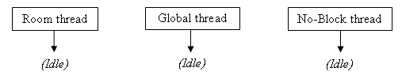
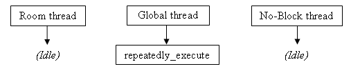
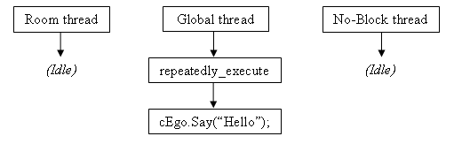
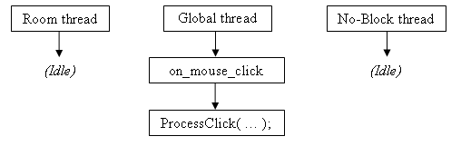
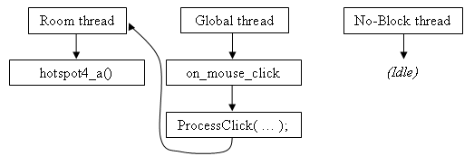

Scripting
#########

The AGS scripting system allows you to write a mini-program, giving you great
control over your game.

The Scripting Tutorials are online here:

* http://www.bigbluecup.com/actutor.htm
* http://www.bigbluecup.com/actutor2.htm

.. _UpgradingTo27:

Upgrading to AGS 2.7
====================

The script language in AGS 2.7 has changed quite significantly from previous versions.
Many of the script commands have become *object-based*, which has several advantages
over the previous approach. This page will attempt to introduce you to the new method and
explain its benefits.

Firstly, so that you can get an idea of the changes, here's an example of some old-style
script commands and their new equivalents::

   AnimateObjectEx(0,2,0,0,0,1);
   ListBoxAdd(3, 5, "New item");

becomes::

   oWaterfall.Animate(2, 0, eOnce, eForwards, eBlock);
   lstTest.AddItem("New item");

Just from looking at that example the advantages should be obvious; the script is more
intuitive for people to learn, much easier to read (no guessing what all the numbers mean
in the AnimateObjectEx call), and therefore you're less likely to make mistakes when using it.
GUI controls having names brings it much more into line with Visual Basic-style GUI
development, so you don't have to remember what control number all your buttons are.

The script editor's autocomplete functionality has been significantly enhanced to aid
in all this as well. You'll see as you start to experiment that autocomplete pops up more
often and lists only the relevant commands thanks to object-based scripting.

So does this mean I have to throw out all my scripts?
-----------------------------------------------------

No, certainly not! The new version is fully backwards compatible, so all your existing
scripts will continue to work just fine. However, for any new scripts that you write,
it's strongly recommended that you use the new object-based commands.

Ok, so uh... what's changed exactly?
------------------------------------

The script language syntax hasn't changed at all (that's the way you use semicolons, brackets,
and so on). It's still just like it was before, but with some new additions. Most
significantly, most commands are now called **on something**. For example, the old
command::

   StopMoving(EGO);

Just from looking at that, it's not at all obvious what StopMoving does. Does it stop
a character moving, an object moving, or does it stop the screen moving? It's not intuitive.
So now, rather than supplying the character as a parameter to the function, you actually
call the function **on** the character. So::

   character[EGO].StopMoving();

Now it's perfectly clear that it's the character EGO that we want to stop moving.

Suppose you're wondering what commands you can call on a character. Previously it was hard
to tell, but now if you type  ``character[EGO].``  in the script editor, auto-complete will
pop up and list all the valid functions and properties that you can access on the character.

So I have to keep typing character[EGO] all the time? What a pain!
------------------------------------------------------------------

Not so fast! Most of the new object-based commands can be called in two ways -- either
through the main array as we just saw, but also through what's called the character's
**Script O-Name**. This is a shorthand that allows you to directly access things, and
for characters it is the script name in sentence case, with a "c" added to the beginning.
So, in this example it would be::

   cEgo.StopMoving();

This line has an identical effect to the one with character[EGO] that we used above.

Furthermore, the *player* variable is now kept up to date with the current player
character, so it is actually useful. In a multi-character game, what you previously had
to write like this::

   StopMoving(GetPlayerCharacter());

can now be done like this::

   player.StopMoving();

Hmm, I see... so what exactly has been object-ised?
---------------------------------------------------

Currently, the following object-based things are available:

================  ==================
**Global array**  **O-Name example**
================  ==================
character[]       cEgo
object[]          oDoor
hotspot[]         hTree
gui[]             gInventory
inventory[]       iPinkPoster
region[]          (none)
================  ==================

GUI controls are handled slightly differently. They all have a script name,
and are directly accessed via that. For example, if you set the script name of
a list box to "lstSaves", then you would use "lstSaves." to access it. There is no
global array of GUI controls.

How do I find out the new equivalents of old functions?
-------------------------------------------------------

The help file's index has been set up to automatically redirect you to the new commands.
Just open the help file, go to the index and type in the name of an old command, and
it will bring you to the new object-based equivalent (if there is one).

Which commands haven't been changed?
------------------------------------

Commands which don't operate on anything in particular (and therefore wouldn't really
benefit from being object-based) have been left alone. For example, SaveGameSlot, QuitGame
and so on have all remained identical to how they were in previous versions.

What's the deal with these "eBlock" type things?
------------------------------------------------

AGS now supports **enumerated types**. Basically, in situations where you have to choose
one from a list of possible options, an enumerated type (or *enum*) now steps in. In
the past, you had commands with descriptions like this:

"Pass 1 if you want the function to block, or 0 if you don't".

This lead to lots of 1's and 0's in function calls, which are hard to read. Now, instead
of this each number is represented by an easy-to-remember word (such as *eBlock* and
*eNoBlock*). Even better, when you call a function that uses an enum parameter,
auto-complete automatically pops up the list of options for you to choose from.

See the :ref:`enum keyword <enum>` description for information on how to create your own.

So do I have to pass all these things like eBlock every time I call the function?
---------------------------------------------------------------------------------

Nope! Many functions now support **optional parameters**, where the most common options
are selected automatically. If you look at the help for a function such as the
:ref:`Animate character command <Character.Animate>`, you'll see some of the parameters
are defined as "optional". This means that you don't have to supply them; if you don't,
the default option that will be chosen is described in the help for that command.

So what else is new?
--------------------

Well, 2.7 introduces the *float* data type, so AGS now finally supports floating-point
arithmetic in your scripts. Also, for more advanced scripters, you can create your own
member functions (including protected and static ones) to write cleaner script than just
having a bunch of global functions.

Also, the script editor is now much better at checking your script for errors. You may
well find that a script which compiled fine before no longer works on 2.7. Hopefully
the error message should direct you towards fixing any problems.

Is there anything else I should watch out for?
----------------------------------------------

Because of the new additions, the script language has more reserved words than before. For
example, words like "gui", "object" and "hotspot" are now reserved (since they are used
to access the global arrays). If your script uses any variables with these names, it will
no longer work. You'll need to change the variable name in order to compile.

Also, the script language now supports *pointers*. Because they are a fairly
complex topic, there's a :ref:`separate page <Pointers>` devoted to explaining what
they are.

Blimey, that's a lot to take in. Where do I start?
--------------------------------------------------

I'd recommend attempting to write your next section of script in the new way. Each time
you're about to use an old-style command, simply look it up in the manual to find out
what it's replacement is.

Once you get used to the new system, I'm sure you'll agree that it is a significant
improvement over the old scripting system and you'll start to enjoy the benefits of
faster and more intuitive coding.

As always, if there's something you really can't get your head round, post on the
AGS Forums and we'll help you out as best we can!

Have fun, ILBRK
CJ

.. _Pointers:

Pointers in AGS
===============

Various commands in the new scripting language will require you to use pointers.
This section has been split into three separate topics to introduce you
to pointers depending on your previous programming experience -- select one of the
links below:

.. _PointersForNewbies:

Pointers for programming newbies
--------------------------------

Pointers can be quite a daunting prospect, and in languages like C and C++ they certainly
are; but AGS tries to make things as simple as possible.

Basically, a pointer is a variable that *points* to something of a particular type.
For example, a *Character* pointer would point to characters. What's the point of
all this, I hear you ask?

Well, let's look back at AGS 2.62. If you wanted to reference a particular hotspot,
you'd need to remember its number. If you wanted to switch on an object, you'd need to
remember what number it was too. And because you could accidentally use an object
number where you wanted a hotspot number, mistakes could easily happen and it all got
rather messy.

That's where pointers step in -- basically, they allow you to do away with identifying
things by number, and in the process provide *type checking*, so you can't accidentally
use a hotspot where you meant to use an object.

Let's look at an example. If you wanted to write a string to a file in 2.62, you'd do this::

   int handle = FileOpen("temp.txt", FILE_WRITE);
   FileWrite(handle, "Test!");
   FileClose(handle);

That's simple enough; but what if you wanted to open the file in one place, and write
to it somewhere else? You'd have to make *handle* a global variable, and then make
sure you remembered that it was a file handle and not a hotspot number or anything else.
Now, with 2.7 the same code would be::

   File *file = File.Open("temp.txt", eFileWrite);
   file.WriteString("Test!");
   file.Close();

Looks fairly simple, doesn't it. The only slightly confusing part is getting used
to declaring the variable as ``File*`` rather than ``int``; but that's something
you'll get used to quite quickly, and all the examples in the manual should point
you in the right direction.

Let's look at another example. Suppose you want a variable that contains the current
hotspot that the mouse is over. In 2.62, you might have something like this::

   // top of global script
   int mouseOverHotspot;

   // repeatedly_execute
   mouseOverHotspot = GetHotspotAt(mouse.x, mouse.y);

How would you do this in 2.7? Well, quite simply::

   // top of global script
   Hotspot *mouseOverHotspot;

   // repeatedly_execute
   mouseOverHotspot = Hotspot.GetAtScreenXY(mouse.x, mouse.y);

But hold on, what if you want to know whether the mouse is over your Door hotspot (say
it's hotspot 2). In 2.62, you'd have done::

   if (mouseOverHotspot == 2) {
     Display("Mouse over the door");
   }

but that's rather messy, because what if you change the door's hotspot number? You'd
have to remember to go back and change all the 2's to 3, or whatever. In 2.7, you now just
do this (assuming you gave the hotspot a script name of hDoor)::

   if (mouseOverHotspot == hDoor) {
     Display("Mouse over the door");
   }

If you're a fan of numbers for some strange reason, you can still use them like this::

   if (mouseOverHotspot == hotspot[2]) {
     Display("Mouse over the door");
   }

So, that concludes our introduction to pointers. Hopefully you've got an understanding of
what they are and what they do; if there's anything you can't work out, feel free to ask
on the Technical forums.

.. _PointersForJavaCSharp:

Pointers for people who know Java or C``#``
----------------------------------------------

AGS pointers work in a very similar way to object variables in Java and C``#``. The main
difference is that AGS pointers are declared in the C-style manner with an asterisk t
represent the pointer. So::

   Hotspot *hs;

would declare a variable *hs* which points to a Hotspot. This would be equivalent to
the following in Java or C``#``::

   Hotspot hs;

In AGS, pointers are used to point to various built-in types, such as Hotspots, Inventory Items,
Characters and so on. Because AGS does not have a *new* keyword, you cannot create pointers
to custom struct types.

You use pointers in the same way as you would in Java and C``#``. Various built-in AGS static
methods return a pointer to an instance (for example, :ref:`File.Open <File.Open>`,
:ref:`Hotspot.GetAtScreenXY <Hotspot.GetAtScreenXY>`, and so on). You can save this
pointer into a pointer variable, and then call its methods as you would in Java or C``#``.
The following examples are all valid::

   File *theFile = File.Open("test.dat", eFileWrite);
   if (theFile == null) Display("It's null!");
   File *file2 = theFile;
   if (theFile == file2) Display("They're the same file!");
   theFile = null;
   file2.WriteInt(10);
   file2.Close();

If you attempt to call a method on a null pointer, an error will occur (just like you'd
get an exception in Java or C``#``).

Pointer memory management in AGS is all automatic -- the memory is freed when there are
no longer any variables pointing to the instance. Thus, if you have global pointer variables
in your global script, it's a good idea to set them to *null* when you're no longer
using them, to allow the memory to be freed.

.. _PointersForC:

Pointers for people who know C or C++
-------------------------------------

Pointers in AGS are based on the C/C++ syntax, so they are declared with an asterisk.
However, in AGS you can only create pointers to built-in AGS types, and not to any
custom structs declared in your script.

Pointer members are accessed with the dot operator, and not the ``->`` C-style operator.
Because AGS doesn't support features such as pointers-to-pointers and so forth, there
is no need for a separate operator.

In AGS, pointer memory management is done automatically based on reference counting (similar
to the way COM works), so there is no *new* or *delete* keyword. When an object
is no longer referenced by any pointer variables, it will be freed. For this reason,
if you have any global pointer variables it's advisable to set them to *null* if
you are done with them.

AGS pointers are strongly typed, and you cannot cast between types at will like you
can in C and C++. AGS will only allow you to compare and assign pointers of the same
type, or of the same base type. There is a special keyword *null* which all pointers
can be set to and compared with, which indicates that they are unassigned.

Because there is no *new* keyword, you cannot create object instances; rather, they
are returned by static member functions in AGS, such as :ref:`File.Open <File.Open>`
and :ref:`Hotspot.GetAtScreenXY <Hotspot.GetAtScreenXY>`. See the examples for the
functions to get an idea of how to use them.

.. _UpgradingTo271:

Upgrading to AGS 2.71
=====================

AGS 2.71 adds new simple string support to the scripting language. Strings have long
been a pain to use in AGS, but this is finally addressed by v2.71.

There's a new String type (that's a capital 'S'). These new strings behave like Java/``C#``
strings in that you can easily assign to and manipulate them.

For example, in 2.7 and previous versions, you had to do this::

   string text;
   StrCopy(text, "This is my text");

in 2.71, you can now do::

   String text = "This is my text";

Furthermore, the == and != operators can be used to compare strings for equality (equivalent
to using StrComp but much more intuitive). An additional benefit is that there is no longer
a need for GetText() and SetText() methods -- instead, we can now just have Text properties.

All the old-style functions that took a "string buffer" parameter have now been replaced with
new ones that return a string instead. Where properties have been created, you should be able
to use them like any other property, so::

   lblLabel.Text = "Hello";
   String buttonValue = btnOK.Text;

and so on.

*NOTE:* Some of the new functions are provided on the Game object -- for example, the new
GetSaveSlotDescription function needs to be called like this::

   String description = Game.GetSaveSlotDescription(10);

This is part of a move towards all built-in functions being object-based, but watch out for it
as it could well cause some confusion. The manual will show you which functions require this.

Rather than using old functions like StrCat and StrContains, you now call the functions
directly on the strings::

   String text = "Hello";
   text = text.Append("World");

will mean that *text* now contains "HelloWorld".

Note the **text =** in that expression. Functions like Append will return a modified version
of the string, they won't actually change the original. Therefore, to update the *text*
variable you need to assign the result to it.

Backwards compatibility
-----------------------

In order to maintain backwards compatibility, a new "const" keyword has been added. This
applies only to old-style strings, and allows them to interoperate with the new ones. A
new-style String can be passed to a function that expects a "const string" (which means
that it will not be allowed to change the string's contents), but cannot be passed to a
function that expects a "string" (since it could overwrite the string data and mess things up).

So, you may find that any custom functions you have that take a string parameter stop
working. If this is the case, change the parameter from "string" to "const string" and
that should fix it.

Apologies for the inconvenience, but this is the only way to allow new Strings to
interoperate safely with old-style strings.

Calling global functions from local scripts
===========================================

You can now call your global script functions directly from your rooms. This
means that if you have a common script that you want to use in response to
various different events during the game, you can call it from your room
scripts rather than duplicating code.

To use a global function, open up the main script header (GlobalScript.ash),
and add a line similar to the following::

   import function my_function_name (parameters);

Where *my_function_name* is the name of the global script function, and
*parameters* is a list of the TYPES ONLY of the parameters it takes. For example,
if you had in your global script::

   function do_animation (int anim_number) {

then you would write::

   import function do_animation (int);

To use the function, you just call it normally in your script, eg::

   do_animation (3);

You can also return a value to the caller by using the "return" statement,
and the local script picks this up the same way it does with built-in
functions. For example, the end of your global script function could be::

   return 51;

then the local script just does::

   int value = do_animation(3);

.. index::
   Script header
   Header

The script header
=================

This allows you to include the same information into all your scripts. For
example, if you have a global function you want all the room scripts to use,
you can add its import definition to the header file.

Do NOT place any actual functions or variables in this header, because if
you do you will need to re-compile ALL the scripts whenever you modify the
function. Instead, place your functions in your global script and just place
an import line in the header file to allow the other scripts to access it.

.. _StringFormats:

String formatting
=================

You will find many times in your game when you need to create a string based
on the values of variables, and functions like :ref:`Display <Display>` and
:ref:`String.Format <String.Format>` allow you to do so.

AGS uses printf-style argument formatting (used by the C language). This means
that you intersperse your text with special codes to insert a variable's value. These
special codes begin with a percent sign, and then specify the variable type. The
actual variables that you want to display are then listed afterwards.

The special codes you can use are as follows:

========  ==============================================================
**Code**  **Description**
========  ==============================================================
``%d``    Integer (use to display value of int and short variables)
``%0Xd``  Integer left-padded with up to X zeros
``%s``    String (use to display string variables)
``%c``    Character (displays the ASCII character of the supplied value)
``%f``    Float (displays a float variable)
``%.Xf``  Float to X decimal places
``%%``    Display the percent character (ie. no variable)
``[``     Inserts a new line into the message
========  ==============================================================

Some examples::

   int life = 42;
   float twoPi = Maths.Pi * 2.0;
   String message = "A string variable";

   Display("A normal string with no variables.");
   Display("The meaning of life is %d.", life);
   Display("The meaning of life in 3 digits is %03d.", life);
   Display("2 times Pi is %f.", twoPi);
   Display("The message says: %s.", message);

would display::

   A normal string with no variables.
   The meaning of life is 42.
   The meaning of life in 3 digits is 042.
   2 times Pi is 6.283186.
   The message says: A string variable.

You can display as many variables as you like in one line::

   int life = 42;
   float twoPi = Maths.Pi * 2.0;

   Display("Life is %d, 2 x Pi = %f, and my dinner is %s.", life, twoPi, "awful");

but, **be very careful** that you supply the right number of variables to correspond
with the tags you use in the text. If you don't supply enough variables, your game could
crash.

.. _ScriptModules:

.. index::
   Modules
   Script modules

Multiple Scripts
================

If you're working on a fairly large game, you'll find that your global script can
quickly become rather large and unwieldy. AGS allows you to create extra scripts
(formerly known as Script Modules) in order to split up your code and easily
import scripts written by other people.

The main global script still has to contain all the event functions (Look At
Character scripts, Interact With Inventory scripts and so forth) and all the GUI
handlers (btnSave_Click, etc).

But if you have any custom functions then you can put them in a separate script in
order to divide up your code. Scripts have the added advantage that they can be
easily exported and imported, if you want to share some of your code with other
people, or even just move it from one game to another.

The scripts for the game can be seen under the "Scripts" node in the project tree. Each
script has its own header, which is where you place the :ref:`import <importkeyword>`
definitions for that script to allow the rest of your game to access its functionality.

The order of the scripts is important. A script can only use functionality from other
scripts that come before it in the list, so the Move Up and Move Down options allow you
to adjust the order. The global script is always at the bottom so that it can access all
other scripts, and room scripts are automatically provided with access to all the scripts.

As an example, suppose you want to have a special *AddNumbers* function in a module.
You'd create a new script, then put this in its header file (.ASH)::

   import function AddNumbers(int a, int b);

Then, in the script file (.ASC) you could put::

   function AddNumbers(int a, int b) {
     return a + b;
   }

That's the basic principle behind using multiple scripts!

Special functions
-----------------

Can extra scripts use special functions like ``game_start`` and ``repeatedly_execute``?
Well, yes and no. They can contain the following functions, and they will
be called at the appropriate times just before the global script's function is:

* function game_start()
* function on_event(EventType event, int data)
* function on_key_press(eKeyCode keycode)
* function on_mouse_click(MouseButton button)
* function repeatedly_execute()
* function repeatedly_execute_always()

All other special functions, such as ``dialog_request``, will only be called in
the Global Script, even if they exist in another script. If you need other scripts to
handle any of this functionality, you can simply create a custom function in the
script and then call it from the global script.

The :ref:`ClaimEvent <ClaimEvent>` command is supported for on_key_press, on_mouse_click
and on_event. Calling it prevents the rest of the scripts (including the global script) from being called.

.. _BlockingScripts:

.. index::
   Blocking scripts; explained

Understanding blocking scripts
==============================

You will see some commands listed as "blocking", where control does not return
to the script until the command finishes. But what does this mean, exactly?

In order to better understand this, we need to explore a little about the way
that the AGS script engine works. In an AGS game, there are three script **threads**
that can be running at once. Think of a thread as a mini-CPU that executes your scripts.

At the start of the game, the threads are all idle (not running any scripts):

Now, as and when your scripts need to be run, AGS will try to run them on the
appropriate thread (the Room thread for local scripts, and the Global thread
for global scripts).

So, on the first game loop, your global scripts' repeatedly_execute will be run:

That's fine, and when it finishes running the thread becomes idle again.

But, suppose that within repeatedly_execute, you make a call to the Character.Say
command. Say (or *DisplaySpeech* in old-style scripting) is a blocking command
and does not return until the character finishes talking:

The global thread is now **blocked**, waiting for the character to
finish talking. This means that none of your global script functions such
as repeatedly_execute, on_event and on_key_press will be run while the character
is talking, since the thread is busy.

Now, AGS does queue up to 5 script functions to be run on the thread
as soon as it is free; but if you have a lot of things happening within your script,
it's possible that you will lose some events such as on_events and keypresses if
you script is blocked for a long time.

Let's explore the most common situation in which this causes confusion. Suppose you
have a *Player looks at inventory* event on a Key inventory item, which
runs a script to display a message.

Let's also suppose that you have some code at the end of your on_mouse_click function
to make the character stand still after running mouse click events.

What you'll find is that the code at the end of on_mouse_click actually gets called
*before* the inventory item's event. Let's look at why:

Remember that AGS does not run events automatically; rather, the on_mouse_click
script function handles the mouse click and calls ProcessClick to run the appropriate
event. When it does so, it finds that the key's Look At Item event has a script function
associated with it.

But oh no! Inventory item scripts are in the global script, and the global thread is
already blocked because of the mouse click. Therefore, the inventory event script
gets added to the thread's queue, and on_mouse_click then finishes running.
The inventory event script will follow on afterwards.

Now you might think that this means that object and hotspot events can run within
on_mouse_click, since they use the room thread, like this:

However, this is not the case. It is still the global thread that is calling ProcessClick,
so the room script will actually be run on the global thread once it is free.

Finally, we come onto the No-Block thread. This thread is only used to run the
*repeatedly_execute_always* function. Because repeatedly_execute_always is not
allowed to run any blocking functions, this ensures that the thread never gets blocked
and so it will always run, even when the other threads are busy:

.. figure:: images/threads6.gif

I hope that helps explain blocking in terms of AGS scripting. If there's anything that
you don't think is clear, please suggest amendments on the Technical forum.

.. _DynamicArrays:

Dynamic Arrays
==============

Suppose that you're writing a script that you want people to be able
to use in their games. You need to store the Health for every character
in the game, but you don't know how many characters there will be. What do you do?

Dynamic Arrays are designed for just this purpose. You can declare an array like this::

   int characterHealth[];

in your script file. This special notation tells AGS that you don't yet know how large
you want the array to be. Now, before you use the array (so probably in game_start),
you can do this::

   characterHealth = new int[Game.CharacterCount];

If you forget to do this ``new`` command, you'll get a Null Pointer Error if you try
to access the array. You can change the size of an array by simply using another
``new`` command with a different size; but this will erase the contents of the
array in the process.

Currently dynamic arrays are supported as global and local variables, but
you can't put one inside a struct.
Also, at present you can create arrays of basic types (int, char, etc) and
of built-in types (String, Character, etc) but not of custom structs.

.. _ExtenderFunctions:

Extender functions
==================

Suppose that you wanted to add a new function, "Scream", to characters which would make
them cry out "AARRRGGGHHH". Because the Character type is defined within AGS, it's not
possible for you to just add a method to it.

That's where Extender Functions come in. Here's an example::

   function Scream(this Character*)
   {
   this.Say("AAAAARRRRGGGGHHHHHH!!!!");
   }

This adds a new "Scream" function to the Character type, so that in your script code
elsewhere you can do things like::

   player.Scream();
   character[EGO].Scream();

and so on.

Where do I put this code?
-------------------------

In the script header, you'd put::

   import function Scream(this Character*);

and then put the main function in the script file. This will then allow it to be used
by other scripts.

.. _Gamevariables:

.. index::
   Variables
   game. variables

Game variables
==============

The following variables are available to your script. They allow you to do various tweaks
to the engine at run-time.

Names in **bold** are **read-only variables** and should NOT be modified by the script.

All the following variables are ``int`` variables.

==========================================  ===================================================================================================================================================================================================================================================
game.abort_key                              The keycode for Abort Game, which allows the you to quit even if your script is stuck. Default 324 (Alt+X).
==========================================  ===================================================================================================================================================================================================================================================
game.ambient_sounds_persist                 If 0 (default), ambient sounds are stopped on room change. Set to 1 to tell AGS to leave ambient sounds playing when going to a new room.
game.anim_background_speed                  The current room's animating background speed - same values as in editor.
game.auto_use_walkto_points                 Default 1; set to 0 to stop AGS automatically using hotspot walk-to points.
game.bgspeech_game_speed                    If 0 (default), background speech stays on the screen for the same amount of time, no matter what the game speed. If 1, the amount of time it stays is relative to the game speed.
game.bgspeech_stay_on_display               If 0 (default), background speech is removed when a Say command happens; if 1, it isn't.
game.close_mouth_end_speech_time            At the end of speech text, the speech animation will stop for this number of game loops. Default 10. No affect in voice mode.
game.debug_mode                             Whether we are in debug mode or not.
game.dialog_options_x                       Offset into dialog options GUI to compensate for borders
game.dialog_options_y                       Offset into dialog options GUI to compensate for borders
game.disable_antialiasing                   Set to 1 to disable smoothing of scaled characters, overriding the user's choice in Setup. Default 0.
game.following_room_timer                   How long to wait before following char emerges in new room, default 150. (higher is longer).
game.keep_screen_during_instant_transition  Normally the Instant transition blacks the screen in 8-bit colour modes, to avoid strange palette effects. However you can set this to 1 to prevent it doing so.
\bf game.inv_activated                      Inventory item that the player last clicked on. Useful for unhandled_event.
game.inventory_greys_out                    Set to 1 to make inventory controls grey out when GUI disabled is set to "GUIs Grey Out"
game.lipsync_speed                          Similar to Game.TextReadingSpeed, but this determines how quickly the text is 'read' out by the mouth moving. You should normally only set this faster than text_speed, otherwise the reading will get cut off when the text times out. Default 15.
game.max_dialogoption_width                 Maximum width of textwindow-based dialog options box. Default 180.
game.min_dialogoption_width                 Minimum width of textwindow-based dialog options box. Default 0.
game.narrator_speech                        Which character ID to use for voice speech within Display() command. Default initial player character. You can also use NARRATOR which uses 'NARR' prefix - special narrator character.
game.no_textbg_when_voice                   Normally 0. If 1, and the Sierra-style With Background speech style is in use, will change to the Sierra-style (No Bg) if a voice speech line is present.
game.read_dialog_option_color               By default, -1. You can set this to a colour number, in which case dialog options that the player has selected before will be displayed in this colour.
game.roomscript_finished                    The on_call function has completed executing. (See :ref:`CallRoomScript <CallRoomScript>`)
\bf game.score                              The player's score. To modify the score, use the GiveScore script function.
game.score_sound                            Sound effect to play when the player gets points, originally set in the editor.
game.screenshot_height                      The height of screenshot images when saved into save games. The largest you can have is the full screen size (320x200), which gives the highest quality but the largest size save game files. The default is 160x100.
game.screenshot_width                       The width of screenshot images when saved into save games.
game.show_single_dialog_option              If only a single dialog option is available, show it anyway (default=0)
game.sierra_inv_color                       The background color of the sierra-style inventory.
game.skip_display                           Setting for how Display() messages are skipped; valid values are same as for Speech.SkipStyle (default 3).
game.skip_speech_specific_key               Default 0. You can set it to a keycode, in which case only that key can skip speech text.
game.speech_bubble_width                    Maximum width of the thought bubble text window (default 100)
game.speech_text_align                      Sets how text in Lucasarts-style speech is aligned. Same possible values as game.text_align, default eAlignCentre
game.speech_text_gui                        The textwindow GUI number used for sierra-style speech.
game.text_align                             Sets how text in message boxes and Sierra-style speech is aligned: See :ref:`Speech.TextAlignment <Speech.TextAlignment>` for details. This does not affect Lucasarts-style speech, which is always centred.
game.text_shadow_color                      Color used for speech text shadow (default 16).
game.top_bar_XXXX                           Customizations for :ref:`DisplayTopBar <DisplayTopBar>`, see link for details
game.total_score                            Maximum possible score, initially set in the editor.
game.used_mode                              Cursor mode used with last click (use with "any click" events to find out which mode was used)
\bf mouse.x                                 Mouse X co-ordinate when the last game loop was run (320-res)
\bf mouse.y                                 Mouse Y co-ordinate when the last game loop was run (320-res)
palette[SLOT].r                             The red component (0-63) of palette slot SLOT
palette[SLOT].g                             The green component (0-63) of palette slot SLOT
palette[SLOT].b                             The blue component (0-63) of palette slot SLOT
player.[x,y,name,...]                       Alias to the current player character.
==========================================  ===================================================================================================================================================================================================================================================

.. _TextScriptEvents:

.. index::
   dialog_request
   game_start
   on_event
   interface_click
   on_key_press
   on_mouse_click
   unhandled_event

Predefined global script functions
==================================

In your main global script file, there are some functions which are
automatically added when you create the game. These are global events, and the
function is called when a particular event happens. There are also some
other events which you can add if you want to.

The available event functions are:

* *dialog_request (int parameter)* -- Called when a dialog script line
  "run-script" is processed. PARAMETER is
  the value of the number following the "run-script" on that line of the
  dialog script.
* *game_start ()* -- Called at the start of the game, before the first
  room is loaded. You can
  use this to set up the initial positions of characters, and to turn
  GUIs on and off. **You cannot run animations or do anything else
  which relies on a room being loaded**.
* *interface_click (int interface, int button)* -- **(Now Obsolete)**
  Called when the player clicks on a button on a GUI which has its
  action set as "Run script". INTERFACE is the number of the GUI which they
  clicked on. BUTTON is the object number of the button within this GUI.
* *on_event (EventType event, int data)* -- Called whenever certain game
  events happen. The value of DATA depends on
  which event has occurred. This allows you to perform checks or update things
  every time the player does something, regardless of which room it is in.
  The possible values of event are:

  * *eEventEnterRoomBeforeFadein* -- called just before room Player Enters Room event is run,
    DATA = new room number.
  * *eEventLeaveRoom* -- called just after room Player Leaves Room event is run,
    DATA = room number they are leaving.
  * *eEventGotScore* -- called whenever the player's score changes,
    DATA = number of points they got.
  * *eEventGUIMouseDown* -- called when a mouse button is pressed down over a GUI,
    DATA = GUI number.
  * *eEventGUIMouseUp* -- called when a mouse button is released over a GUI,
    DATA = GUI number.
  * *eEventAddInventory* -- the player just got a new inventory item,
    DATA = inventory item number that was added.
  * *eEventLoseInventory* -- the player just lost an inventory item,
    DATA = inventory item number that was lost.
  * *eEventRestoreGame* -- tells your game that it has just been restored from a save game,
    DATA = save slot number.

* *on_key_press (eKeyCode keycode)* -- Called whenever a key is pressed
  on the keyboard. KEYCODE holds the ASCII
  value of the key. A list of these values is in :ref:`this section <ASCIIcodes>`.
* *on_mouse_click (MouseButton button)* -- Called when the player clicks
  a mouse button. BUTTON is either LEFT,
  RIGHT or MIDDLE, depending on which button was clicked. The "mouse.x" and "mouse.y"
  global variables contain the mouse's position.

  If 'Handle inventory clicks in script' is enabled in the game options, this
  function can also be called with eMouseLeftInv, eMouseMiddleInv or eMouseRightInv, which
  indicate a left, middle or right click on an inventory item, respectively.

  If 'Enable mouse wheel support' is enabled, this function can also be called with
  eMouseWheelNorth or eMouseWheelSouth, which indicate the user moving the mouse wheel north or
  south, respectively.
* *repeatedly_execute()* -- Called every game cycle (normally 40 times per second).
  See :ref:`this help page <RepExec>` for more information.
* *repeatedly_execute_always()* -- Called every game cycle, even when a
  blocking routine (eg. speech/cutscene) is in
  progress. You **cannot** call any blocking functions from this event handler.
  See :ref:`this help page <RepExec>` for more information.
* *unhandled_event (int what, int type)* -- Called when an event occurs,
  but no handler is set up in the Events list.
  This could be used to display a default "I can't do that" type of message.
  The values of WHAT and TYPE tell you what the player did,
  the possible values are listed below:

  ========  ========  ================================================
  **WHAT**  **TYPE**  **Description**
  ========  ========  ================================================
     1         1      Look at hotspot
     1         2      Interact with hotspot
     1         3      Use inventory on hotspot
     1         4      Talk to hotspot
     1         7      Pick up hotspot
     1         8      Cursor Mode 8 on hotspot
     1         9      Cursor Mode 9 on hotspot
     2         0      Look at object
     2         1      Interact with object
     2         2      Talk to object
     2         3      Use inventory on object
     2         5      Pick up object
     2         6      Cursor Mode 8 on object
     2         7      Cursor Mode 9 on object
     3         0      Look at character
     3         1      Interact with character
     3         2      Speak to character
     3         3      Use inventory on character
     3         5      Pick up character
     3         6      Cursor Mode 8 on character
     3         7      Cursor Mode 9 on character
     4         1      Look at nothing (ie. no hotspot)
     4         2      Interact with nothing
     4         3      Use inventory with nothing
     4         4      Talk to nothing
     5         0      Look at inventory
     5         1      Interact with inventory (currently not possible)
     5         2      Speak to inventory
     5         3      Use an inventory item on another
     5         4      Other click on inventory
  ========  ========  ================================================

  Note that the "Character stands on hotspot" event does not trigger this
  function, and it will not be triggered if there is an "Any click" event defined.

  This function is **not** triggered if the player clicks on nothing (hotspot 0).

The *on_key_press* and *on_mouse_click* events can also be handled by
individual room scripts. If you add their function definitions to your room script
in a similar way to how they are in the global script, the room script can intercept
the keypress/mouseclick first, and then decide whether to pass it on to the global
script or not. See the :ref:`ClaimEvent <ClaimEvent>` function for more.

.. _RepExec:

.. index::
   repeatedly_execute
   repeatedly_execute_always

repeatedly_execute (_always)
============================

One of the most common things you'll need to do when scripting is to check if something
has happened in the game -- and if so, then make the game do something in response.

For example, suppose that you want a bird to fly backwards and forwards across the screen
in the background. You need a way of telling the bird to move in one direction, recognise
when it has finished, and tell it to move back again.

This is where *repeatedly_execute* and *repeatedly_execute_always* come in.

What's the difference between them?
-----------------------------------

The *repeatedly_execute* event is run on every game loop (by default this is 40 times per
second), but only when the game is not blocked. That means that it will run as long as there
are no current blocking animations or moves going on (ie. a Walk or Animate command where
*eBlock* has been specified as a parameter).

On the other hand, *repeatedly_execute_always* is always run on every game loop, no matter
whether the game is blocked or not. This comes at a price though, which is that you cannot
run any blocking code within it. So if you try to script a *player.Walk()* command that
passes the *eBlock* parameter -- or even just try to use a ``Wait(1);`` command, these
will fail within *repeatedly_execute_always*.

What would I use each one for?
------------------------------

You would usually use *repeatedly_execute* for doing things that affect the player character,
and *repeatedly_execute_always* for doing background tasks that don't directly affect the
player.

For example, if your game kept track of the player's hunger, you might want to check in
*repeatedly_execute* how long it has been since he last ate -- and if it has been more than 20
minutes, make the player character stop walking and rub his stomach. Because you want to perform
a blocking animation, and you wouldn't want this to interrupt any specific cutscenes that were going on,
repeatedly_execute would be the ideal place for it.

On the other hand, in the case of our bird flying across the screen, because we don't want to
block the game while the bird flies, and we just want it to happen in the background,
*repeatedly_execute_always* would be the place to put it.

How do I create them?
---------------------

In main game scripts, you create your *repeatedly_execute* script function by just pasting
it into the script as follows. In the GlobalScript.asc it is already created for you::

   function repeatedly_execute()
   {
     // Put your script code here
   }

In rooms, it is slightly different. If you want to run some script that is specific to a particular
room, open that room's Events Pane and you'll see a "Repeatedly execute" event. Click the "..." button
and a function called something like *Room_RepExec* will be created for you.

This is important to remember -- in a room script, **you cannot simply paste in a repeatedly_execute
function**; you need to use the Events Pane to create it instead.

To create *repeatedly_execute_always*, you can simply paste it into the script as above -- but
you can also paste it into room scripts. Therefore the following will work in any script, whether
it be a room or a global script.

::

   function repeatedly_execute_always()
   {
     // Put your script code here
   }

Remember, of course, that RepExec or *repeatedly_execute_always* functions in a room script
will only be run while the player is actually in that room!

Can you show me an example?
---------------------------

Let's implement the two things we just talked about. Here's our hunger checking code::

   function repeatedly_execute()
   {
     // increment our timer variable (we would have created this
     // in the Global Variables editor)
     hungerTimer++;

     if (hungerTimer == 800)
     {
       Display("You are getting very hungry.");
       player.LockView(RUBSTOMACH);
       player.Animate(0, 5, eOnce, eBlock, eForwards);
       player.UnlockView();
     }
   }

and let's put the bird flying code in the room script, because we only want it to happen in that one room::

   function repeatedly_execute_always()
   {
     if (!cBird.Moving)
     {
       if (cBird.x < 100)
       {
         // if the bird is on the left hand side of the screen,
         // start it moving towards the right
         cBird.Walk(400, cBird.y, eNoBlock, eAnywhere);
       }
       else
       {
         // otherwise, move it towards the left
         cBird.Walk(0, cBird.y, eNoBlock, eAnywhere);
       }
     }
   }

.. _CustomDialogOptions:

.. index::
   Dialog options; custom rendering

Custom dialog options rendering
===============================

By default, AGS comes with two types of dialog options -- displaying them using the size
and position of an existing GUI, or creating a text window to display the options in.

As of AGS 3.1, if neither of these methods suit you (for example, because you want to
use picture-based dialog options, or you want to add scroll arrows), you can now implement
the dialog options display yourself in the script.

*NOTE:* This topic involves some advanced scripting. If you're just starting out with AGS,
please just use one of the built-in dialog option styles for now, and come back to this later
when you're comfortable with scripting.

To write your custom dialog options code, you need to do the following:

* Add a ``dialog_options_get_dimensions`` function to your script (an example follows).
  This function is called by AGS to find out which part of the screen you will be drawing onto.
  By setting the width and height to values greater than 0, the custom dialog system is activated.
* Add a ``dialog_options_render`` function, which is called by AGS when it needs to
  draw the dialog options. A standard script :ref:`DrawingSurface <DrawingSurfaceFunctions>` is
  supplied, which you can use to draw onto.
* Add a ``dialog_options_get_active`` function, which is called by AGS as the player moves
  the mouse around the screen. This needs to work out which option the mouse is currently hovering
  over, so that AGS knows which option to process if the player clicks the mouse button.
* Optionally, add a ``dialog_options_mouse_click`` function. This is called by AGS if the
  player clicks the mouse when it is not over one of the options. You might want to use this to
  process clicks on some custom scroll arrows, for example.

These functions don't have to go in the global script; you can put them in any script you like.
However, beware that if the functions are present in more than one script they could interfere
with each other and cause problems.

**IMPORTANT:** When adding the functions to the script, they all take in a parameter of
type :ref:`DialogOptionsRenderingInfo <DialogOptionsRenderingInfoFunctions>` and the
dialog_options_mouse_click function has an extra parameter for the mouse button. See the example below.

**IMPORTANT:** The four Custom Dialog functions all run on the non-blocking thread. That means
that you should not make any blocking calls, such as Character.Say, Wait or Display within them,
as they may not behave correctly.

Example
-------

Below is a very simple implementation of a dialog options screen.

::

   function dialog_options_get_dimensions(DialogOptionsRenderingInfo *info)
   {
     // Create a 200x200 dialog options area at (50,100)
     info.X = 50;
     info.Y = 100;
     info.Width = 200;
     info.Height = 200;
     // Enable alpha channel for the drawing surface
     info.HasAlphaChannel = true;
     // Put the text parser at the bottom (if enabled)
     info.ParserTextBoxX = 10;
     info.ParserTextBoxY = 160;
     info.ParserTextBoxWidth = 180;
   }

   function dialog_options_render(DialogOptionsRenderingInfo *info)
   {
     // Clear the area yellow
     info.Surface.Clear(14);
     int i = 1,  ypos = 0;
     // Render all the options that are enabled
     while (i <= info.DialogToRender.OptionCount)
     {
       if (info.DialogToRender.GetOptionState(i) == eOptionOn)
       {
         if (info.ActiveOptionID == i) info.Surface.DrawingColor = 13;
         else info.Surface.DrawingColor = 4;
         info.Surface.DrawStringWrapped(5, ypos, info.Width - 10,
                            eFontFont0, eAlignLeft, info.DialogToRender.GetOptionText(i));
         ypos += GetTextHeight(info.DialogToRender.GetOptionText(i), eFontFont0, info.Width - 10);
       }
       i++;
     }
   }

   function dialog_options_get_active(DialogOptionsRenderingInfo *info)
   {
     int i = 1,  ypos = 0;
     // Find the option that corresponds to where the player clicked
     while (i <= info.DialogToRender.OptionCount)
     {
       if (info.DialogToRender.GetOptionState(i) == eOptionOn)
       {
         ypos += GetTextHeight(info.DialogToRender.GetOptionText(i), eFontFont0, info.Width - 10);
         if ((mouse.y - info.Y) < ypos)
         {
           info.ActiveOptionID = i;
           return;
         }
       }
       i++;
     }
   }

   function dialog_options_mouse_click(DialogOptionsRenderingInfo *info, MouseButton button)
   {
     // do something here if you want!
   }

The example above is slightly naive; in reality you would probably want to track
the Y position of each option in a variable to save having to continually scan through
all the options.

For more detail on the commands used here, see the :ref:`DialogOptionsRenderingInfo <DialogOptionsRenderingInfoFunctions>`
page.

*Compatibility:* Supported by **AGS 3.1.0** and later versions.

.. _BuiltInEnums:

.. index::
   Enumerated types (built-in)

Built-in enumerated types
=========================

AGS has several :ref:`enumerated types <enum>` built in. These are used in calls to
various commands, and will usually pop up automatically in autocomplete. However, for times
where autocomplete doesn't do the job, having a manual reference is invaluable::

   enum BlockingStyle {
     eBlock,
     eNoBlock
   };

*Used by:* :ref:`Character.Animate <Character.Animate>`,
:ref:`Character.FaceCharacter <Character.FaceCharacter>`,
:ref:`Character.FaceLocation <Character.FaceLocation>`,
:ref:`Character.FaceObject <Character.FaceObject>`,
:ref:`Character.Move <Character.Move>`,
:ref:`Character.Walk <Character.Walk>`,
:ref:`Character.WalkStraight <Character.WalkStraight>`,
:ref:`Object.Animate <Object.Animate>`,
:ref:`Object.Move <Object.Move>`

::

   enum Direction {
     eForwards,
     eBackwards
   };

*Used by:* :ref:`Character.Animate <Character.Animate>`,
:ref:`Object.Animate <Object.Animate>`

::

   enum WalkWhere {
     eAnywhere,
     eWalkableAreas
   };

*Used by:* :ref:`Character.Move <Character.Move>`,
:ref:`Character.Walk <Character.Walk>`,
:ref:`Object.Move <Object.Move>`

::

   enum RepeatStyle {
     eOnce,
     eRepeat
   };

*Used by:* :ref:`Button.Animate <Button.Animate>`,
:ref:`Character.Animate <Character.Animate>`,
:ref:`Object.Animate <Object.Animate>`

::

   enum Alignment {
     eAlignLeft,
     eAlignCentre,
     eAlignRight
   };

*Used by:* :ref:`Character.LockViewAligned <Character.LockViewAligned>`

::

   enum eFlipDirection {
     eFlipLeftToRight,
     eFlipUpsideDown,
     eFlipBoth
   };

*Used by:* :ref:`DynamicSprite.Flip <DynamicSprite.Flip>`

::

   enum TransitionStyle {
     eTransitionFade,
     eTransitionInstant,
     eTransitionDissolve,
     eTransitionBoxout,
     eTransitionCrossfade
   };

*Used by:* :ref:`SetScreenTransition <SetScreenTransition>`,
:ref:`SetNextScreenTransition <SetNextScreenTransition>`

::

   enum MouseButton {
     eMouseLeft,
     eMouseRight,
     eMouseMiddle,
     eMouseLeftInv,
     eMouseMiddleInv,
     eMouseRightInv,
     eMouseWheelNorth,
     eMouseWheelSouth
   };

*Used by:* :ref:`Mouse.IsButtonDown <Mouse.IsButtonDown>`

*Passed into:* on_mouse_click

::

   enum EventType {
     eEventLeaveRoom,
     eEventEnterRoom,
     eEventGotScore,
     eEventGUIMouseDown,
     eEventGUIMouseUp,
     eEventAddInventory,
     eEventLoseInventory,
     eEventRestoreGame
   };

*Passed into:* on_event

::

   enum RoundDirection {
     eRoundDown,
     eRoundNearest,
     eRoundUp
   };

*Used by:* :ref:`FloatToInt <FloatToInt>`

::

   enum eSpeechStyle {
     eSpeechLucasarts,
     eSpeechSierra,
     eSpeechSierraWithBackground,
     eSpeechFullScreen
   };

*Used by:* :ref:`Speech.Style <Speech.Style>`

::

   enum SkipSpeechStyle {
     eSkipKeyMouseTime = 0,
     eSkipKeyTime      = 1,
     eSkipTime         = 2,
     eSkipKeyMouse     = 3,
     eSkipMouseTime    = 4,
     eSkipKey          = 5,
     eSkipMouse        = 6
   };

*Used by:* :ref:`Speech.SkipStyle <Speech.SkipStyle>`

::

   enum eVoiceMode {
     eSpeechTextOnly,
     eSpeechVoiceAndText,
     eSpeechVoiceOnly
   };

*Used by:* :ref:`Speech.VoiceMode <Speech.VoiceMode>`

::

   enum DialogOptionState {
     eOptionOff,
     eOptionOn,
     eOptionOffForever
   };

*Used by:* :ref:`Dialog.GetOptionState <Dialog.GetOptionState>`,
:ref:`Dialog.SetOptionState <Dialog.SetOptionState>`

::

   enum CutsceneSkipType {
     eSkipESCOnly,
     eSkipAnyKey,
     eSkipMouseClick,
     eSkipAnyKeyOrMouseClick,
     eSkipESCOrRightButton
   };

*Used by:* :ref:`StartCutscene <StartCutscene>`

::

   enum eOperatingSystem {
     eOSDOS,
     eOSWindows,
     eOSLinux,
     eOSMacOS
   };

*Used by:* :ref:`System.OperatingSystem <System.OperatingSystem>`

::

   enum eCDAudioFunction {
     eCDIsDriverPresent,
     eCDGetPlayingStatus,
     eCDPlayTrack,
     eCDPausePlayback,
     eCDResumePlayback,
     eCDGetNumTracks,
     eCDEject,
     eCDCloseTray,
     eCDGetCDDriveCount,
     eCDSelectActiveCDDrive
   };

*Used by:* :ref:`CDAudio <CDAudio>`

::

   enum CursorMode {
     eModeXXXX,
     eModeXXXX,
     ...
   };

The CursorMode enumeration is generated automatically based on your mouse cursors.
The cursor mode name is taken, all its spaces are removed, and *eMode* is added
to the front.

*Used by:* :ref:`IsInteractionAvailable <IsInteractionAvailable>`,
:ref:`ProcessClick <ProcessClick>`,
:ref:`Mouse.ChangeModeGraphic <Mouse.ChangeModeGraphic>`,
:ref:`Mouse.ChangeModeHotspot <Mouse.ChangeModeHotspot>`,
:ref:`Mouse.DisableMode <Mouse.DisableMode>`,
:ref:`Mouse.EnableMode <Mouse.EnableMode>`,
:ref:`Mouse.UseModeGraphic <Mouse.UseModeGraphic>`,
:ref:`Mouse.Mode <Mouse.Mode>`,
:ref:`InventoryItem.IsInteractionAvailable <InventoryItem.IsInteractionAvailable>`,
:ref:`InventoryItem.RunInteraction <InventoryItem.RunInteraction>`,
:ref:`Hotspot.RunInteraction <Hotspot.RunInteraction>`,
:ref:`Object.RunInteraction <Object.RunInteraction>`,
:ref:`Character.RunInteraction <Character.RunInteraction>`

::

   enum FontType {
     eFontXXXX,
     eFontXXXX,
     ...
   };

The FontType enumeration is generated automatically based on your fonts.
The font name is taken, all its spaces are removed, and *eFont* is added
to the front.

*Used by:* :ref:`Button.Font <Button.Font>`,
:ref:`DrawingSurface.DrawMessageWrapped <DrawingSurface.DrawMessageWrapped>`,
:ref:`DrawingSurface.DrawString <DrawingSurface.DrawString>`,
:ref:`DrawingSurface.DrawStringWrapped <DrawingSurface.DrawStringWrapped>`,
:ref:`Game.NormalFont <Game.NormalFont>`,
:ref:`Game.SpeechFont <Game.SpeechFont>`,
:ref:`GetTextHeight <GetTextHeight>`,
:ref:`GetTextWidth <GetTextWidth>`,
:ref:`Label.Font <Label.Font>`,
:ref:`ListBox.Font <ListBox.Font>`,
:ref:`TextBox.Font <TextBox.Font>`,
:ref:`Overlay.CreateTextual <Overlay.CreateTextual>`,
:ref:`Overlay.SetText <Overlay.SetText>`

::

   enum LocationType {
     eLocationNothing,
     eLocationHotspot,
     eLocationCharacter,
     eLocationObject
   };

*Returned by:* :ref:`GetLocationType <GetLocationType>`

::

   enum FileMode {
     eFileRead,
     eFileWrite,
     eFileAppend
   };

*Used by:* :ref:`File.Open <File.Open>`

::

   enum DialogOptionSayStyle {
     eSayUseOptionSetting,
     eSayAlways,
     eSayNever
   };

*Used by:* :ref:`Dialog.DisplayOptions <Dialog.DisplayOptions>`

::

   enum VideoSkipStyle {
     eVideoSkipNotAllowed,
     eVideoSkipEscKey,
     eVideoSkipAnyKey,
     eVideoSkipAnyKeyOrMouse
   };

*Used by:* :ref:`PlayVideo <PlayVideo>`

::

   enum AudioFileType {
     eAudioFileOGG,
     eAudioFileMP3,
     eAudioFileWAV,
     eAudioFileVOC,
     eAudioFileMIDI,
     eAudioFileMOD
   };

*Used by:* :ref:`AudioClip.FileType <AudioClip.FileType>`

::

   enum AudioPriority {
     eAudioPriorityVeryLow = 1,
     eAudioPriorityLow = 25,
     eAudioPriorityNormal = 50,
     eAudioPriorityHigh = 75,
     eAudioPriorityVeryHigh = 100
   };

*Used by:* :ref:`AudioClip.Play <AudioClip.Play>`,
:ref:`AudioClip.PlayFrom <AudioClip.PlayFrom>`,
:ref:`AudioClip.PlayQueued <AudioClip.PlayQueued>`

Script language keywords
========================

.. _Arrays:

Arrays
------

*data_type* *name* ``[`` *size* ``];``

Arrays allow you to easily create several variables of the same type. For example,
suppose you wanted to store a health variable for all the different characters in the game.
One way would be to declare several different variables like this::

   int egoHealth;
   int badGuyHealth;
   int swordsmanHealth;

but that quickly gets messy and difficult to keep up to date, since you need to use
different script code to update each one. So instead, you can do this::

   int health[50];

This example declares 50 int variables, all called *health*.

You access each separate variable via its **index** (the number in the brackets). Indexes
start from 0, so in this case the *health* array can be accessed by indexes 0 to 49.
If you attempt to access an invalid index, your game will exit with an error.

Here's an example of using the array::

     health[3] = 50;
     health[4] = 100;
     health[player.ID] = 10;

this sets Health 3 to 50, Health 4 to 100, and the Health index that corresponds to the player
character's ID number to 10.

See Also: :ref:`Dynamic arrays <DynamicArrays>`

.. _Datatypes:

.. index::
   short
   char
   int
   string
   float

Data types
----------

========  ======================================================================================================================================
**Type**  **Description**
========  ======================================================================================================================================
char      Single byte data type, can store a single character or number 0 to 255
short     16-bit integer, can store numbers from -32,768 to 32,767
int       32-bit integer, can store from -2,147,483,648 to 2,147,483,647
String    Stores a string of characters
float     A 32-bit floating point number. Accuracy normally about 6 decimal places, but varies depending on the size of the number being stored.
bool      a variable that stores either 'true' or 'false'
========  ======================================================================================================================================

You will normally only need to use the **int** and **String** data types. The smaller types
are only useful for conserving memory if you are creating a very large number of variables.

To declare a variable, write the type followed by the variable name, then a semicolon.
For example::

   int my_variable;

declares a new 32-bit integer called  my_variable

**WARNING:** When using the *float* data type, you may find that the == and != operators
don't seem to work properly. For example::

   float result = 2.0 * 3.0;
   if (result == 6.0) {
     Display("Result is 6!");
   }

may not always work. This is due to the nature of floating point variables, and the solution
is to code like this::

   float result = 2.0 * 3.0;
   if ((result > 5.99) && (result < 6.01)) {
     Display("Result is 6!");
   }

The way floating point numbers are stored means that 6 might actually be stored as 6.000001
or 5.999999; this is a common gotcha to all programming languages so just be aware of it
if you use any floating point arithmetic.

Operators
---------

The AGS scripting engine supports the following operators in expressions. They are listed
in order of precedence, with the most tightly bound at the top of the list.

**WARNING:** When using operators of equal precedence, AGS by default evaluates them
right-to-left. So, the expression ``a = 5 - 4 - 2;`` evaluates as ``a = 5 - (4 - 2);``
which is not what you might expect. Always use parenthesis to make it clear what you want.

The "Left-to-right operator precedence" option on the General Settings pane allows you to
control this behaviour.

============  ========================  ===============
**Operator**  **Description**           **Example**
============  ========================  ===============
    ``!``     NOT                       ``if (!a)``
    ``*``     Multiply                  ``a = b * c;``
    ``/``     Divide                    ``a = b / c;``
    ``%``     Remainder                 ``a = b % c;``
    ``+``     Add                       ``a = b + c;``
    ``-``     Subtract                  ``a = b - c;``
   ``<<``     Bitwise Left Shift        ``a = b << c;``
              (advanced users only)
   ``>>``     Bitwise Right Shift       ``a = b >> c;``
              (advanced users only)
    ``&``     Bitwise AND               ``a = b & c;``
              (advanced users only)
    ``|``     Bitwise OR                ``a = b | c;``
              (advanced users only)
    ``^``     Bitwise XOR               ``a = b ^ c;``
              (advanced users only)
   ``==``     Is equal to               ``if (a == b)``
   ``!=``     Is not equal to           ``if (a != b)``
    ``>``     Is greater than           ``if (a > b)``
    ``<``     Is less than              ``if (a < b)``
   ``>=``     Is greater than or equal  ``if (a >= b)``
   ``<=``     Is less than or equal     ``if (a <= b)``
   ``&&``     Logical AND               ``if (a && b)``
   ``||``     Logical OR                ``if (a || b)``
============  ========================  ===============

This order of precedence allows expressions such as the following to evaluate as expected::

   if (!a && b < 4)

which will execute the 'if' block if **a** is 0 and **b** is less than 4.

However, it is always good practice to use parenthesis to group expressions. It's much
more readable to script the above expression like this::

   if ((!a) && (b < 4))

.. _Constants:

.. index::
   Predefined constants
   #ifdef
   #ifndef
   #error
   DEBUG
   STRICT
   LRPRECEDENCE
   AGS_NEW_STRINGS
   AGS_MAX_* constants

Constants
---------

The following predefined macros are available in your scripts:

========================  ===============================================================================
**Name**                  **Description**
========================  ===============================================================================
DEBUG                     Defined if the game is being compiled in debug mode, not defined otherwise
STRICT                    Defined if "Enforce Object Based Scripting" is ticked, not defined otherwise
STRICT_STRINGS            Defined if "Enforce new-style strings" is ticked, not defined otherwise
STRICT_AUDIO              Defined if "Enforce new-style audio scripting" is ticked, not defined otherwise
LRPRECEDENCE              Defined if "Left-to-right operator precedence" is ticked, not defined otherwise
AGS_NEW_STRINGS           Defined if AGS 2.71 or later (with new-String support), not defined otherwise
AGS_SUPPORTS_IFVER        Defined if AGS 2.72 or later (with ``#ifver`` support), not defined otherwise
AGS_MAX_INV_ITEMS         The maximum number of inventory items
AGS_MAX_CONTROLS_PER_GUI  The maximum number of controls on a GUI
AGS_MAX_OBJECTS           The maximum objects per room
AGS_MAX_HOTSPOTS          The maximum hotspots per room
AGS_MAX_REGIONS           The maximum regions per room
========================  ===============================================================================

You can check for whether a macro is defined or not by using the ``#ifdef`` and
``#ifndef`` keywords::

   #ifndef STRICT
     // only compile the MoveCharacter command if not using object-based scripting
     MoveCharacter(EGO, 30, 40);
   #endif
   #ifdef DEBUG
     // only display this when the game is compiled in debug mode
     Display("Debugging information");
   #endif

There is also an ``#error`` directive you can use to stop the script compiling::

   #ifndef AGS_NEW_STRINGS
   #error This script requires at least AGS 2.71
   #endif

The other constants (AGS_MAX_*) are useful if you are writing some script code that you
want to be portable to different versions of AGS, and to pick up the limits from the user's
AGS version. For example, if you wanted to store some extra information on all the inventory
items, you could do::

   int invWeights[AGS_MAX_INV_ITEMS];

To get the actual number of things in the game rather than the AGS limit, use the
:ref:`Game.CharacterCount <Game.CharacterCount>`-style properties.

.. _VersionChecks:

.. index::
   #ifver
   #ifnver

Version checking
----------------

If you are writing a script module, you may need to check which version of AGS the user
of your module is using.

For this purpose there are two directives::

   #ifver 2.72
   // do stuff for 2.72 and above
   #endif
   #ifnver 2.72
   // do stuff for 2.71 and below
   #endif

Note that this ability was only added in 2.72, so you cannot use the ``#ifver`` checks
if you want your module to work with earlier versions than this.

.. _ifelsestatements:

.. index::
   if statement
   else statement

if, else statements
-------------------

::

   if ( <expression> ) {
     <statements1>
   }

If ``<expression>`` is true, then ``<statements1>`` are run.

::

   if ( <expression> ) {
     <statements1>
   }
   else {
     <statements2>
   }

If ``<expression>`` is true, then ``<statements1>`` are run like before.
If ``<expression>`` is not true, ``<statements2>`` are run instead.

For example::

   if (GetGlobalInt(5) == 10) {
     Display("Globalint 5 is 10.");
   }
   else {
     Display("Globalint 5 is not 10.");
   }

In this example, the first message will be displayed if the return value from
``GetGlobalInt(5)`` is 10, and the second message will be displayed if it is not.

**if** statements can be nested inside **else** statements to produce an "else if"
effect. For example::

   if (GetGlobalInt(5) == 1) {
     Display("Globalint 5 is 1.");
   }
   else if (GetGlobalInt(5) == 2) {
     Display("Globalint 5 is 2.");
   }
   else {
     Display("Globalint 5 is not 1 or 2.");
   }

.. _whilestatement:

while
-----

::

   while ( <expression> ) {
     <statements>
   }

Runs ``<statements>`` continuously, while ``<expression>`` is true.

For example::

   while (cEgo.Moving) {
     Wait(1);
   }

will run the script ``Wait(1);`` repeatedly, as long as ``cEgo.Moving`` is
not zero. Once it is zero, the **while** statement will exit at the end of the loop.

.. _function:

function
--------

**function** *name* ``(`` [*type1 param1*, *type2 param2*, ... ] ``)``

Declares a custom function in your script. A function is a way in which you can
separate out commonly used code into its own place, and thus avoid duplicating code.

For example, suppose that you quite often want to play a sound and add an inventory item
at the same time. You could write both commands each time, or you could define a custom
function::

   function AddInvAndPlaySound(InventoryItem* item) {
     player.AddInventory(item);
     aInventorySound.Play();
   }

then, elsewhere in your code you can simply call::

   AddInvAndPlaySound(iKey);

to add inventory item *iKey* and play the sound.

Generally, you place your functions in your global script. You then need to add
an :ref:`import <importkeyword>` line to your script header to allow the function to be called
from room scripts.

Optional parameters
...................

You can make *int* parameters optional if there is a default value that the user
doesn't need to supply. To do this, change the script header *import* declaration like this::

   import function TestFunction(int stuff, int things = 5);

that declares a function with a mandatory *stuff* parameter, and an optional *things*
parameter. If the caller does not supply the second parameter, it will default to 5.

*NOTE:* To use optional parameters, you need to have an "import" declaration for the function
in the script header. The default values cannot be specified in the actual function declaration
itself.

.. _struct:

.. index::
   class

struct
------

**struct** *name* ``{``

Declares a custom struct type in your script.

Structs allow you to group together related variables in order to make your
script more structured and readable. For example, suppose that wanted to store
some information on weapons that the player could carry. You could declare
the variables like this::

   int swordDamage;
   int swordPrice;
   String swordName;

but that quickly gets out of hand and leaves you with tons of variables to keep track of.
This is where structs come in::

   struct Weapon {
     int damage;
     int price;
     String name;
   };

Now, you can declare a struct in one go, like so::

   Weapon sword;
   sword.damage = 10;
   sword.price = 50;
   sword.name = "Fine sword";

Much neater and better organised. You can also combine structs with :ref:`arrays <Arrays>`::

   // at top of script
   Weapon weapons[10];
   // inside script function
   weapons[0].damage = 10;
   weapons[0].price = 50;
   weapons[0].name = "Fine sword";
   weapons[1].damage = 20;
   weapons[1].price = 80;
   weapons[1].name = "Poison dagger";

structs are essential if you have complex data that you need to store in your scripts.

.. _enum:

enum
----

*Note:* Recommended for advanced users only.

::

   enum <name> {
     <option1> [ = <value1> ],
     <option2> [ = <value2> ],
     ...
   };

Declares an enumeration type. An enumeration allows you to group together a set of related
options, where only one will be true at any one time, a bit like the contents of a list box.

For example, if you have a script function, *doStuff*, that can perform 3 different
operations, you could do this::

   function doStuff(int param) {
     if (param == 1) {
       // do something
     }
     else if (param == 2) {
       // do something else
     }
     // etc
   }

but it's hard to read, and when calling the function from elsewhere in your script,
it's not clear what 1 or 2 means. That's where enums come in::

   enum DoStuffOption {
     BakeCake,
     DoLaundry
   };

   function doStuff(DoStuffOption param) {
     if (param == BakeCake) {
       // do something
     }
     else if (param == DoLaundry) {
       // do something else
     }
     // etc
   }

and then the calling code looks like::

   doStuff(BakeCake);

thus making it perfectly clear what the command will do.

Normally, you would put the enum definition into the script header.

In summary, enums are not an essential part of scripting and you can get away perfectly
well without using them, but in some specific situations they're very handy.

.. _this:

this
----

There are two uses for the ``this`` keyword:

1. *Accessing members of the current struct* -- When you are creating
   custom :ref:`structs <struct>`, you use the "this" keyword inside member
   functions to refer to the current struct. For example, suppose you had this
   in your script header::

      struct MyStruct {
       int myValue;

       import function MyMethod();
      };

   Then, in your main script, you could put this::

      function MyStruct::MyMethod()
      {
       this.myValue = 5;
      }

   The ``MyStruct::MyMethod`` tells AGS that you are defining the function *MyMethod*
   which belongs to the struct *MyStruct* (the ``::`` operator means "belongs to").

   The code above will mean that when the MyMethod function is called, it sets
   the ``myValue`` variable to 5.

2. *Declaring extender functions* -- Please see the
   :ref:`Extender functions <ExtenderFunctions>` page for details.

.. _importkeyword:

import
------

**import** *declaration* ;

Declares *declaration* as a variable or function which is external to the current
script, but that the script needs access to it. You use this to provide your room scripts
with access to parts of your global script.

For example::

   import int counter;
   import function add_numbers (int, int);

This imports an integer variable ``counter`` and the function ``add_numbers`` from
the global script to enable the current script to call them. You normally place import
statements into the script header so that all rooms can benefit from them.

In order to import the variable, it must have been exported from the global script
with the :ref:`export keyword <exportkeyword>`.

*NOTE:* You **MUST** import external variables with the correct type. If ``counter``
was declared as a **short** in the global script, you MUST import it as a short, otherwise
your game may crash.

*NOTE:* You cannot import old-style ``string`` variables (this does not
apply to new-style ``String`` variables).

.. _exportkeyword:

export
------

**export** *variable* [, *variable* ... ] ;

Declares that *variable* can be exported and accessed by other scripts. You must place
this at the **end** of your global script. You can export many variables with one export
line.

For example::

   export my_variable;
   export counter, strength;

This exports three variables - my_variable, counter and strength.

.. _noloopcheck:

noloopcheck
-----------

function **noloopcheck** *function_name* ( *parameters ...* ) ``{``

The noloopcheck keyword disables the script loop checking for the current function.

Normally, if a :ref:`while <whilestatement>` loop runs for more than 150,000
loops, AGS will assume that the script has hung and abort the game. This is to assist
scripting since otherwise the game would lock up if you scripted a loop wrongly.

However, there are some rare situations in which you need a loop to run several thousand
times (for example, when initialising a very large array). In this case, the *noloopcheck*
keyword can be used to stop AGS aborting your script.

*NOTE:* The *noloopcheck* keyword must be placed between "function" and the function's name.

If you import the function into the script header, you **do not** include the "noloopcheck" keyword
in the import declaration -- it is only included in the actual function body.

*NOTE:* If AGS gives you a script iterations error, **DO NOT** just automatically
add this keyword as a way to fix the problem -- more often than not, it is a fault in
your scripting and using this keyword will mean that the game will hang rather than abort.

For example::

   function noloopcheck initialize_array() {
     char bigarray[200000];
     int a = 0;
     while (a < 200000) {
       bigarray[a] = 1;
       a++;
     }
   }

without the "noloopcheck" keyword here, AGS would abort that script.

.. _AudioChannelCommands:

AudioChannel functions and properties
=====================================

The AudioChannel instance represents a currently playing audio file. You can use this
instance to check the status of playing sounds, and adjust them.

.. _AudioChannel.Seek:

.. index::
   AudioChannel.Seek
   SeekMODPattern
   SeekMP3PosMillis
   SeekMIDIPosition

Seek
----

* *(Formerly known as SeekMIDIPosition, which is now obsolete)*
* *(Formerly known as SeekMODPattern, which is now obsolete)*
* *(Formerly known as SeekMP3PosMillis, which is now obsolete)*

::

   AudioChannel.Seek(int position)

Seeks the audio clip that is currently playing on this channel to *position*.

What *position* represents depends on the FileType of the audio clip:

* *MIDI* -- the beat number
* *MOD/XM/S3M* -- the pattern number
* *WAV/VOC* -- the sample number (eg. in a 22050 Hz sound, 22050 = 1 second)
* *OGG/MP3* -- milliseconds offset

Example::

   AudioChannel *channel = aExplosion.Play();
   Wait(40);
   channel.Seek(0);

will start playing the *aExplosion* audio clip, wait for a second, then seek it back to the start.

*Compatibility:* Supported by **AGS 3.2.0** and later versions.

*See Also:* :ref:`AudioChannel.Position <AudioChannel.Position>`

.. _AudioChannel.SetRoomLocation:

.. index::
   AudioChannel.SetRoomLocation

SetRoomLocation
---------------

* *(Formerly part of PlayAmbientSound, which is now obsolete)*

::

   AudioChannel.SetRoomLocation(int x, int y)

Sets the currently playing audio to be a directional sound, emanating from (x,y).

The volume of the channel will be dynamically adjusted depending on how close the player
character is to the co-ordinates. Therefore, as the player walks closer the volume will
increase, and as they walk away the volume will decrease.

The channel's Volume setting sets the maximum possible volume when the player is standing
on the specified co-ordinates.

Pass the co-ordinates as (0,0) to remove the directional effect and return this channel
to playing at its normal volume.

Example::

   AudioChannel *channel = aMachine.Play();
   channel.SetRoomLocation(oMachine.X, oMachine.Y);

will start playing the *aMachine* audio clip, and set it at the location of the *oMachine*
room object.

*Compatibility:* Supported by **AGS 3.2.0** and later versions.

*See Also:* :ref:`AudioChannel.Volume <AudioChannel.Volume>`

.. _AudioChannel.Stop:

.. index::
   AudioChannel.Stop
   StopChannel
   StopAmbientSound

Stop (audio channel)
--------------------

* *(Formerly known as StopAmbientSound, which is now obsolete)*
* *(Formerly known as StopChannel, which is now obsolete)*

::

   AudioChannel.Stop()

Stops the sound that is currently playing on this audio channel.

Example::

   AudioChannel *channel = aExplosion.Play();
   Wait(40);
   channel.Stop();

will start playing the *aExplosion* audio clip, wait for a second, then stop it.

*Compatibility:* Supported by **AGS 3.2.0** and later versions.

*See Also:* :ref:`Game.StopAudio <Game.StopAudio>`

.. _AudioChannel.ID:

.. index::
   AudioChannel.ID

ID property (audio channel)
---------------------------

::

   readonly int AudioChannel.ID

Gets the Channel ID of this audio channel. You will not normally need to use this,
but it can be used for inter-operating with legacy commands such as StopChannel.

Example::

   AudioChannel *channel = aExplosion.Play();
   Display("Explosion playing on channel %d", channel.ID);

will start playing the *aExplosion* audio clip, and display which channel it is playing on.

*Compatibility:* Supported by **AGS 3.2.0** and later versions.

.. _AudioChannel.IsPlaying:

.. index::
   AudioChannel.IsPlaying
   IsChannelPlaying

IsPlaying property
------------------

* *(Formerly known as IsChannelPlaying, which is now obsolete)*

::

   readonly bool AudioChannel.IsPlaying

Gets whether this audio channel is currently playing a sound. Returns *true* if it is,
or *false* if it is not.

Example::

   AudioChannel *channel = aExplosion.Play();
   while (channel.IsPlaying) Wait(1);
   Display("Finished playing the explosion");

will start playing the *aExplosion* audio clip, and wait until it finishes.

*Compatibility:* Supported by **AGS 3.2.0** and later versions.

*See Also:* :ref:`AudioClip.Play <AudioClip.Play>`

.. _AudioChannel.LengthMs:

.. index::
   AudioChannel.LengthMs

LengthMs property
-----------------

::

   readonly int AudioChannel.LengthMs

Gets the length of the audio playing on this channel, in milliseconds.

This is supported by all file types, but with MIDI music it is only accurate to the nearest second.

If this channel is not currently playing any audio, returns 0.

Example::

   AudioChannel *channel = aExplosion.Play();
   Display("The Explosion sound is %d ms long.", channel.LengthMs);

will start playing the *aExplosion* audio clip, then display its length.

*Compatibility:* Supported by **AGS 3.2.0** and later versions.

*See Also:* :ref:`AudioChannel.PositionMs <AudioChannel.PositionMs>`

.. _AudioChannel.Panning:

.. index::
   AudioChannel.Panning

Panning property
----------------

::

   int AudioChannel.Panning

Gets/sets the panning of this audio channel.

Panning allows you to adjust the stereo balance of the audio. The default is 0, which is
centred and will play at the same volume on both speakers. However you can adjust this
between -100 (fully left) to 100 (fully right) to adjust the balance between the speakers.

*NOTE:* MIDI music files do not support panning.

Example::

   AudioChannel *channel = aExplosion.Play();
   channel.Panning = -100;

will start playing the *aExplosion* audio clip on the left speaker only.

*Compatibility:* Supported by **AGS 3.2.0** and later versions.

*See Also:* :ref:`AudioClip.Play <AudioClip.Play>`

.. _AudioChannel.PlayingClip:

.. index::
   AudioChannel.PlayingClip
   GetCurrentMusic

PlayingClip property
--------------------

* *(Formerly known as GetCurrentMusic, which is now obsolete)*

::

   readonly AudioClip* AudioChannel.PlayingClip

Gets the audio clip that is playing on this channel. This allows you to find out the type
of the clip, and other information.

Returns *null* if there is no sound currently playing on this channel.

Example::

   AudioChannel *channel = System.AudioChannels[2];
   if (channel.PlayingClip == null)
   {
     Display("Nothing is playing on channel 2");
   }
   else
   {
     Display("Channel 2 is playing a clip of type %d", channel.PlayingClip.Type);
   }

will display what is currently playing on audio channel 2.

*Compatibility:* Supported by **AGS 3.2.0** and later versions.

*See Also:* :ref:`AudioClip.Play <AudioClip.Play>`, :ref:`System.AudioChannels <System.AudioChannels>`

.. _AudioChannel.Position:

.. index::
   AudioChannel.Position
   GetMODPattern
   GetMP3PosMillis
   GetMIDIPosition

Position property
-----------------

* *(Formerly known as GetMIDIPosition, which is now obsolete)*
* *(Formerly known as GetMODPattern, which is now obsolete)*
* *(Formerly known as GetMP3PosMillis, which is now obsolete)*

::

   readonly int AudioChannel.Position

Gets the current position of the audio playing on this channel.

What *position* represents depends on the FileType of the audio clip:

* *MIDI* -- the beat number
* *MOD/XM/S3M* -- the pattern number
* *WAV/VOC* -- the sample number (eg. in a 22050 Hz sound, 22050 = 1 second)
* *OGG/MP3* -- milliseconds offset

This property is read-only. If you want to change the current playback position within the audio file,
use the :ref:`AudioChannel.Seek <AudioChannel.Seek>` function.

Example::

   AudioChannel *channel = aExplosion.Play();
   Wait(40);
   channel.Seek(channel.Position + 1000);

will start playing the *aExplosion* audio clip, wait for a second, then seek it ahead one second (if it is OGG/MP3/WAV).

*Compatibility:* Supported by **AGS 3.2.0** and later versions.

*See Also:* :ref:`AudioChannel.PositionMs <AudioChannel.PositionMs>`,
:ref:`AudioChannel.Seek <AudioChannel.Seek>`

.. _AudioChannel.PositionMs:

.. index::
   AudioChannel.PositionMs

PositionMs property
-------------------

::

   readonly int AudioChannel.PositionMs

Gets the current position of the audio playing on this channel, in milliseconds.

This is supported by all file types except MIDI, and returns the current offset into the sound
in milliseconds. MIDI files will always return 0.

This property is read-only. If you want to change the current playback position within the audio file,
use the :ref:`AudioChannel.Seek <AudioChannel.Seek>` function.

Example::

   AudioChannel *channel = aExplosion.Play();
   Wait(40);
   Display("After 1 second, offset is %d ms.", channel.PositionMs);

will start playing the *aExplosion* audio clip, wait for a second, then display its position.

*Compatibility:* Supported by **AGS 3.2.0** and later versions.

*See Also:* *See Also:* :ref:`AudioChannel.LengthMs <AudioChannel.LengthMs>`,
:ref:`AudioChannel.Position <AudioChannel.Position>`

.. _AudioChannel.Volume:

.. index::
   AudioChannel.Volume
   SetChannelVolume
   SetMusicVolume

Volume property (audio channel)
-------------------------------

* *(Formerly known as SetChannelVolume, which is now obsolete)*
* *(Formerly known as SetMusicVolume, which is now obsolete)*

::

   int AudioChannel.Volume

Gets/sets the volume of this audio channel, from 0 to 100. This allows you to dynamically
adjust the volume of a playing sound.

This command adjusts the volume of this channel relative to the other channels.
It is still constrained within the overall volume, set by the System.Volume property.

*NOTE:* This command only affects the current sound being played on the channel.
When a new audio clip starts playing on this channel, the volume will be set to the
DefaultVolume of the new audio clip.

*NOTE:* The volume returned by this property is the channel's base volume, ie. it does
not include the effects of any directional audio set with SetRoomLocation, or any temporary
volume drop while speech is playing.

Example::

   AudioChannel *channel = aExplosion.Play();
   Wait(40);
   channel.Volume = 20;

will start playing the *aExplosion* audio clip, wait for a second, then reduce its volume.

*Compatibility:* Supported by **AGS 3.2.0** and later versions.

*See Also:* :ref:`AudioChannel.SetRoomLocation <AudioChannel.SetRoomLocation>`,
:ref:`Game.SetAudioTypeVolume <Game.SetAudioTypeVolume>`, :ref:`System.Volume <System.Volume>`

.. _AudioClipCommands:

AudioClip functions and properties
==================================

AudioClips are created when you import files in the AGS Editor. The commands in this
section allow to play them.

.. _AudioClip.Play:

.. index::
   AudioClip.Play
   PlaySound
   PlayAmbientSound
   PlaySoundEx
   PlayMusic
   PlayMP3File
   SetMusicRepeat

Play
----

* *(Formerly known as PlayAmbientSound, which is now obsolete)*
* *(Formerly known as PlayMP3File, which is now obsolete)*
* *(Formerly known as PlayMusic, which is now obsolete)*
* *(Formerly known as PlaySound, which is now obsolete)*
* *(Formerly known as PlaySoundEx, which is now obsolete)*
* *(Formerly known as SetMusicRepeat, which is now obsolete)*

::

   AudioChannel* AudioClip.Play(optional AudioPriority, optional RepeatStyle)

Plays the audio clip.

Optionally you can supply a priority and Repeat setting; if you do not supply these,
the defaults set for the audio clip in the editor will be used.

This command searches through all the available audio channels to find one that is
available for this type of audio. If no spare channels are found, it will try to find
one that is playing a clip with a lower or equal priority, and interrupt it to replace
it with this new sound.

If all audio channels are busy playing higher priority sounds, then this new audio clip
will not be played.

This command returns the AudioChannel instance that the new sound is playing on, or
*null* if it did not play for any reason.

*NOTE:* AGS can only play one MIDI file at a time.

Example::

   aExplosion.Play();

plays the *aExplosion* audio clip.

*Compatibility:* Supported by **AGS 3.2.0** and later versions.

*See Also:* :ref:`AudioClip.PlayFrom <AudioClip.PlayFrom>`,
:ref:`AudioClip.PlayQueued <AudioClip.PlayQueued>`,
:ref:`AudioClip.Stop <AudioClip.Stop>`

.. _AudioClip.PlayFrom:

.. index::
   AudioClip.PlayFrom

PlayFrom
--------

::

   AudioChannel* AudioClip.PlayFrom(int position, optional AudioPriority,
                                    optional RepeatStyle)

Plays the audio clip, starting from *position*. For the meaning of the position,
see the :ref:`AudioChannel.Seek <AudioChannel.Seek>` help page.

Otherwise, this command behaves identically to :ref:`AudioClip.Play <AudioClip.Play>`.
Please see that help page for more information.

Example::

   aExplosion.PlayFrom(1000);

plays the *aExplosion* audio clip, starting from a 1 second offset (if it is OGG/MP3).

*Compatibility:* Supported by **AGS 3.2.0** and later versions.

*See Also:* :ref:`AudioClip.Play <AudioClip.Play>`

.. _AudioClip.PlayQueued:

.. index::
   AudioClip.PlayQueued
   PlayMusicQueued

PlayQueued
----------

* *(Formerly known as PlayMusicQueued, which is now obsolete)*

::

   AudioChannel* AudioClip.PlayQueued(optional AudioPriority, optional RepeatStyle)

Plays the audio clip, or queues it to be played later if it cannot be played now.

This command behaves identically to :ref:`AudioClip.Play <AudioClip.Play>`,
except that if there are no available audio channels, it will queue this audio clip
to be played when a channel becomes available.

Additionally, unlike the Play command, using PlayQueued will not interrupt an existing audio
clip with an equal priority; it will only interrupt clips with a lower priority.

You can queue up to 10 tracks in the audio queue. Note that if you queue audio clips to
be played after a repeating audio clip, they will never be played.

Example::

   aExplosion.Play();
   aAftermath.PlayQueued();

plays the *aExplosion* audio clip, and queues the *aAftermath* sound to be played
afterwards.

*Compatibility:* Supported by **AGS 3.2.0** and later versions.

*See Also:* :ref:`AudioClip.Play <AudioClip.Play>`

.. _AudioClip.Stop:

.. index::
   AudioClip.Stop

Stop (audio clip)
-----------------

::

   AudioClip.Stop()

Stops all currently playing instances of this audio clip.

Example::

   aExplosion.Play();
   Wait(40);
   aExplosion.Stop();

plays the *aExplosion* audio clip, waits 1 second and then stops it again.

*Compatibility:* Supported by **AGS 3.2.0** and later versions.

*See Also:* :ref:`AudioClip.Play <AudioClip.Play>`

.. _AudioClip.FileType:

.. index::
   AudioClip.FileType

FileType property (audio clip)
------------------------------

::

   readonly AudioFileType AudioClip.FileType;

Gets the file type of this audio clip. This is useful in conjunction with the PlayFrom
and Seek commands to determine what the position offset represents.

Example::

   if (aExplosion.FileType == eAudioFileMIDI)
   {
     Display("Explosion is a MIDI file!");
   }

displays a message if aExplosion is a MIDI file

*Compatibility:* Supported by **AGS 3.2.0** and later versions.

*See Also:* :ref:`AudioChannel.Seek <AudioChannel.Seek>`,
:ref:`AudioChannel.Position <AudioChannel.Position>`,
:ref:`AudioClip.PlayFrom <AudioClip.PlayFrom>`

.. _AudioClip.IsAvailable:

.. index::
   AudioClip.IsAvailable
   IsMusicVoxAvailable

IsAvailable property (audio clip)
---------------------------------

* *(Formerly known as IsMusicVoxAvailable, which is now obsolete)*

::

   readonly bool AudioClip.IsAvailable;

Gets whether this audio clip is available on the player's system.

This will normally be *true*, unless the clip was bundled in the external AUDIO.VOX
file and the player does not have the file on their system.

You do not normally need to check this property, since the Play command will silently
fail if it cannot find the audio clip to play.

Example::

   if (aExplosion.IsAvailable)
   {
     aExplosion.Play();
   }

checks if the aExplosion audio clip is available, and if so plays it.

*Compatibility:* Supported by **AGS 3.2.0** and later versions.

*See Also:* :ref:`AudioClip.Play <AudioClip.Play>`

.. _AudioClip.Type:

.. index::
   AudioClip.Type

Type property (audio clip)
--------------------------

::

   readonly AudioType AudioClip.Type;

Gets the type of this audio clip, as initially set in the editor.

The AudioType allows you to group audio clips into areas such as Sound and Music.

Example::

   if (aExplosion.Type == eAudioTypeMusic)
   {
     Display("Explosion is music!");
   }

displays a message if the *aExplosion* clip is music.

*Compatibility:* Supported by **AGS 3.2.0** and later versions.

*See Also:* :ref:`AudioClip.Play <AudioClip.Play>`,
:ref:`Game.IsAudioPlaying <Game.IsAudioPlaying>`

Character functions and properties
==================================

.. _Character.AddInventory:

.. index::
   Character.AddInventory
   AddInventory
   AddInventoryToCharacter

AddInventory
------------

* *(Formerly known as global function AddInventory, which is now obsolete)*
* *(Formerly known as global function AddInventoryToCharacter, which is now obsolete)*

::

   Character.AddInventory(InventoryItem *item, optional int addAtIndex)

Adds the specified item to the character's inventory. This
ensures that the item gets added to the character's inventory list, and that
any on-screen inventory display gets updated if appropriate.

The first parameter is the inventory item's Script O-Name from the editor (for
example, *iPoster*).

By default, the new item is added to the end of the character's inventory list. However,
you can insert it in a particular position in the list by supplying the second parameter.
The new item is inserted *before* the current item at *addAtIndex*. Indexes are
numbered from 0, so to add the item at the start of the list, pass 0 as the second parameter.

Example::

   cEgo.AddInventory(iKey);

will give inventory item iKey to character EGO.

*See Also:* :ref:`Character.HasInventory <Character.HasInventory>`,
:ref:`Character.LoseInventory <Character.LoseInventory>`,
:ref:`UpdateInventory <UpdateInventory>`

.. _Character.AddWaypoint:

.. index::
   Character.AddWaypoint
   MoveCharacterPath

AddWaypoint
-----------

* *(Formerly known as MoveCharacterPath, which is now obsolete)*

::

   Character.AddWaypoint(int x, int y)

Tells the character to move to (X,Y) directly, after it has finished its current
move. This function allows you to queue up a series of moves for the character to make, if
you want them to take a preset path around the screen. Note that any moves made with
this command ignore walkable areas.

This is useful for situations when you might want a townsperson to wander onto the screen
from one side, take a preset route around it and leave again.

Example::

   cSomeguy.Walk(160, 100);
   cSomeguy.AddWaypoint(50, 150);
   cSomeguy.AddWaypoint(50, 50);

tells character SOMEGUY to first of all walk to the centre of the screen normally (obeying
walkable areas), then move to the bottom left corner and then top left corner afterwards.

*See Also:* :ref:`Character.Move <Character.Move>`
:ref:`Character.Walk <Character.Walk>`

.. _Character.Animate:

.. index::
   Character.Animate
   AnimateCharacter
   AnimateCharacterEx

Animate (character)
-------------------

* *(Formerly known as AnimateCharacter, which is now obsolete)*
* *(Formerly known as AnimateCharacterEx, which is now obsolete)*

::

   Character.Animate(int loop, int delay, optional RepeatStyle,
                     optional BlockingStyle, optional Direction)

Starts the character animating, using loop number LOOP of his current view. The
overall speed of the animation is set with DELAY, where 0 is the fastest, and
increasing numbers mean slower. The delay for each frame is worked out as DELAY + FRAME SPD,
so the individual frame speeds are relative to this overall speed.

Before using this command, you should use :ref:`LockView <Character.LockView>` in order
to select the view you want to animate with and prevent any automatic animations (eg.
walking or idle animations) from playing.

The *RepeatStyle* parameter sets whether the animation will continuously repeat
the cycling through the frames. This can be *eOnce* (or zero), in which case the animation
will start from the first frame of LOOP, and go through each frame in turn until the
last frame, where it will stop. If RepeatStyle is *eRepeat* (or 1), then when the last frame
is reached, it will go back to the first frame and start over again with the animation.

*direction* specifies which way the animation plays. You can either pass eForwards (the
default) or eBackwards.

For *blocking* you can pass either eBlock (in which case the function will wait
for the animation to finish before returning), or eNoBlock (in which case the animation
will start to play, but your script will continue). The default is eBlock.

If the character is currently moving, it will be stopped.

Example::

   cEgo.LockView(5);
   cEgo.Animate(3, 1, 0, eBlock, eBackwards);
   cEgo.UnlockView();

will animate the character once using loop number 3 of view 5 backwards, and
wait until the animation finishes before returning.

*See Also:* :ref:`Object.Animate <Object.Animate>`

.. _Character.ChangeRoom:

.. index::
   Character.ChangeRoom
   NewRoom
   NewRoomEx
   NewRoomNPC

ChangeRoom
----------

* *(Formerly known as NewRoom, which is now obsolete)*
* *(Formerly known as NewRoomEx, which is now obsolete)*
* *(Formerly known as NewRoomNPC, which is now obsolete)*

::

   Character.ChangeRoom(int room_number, optional int x, optional int y)

Changes the room that the character is in.

If you call this on the player character, then the game will move into the new
room with them.

**IMPORTANT:** This command does not change the room immediately; instead, it
will perform the actual room change once your script function has finished
(This is to avoid problems with unloading the script while it is still
running). This means that you should not use any other commands which rely
on the new room (object positions, and so on) after this command within
the same function.

If you call this on a non-player character, then they are instantly transported
to the new room number.

Optionally, you can include an X and Y co-ordinate (you must include either both
or neither). If you do so, then the character will also be moved to the specified
co-ordinates in the new room.

Example::

   player.ChangeRoom(4, 100, 50);

will move the player character to room 4 and also place him at coordinates 100,50.
This will also mean that the game moves into room 4.

*See Also:* :ref:`Character.ChangeRoomAutoPosition <Character.ChangeRoomAutoPosition>`

.. _Character.ChangeRoomAutoPosition:

.. index::
   Character.ChangeRoomAutoPosition

ChangeRoomAutoPosition
----------------------

::

   Character.ChangeRoomAutoPosition(int room_number, optional int newPosition)

Changes the room that the character is in, and positions him along one of the room edges.

This command simulates the behaviour of the old "Go to room" interaction command from AGS 2.72
and previous versions. If *newPosition* is not specified or is 0, the character will be
placed on the opposite side of the new room, if he is within 10 pixels of a room edge in the
current room.

Alternatively, you can specify the position where he will get placed in the new room.
*newPosition* can be 1000 for the left edge, 2000 for the right edge, 3000 for the
bottom edge and 4000 for the top edge. Then, add on the offset within that edge where
you want to place the character, in normal room co-ordinates.

**IMPORTANT:** This command does not change the room immediately; instead, it
will perform the actual room change once your script function has finished
(This is to avoid problems with unloading the script while it is still
running). This means that you should not use any other commands which rely
on the new room (object positions, and so on) after this command within
the same function.

*NOTE:* This command can only be used with the player character.

Example::

   player.ChangeRoomAutoPosition(4, 2100);

will move the player character to room 4 and place him half way down the right hand side of the screen.
This will also mean that the game moves into room 4.

*See Also:* :ref:`Character.ChangeRoom <Character.ChangeRoom>`

.. _Character.ChangeView:

.. index::
   Character.ChangeView
   ChangeCharacterView

ChangeView
----------

* *(Formerly known as ChangeCharacterView, which is now obsolete)*

::

   Character.ChangeView(int view)

Changes the normal view number of the character to *view*. This is
useful if, for example, you want the character to change the clothes
they are wearing, and so permanently alter their view number.

*NOTE:* This command is **not** intended to change the view temporarily to
perform an animation. If you want to do that, use the LockView command instead. This
ChangeView command permanently changes the character's normal walking view.

Example::

   cEgo.ChangeView(5);

will make the EGO character use view number 5 as his walking view.

*See Also:* :ref:`Character.LockView <Character.LockView>`,
:ref:`Character.NormalView <Character.NormalView>`

.. _Character.FaceCharacter:

.. index::
   Character.FaceCharacter
   FaceCharacter

FaceCharacter
-------------

* *(Formerly known as global function FaceCharacter, which is now obsolete)*

::

   Character.FaceCharacter(Character* toFace, optional BlockingStyle)

Turns the graphic of the character so that it looks like he is facing
character TOFACE. This involves changing the current loop to the appropriate
loop number, and setting the frame number to 0 (standing).

If the character has Turning enabled (ie. the "Characters turn to face direction" game
option is turned on, and the character does not have the "Do not turn before walking"
option checked), then the character will turn on the spot in order to face the new direction.
In this case, the BlockingStyle parameter determines whether the script waits for the
character to finish turning (eBlock, the default) or whether the script continues immediately
and the character finishes turning later on (eNoBlock).

If the character does not have Turning enabled, he will immediately turn to face the
new direction and the BlockingStyle parameter has no effect. In this case, the screen
will not be refreshed straight away -- if you want to see the character facing his new direction
immediately, call  Wait(1);

Example::

   cEgo.FaceCharacter(cMan);

will make the character EGO face the character MAN

*See Also:* :ref:`Character.FaceLocation <Character.FaceLocation>`,
:ref:`Character.FaceObject <Character.FaceObject>`,
:ref:`Character.Walk <Character.Walk>`

.. _Character.FaceLocation:

.. index::
   Character.FaceLocation
   FaceLocation

FaceLocation
------------

* *(Formerly known as global function FaceLocation, which is now obsolete)*

::

   Character.FaceLocation(int x, int y, optional BlockingStyle)

Similar to the FaceCharacter function, except that this faces the character
to room co-ordinates (X,Y). This allows him to face not only other characters,
but also hotspots or anything else as well (you can get co-ordinates by
watching the co-ordinates displayed in the Room Settings mode as you move the mouse
over the room background).

If the character has Turning enabled (ie. the "Characters turn to face direction" game
option is turned on, and the character does not have the "Do not turn before walking"
option checked), then the character will turn on the spot in order to face the new direction.
In this case, the BlockingStyle parameter determines whether the script waits for the
character to finish turning (eBlock, the default) or whether the script continues immediately
and the character finishes turning later on (eNoBlock).

If the character does not have Turning enabled, he will immediately turn to face the
new direction and the BlockingStyle parameter has no effect. In this case, the screen
will not be refreshed straight away -- if you want to see the character facing his new direction
immediately, call  Wait(1);

Example::

   cEgo.FaceLocation(cEgo.x + 50, cEgo.y);

will make the character face to the east.

*See Also:* :ref:`Character.FaceCharacter <Character.FaceCharacter>`

.. _Character.FaceObject:

.. index::
   Character.FaceObject

FaceObject
----------

::

   Character.FaceObject(Object* object, optional BlockingStyle)

Similar to the FaceCharacter function, except that this faces the character
to object OBJECT in the current room.

If the character has Turning enabled (ie. the "Characters turn to face direction" game
option is turned on, and the character does not have the "Do not turn before walking"
option checked), then the character will turn on the spot in order to face the new direction.
In this case, the BlockingStyle parameter determines whether the script waits for the
character to finish turning (eBlock, the default) or whether the script continues immediately
and the character finishes turning later on (eNoBlock).

If the character does not have Turning enabled, he will immediately turn to face the
new direction and the BlockingStyle parameter has no effect. In this case, the screen
will not be refreshed straight away -- if you want to see the character facing his new direction
immediately, call  Wait(1);

Example::

   player.FaceObject(object[2]);

will make the player character face object 2.

*See Also:* :ref:`Character.FaceCharacter <Character.FaceCharacter>`

.. _Character.FollowCharacter:

.. index::
   Character.FollowCharacter
   FollowCharacter
   FollowCharacterEx

FollowCharacter
---------------

* *(Formerly known as global function FollowCharacter, which is now obsolete)*
* *(Formerly known as global function FollowCharacterEx, which is now obsolete)*

::

   Character.FollowCharacter(Character* chartofollow, optional int dist,
                             optional int eagerness)

Tells the character to follow CHARTOFOLLOW around, wherever he goes.
You could use this command to have a group of main characters who go around
together, or for example when the hero has rescued someone from the bad
guy, they can follow the hero home.

Pass CHARTOFOLLOW as *null* to stop the character following.

There are a couple of extra optional parameters:

DIST sets how far away from CHARTOFOLLOW that CHARID will
stand. If DIST is 1, they will try to stand very close; if DIST is for
example 20, they will stand about 20 pixels away.

EAGERNESS sets on average how long the character will stand around before
checking if he needs to move again. Setting this to 0 means that he will
always be on the move until he reaches CHARTOFOLLOW; setting this to 99
means that he will pause and think for a while on route. Values in between
specify different lengths of idle time.

The default values are DIST=10 and EAGERNESS=97.

As a special case, setting DIST=0 and EAGERNESS=0 makes CHARID behave as if
it is chasing CHARTOFOLLOW - it will try and get there as quickly as possible.
Setting EAGERNESS=0 also tells the character not to stop when they reach
CHARTOFOLLOW, but instead to randomly wander around the character - useful
perhaps for a very energetic dog or something.

There is also another special use for this command. You can pass the special
value FOLLOW_EXACTLY as the DIST parameter rather than passing a number. If you
do this, then CHARID will always remain at exactly the same X and Y co-ordinates
as CHARTOFOLLOW. This might be useful for effects such as a temporary halo over
the character and so forth.

If you use FOLLOW_EXACTLY, then EAGERNESS has another meaning. If you pass 0, CHARID
will be drawn in front of CHARTOFOLLOW; if you pass 1, it will be drawn behind.

Example::

   cMan.FollowCharacter(cEgo, 5, 80);

will make character MAN follow character EGO standing about 5 pixels near
him and waiting for a while before he makes his move.

.. _Character.GetAtScreenXY:

.. index::
   Character.GetAtScreenXY
   GetCharacterAt

GetAtScreenXY (character)
-------------------------

* *(Formerly known as global function GetCharacterAt, which is now obsolete)*

::

   static Character* Character.GetAtScreenXY(int x, int y)

Checks if there is a character at SCREEN co-ordinates (X,Y).
Returns the character if there is, or null if there is not.
See the description of GetLocationName for more on screen co-ordinates.

*NOTE:* Any characters with the "Clickable" property set to false will not be seen
by this function.

Example::

   if (Character.GetAtScreenXY(mouse.x, mouse.y) == cEgo) {
     Display("The mouse is over the main character");
   }

will display the message if the mouse cursor is over the EGO character

*See Also:* :ref:`Hotspot.GetAtScreenXY <Hotspot.GetAtScreenXY>`,
:ref:`Object.GetAtScreenXY <Object.GetAtScreenXY>`,
:ref:`Game.GetLocationName <Game.GetLocationName>`

.. _Character.GetProperty:

.. index::
   Character.GetProperty
   GetCharacterProperty

GetProperty (character)
-----------------------

* *(Formerly known as GetCharacterProperty, which is now obsolete)*

::

   Character.GetProperty(string property)

Returns the custom property setting of the PROPERTY for the specified character.

This command works with Number properties (it returns the number), and with Boolean
properties (returns 1 if the box was checked, 0 if not).

Use the equivalent GetTextProperty function to get a text property.

Example::

   if (cEgo.GetProperty("Value") > 200)
     Display("EGO's value is over 200!");

will print the message if EGO has its "Value" property set to more than 200.

*See Also:* :ref:`Character.GetTextProperty <Character.GetTextProperty>`

.. _Character.GetTextProperty:

.. index::
   Character.GetTextProperty
   Character.GetPropertyText
   GetCharacterPropertyText

GetTextProperty (character)
---------------------------

* *(Formerly known as GetCharacterPropertyText, which is now obsolete)*
* *(Formerly known as Character.GetPropertyText, which is now obsolete)*

::

   String Character.GetTextProperty(string property)

Returns the custom property setting of the PROPERTY for the specified character.

This command works with Text properties only. The property's text will be
returned from this function.

Use the equivalent GetProperty function to get a non-text property.

Example::

   String description = cEgo.GetTextProperty("Description");
   Display("EGO's description: %s", description);

will retrieve EGO's "description" property and display it.

*See Also:* :ref:`Character.GetProperty <Character.GetProperty>`

.. _Character.HasInventory:

.. index::
   Character.HasInventory

HasInventory
------------

::

   bool Character.HasInventory(InventoryItem *item)

Checks whether the character currently has the specified inventory item.
Returns *true* if they do, or *false* if they don't.

The parameter is the inventory item's Script O-Name from the editor (for
example, *iPoster*).

Example::

   if (player.HasInventory(iKey))
   {
     Display("The player has the key!!");
   }

will display a message if the player has the key.

*Compatibility:* Supported by **AGS 3.1.0** and later versions.

*See Also:* :ref:`Character.AddInventory <Character.AddInventory>`,
:ref:`Character.InventoryQuantity <Character.InventoryQuantity>`,
:ref:`Character.LoseInventory <Character.LoseInventory>`

.. _Character.IsCollidingWithChar:

.. index::
   Character.IsCollidingWithChar
   AreCharactersColliding

IsCollidingWithChar
-------------------

* *(Formerly known as AreCharactersColliding, which is now obsolete)*

::

   Character.IsCollidingWithChar(Character* otherChar)

Checks if the character is touching OTHERCHAR. This function just checks
the baseline of both characters, so if one is standing a fair distance behind
the other, it will not be marked as colliding.

Returns 1 if the characters feet are touching, 0 otherwise.

Example::

   if (cEgo.IsCollidingWithChar(cMan) == 1)
      { colliding code here }

will execute the colliding code only if the characters EGO and MAN are colliding.

*See Also:* :ref:`Character.IsCollidingWithObject <Character.IsCollidingWithObject>`,
:ref:`Object.IsCollidingWithObject <Object.IsCollidingWithObject>`,
:ref:`AreThingsOverlapping <AreThingsOverlapping>`

.. _Character.IsCollidingWithObject:

.. index::
   Character.IsCollidingWithObject
   AreCharObjColliding

IsCollidingWithObject (character)
---------------------------------

* *(Formerly known as AreCharObjColliding, which is now obsolete)*

::

   Character.IsCollidingWithObject(Object* obj)

Checks whether the character's feet (ie. the bottom third of the character) are
touching OBJ. This can be used to determine if the character is standing on the object.

Returns 1 if they are, and 0 if they are not.

Example::

   if (cEgo.IsCollidingWithObject(object[3]) == 1) {
     // colliding code here
   }

will execute the colliding code only if the character EGO and the object number 3 are colliding.

*See Also:* :ref:`Character.IsCollidingWithChar <Character.IsCollidingWithChar>`,
:ref:`Object.IsCollidingWithObject <Object.IsCollidingWithObject>`,
:ref:`AreThingsOverlapping <AreThingsOverlapping>`

.. _Character.LockView:

.. index::
   Character.LockView
   SetCharacterView

LockView
--------

* *(Formerly known as SetCharacterView, which is now obsolete)*

::

   Character.LockView(int view)

Sets the character's view to VIEW. This can be used to perform animations
with characters, for example bending down to pick something up, which don't
use the default view.

*NOTE:* This function locks the character's view to the specified view, so
that it can only be changed by other script commands (ie. it won't
automatically be changed by AGS on walkable areas, screen changes,
etc). When you are done with the animation, call UnlockView to allow AGS to
take control back.

Example::

   cEgo.LockView(12);
   cEgo.Animate(0, 0, eOnce, eBlock, eForwards);
   cEgo.UnlockView();

will change the character's EGO view to view 12, perform an animation using loop 0,
wait until the animation finishes and then return the character to his normal view.

*See Also:* :ref:`Character.Animate <Character.Animate>`,
:ref:`Character.ChangeView <Character.ChangeView>`,
:ref:`Character.SpeechView <Character.SpeechView>`,
:ref:`Character.LockViewAligned <Character.LockViewAligned>`,
:ref:`Character.LockViewOffset <Character.LockViewOffset>`
:ref:`Character.UnlockView <Character.UnlockView>`,

.. _Character.LockViewAligned:

.. index::
   Character.LockViewAligned
   SetCharacterViewEx

LockViewAligned
---------------

* *(Formerly known as SetCharacterViewEx, which is now obsolete)*

::

   Character.LockViewAligned(int view, int loop, Alignment align)

Sets the character's view to VIEW, and sets the character's current frame to
the first frame in LOOP of VIEW.

The main purpose of this command is that it can align the new frame to the previous one.
This is particularly useful if you want to go from the character's normal walking view to
a specific animation - since characters have the central point as their 'axis', if
you have a wider animation then it can be difficult to stop yourself getting a jumping
effect when the animation starts.

*ALIGN* can have one of the following values:

============  ===================================================================================================================
**align**     **Description**
============  ===================================================================================================================
eAlignLeft    Moves the new frame so that the left hand side is at exactly the same X co-ordinate as the old one was.
eAlignCentre  Leaves the frames centred in the middle. This is the default and using this is equivalent to just calling LockView.
eAlignRight   Moves the new frame so that the right hand side is at exactly the same X co-ordinate as the old one was.
============  ===================================================================================================================

Note that this only aligns the first frame of the animation, so to get the full benefit
all your frames in the animation loop should be the same width. All following frames will
be shifted by the same amount, until UnlockView is called.

*NOTE:* This function locks the character's view to the specified view, so
that it can only be changed by other script commands (ie. it won't
automatically be changed by the program on regions, screen changes,
etc). When you are done with the animation, call UnlockView to
allow the program to take control back.

Example::

   cEgo.LockViewAligned(12, 1, eAlignLeft);
   cEgo.Animate(1, 5, eOnce, eBlock, eForwards);
   cEgo.UnlockView();

will change the character's EGO view to view 12, perform an animation using loop 1,
wait until the animation finishes and then return the character to his normal view.

*See Also:* :ref:`Character.LockView <Character.LockView>`,
:ref:`Character.LockViewOffset <Character.LockViewOffset>`,
:ref:`Character.UnlockView <Character.UnlockView>`

.. _Character.LockViewFrame:

.. index::
   Character.LockViewFrame
   SetCharacterFrame

LockViewFrame
-------------

* *(Formerly known as SetCharacterFrame, which is now obsolete)*

::

   Character.LockViewFrame(int view, int loop, int frame)

Sets the character's graphic to frame FRAME of loop LOOP of view number VIEW.
This is useful if you don't want an animation, but just want to change the
character to display a specific frame.

The frame will be locked to the one you specify until you call UnlockView.

Example::

   cEgo.LockViewFrame(AGHAST, 2, 4);
   Wait(40);
   cEgo.UnlockView();

will change EGO to have frame 4 of loop 2 in the AGHAST view, wait for a second,
then return him to normal.

*See Also:* :ref:`Character.Animate <Character.Animate>`,
:ref:`Character.LockView <Character.LockView>`,
:ref:`Character.UnlockView <Character.UnlockView>`

.. _Character.LockViewOffset:

.. index::
   Character.LockViewOffset
   SetCharacterViewOffset

LockViewOffset
--------------

* *(Formerly known as SetCharacterViewOffset, which is now obsolete)*

::

   Character.LockViewOffset(int view, int xOffset, int yOffset)

Sets the character's view to VIEW, in the same way as LockView does. However,
it also adds a specified offset to all the character's frames until UnlockView
is called.

The XOFFSET and YOFFSET parameters specify **in actual game resolution units** how much
to move the character's sprite. Positive values for X move right, for Y move down; negative
values do the opposite.

This command is designed to allow you to cope with those niggly situations where animations
don't quite line up with the standing frame, assuming all the frames of the animation are
the same size. Note that LockViewAligned is easier to use if your frames will align at
the left or right hand side.

*NOTE:* You should only use this command for minor adjustments, since the offsets do not
affect the clickable area of the character, what walkable area he is in, and so forth. You
should limit the use of this command to in-game cutscenes where the player has no control.

*NOTE:* This is the only command in AGS which uses actual game-resolution co-ordinates.
Therefore, specifying an x offset of 1 will actually move 1 pixel in a 640x400 game, and will
not be multiplied up to 2 (they will be automatically adjusted though if the player chooses
to play the game at another resolution).

*NOTE:* This function locks the character's view to the specified view, so
that it can only be changed by other script commands (ie. it won't
automatically be changed by AGS on walkable areas, screen changes, etc). When
you are done with the animation, call UnlockView to allow AGS to take control back.

Example::

   cEgo.LockViewOffset(12, 1, -1);
   cEgo.Animate(1, 5, eOnce, eBlock, eForwards);
   cEgo.UnlockView();

will change EGO's view to view 12 and animate using loop 1, meanwhile all frames will be
shifted 1 pixel right and 1 pixel up.

*See Also:* :ref:`Character.LockView <Character.LockView>`,
:ref:`Character.LockViewAligned <Character.LockViewAligned>`,
:ref:`Character.UnlockView <Character.UnlockView>`

.. _Character.LoseInventory:

.. index::
   Character.LoseInventory
   LoseInventory
   LoseInventoryFromCharacter

LoseInventory
-------------

* *(Formerly known as global function LoseInventory, which is now obsolete)*
* *(Formerly known as LoseInventoryFromCharacter, which is now obsolete)*

::

   Character.LoseInventory(InventoryItem *item)

Removes the specified inventory item from the character's inventory.
If they do not have the item, nothing happens.

The parameter is the inventory item's Script O-Name from the editor.

Example::

   cEgo.LoseInventory(iKey);

will make the character EGO lose the inventory item iKey from the inventory tab

*See Also:* :ref:`Character.AddInventory <Character.AddInventory>`

.. _Character.Move:

.. index::
   Character.Move

Move (character)
----------------

::

   Character.Move(int x, int y, optional BlockingStyle,
                                optional WalkWhere);

Starts the character moving from its current location to (X,Y), but does
not play the character's walking animation.

The parameters to this command are identical to the :ref:`Character.Walk <Character.Walk>`
command -- see that page for more details. The only difference is that *Walk*
plays the walking animation whereas *Move* does not.

In the vast majority of cases, you will use **Character.Walk** instead.

Example::

   cEgo.Move(155, 122, eBlock);

will make the character move to 155,122 without playing his walking animation.
The script will not continue until the character has reached his destination.

*Compatibility:* Supported by **AGS 3.1.0** and later versions.

*See Also:* :ref:`Character.AddWaypoint <Character.AddWaypoint>`,
:ref:`Character.FaceCharacter <Character.FaceCharacter>`,
:ref:`Character.Walk <Character.Walk>`,
:ref:`MoveCharacterToObject <MoveCharacterToObject>`,
:ref:`Object.Move <Object.Move>`,
:ref:`Character.StopMoving <Character.StopMoving>`

.. _Character.PlaceOnWalkableArea:

.. index::
   Character.PlaceOnWalkableArea
   MoveToWalkableArea

PlaceOnWalkableArea
-------------------

* *(Formerly known as MoveToWalkableArea, which is now obsolete)*

::

   Character.PlaceOnWalkableArea()

Places the character in the nearest walkable area to its current location.
If the character is already on a walkable area, nothing happens.

This is useful for example in the Player Enters Room event of a room, to
make sure the character can move if a ChangeRoom with co-ordinates has been issued to get there.
You could also use this in on_event for eEventEnterRoomBeforeFadein to use whenever a
player enters a room.

Example::

   cEgo.x = Random(320);
   cEgo.y = Random(200);
   cEgo.PlaceOnWalkableArea();

will move character EGO to a random position but make sure that he is on a walkable area.

.. _Character.RemoveTint:

.. index::
   Character.RemoveTint

RemoveTint (character)
----------------------

::

   Character.RemoveTint()

Undoes the effects of calling Tint, and returns the character to using the room's ambient tint.

Example::

   player.Tint(0, 250, 0, 30, 100);
   Wait(40);
   player.RemoveTint();

will tint the player character green for a second, then turn it back to normal.

*See Also:* :ref:`Character.HasExplicitTint <Character.HasExplicitTint>`,
:ref:`Character.Tint <Character.Tint>`

.. _Character.RunInteraction:

.. index::
   Character.RunInteraction
   RunCharacterInteraction

RunInteraction (character)
--------------------------

* *(Formerly known as RunCharacterInteraction, which is now obsolete)*

::

   Character.RunInteraction(CursorMode)

Fires the event script as if the player had clicked the mouse on the character
in the specified cursor mode. This is one of the mouse cursor
modes, as defined in your Cursors tab in the editor.

Example::

   cMan.RunInteraction(eModeTalk);

will execute the code defined in the MAN's "TALK TO CHARACTER" event.

*See Also:* :ref:`ProcessClick <ProcessClick>`, :ref:`Hotspot.RunInteraction <Hotspot.RunInteraction>`,
:ref:`InventoryItem.RunInteraction <InventoryItem.RunInteraction>`

.. _Character.Say:

.. index::
   Character.Say
   DisplaySpeech

Say
---

* *(Formerly known as DisplaySpeech, which is now obsolete)*

::

   Character.Say(string message)

Displays the text MESSAGE as speech above the character's head.
The text will remain on screen for a limited time, and the user may or may
not be able to click it away depending on the setting of "Player can't
skip speech text". The text displayed by this function looks identical to
that used by the dialog system.

You can insert the value of variables into the message. For more information,
see the :ref:`string formatting <StringFormats>` section.

Example::

   cEgo.Say("My name is ego");

will display the message above the character's EGO head like the LEC games,
whilst playing the character's talking animation.

*See Also:* :ref:`Display <Display>`, :ref:`Character.SayAt <Character.SayAt>`,
:ref:`Character.SayBackground <Character.SayBackground>`,
:ref:`Character.Think <Character.Think>`

.. _Character.SayAt:

.. index::
   Character.SayAt
   DisplaySpeechAt

SayAt
-----

* *(Formerly known as DisplaySpeechAt, which is now obsolete)*

::

   SayAt(int x, int y, int width, string message)

Similar to :ref:`Say <Character.Say>`, except that the text is displayed with its top
left corner at (X,Y), in an area WIDTH wide.

You can use this function to write the character's speech text anywhere you like, and
AGS will still play the character's talking animation and so on if appropriate.

*NOTE:* This function does not support Whole-Screen speech.

Example::

   cEgo.SayAt(220, 20, 100, "My name is ego");

will display the message in the top right corner of the screen, whilst playing the
character's talking animation.

*See Also:* :ref:`Character.Say <Character.Say>`,
:ref:`Character.SayBackground <Character.SayBackground>`

.. _Character.SayBackground:

.. index::
   Character.SayBackground
   DisplaySpeechBackground

SayBackground
-------------

* *(Formerly known as DisplaySpeechBackground, which is now obsolete)*

::

   Overlay* Character.SayBackground(string message)

Similar to Say, except that this function returns immediately
and the game continues while the character is talking. This allows you
to have characters talking in the background while the player does other
things. Note that the character's talking animation is not played if this
function is used.

This command works by creating a text overlay with an automatic removal time
delay. The overlay is returned by this command, so you can save it for
use later with Overlay.IsValid and Overlay.Remove, if you want to remove the
text prematurely.

If background speech is already on-screen for the character, it will be removed and
replaced with the new MESSAGE.

All background speech is automatically removed when a normal Say command
is used (unless you set the global variable :ref:`game.bgspeech_stay_on_display <Gamevariables>` to 1).

Example::

   cMan.SayBackground("Hey, why won't you talk to me?");

will display the message above character MAN's head without pausing the game.

*See Also:* :ref:`Character.Say <Character.Say>`

.. _Character.SetAsPlayer:

.. index::
   Character.SetAsPlayer
   SetPlayerCharacter

SetAsPlayer
-----------

* *(Formerly known as SetPlayerCharacter, which is now obsolete)*

::

   Character.SetAsPlayer()

Changes the character which the player controls to the specified character.
This function will also cause the room to change to the room which the
chosen character is currently in (though as with ChangeRoom, the change won't
happen until the end of the script).

Additionally, calling this command will cause the "player" variable to be
updated to point to the specified character.

Example::

   cMan.SetAsPlayer();

will change the character that the player controls to character MAN and also change to the room
that MAN is in, if he is not in the current room.

*See Also:* :ref:`Character.ID <Character.ID>`,
:ref:`Character.ChangeRoom <Character.ChangeRoom>`

.. _Character.SetIdleView:

.. index::
   Character.SetIdleView
   SetCharacterIdle

SetIdleView
-----------

* *(Formerly known as SetCharacterIdle, which is now obsolete)*

::

   Character.SetIdleView(int idleview, int delay)

Changes the character's idle view to IDLEVIEW, with a timeout of DELAY seconds
of inactivity before it is played. Inactivity is defined as when the character
is not moving and not being animated.

Setting DELAY to 0 causes the idle view to be looped continuously when
the character is not moving - this is useful when for example the character
is swimming and they need to tread water when idle.

Pass IDLEVIEW as -1 to disable the idle view completely.

*NOTE:* The DELAY is actually relative to the game speed. Setting this to 1 means
a one second delay at the default 40 fps, but if you have adjusted the game speed then
the delay will be adjusted accordingly.

*NOTE:* Due to a quirk in AGS, you cannot set the Idle View to view 1. In the unlikely event that you
created your idle view in View 1, you'll need to move it to another view number.

Example::

   cEgo.SetIdleView(12, 30);

will change/set the character EGO's idle view to 12. The idle view will be
played if the character is idle for 30 seconds.

.. _Character.SetWalkSpeed:

.. index::
   Character.SetWalkSpeed
   SetCharacterSpeed
   SetCharacterSpeedEx

SetWalkSpeed
------------

* *(Formerly known as SetCharacterSpeed, which is now obsolete)*
* *(Formerly known as SetCharacterSpeedEx, which is now obsolete)*

::

   Character.SetWalkSpeed(int x_speed, int y_speed)

Changes the character to have a walking speed of X_SPEED in the horizontal direction
and Y_SPEED in the vertical direction. The values used for X_SPEED and Y_SPEED are
identical to those set in the AGS Editor for walking speed.

X_SPEED and Y_SPEED can be identical, in which case the character moves with the same
speed in any direction. (the editor calls this "Uniform movement speed")

*NOTE:* This function CANNOT be called while the character is moving, so
you must stop him first.

Example::

   cEgo.SetWalkSpeed(10, 10);

will change the character EGO's speed to 10.

*See Also:* :ref:`Character.AnimationSpeed <Character.AnimationSpeed>`,
:ref:`Character.StopMoving <Character.StopMoving>`,
:ref:`Character.Walk <Character.Walk>`,
:ref:`Character.WalkSpeedX <Character.WalkSpeedX>`,
:ref:`Character.WalkSpeedY <Character.WalkSpeedY>`

.. _Character.StopMoving:

.. index::
   Character.StopMoving
   StopMoving

StopMoving (character)
----------------------

* *(Formerly known as global function StopMoving, which is now obsolete)*

::

   Character.StopMoving()

Stops the character moving and sets its graphic to the standing frame of the current loop.

Example::

   if (cEgo.x > 299)
   {
     cEgo.StopMoving();
   }

will stop the character when he reaches the coordinate x=300.

*See Also:* :ref:`Character.Walk <Character.Walk>`, :ref:`Object.StopMoving <Object.StopMoving>`

.. _Character.Think:

.. index::
   Character.Think
   DisplayThought

Think
-----

* *(Formerly known as DisplayThought, which is now obsolete)*

::

   Character.Think(string message, ...)

Displays the text MESSAGE as a thought above the specified character's head.
The text will remain on screen for a limited time, and the user may or may
not be able to click it away depending on the setting of "Player can't
skip speech text".

How this function displays the text depends on a few things: the Speech Style
setting, the 'Thought uses bubble GUI' setting, and whether the character has a thinking
animation or not.

If the "Thought uses bubble GUI" setting is not checked, then the thought will be displayed
in the same way as normal speech - the difference being that the character's thinking animation
will play (or no animation if they don't have one).

If you are using Sierra-style speech and the character doesn't have a thinking animation,
the thought bubble will be displayed in lucasarts-style.

If the "Thought uses bubble GUI" setting has been set, then the thought will be displayed
like normal speech, except that the bubble GUI will be used for the window background.
In Lucasarts-style speech this means above the character's head, in Sierra-style it will
be done along the top of the screen as normal.

If the character has a thinking animation, it will just loop through once (it won't repeat).

You can insert the value of variables into the message. For more information,
see the :ref:`string formatting <StringFormats>` section.

Example::

   cEgo.Think("I wonder what's for dinner.");

will display the message above EGO's head and play the character's thinking animation.

*See Also:* :ref:`Character.BlinkWhileThinking <Character.BlinkWhileThinking>`,
:ref:`Character.Say <Character.Say>`,
:ref:`Character.ThinkView <Character.ThinkView>`,
:ref:`game.speech_bubble_width <Gamevariables>`

.. _Character.Tint:

.. index::
   Character.Tint

Tint (character)
----------------

::

   Character.Tint(int red, int green, int blue,
                  int saturation, int luminance)

Tints the character on the screen to (RED, GREEN, BLUE) with SATURATION percent
saturation.

This function applies a tint to a specific character. For the meaning of all the parameters,
see :ref:`SetAmbientTint <SetAmbientTint>`.

The tint set by this function overrides any ambient tint set for the room. For this
reason, passing the SATURATION as 0 to this function does not turn it off - rather, it
ensures that no tint is applied to the character (even if an ambient tint is set).

To remove the tint set by this function and return to using the ambient tint for this
character, call :ref:`RemoveTint <Character.RemoveTint>`.

*NOTE:* This function only works in hi-colour games and with hi-colour sprites.

Example::

   cEgo.Tint(0, 250, 0, 30, 100);

will tint the EGO character green.

*See Also:* :ref:`Character.HasExplicitTint <Character.HasExplicitTint>`,
:ref:`Character.RemoveTint <Character.RemoveTint>`,
:ref:`SetAmbientTint <SetAmbientTint>`

.. _Character.UnlockView:

.. index::
   Character.UnlockView
   ReleaseCharacterView

UnlockView
----------

* *(Formerly known as ReleaseCharacterView, which is now obsolete)*

::

   Character.UnlockView()

Allows the engine to automatically control the character's view, as normal.
Use this once you have finished doing the animation which you started with
the LockView command.

Example::

   cEgo.LockView(12);
   cEgo.Animate(0, 0, eOnce, eBlock, eForwards);
   cEgo.UnlockView();

will play an animation using loop 0 of view 12, then return the character to its normal view.

*See Also:* :ref:`Character.LockView <Character.LockView>`

.. _Character.Walk:

.. index::
   Character.Walk
   MoveCharacter
   MoveCharacterBlocking
   MoveCharacterDirect

Walk
----

* *(Formerly known as MoveCharacter, which is now obsolete)*
* *(Formerly known as MoveCharacterBlocking, which is now obsolete)*
* *(Formerly known as MoveCharacterDirect, which is now obsolete)*

::

   Character.Walk(int x, int y, optional BlockingStyle,
                                optional WalkWhere);

Starts the character moving from its current location to (X,Y), whilst playing
his walking animation.

If *blocking* is eNoBlock (the default) then control returns to the script immediately, and
the character will move in the background.

If *blocking* is eBlock then this command will wait for the character
to finish moving before your script resumes.

If *walkWhere* is eWalkableAreas (the default), then the character will attempt to
get as close a possible to (X,Y) by using the room's walkable areas.

If *walkWhere* is eAnywhere, then the character will simply walk directly from its
current location to (X,Y), ignoring the room walkable areas.

If you don't want the character's walking animation to play, you can use the
:ref:`Move <Character.Move>` command instead.

*NOTE:* this function only works with characters which are on the current screen.

*NOTE:* if you need to find out when the character has reached its destination,
use the :ref:`Moving <Character.Moving>` property.

Example::

   cEgo.Walk(155, 122, eBlock);

will make the character walk to 155,122. The script will not continue until the
character has reached his destination.

*See Also:* :ref:`Character.AddWaypoint <Character.AddWaypoint>`,
:ref:`Character.FaceCharacter <Character.FaceCharacter>`,
:ref:`Character.Move <Character.Move>`,
:ref:`MoveCharacterToObject <MoveCharacterToObject>`,
:ref:`Object.Move <Object.Move>`,
:ref:`Character.StopMoving <Character.StopMoving>`

.. _Character.WalkStraight:

.. index::
   Character.WalkStraight
   MoveCharacterStraight

WalkStraight
------------

* *(Formerly known as MoveCharacterStraight, which is now obsolete)*

::

   Character.WalkStraight(int x, int y, optional BlockingStyle);

Moves the character from its current location towards (X,Y) in a straight
line as far as is possible before hitting a non-walkable area. This is
useful for use with the arrow keys for character movement, since it
guarantees that the character will move in a straight line in the direction
specified.

*blocking* determines whether the function waits for the character to finish moving
before your script resumes. eNoBlock is the default (which means your script
resumes straight away, and the character moves in the background). You can also pass
eBlock, in which case your script will not resume until the character finishes moving.

Example::

   cEgo.WalkStraight(166, 78);

will move the character EGO in a straight line towards co ordinates 166,78 until he
hits a non walkable area.

*See Also:* :ref:`Character.Walk <Character.Walk>`

.. _Character.ActiveInventory:

.. index::
   Character.ActiveInventory
   SetActiveInventory

ActiveInventory property
------------------------

* *(Formerly known as SetActiveInventory, which is now obsolete)*
* *(Formerly known as character[].activeinv, which is now obsolete)*

::

   InventoryItem* Character.ActiveInventory

Gets/sets the character's current active inventory item.
Setting it will update the mouse cursor if appropriate.

This property is useful in "Use inventory on hotspot/character/etc" events, to
find out which inventory item the player is trying to use on the target.

To deselect the current inventory, set it to *null*.

Example::

   cEgo.ActiveInventory = iKey;

will make the inventory item iKey active (before you use it make sure that the player
has the inventory item)

.. _Character.Animating:

.. index::
   Character.Animating

Animating property (character)
------------------------------

* *(Formerly known as character[].animating, which is now obsolete)*

::

   readonly bool Character.Animating

* Returns 1 if the character is currently animating.
* Returns 0 if the character has finished its animation.

This property is read-only. To change character animation, use the
:ref:`Animate <Character.Animate>` command.

Example::

   cEgo.Animate(5, 0);
   while (cEgo.Animating) Wait(1);

will animate EGO and wait until the animation finishes.

In reality, you would simply use the Blocking parameter of Animate so you wouldn't need
to do this.

*See Also:* :ref:`Character.Animate <Character.Animate>`,
:ref:`Character.Moving <Character.Moving>`,
:ref:`Character.Speaking <Character.Speaking>`

.. _Character.AnimationSpeed:

.. index::
   Character.AnimationSpeed

AnimationSpeed property
-----------------------

* *(Formerly known as character[].animspeed, which is now obsolete)*

::

   int Character.AnimationSpeed;

Gets/sets the character's animation delay, as set in the editor.

Example::

   player.AnimationSpeed = 4;

will change the player character's animation speed to 4.

*See Also:* :ref:`Character.SetWalkSpeed <Character.SetWalkSpeed>`,
:ref:`Character.SpeechAnimationDelay <Character.SpeechAnimationDelay>`

.. _Character.Baseline:

.. index::
   Character.Baseline
   SetCharacterBaseline

Baseline property (character)
-----------------------------

* *(Formerly known as SetCharacterBaseline, which is now obsolete)*

::

   int Character.Baseline

Gets/sets the character's baseline. This allows you to set a specific
base line for the character, which works similarly to walk-behind area and
object baselines.

The baseline can be from 1 to the height of the room (normally 200), or set it
to 0 to go back to using the character's feet as the baseline.

Example::

   cEgo.Baseline = 120;

will move the character's baseline (which can be used for testing collisions,
or for walk-behinds) to a line positioned at y coordinate = 120.

*See Also:* :ref:`Object.Baseline <Object.Baseline>`, :ref:`SetWalkBehindBase <SetWalkBehindBase>`

.. _Character.BlinkInterval:

.. index::
   Character.BlinkInterval
   SetCharacterBlinkView

BlinkInterval property
----------------------

* *(Formerly part of SetCharacterBlinkView, which is now obsolete)*

::

   int Character.BlinkInterval

Gets/sets the character's blinking interval, which specifies how long the game waits
between playing the blinking animation. This is specified in game loops - an interval
of 80 would play the blinking animation about every 2 seconds.

This property has no effect if no :ref:`BlinkView <Character.BlinkView>` has been set.

Example::

   cEgo.BlinkView = 10;
   cEgo.BlinkInterval = 160;

will change the character EGO's blink view to view 10, and play the animation every 4 seconds.

*See Also:* :ref:`Character.BlinkView <Character.BlinkView>`,
:ref:`Character.SpeechView <Character.SpeechView>`

.. _Character.BlinkView:

.. index::
   Character.BlinkView
   SetCharacterBlinkView

BlinkView property
------------------

* *(Formerly part of SetCharacterBlinkView, which is now obsolete)*

::

   int Character.BlinkView

Gets/sets the character's blinking view. To stop the character from blinking, set
this to -1.

The :ref:`BlinkInterval <Character.BlinkInterval>` property sets how often the blinking
animation is played.

Example::

   cEgo.BlinkView = 10;
   cEgo.BlinkInterval = 160;

will change the character EGO's blink view to view 10, and play the animation every 4 seconds.

*See Also:* :ref:`Character.BlinkInterval <Character.BlinkInterval>`,
:ref:`Character.SpeechView <Character.SpeechView>`

.. _Character.BlinkWhileThinking:

.. index::
   Character.BlinkWhileThinking

BlinkWhileThinking property
---------------------------

::

   bool Character.BlinkWhileThinking

Gets/sets whether the character can blink while thinking. By default this is set to true,
but if your blinking animation only goes with the talking animation and not the thinking
one, you can stop the character from blinking while Thinking by setting this to false.

Example::

   cEgo.BlinkWhileThinking = false;

will stop EGO from blinking while his thinking animation is playing.

*See Also:* :ref:`Character.BlinkView <Character.BlinkView>`,
:ref:`Character.Think <Character.Think>`

.. _Character.BlockingHeight:

.. index::
   Character.BlockingHeight

BlockingHeight property (character)
-----------------------------------

::

   int Character.BlockingHeight

Gets/sets the character's blocking height.

The blocking height determines how large of a blocking rectangle the character exerts to
stop other characters walking through it. If this is set to 0 (the default), then the
blocking rectangle is automatically calculated to be the character's width, and 5 pixels
high.

You can manually change the setting by entering a blocking height in pixels, which is the
size of walkable area that the character effectively removes by standing on it.

*NOTE:* This property has no effect unless the :ref:`Solid <Character.Solid>` property
is set to *true*.

Example::

   cEgo.BlockingHeight = 20;

will make EGO block 20 pixels high (10 above and 10 below his baseline)

*See Also:* :ref:`Character.BlockingWidth <Character.BlockingWidth>`,
:ref:`Character.Solid <Character.Solid>`

.. _Character.BlockingWidth:

.. index::
   Character.BlockingWidth

BlockingWidth property (character)
----------------------------------

::

   int Character.BlockingWidth

Gets/sets the character's blocking width.

The blocking width determines how large of a blocking rectangle the character exerts to
stop other characters walking through it. If this is set to 0 (the default), then the
blocking rectangle is automatically calculated to be the character's width, and 5 pixels
high.

You can manually change the setting by entering a blocking width in pixels, which is the
size of walkable area that the character effectively removes by standing on it.

*NOTE:* This property has no effect unless the :ref:`Solid <Character.Solid>` property
is set to *true*.

Example::

   cEgo.BlockingWidth = 50;

will make EGO block 50 pixels wide (25 pixels to the left of his X co-ordinate, and 25 to the right)

*See Also:* :ref:`Character.BlockingHeight <Character.BlockingHeight>`,
:ref:`Character.Solid <Character.Solid>`

.. _Character.Clickable:

.. index::
   Character.Clickable
   SetCharacterClickable

Clickable property (character)
------------------------------

* *(Formerly known as SetCharacterClickable, which is now obsolete)*

::

   bool Character.Clickable

Gets/sets whether the character is recognised as something which the
player can interact with. This allows you to modify the "Clickable"
property set initially in the Editor.

If you set this to *true* then the player can look at, speak to, and so on
the character (as with the old Sierra games). If you set this to *false*, then
if the player clicks on the character it will activate whatever is behind
them (as with the old Lucasarts games).

Example::

   cMan.Clickable = 0;

will make the game ignore clicks on the character MAN.

*See Also:* :ref:`Object.Clickable <Object.Clickable>`

.. _Character.DiagonalLoops:

.. index::
   Character.DiagonalLoops

DiagonalLoops property
----------------------

* *(Formerly part of SetCharacterProperty, which is now obsolete)*

::

   bool Character.DiagonalLoops

Gets/sets whether diagonal walking loops are used for the character. If this is set
to *true*, then loops 4-7 will be used as diagonal walking loops. If this is set to
*false*, then the character will only face in 4 directions and you can use
loops 4-7 for other purposes.

Example::

   cEgo.DiagonalLoops = true;

will enable diagonal walking loops for character EGO.

.. _Character.Frame:

.. index::
   Character.Frame

Frame property (character)
--------------------------

* *(Formerly known as character[].frame, which is now obsolete)*

::

   int Character.Frame

Gets/sets the character's current frame number. Usually you won't change this
directly, but will use the Animate command to play an animation.

Example::

   Display("EGO currently using frame %d.", cEgo.Frame);

displays EGO's current frame number within his view.

*SeeAlso:* :ref:`Character.Animate <Character.Animate>`,
:ref:`Character.Loop <Character.Loop>`,
:ref:`Character.View <Character.View>`

.. _Character.HasExplicitTint:

.. index::
   Character.HasExplicitTint

HasExplicitTint property
------------------------

::

   readonly bool Character.HasExplicitTint

Returns *true* if the character has a tint set explicitly with the
:ref:`Character.Tint <Character.Tint>` command.

Returns *false* if the character has no explicit tint, but it may still be
tinted by :ref:`SetAmbientTint <SetAmbientTint>` or a region tint.

Example::

   if (player.HasExplicitTint)
   {
     player.RemoveTint();
   }

removes the player's tint if it currently has one.

*Compatibility:* Supported by **AGS 3.1.0** and later versions.

*SeeAlso:* :ref:`Character.Tint <Character.Tint>`,
:ref:`Character.RemoveTint <Character.RemoveTint>`

.. _Character.ID:

.. index::
   Character.ID

ID property (character)
-----------------------

::

   readonly int Character.ID

Gets the character's ID number. This is the character's number from the editor, and is
useful if you need to interoperate with legacy code that uses the character's number
rather than name.

Example::

   MoveCharacter(cEgo.ID, 100, 50);

uses the obsolete MoveCharacter function to move EGO to (100, 50)

.. _Character.IdleView:

.. index::
   Character.IdleView

IdleView property
-----------------

::

   readonly int Character.IdleView

Gets the character's current idle view. If the character doesn't have one, returns -1.

This property is read-only; to change the view, use the :ref:`SetIdleView <Character.SetIdleView>`
function.

Example::

   Display("EGO's idle view is currently view %d.", cEgo.IdleView);

will display EGO's current idle view number.

*SeeAlso:* :ref:`SetIdleView <Character.SetIdleView>`

.. _Character.IgnoreLighting:

.. index::
   Character.IgnoreLighting
   SetCharacterIgnoreLight

IgnoreLighting property
-----------------------

* *(Formerly known as SetCharacterIgnoreLight, which is now obsolete)*

::

   bool Character.IgnoreLighting

Allows you to dynamically modify the "ignore lighting" checkbox for the
character. If this is set to 0, the character will be affected by region light
levels and tints; if this is set to 1, then the character will ignore all
region lighting.

Example::

   cEgo.IgnoreLighting = 1;

will make the character look the same no matter if he stands on regions with
different light levels.

.. _Character.IgnoreWalkbehinds:

.. index::
   Character.IgnoreWalkbehinds
   SetCharacterIgnoreWalkbehinds

IgnoreWalkbehinds property (character)
--------------------------------------

* *(Formerly known as SetCharacterIgnoreWalkbehinds, which is now obsolete)*

::

   bool Character.IgnoreWalkbehinds

Gets/sets whether the character is affected by walkbehind areas. Passing *false*
(the default setting) means that the character will be placed behind walk-
behind areas according to the relevant baselines.

Passing *true* means that the character will never be placed behind a walk-behind
area. This is useful if for example you want to use the character as an
overlay to display rain or snow onto a scene.

*NOTE:* enabling this property does not currently work properly when using
the Direct3D driver.

Example::

   cEgo.IgnoreWalkbehinds = true;

will make the character EGO ignore walk-behinds.

*See Also:* :ref:`Character.Baseline <Character.Baseline>`,
:ref:`Object.IgnoreWalkbehinds <Object.IgnoreWalkbehinds>`

.. _Character.InventoryQuantity:

.. index::
   Character.InventoryQuantity

InventoryQuantity property
--------------------------

* *(Formerly known as character[].inv, which is now obsolete)*

::

   int Character.InventoryQuantity[]

Gets/sets the quantity of the specified inventory item that the character currently has.
The array index is the inventory item number, from the Inventory pane in the editor.

Usually, you should use the AddInventory and LoseInventory functions to modify the
character's inventory; however, if you need to add or remove a large number of items
in one go, directly changing this array can be an easier method.

If you change this array directly, the on-screen inventory will not be updated. In this
case, you must call UpdateInventory to see any new or removed items.

If you just want to quickly check whether the character has a particular item or
not, use the :ref:`HasInventory <Character.HasInventory>` function instead.

Example::

   Display("The player has $%d.", player.InventoryQuantity[iCash.ID]);

will display how many inventory items of type iCash the player has.

*See Also:* :ref:`UpdateInventory <UpdateInventory>`,
:ref:`Character.AddInventory <Character.AddInventory>`,
:ref:`Character.HasInventory <Character.HasInventory>`,
:ref:`Character.LoseInventory <Character.LoseInventory>`

.. _Character.Loop:

.. index::
   Character.Loop

Loop property (character)
-------------------------

* *(Formerly known as character[].loop, which is now obsolete)*

::

   int Character.Loop

Gets/sets the character's current loop number. Usually you won't change this
directly, but will use the Animate command to play an animation.

Example::

   Display("EGO currently using loop %d.", cEgo.Loop);

displays EGO's current loop number within his view.

*SeeAlso:* :ref:`Character.Animate <Character.Animate>`,
:ref:`Character.Frame <Character.Frame>`,
:ref:`Character.View <Character.View>`

.. _Character.ManualScaling:

.. index::
   Character.ManualScaling
   Character.IgnoreScaling
   IgnoreScaling property (character)

ManualScaling property (character)
----------------------------------

* *(Formerly known as Character.IgnoreScaling, which is now obsolete)*
* *(Formerly part of SetCharacterProperty, which is now obsolete)*

::

   bool Character.ManualScaling

Gets/sets whether the character's scaling level is determined by the walkable area that
he is walking on, or whether it is set manually by the script. This is equivalent
to the "Ignore room area scaling" checkbox in the editor.

If this is set to *true*, then the character's scaling level is set manually by the
:ref:`Scaling <Character.Scaling>` property (by default this is ``100%``).
If it is set to *false*, then the character will be stretched or shrunk
automatically as appropriate on walkable areas.

Example::

   cEgo.ManualScaling = true;
   cEgo.Scaling = 50;

will tell EGO to ignore walkable area scaling levels and be fixed to ``50%`` zoom level.

*SeeAlso:* :ref:`Character.Scaling <Character.Scaling>`

.. _Character.MovementLinkedToAnimation:

.. index::
   Character.MovementLinkedToAnimation

MovementLinkedToAnimation property
----------------------------------

::

   bool Character.MovementLinkedToAnimation

Gets/sets whether the character's movement is linked to their animation. By default
this is *true*, which means that when the character is walking their movement across
the screen will be kept in sync with their animation frame changing. Without this, the
character can appear to "glide" across the screen.

In some special cases you may wish to turn this off though, and to do so you can set this
property to *false*.

In previous versions of AGS, this setting was known as "Anti-glide mode" and was a game-wide
setting.

Example::

   player.MovementLinkedToAnimation = false;
   player.Walk(50, 100, eBlock);
   player.MovementLinkedToAnimation = true;

will turn off movement-linked animation for the player character, walk him to (50,100),
then turn it back on again.

*Compatibility:* Supported by **AGS 3.1.1** and later versions.

*See Also:*
:ref:`Character.Move <Character.Move>`,
:ref:`Character.Moving <Character.Moving>`,
:ref:`Character.Walk <Character.Walk>`

.. _Character.Moving:

.. index::
   Character.Moving

Moving property (character)
---------------------------

* *(Formerly known as character[].walking, which is now obsolete)*

::

   readonly bool Character.Moving

Returns *true* if the character is currently moving, or *false* if not.

This property is read-only; to change the character's movement, use the :ref:`Walk <Character.Walk>`,
:ref:`Move <Character.Move>` and :ref:`StopMoving <Character.StopMoving>` commands.

Example::

   cEgo.Walk(125, 40);
   while (cEgo.Moving) Wait(1);

will move EGO to 125,40 and return control to the player when he gets there.

*See Also:* :ref:`Character.Animating <Character.Animating>`,
:ref:`Character.Move <Character.Move>`,
:ref:`Character.Speaking <Character.Speaking>`,
:ref:`Character.StopMoving <Character.StopMoving>`,
:ref:`Character.Walk <Character.Walk>`

.. _Character.Name:

.. index::
   Character.Name

Name property (character)
-------------------------

* *(Formerly known as character[].name, which is now obsolete)*

::

   String Character.Name

Gets/sets the name of the character, as set in the AGS Editor. This is the full name,
not the script name.

Note that character names are limited to 40 characters, so if you set the name it
will be truncated to that length.

Example::

   Display("You are controlling %s.", player.Name);

will display the name of the player character

.. _Character.NormalView:

.. index::
   Character.NormalView

NormalView property
-------------------

* *(Formerly known as character[].defview, which is now obsolete)*

::

   readonly int Character.NormalView

Gets the character's normal view. This is the character's standard walking view, that
is used when his view is not locked to something else.

This property is read-only; to change it, use the :ref:`ChangeView <Character.ChangeView>` command.

Example::

   if (cEgo.View == cEgo.NormalView) {
     Display("EGO is not animating, not talking and not idle.");
   }

will display a message if EGO is currently displayed using his normal view.

*See Also:* :ref:`Character.ChangeView <Character.ChangeView>`,
:ref:`Character.View <Character.View>`

.. _Character.PreviousRoom:

.. index::
   Character.PreviousRoom

PreviousRoom property
---------------------

* *(Formerly known as character[].prevroom, which is now obsolete)*

::

   readonly int Character.PreviousRoom

Gets the room number that the character was previously in. If the character is still
in the room that they started in, this will be -1. Otherwise, it will be the room number
of the room that they were last in.

This is a read-only property. It is set automatically by :ref:`ChangeRoom <Character.ChangeRoom>`.

Example::

   Display("EGO's previous room was %d.", cEgo.PreviousRoom);

will display the EGO character's previous room.

.. _Character.Room:

.. index::
   Character.Room

Room property
-------------

* *(Formerly known as character[].room, which is now obsolete)*

::

   readonly int Character.Room

Gets the room number that the character is currently in.

This is a read-only property. It is set by :ref:`ChangeRoom <Character.ChangeRoom>`.

Example::

   Display("EGO is in room %d.", cEgo.Room);

will display the EGO character's current room.

.. _Character.ScaleMoveSpeed:

.. index::
   Character.ScaleMoveSpeed

ScaleMoveSpeed property
-----------------------

* *(Formerly part of SetCharacterProperty, which is now obsolete)*

::

   bool Character.ScaleMoveSpeed

Gets/sets whether the character's movement speed is adjusted in line with his
current scaling level. This allows you to modify the "Adjust speed with scaling" option
from the editor.

If you set this to *true*, the character's movement speed will be adjusted so that he walks
at a speed relative to his current scaling level. If you set this to *false*, the character
will always just move at his normal speed.

Example::

   cEgo.ScaleMoveSpeed = true;

will mean that EGO's speed is adjusted in line with his scaling

*See Also:* :ref:`Character.ScaleVolume <Character.ScaleVolume>`

.. _Character.ScaleVolume:

.. index::
   Character.ScaleVolume

ScaleVolume property
--------------------

::

   bool Character.ScaleVolume

Gets/sets whether the character's volume is adjusted in line with his
current scaling level. This allows you to modify the "Adjust volume with scaling" option
from the editor.

By default, this is *false*. If you set it to *true*, then any frame-linked
sounds for the character (for example, footstep sounds) will have their volume
automatically adjusted in line with the character's scaling level. At the normal ``100%``
zoom level the sounds will be played at normal volume, but will then get quieter
and louder as appropriate in scaled walkable areas.

Example::

   cEgo.ScaleVolume = true;

will mean that EGO's footstep sounds are adjusted in line with his scaling

*See Also:* :ref:`Character.ScaleMoveSpeed <Character.ScaleMoveSpeed>`

.. _Character.Scaling:

.. index::
   Character.Scaling

Scaling property (character)
----------------------------

::

   int Character.Scaling

Gets/sets the character's current scaling level.

This property can always be read, and returns the character's current zoom level, which
will be between 5 and 200 (the default being 100 if they are not currently scaled).

You can only set the value of this property if :ref:`ManualScaling <Character.ManualScaling>`
is enabled for the character; otherwise, the scaling is determined automatically based on
the walkable area that the character is on.

Example::

   cEgo.ManualScaling = true;
   cEgo.Scaling = 50;

will tell EGO to ignore walkable area scaling levels and be fixed to ``50%`` zoom level.

*SeeAlso:* :ref:`Character.ManualScaling <Character.ManualScaling>`

.. _Character.Solid:

.. index::
   Character.Solid

Solid property (character)
--------------------------

* *(Formerly part of SetCharacterProperty, which is now obsolete)*

::

   bool Character.Solid

Gets/sets whether the character can be walked through by other characters.

If this is set to *true*, then the character is solid and will block the path of other
characters. If this is set to *false*, then the character acts like a hologram, and other
characters can walk straight through him.

Example::

   cEgo.Solid = true;

will mean that EGO blocks the path other characters.

*See Also:* :ref:`Character.BlockingHeight <Character.BlockingHeight>`,
:ref:`Character.BlockingWidth <Character.BlockingWidth>`

.. _Character.Speaking:

.. index::
   Character.Speaking

Speaking property
-----------------

::

   readonly bool Character.Speaking

Returns true if the character is currently talking, or false if not.

This property is read-only. It will **only** return true for the active talking character;
that is, it will not return true for any characters talking with the SayBackground command.

Since this property will only be true while the character is speaking, and speaking is
a blocking command, this property will probably only be useful to access from
the repeatedly_execute_always handler.

Example::

   if ((cEgo.Speaking) && (!cEgo.Animating)) {
     cEgo.Animate(3, 5, eRepeat, eNoBlock);
   }

will animate the character using loop 3 while they are talking (only useful with Sierra-style speech).

*See Also:* :ref:`Character.Animating <Character.Animating>`,
:ref:`Character.Moving <Character.Moving>`,
:ref:`Character.Say <Character.Say>`,
:ref:`Character.SpeakingFrame <Character.SpeakingFrame>`

.. _Character.SpeakingFrame:

.. index::
   Character.SpeakingFrame

SpeakingFrame property
----------------------

::

   readonly int Character.SpeakingFrame

Returns the current frame number of the character's talking animation. This is
useful when using Sierra-style speech, if you want to synchronize events with the
progress of the close-up face talking animation.

This property is read-only. It is only accessible while the character is speaking;
if you attempt to call it when :ref:`Character.Speaking <Character.Speaking>` is
*false* then it will raise an error.

Since speaking is a blocking command, this property will probably only be useful
access from the repeatedly_execute_always handler.

Example::

   if (cEgo.Speaking) {
     if (cEgo.SpeakingFrame == 0) {
       cMan.Move(cMan.x + 10, cMan.y, eNoBlock, eAnywhere);
     }
   }

will move cMan to the right every time the talking animation loops back to Frame 0.

*See Also:* :ref:`Character.Say <Character.Say>`,
:ref:`Character.Speaking <Character.Speaking>`

.. _Character.SpeechAnimationDelay:

.. index::
   Character.SpeechAnimationDelay

SpeechAnimationDelay property
-----------------------------

::

   int Character.SpeechAnimationDelay;

Gets/sets the character's speech animation delay, as set in the editor. This specifies
how many game loops each frame of the character's speech animation is shown for.

*NOTE:* This property is ignored if lip sync is enabled.

*NOTE:* This property **cannot** be used if the Speech.UseGlobalSpeechAnimationDelay is set to *true*.
In that case, the Speech.GlobalSpeechAnimationDelay property value is used instead.

Example::

   player.SpeechAnimationDelay = 4;

will change the player character's speech animation speed to 4.

*Compatibility:* Supported by **AGS 3.1.2** and later versions.

*See Also:* :ref:`Character.AnimationSpeed <Character.AnimationSpeed>`,
:ref:`Character.SpeechView <Character.SpeechView>`,
:ref:`Game.TextReadingSpeed <Game.TextReadingSpeed>`,
:ref:`Speech.GlobalSpeechAnimationDelay <Speech.GlobalSpeechAnimationDelay>`,
:ref:`Speech.UseGlobalSpeechAnimationDelay <Speech.UseGlobalSpeechAnimationDelay>`,

.. _Character.SpeechColor:

.. index::
   Character.SpeechColor
   SetTalkingColor

SpeechColor property
--------------------

* *(Formerly known as SetTalkingColor, which is now obsolete)*

::

   int Character.SpeechColor

Gets/sets the character's speech text color. This is set by default in the
editor.

NEWCOLOR is the colour slot index from the Palette Editor. This can be 0-255 for
a 256-colour game, or one of the hi-colour indexes available from the Palette Editor.

Example::

   cEgo.SpeechColor = 14;

will change the character's EGO talking color to yellow.

*See Also:* :ref:`Character.SpeechView <Character.SpeechView>`

.. _Character.SpeechView:

.. index::
   Character.SpeechView
   SetCharacterSpeechView

SpeechView property
-------------------

* *(Formerly known as SetCharacterSpeechView, which is now obsolete)*
* *(Formerly known as character[].talkview, which is now obsolete)*

::

   int Character.SpeechView

Gets/sets the character's talking view. If you change it, the new view number will
be used as the character's talking view in all future conversations.

You can set this to -1 to disable the character's speech view.

Example::

   cEgo.SpeechView = 10;

will change the character EGO's speech view to view 10.

*See Also:* :ref:`Character.ChangeView <Character.ChangeView>`,
:ref:`Character.BlinkView <Character.BlinkView>`,
:ref:`Character.SpeechAnimationDelay <Character.SpeechAnimationDelay>`,
:ref:`Character.SpeechColor <Character.SpeechColor>`

.. _Character.ThinkView:

.. index::
   Character.ThinkView

ThinkView property
------------------

* *(Formerly known as character[].thinkview, which is now obsolete)*

::

   int Character.ThinkView

Gets/sets the character's thinking view. This is used to animate the character
when a thought is being displayed.

Example::

   cEgo.ThinkView = 14;

will change the character EGO's thinking view to 14.

*See Also:* :ref:`Character.Think <Character.Think>`

.. _Character.Transparency:

.. index::
   Character.Transparency
   SetCharacterTransparency

Transparency property (character)
---------------------------------

* *(Formerly known as SetCharacterTransparency, which is now obsolete)*

::

   int Character.Transparency

Gets/sets the character's transparency. This is specified as a percentage, from 0 to 100.
100 means fully transparent (ie. invisible), and 0 is totally opaque (fully visible). Numbers
in between represent varying levels of transparency.

*NOTE:* Transparency only works in 16-bit and 32-bit colour games.

*NOTE:* When using the DirectX 5 driver, a large transparent character can significantly slow
down AGS.

Some rounding is done internally when the transparency is stored -- therefore, if you get
the transparency after setting it, the value you get back might be one out. Therefore, using
a loop with ``cEgo.Transparency++;`` is not recommended as it will probably
end too quickly.

In order to fade a character in, the best approach is shown in the example below:

Example::

   int trans = cEgo.Transparency;
   while (trans < 100) {
     trans++;
     cEgo.Transparency = trans;
     Wait(1);
   }

will gradually fade out the character from its current transparency level to being fully
invisible.

*See Also:* :ref:`Object.Transparency <Object.Transparency>`

.. _Character.TurnBeforeWalking:

.. index::
   Character.TurnBeforeWalking

TurnBeforeWalking property
--------------------------

* *(Formerly part of SetCharacterProperty, which is now obsolete)*

::

   bool Character.TurnBeforeWalking

Gets/sets whether the character turns to face his new direction before walking. This
is equivalent (though opposite) to the editor "Do not turn before walking" tick-box.

If you set this to 1, the character will turn on the spot to face his new direction
before setting off on a walk. If you set this to 0, the character will instantly face
in the correct direction and start walking.

Example::

   cEgo.TurnBeforeWalking = 1;

will tell EGO to turn to face his new direction before setting off, whenever he walks.

.. _Character.View:

.. index::
   Character.View

View property (character)
-------------------------

::

   readonly int Character.View

Gets the view that the character is currently displayed using.

This property is read-only; to change the view, use the ChangeView and LockView functions.

Example::

   Display("EGO's view is currently view %d.", cEgo.View);

will display EGO's current view number.

*SeeAlso:* :ref:`Character.ChangeView <Character.ChangeView>`,
:ref:`Character.Frame <Character.Frame>`,
:ref:`Character.LockView <Character.LockView>`,
:ref:`Character.Loop <Character.Loop>`,
:ref:`Character.NormalView <Character.NormalView>`

.. _Character.WalkSpeedX:

.. index::
   Character.WalkSpeedX

WalkSpeedX property
-------------------

::

   readonly int Character.WalkSpeedX;

Gets the character's walking speed in the X direction. If using uniform movement,
this will be the same as the Y walking speed.

This property is read-only. To change the walking speed, use the SetWalkSpeed function.

Example::

   Display("player's x speed: %d", player.WalkSpeedX);

will display the player's X speed.

*See Also:* :ref:`Character.SetWalkSpeed <Character.SetWalkSpeed>`,
:ref:`Character.WalkSpeedY <Character.WalkSpeedY>`

.. _Character.WalkSpeedY:

.. index::
   Character.WalkSpeedY

WalkSpeedY property
-------------------

::

   readonly int Character.WalkSpeedY;

Gets the character's walking speed in the Y direction. If using uniform movement,
this will be the same as the X walking speed.

This property is read-only. To change the walking speed, use the SetWalkSpeed function.

Example::

   Display("player's y speed: %d", player.WalkSpeedY);

will display the player's Y speed.

*See Also:* :ref:`Character.SetWalkSpeed <Character.SetWalkSpeed>`,
:ref:`Character.WalkSpeedX <Character.WalkSpeedX>`

.. _Character.x:

.. index::
   Character.x

x property (character)
----------------------

::

   int Character.x;

Gets/sets the character's current X co-ordinate. This is expressed in normal room
co-ordinates, and specifies the centre-bottom of the character's sprite.

*NOTE:* Do **NOT** change this property while the character is moving. Make
sure the character is standing still before changing his co-ordinates.

Example::

   Display("The player is at %d,%d.", player.x, player.y);

displays the player character's current coordinates.

*See Also:* :ref:`Character.y <Character.y>`,
:ref:`Character.z <Character.z>`

.. _Character.y:

.. index::
   Character.y

y property (character)
----------------------

::

   int Character.y;

Gets/sets the character's current Y co-ordinate. This is expressed in normal room
co-ordinates, and specifies the centre-bottom of the character's sprite.

*NOTE:* Do **NOT** change this property while the character is moving. Make
sure the character is standing still before changing his co-ordinates.

Example::

   Display("The player is at %d,%d.", player.x, player.y);

displays the player character's current coordinates.

*See Also:* :ref:`Character.x <Character.x>`,
:ref:`Character.z <Character.z>`

.. _Character.z:

.. index::
   Character.z

z property (character)
----------------------

::

   int Character.z;

Gets/sets the character's current Z position. This allows the character to levitate
off the ground, whilst still retaining its normal Y co-ordinate for baseline calculations
and regions.

Normally this is set to 0 (ground-level), but you can increase it to make the character float.

Example::

   while (player.z < 20) {
     player.z++;
     Wait(1);
   }

gradually levitates the character up to 20 pixels.

*See Also:* :ref:`Character.x <Character.x>`,
:ref:`Character.y <Character.y>`

.. _SetCharacterProperty:

SetCharacterProperty
--------------------

::

   SetCharacterProperty (CHARID, PROPERTY, int new_value)

**This command is now obsolete.** It has been replaced by the following properties:

* :ref:`Clickable <Character.Clickable>`
* :ref:`DiagonalLoops <Character.DiagonalLoops>`
* :ref:`IgnoreLighting <Character.IgnoreLighting>`
* :ref:`ManualScaling <Character.ManualScaling>`
* :ref:`ScaleMoveSpeed <Character.ScaleMoveSpeed>`
* :ref:`Solid <Character.Solid>`
* :ref:`TurnBeforeWalking <Character.TurnBeforeWalking>`

DateTime functions and properties
=================================

.. _DateTime.Now:

.. index::
   DateTime.Now
   GetTime

Now property
------------

* *(Formerly known as GetTime, which is now obsolete)*

::

   readonly static DateTime* DateTime.Now;

Gets the current system time.
You could use this for timing a loop, or for effects like telling the
player to go to bed, and so on.

A *DateTime* object is returned, which contains various properties that you can use.

Note that the DateTime object that you get will not be kept up to date with the current time;
it will remain static with the time at which you called DateTime.Now.

Example::

   DateTime *dt = DateTime.Now;
   Display("The date is: %02d/%02d/%04d", dt.DayOfMonth, dt.Month, dt.Year);
   Display("The time is: %02d:%02d:%02d", dt.Hour, dt.Minute, dt.Second);

will display the current date and time in 24-hour format

*See Also:* :ref:`DateTime.DayOfMonth <DateTime.DayOfMonth>`,
:ref:`DateTime.Hour <DateTime.Hour>`,
:ref:`DateTime.Minute <DateTime.Minute>`,
:ref:`DateTime.Month <DateTime.Month>`,
:ref:`DateTime.RawTime <DateTime.RawTime>`,
:ref:`DateTime.Second <DateTime.Second>`,
:ref:`DateTime.Year <DateTime.Year>`

.. _DateTime.DayOfMonth:

.. index::
   DateTime.DayOfMonth

DayOfMonth property
-------------------

::

   readonly int DateTime.DayOfMonth;

Gets the day of the month represented by the DateTime object. This will be from 1 to 31,
representing the current day within the month.

Example:
For an example, see :ref:`DateTime.Now <DateTime.Now>`.

*See Also:* :ref:`DateTime.Now <DateTime.Now>`

.. _DateTime.Hour:

.. index::
   DateTime.Hour

Hour property
-------------

::

   readonly int DateTime.Hour;

Gets the hour represented by the DateTime object. This will be from 0 to 23,
representing the hour in 24-hour format.

Example:
For an example, see :ref:`DateTime.Now <DateTime.Now>`.

*See Also:* :ref:`DateTime.Now <DateTime.Now>`

.. _DateTime.Minute:

.. index::
   DateTime.Minute

Minute property
---------------

::

   readonly int DateTime.Minute;

Gets the minute represented by the DateTime object. This will be from 0 to 59,
representing the minute in 24-hour format.

Example:
For an example, see :ref:`DateTime.Now <DateTime.Now>`.

*See Also:* :ref:`DateTime.Now <DateTime.Now>`

.. _DateTime.Month:

.. index::
   DateTime.Month

Month property
--------------

::

   readonly int DateTime.Month;

Gets the month represented by the DateTime object. This will be from 1 to 12,
representing the month of the year.

Example:
For an example, see :ref:`DateTime.Now <DateTime.Now>`.

*See Also:* :ref:`DateTime.Now <DateTime.Now>`

.. _DateTime.RawTime:

.. index::
   DateTime.RawTime
   GetRawTime

RawTime property
----------------

* *(Formerly known as GetRawTime, which is now obsolete)*

::

   readonly int DateTime.RawTime;

This function returns the raw system time, as the number of seconds since January 1970.
While this value is not useful in itself, you can use it to calculate time differences
by getting the value at the start of the game, for example, and then getting the value
later on, and the difference between the two is how much time has elapsed.

*NOTE:* Because this accesses the real-time clock on the users' system, it is not
a good idea to use this for long term timing tasks, since if the user saves the game and
then restores it later, the Time value returned by this function will obviously include
the difference when they were not playing.

Example::

   DateTime *dt = DateTime.Now;
   int start_time = dt.RawTime;
   Wait(120);
   dt = DateTime.Now;
   Display("After the wait it is now %d seconds later.", dt.RawTime - start_time);

should display that 3 seconds have elapsed.

*See Also:* :ref:`DateTime.Now <DateTime.Now>`, :ref:`SetTimer <SetTimer>`

.. _DateTime.Second:

.. index::
   DateTime.Second

Second property
---------------

::

   readonly int DateTime.Second;

Gets the second represented by the DateTime object. This will be from 0 to 59,
representing the second.

Example:
For an example, see :ref:`DateTime.Now <DateTime.Now>`.

*See Also:* :ref:`DateTime.Now <DateTime.Now>`

.. _DateTime.Year:

.. index::
   DateTime.Year

Year property
-------------

::

   readonly int DateTime.Year;

Gets the year represented by the DateTime object. This is the full year,
for example *2005*.

Example:
For an example, see :ref:`DateTime.Now <DateTime.Now>`.

*See Also:* :ref:`DateTime.Now <DateTime.Now>`

Dialog functions and properties
===============================

.. _Dialog.DisplayOptions:

.. index::
   Dialog.DisplayOptions

DisplayOptions (dialog)
-----------------------

::

   int Dialog.DisplayOptions(optional DialogOptionSayStyle)

Presents the options for this dialog to the user and waits until they select
one of them. The selected option number is returned.

*NOTE:* This command does not run any dialog scripts, it simply displays
the options and waits for the player to choose one.  To run the dialog normally,
use the :ref:`Dialog.Start <Dialog.Start>` command instead.

This command is useful if you want to implement your own dialog system, but still
use the standard AGS dialog option selection screens.

The optional *DialogOptionSayStyle* parameter determines whether the chosen option
is automatically spoken by the player character. The default is *eSayUseOptionSetting*,
which will use the option's "Say" setting from the dialog editor. You can alternatively
use *eSayAlways*, which will speak the chosen option regardless of its setting
in the editor; or *eSayNever*, which will not speak the chosen option.

If the text parser is enabled for this dialog and the player types something into
it rather than selecting an option, the special value ``DIALOG_PARSER_SELECTED``
will be returned, and AGS will have automatically called :ref:`Parser.ParseText <Parser.ParseText>`
with the player's text. Therefore, you can call :ref:`Parser.Said <Parser.Said>`
to process it.

Example::

   int result = dOldMan.DisplayOptions();
   if (result == DIALOG_PARSER_SELECTED)
   {
     Display("They typed something into the parser!!");
   }
   else
   {
     Display("They chose dialog option %d.", result);
   }

will show the options for dialog *dOldMan* and display a message depending
on what the player selected.

*Compatibility:* Supported by **AGS 3.0.2** and later versions.

*See Also:* :ref:`Dialog.Start <Dialog.Start>`,
:ref:`Parser.ParseText <Parser.ParseText>`

.. _Dialog.GetOptionState:

.. index::
   Dialog.GetOptionState
   GetDialogOption

GetOptionState (dialog)
-----------------------

* *(Formerly known as global function GetDialogOption, which is now obsolete)*

::

   Dialog.GetOptionState(int option)

Finds out whether an option in a conversation is available to the player or
not.

OPTION is the option number within the dialog, from 1 to whatever the
highest option is for that topic.

The return value can have the following values:

* *eOptionOff* -- The option is disabled, the player will not see it.
* *eOptionOn* -- The option is enabled, the player can now see and use it.
* *eOptionOffForever* -- The option is permanently disabled, no other command can ever turn
  it back on again.

These are the same as the options passed to Dialog.SetOptionState.

Example::

   if (dJoeExcited.GetOptionState(2) != eOptionOn)
     Display("It's turned off");

Will display a message if option 2 of dialog dJoeExcited is not currently switched on.

*See Also:* :ref:`Dialog.HasOptionBeenChosen <Dialog.HasOptionBeenChosen>`,
:ref:`Dialog.SetHasOptionBeenChosen <Dialog.SetHasOptionBeenChosen>`,
:ref:`Dialog.SetOptionState <Dialog.SetOptionState>`

.. _Dialog.GetOptionText:

.. index::
   Dialog.GetOptionText

GetOptionText (dialog)
----------------------

::

   String Dialog.GetOptionText(int option)

Returns the text for the specified dialog option.

OPTION is the option number within the dialog, from 1 to whatever the
highest option is for that topic.

Example::

   String optionText = dJoeBloggs.GetOptionText(3);
   Display("Option 3 of dialog dJoeBloggs is %s!", optionText);

will display the text for the third option of the dJoeBloggs dialog.

*Compatibility:* Supported by **AGS 3.0.2** and later versions.

*See Also:* :ref:`Dialog.OptionCount <Dialog.OptionCount>`,
:ref:`Dialog.GetOptionState <Dialog.GetOptionState>`

.. _Dialog.HasOptionBeenChosen:

.. index::
   Dialog.HasOptionBeenChosen

HasOptionBeenChosen
-------------------

::

   bool Dialog.HasOptionBeenChosen(int option)

Finds out whether the player has already chosen the specified option in this
dialog. This is mainly useful when drawing your own custom dialog options
display, since it allows you to differentiate options that have already been chosen.

OPTION is the option number within the dialog, from 1 to whatever the
highest option is for that topic.

Example::

   if (dJoeExcited.HasOptionBeenChosen(2))
     Display("The player has chosen option 2 in dialog dJoeExcited!");

will display a message if the player has used option 2 of the dialog before.

*Compatibility:* Supported by **AGS 3.1.1** and later versions.

*See Also:* :ref:`Dialog.GetOptionState <Dialog.GetOptionState>`,
:ref:`Dialog.SetHasOptionBeenChosen <Dialog.SetHasOptionBeenChosen>`,

.. _Dialog.ID:

.. index::
   Dialog.ID

ID property (dialog)
--------------------

::

   readonly int Dialog.ID;

Gets the dialog ID number from the editor.

This might be useful if you need to interoperate with legacy scripts
that work with dialog ID numbers.

Example::

   Display("dFisherman is Dialog %d!", dFisherman.ID);

will display the ID number of the dFisherman dialog

*Compatibility:* Supported by **AGS 3.1.0** and later versions.

.. _Dialog.OptionCount:

.. index::
   Dialog.OptionCount

OptionCount property (dialog)
-----------------------------

::

   readonly int Dialog.OptionCount;

Gets the number of options that this dialog has.

This might be useful in a script module if you want to iterate through all
the possible choices in the dialog.

Example::

   Display("dFisherman has %d options!", dFisherman.OptionCount);

will display the number of options in the dFisherman dialog.

*Compatibility:* Supported by **AGS 3.0.2** and later versions.

*See Also:* :ref:`Dialog.GetOptionText <Dialog.GetOptionText>`,
:ref:`Dialog.GetOptionState <Dialog.GetOptionState>`

.. _Dialog.SetHasOptionBeenChosen:

.. index::
   Dialog.SetHasOptionBeenChosen

SetHasOptionBeenChosen (dialog)
-------------------------------

::

   Dialog.SetHasOptionBeenChosen(int option, bool chosen)

Changes whether an option in a conversation is marked as previously chosen by the player.
The option is marked as chosen whenever player selects it during the conversation,
and is usually highlighted with different text colour. This function lets you to
reset the option state, or force it change at any random moment.

OPTION is the option number within the dialog, from 1 to whatever the
highest option is for that topic.

Example::

   if (dDialog1.HasOptionBeenChosen(1))
       dDialog1.SetHasOptionBeenChosen(1, false); // reset the option state

will mark option 1 of dialog dDialog1 as "not chosen yet".

*Compatibility:* Supported by **AGS 3.3.0** and later versions.

*See Also:* :ref:`Dialog.GetOptionState <Dialog.GetOptionState>`,
:ref:`Dialog.HasOptionBeenChosen <Dialog.HasOptionBeenChosen>`

.. _Dialog.SetOptionState:

.. index::
   Dialog.SetOptionState
   SetDialogOption

SetOptionState (dialog)
-----------------------

* *(Formerly known as global function SetDialogOption, which is now obsolete)*

::

   Dialog.SetOptionState(int option, DialogOptionState)

Changes whether an option in a conversation is available to the player or
not. This allows you to add extra options to a conversation once the player
has done certain things.

OPTION is the option number within the topic, from 1 to whatever the
highest option is for that topic.

The DialogOptionState controls what happens to this option. It can have the following
values:

* *eOptionOff* -- The option is disabled, the player will not see it.
* *eOptionOn* -- The option is enabled, the player can now see and use it.
* *eOptionOffForever* -- The option is permanently disabled, no other command can ever turn
  it back on again.

These are equivalent to the option-off, option-on, and option-off-forever
dialog commands.

Example::

   if (GetGlobalInt(10)==1)
       dialog[4].SetOptionState(2, eOptionOn);

will enable option 2 of topic number 4 if the Global Integer 10 is 1.

*See Also:* :ref:`Dialog.GetOptionState <Dialog.GetOptionState>`,
:ref:`Dialog.Start <Dialog.Start>`, :ref:`StopDialog <StopDialog>`

.. _Dialog.ShowTextParser:

.. index::
   Dialog.ShowTextParser

ShowTextParser property (dialog)
--------------------------------

::

   readonly bool Dialog.ShowTextParser;

Gets whether this dialog shows a text box allowing the player to type in text.

This property is initially set in the Dialog Editor.

Example::

   if (dFisherman.ShowTextParser)
   {
     Display("dFisherman has a text box!");
   }

will display a message if dFisherman has the option enabled

*Compatibility:* Supported by **AGS 3.2.1** and later versions.

.. _Dialog.Start:

.. index::
   Dialog.Start
   RunDialog

Start (dialog)
--------------

* *(Formerly known as global function RunDialog, which is now obsolete)*

::

   Dialog.Start()

Starts a conversation from the specified topic.

*NOTE:* The conversation will not start immediately; instead, it will be run
when the current script function finishes executing.

If you use this command from within the dialog_request function, it will
specify that the game should return to this new topic when the script finishes.

Example::

   dMerchant.Start();

will start the conversation topic named dMerchant.

*See Also:* :ref:`Dialog.DisplayOptions <Dialog.DisplayOptions>`,
:ref:`Dialog.SetOptionState <Dialog.SetOptionState>`

.. _StopDialog:

StopDialog
----------

::

   StopDialog ()

This command can only be used from within the dialog_request function. It
tells AGS that when dialog_request finishes, the whole conversation should
stop rather than continuing with the dialog script.

You can use this function to end the conversation depending on whether the
player has/does a certain thing.

Example::

    function dialog_request (int dr) {
    if (dr==1) {
      cEgo.AddInventory(iPoster);
      StopDialog();
    }

will give the player the inventory item 3 and then end the conversation.

*See Also:* :ref:`Dialog.SetOptionState <Dialog.SetOptionState>`

.. _DialogOptionsRenderingInfoFunctions:

DialogOptionsRenderingInfo functions and properties
===================================================

The DialogOptionsRenderingInfo instance is used by the :ref:`custom dialog options <CustomDialogOptions>`
system. You can never create one yourself, it will be passed in to the dialog option functions as
described in the linked page.

.. _DialogOptionsRenderingInfo.ActiveOptionID:

.. index::
   DialogOptionsRenderingInfo.ActiveOptionID

ActiveOptionID property
-----------------------

::

   int DialogOptionsRenderingInfo.ActiveOptionID;

Gets/sets the currently active option on the dialog options screen. You set this in the
``dialog_options_get_active`` function to tell AGS which option the mouse is hovering over.
This ensures that the correct option is activated when the player clicks the mouse button.

You can read this property in the ``dialog_options_render`` function in order to highlight
the selected option in a different manner to the others.

This property can be set to **0** which indicates that no option is selected; otherwise it
will be the option number from 1 to the number of options in the dialog.

Example::

   function dialog_options_get_active(DialogOptionsRenderingInfo *info)
   {
     info.ActiveOptionID = 1;
   }

always selects the first option

*Compatibility:* Supported by **AGS 3.1.0** and later versions.

*See Also:* :ref:`Dialog.GetOptionState <Dialog.GetOptionState>`

.. _DialogOptionsRenderingInfo.DialogToRender:

.. index::
   DialogOptionsRenderingInfo.DialogToRender

DialogToRender property
-----------------------

::

   Dialog* DialogOptionsRenderingInfo.DialogToRender;

Gets the dialog that needs to be rendered. You can loop through all the options in the dialog
in order to decide what to display on the screen.

Example:
For an example please see the :ref:`custom dialog options <CustomDialogOptions>` page.

*Compatibility:* Supported by **AGS 3.1.0** and later versions.

*See Also:* :ref:`Dialog.GetOptionState <Dialog.GetOptionState>`,
:ref:`DialogOptionsRenderingInfo.Surface <DialogOptionsRenderingInfo.Surface>`

.. _DialogOptionsRenderingInfo.HasAlphaChannel:

.. index::
   DialogOptionsRenderingInfo.HasAlphaChannel

HasAlphaChannel property (DialogOptionsRenderingInfo)
-----------------------------------------------------

::

   int DialogOptionsRenderingInfo.HasAlphaChannel;

Gets/sets whether the dialog options's drawing surface will have alpha channel.

This can only be set within the ``dialog_options_get_dimensions`` function, but
can be read in other functions in order to render the options.

Example::

   function dialog_options_get_dimensions(DialogOptionsRenderingInfo *info)
   {
     info.Width = 300;
     info.Height = 150;
     info.HasAlphaChannel = true;
   }

creates a 300x150 size area with alpha channel to draw the dialog options in.

*Compatibility:* Supported by **AGS 3.3.0** and later versions.

*See Also:*
:ref:`DialogOptionsRenderingInfo.Height <DialogOptionsRenderingInfo.Height>`
:ref:`DialogOptionsRenderingInfo.Width <DialogOptionsRenderingInfo.Width>`

.. _DialogOptionsRenderingInfo.Height:

.. index::
   DialogOptionsRenderingInfo.Height

Height property (DialogOptionsRenderingInfo)
--------------------------------------------

::

   int DialogOptionsRenderingInfo.Height;

Gets/sets the height of the area needed to draw the dialog options.

This can only be set within the ``dialog_options_get_dimensions`` function, but
can be read in other functions in order to render the options.

Example::

   function dialog_options_get_dimensions(DialogOptionsRenderingInfo *info)
   {
     info.Width = 300;
     info.Height = 150;
   }

creates a 300x150 size area to draw the dialog options in

*Compatibility:* Supported by **AGS 3.1.0** and later versions.

*See Also:* :ref:`DialogOptionsRenderingInfo.Width <DialogOptionsRenderingInfo.Width>`

.. _DialogOptionsRenderingInfo.ParserTextBoxWidth:

.. index::
   DialogOptionsRenderingInfo.ParserTextBoxWidth

ParserTextBoxWidth property
---------------------------

::

   int DialogOptionsRenderingInfo.ParserTextBoxWidth;

Gets/sets the width of the text parser textbox on the dialog options.
If the text parser is not enabled for this dialog, this setting will be ignored.

This can only be set within the ``dialog_options_get_dimensions`` function.

Example::

   function dialog_options_get_dimensions(DialogOptionsRenderingInfo *info)
   {
     info.Width = 300;
     info.Height = 150;
     // Put the text parser at the bottom (if enabled)
     info.ParserTextBoxX = 10;
     info.ParserTextBoxY = 130;
     info.ParserTextBoxWidth = 180;
   }

positions the parser text box at (10,130) inside the 300x150 dialog options area

*Compatibility:* Supported by **AGS 3.1.0** and later versions.

*See Also:* :ref:`DialogOptionsRenderingInfo.Width <DialogOptionsRenderingInfo.Width>`,
:ref:`DialogOptionsRenderingInfo.ParserTextBoxX <DialogOptionsRenderingInfo.ParserTextBoxX>`,
:ref:`DialogOptionsRenderingInfo.ParserTextBoxY <DialogOptionsRenderingInfo.ParserTextBoxY>`

.. _DialogOptionsRenderingInfo.ParserTextBoxX:

.. index::
   DialogOptionsRenderingInfo.ParserTextBoxX

ParserTextBoxX property
-----------------------

::

   int DialogOptionsRenderingInfo.ParserTextBoxX;

Gets/sets the X-position of the text parser textbox on the dialog options.
If the text parser is not enabled for this dialog, this setting will be ignored.

This X-position is relative to the dialog options surface. That is, an X of 10
will position it 10 pixels within the dialog options area, not 10 pixels from
the edge of the screen.

This can only be set within the ``dialog_options_get_dimensions`` function.

Example::

   function dialog_options_get_dimensions(DialogOptionsRenderingInfo *info)
   {
     info.Width = 300;
     info.Height = 150;
     // Put the text parser at the bottom (if enabled)
     info.ParserTextBoxX = 10;
     info.ParserTextBoxY = 130;
     info.ParserTextBoxWidth = 180;
   }

positions the parser text box at (10,130) inside the 300x150 dialog options area

*Compatibility:* Supported by **AGS 3.1.0** and later versions.

*See Also:* :ref:`DialogOptionsRenderingInfo.ParserTextBoxWidth <DialogOptionsRenderingInfo.ParserTextBoxWidth>`,
:ref:`DialogOptionsRenderingInfo.ParserTextBoxY <DialogOptionsRenderingInfo.ParserTextBoxY>`

.. _DialogOptionsRenderingInfo.ParserTextBoxY:

.. index::
   DialogOptionsRenderingInfo.ParserTextBoxY

ParserTextBoxY property
-----------------------

::

   int DialogOptionsRenderingInfo.ParserTextBoxY;

Gets/sets the Y-position of the text parser textbox on the dialog options.
If the text parser is not enabled for this dialog, this setting will be ignored.

This Y-position is relative to the dialog options surface. That is, a Y of 10
will position it 10 pixels within the dialog options area, not 10 pixels from
the edge of the screen.

This can only be set within the ``dialog_options_get_dimensions`` function.

Example::

   function dialog_options_get_dimensions(DialogOptionsRenderingInfo *info)
   {
     info.Width = 300;
     info.Height = 150;
     // Put the text parser at the bottom (if enabled)
     info.ParserTextBoxX = 10;
     info.ParserTextBoxY = 130;
     info.ParserTextBoxWidth = 180;
   }

positions the parser text box at (10,130) inside the 300x150 dialog options area

*Compatibility:* Supported by **AGS 3.1.0** and later versions.

*See Also:* :ref:`DialogOptionsRenderingInfo.ParserTextBoxX <DialogOptionsRenderingInfo.ParserTextBoxX>`

.. _DialogOptionsRenderingInfo.Surface:

.. index::
   DialogOptionsRenderingInfo.Surface

Surface property (DialogOptionsRenderingInfo)
---------------------------------------------

::

   DrawingSurface* DialogOptionsRenderingInfo.Surface;

Gets the drawing surface that can be used to draw the dialog options.

This can only be used within the ``dialog_options_render`` function; in all other
functions it will return *null*.

Unlike most other uses of the DrawingSurface, you do **NOT** have to release this one.
AGS will automatically do that for you after the ``dialog_options_render`` function
has completed.

The size of the surface should correspond to the Width and Height requested in
the ``dialog_options_get_dimensions`` function.

Example::

   function dialog_options_render(DialogOptionsRenderingInfo *info)
   {
     info.Surface.Clear(14);
   }

clears the dialog options area to yellow.

*Compatibility:* Supported by **AGS 3.1.0** and later versions.

*See Also:* :ref:`DrawingSurface functions <DrawingSurfaceFunctions>`

.. _DialogOptionsRenderingInfo.Width:

.. index::
   DialogOptionsRenderingInfo.Width

Width property (DialogOptionsRenderingInfo)
-------------------------------------------

::

   int DialogOptionsRenderingInfo.Width;

Gets/sets the width of the area needed to draw the dialog options.

This can only be set within the ``dialog_options_get_dimensions`` function, but
can be read in other functions in order to render the options.

Example::

   function dialog_options_get_dimensions(DialogOptionsRenderingInfo *info)
   {
     info.Width = 300;
     info.Height = 150;
   }

creates a 300x150 size area to draw the dialog options in

*Compatibility:* Supported by **AGS 3.1.0** and later versions.

*See Also:* :ref:`DialogOptionsRenderingInfo.Height <DialogOptionsRenderingInfo.Height>`

.. _DialogOptionsRenderingInfo.X:

.. index::
   DialogOptionsRenderingInfo.X

X property (DialogOptionsRenderingInfo)
---------------------------------------

::

   int DialogOptionsRenderingInfo.X;

Gets/sets the horizontal co-ordinate of the top-left corner of the dialog options area.

This can only be set within the ``dialog_options_get_dimensions`` function, but
can be read in other functions in order to render the options.

Example::

   function dialog_options_get_dimensions(DialogOptionsRenderingInfo *info)
   {
     info.X = 50;
     info.Y = 20;
     info.Width = 200;
     info.Height = 150;
   }

creates a 200x150 size area at (50, 20) to draw the dialog options in

*Compatibility:* Supported by **AGS 3.1.0** and later versions.

*See Also:* :ref:`DialogOptionsRenderingInfo.Y <DialogOptionsRenderingInfo.Y>`

.. _DialogOptionsRenderingInfo.Y:

.. index::
   DialogOptionsRenderingInfo.Y

Y property (DialogOptionsRenderingInfo)
---------------------------------------

::

   int DialogOptionsRenderingInfo.Y;

Gets/sets the vertical co-ordinate of the top-left corner of the dialog options area.

This can only be set within the ``dialog_options_get_dimensions`` function, but
can be read in other functions in order to render the options.

Example::

   function dialog_options_get_dimensions(DialogOptionsRenderingInfo *info)
   {
     info.X = 50;
     info.Y = 20;
     info.Width = 200;
     info.Height = 150;
   }

creates a 200x150 size area at (50, 20) to draw the dialog options in

*Compatibility:* Supported by **AGS 3.1.0** and later versions.

*See Also:* :ref:`DialogOptionsRenderingInfo.X <DialogOptionsRenderingInfo.X>`

.. _DrawingSurfaceFunctions:

DrawingSurface functions and properties
=======================================

The DrawingSurface family of functions allow you to directly draw onto dynamic sprites
and room backgrounds in the game. You get a drawing surface by calling
:ref:`DynamicSprite.GetDrawingSurface <DynamicSprite.GetDrawingSurface>` or
:ref:`Room.GetDrawingSurfaceForBackground <Room.GetDrawingSurfaceForBackground>`,
and you can then use the following methods to draw onto the surface.

**IMPORTANT:** You **MUST** call the :ref:`Release <DrawingSurface.Release>` method
when you have finished drawing onto the surface. This allows AGS to update its cached
copies of the image and upload it to video memory if appropriate.

.. _DrawingSurface.Clear:

.. index::
   DrawingSurface.Clear
   RawClearScreen

Clear (drawing surface)
-----------------------

* *(Formerly known as RawClearScreen, which is now obsolete)*

::

   DrawingSurface.Clear(optional int colour)

Clears the surface to the specified COLOUR (this is a number you can find in
the Colours pane of the editor). The current contents of the surface will be lost.

If you do not supply the COLOUR parameter, or use COLOR_TRANSPARENT, the surface
will be cleared to be fully transparent.

Example::

   DrawingSurface *surface = Room.GetDrawingSurfaceForBackground();
   surface.Clear(14);
   surface.DrawingColor = 13;
   surface.DrawCircle(160,100,50);
   surface.Release();

clears the room background to be fully yellow, then draws a pink circle in the middle of it.

*See Also:* :ref:`DrawingSurface.DrawingColor <DrawingSurface.DrawingColor>`

.. _DrawingSurface.CreateCopy:

.. index::
   DrawingSurface.CreateCopy
   RawSaveScreen

CreateCopy
----------

* *(Formerly known as RawSaveScreen, which is now obsolete)*

::

   DrawingSurface* DrawingSurface.CreateCopy()

Makes a backup copy of the current surface, in order that it can be
restored later. This could be useful to back up a background scene before
writing over it, or to save a certain state of your drawing to restore
later.

Unlike the obsolete RawSaveScreen command in previous versions of AGS, backup
surfaces created with this command are not lost when the player changes room or
restores a game. However, surfaces containing a copy of room backgrounds can
be **very large**, using up a large amount of memory and can increase the
save game sizes significantly. Therefore, it is **strongly recommended** that
you Release any backup copy surfaces as soon as you are done with them.

Example::

   DrawingSurface *surface = Room.GetDrawingSurfaceForBackground();
   DrawingSurface *backup = surface.CreateCopy();
   surface.DrawTriangle(0,0,160,100,0,200);
   Wait(80);
   surface.DrawSurface(backup);
   backup.Release();
   surface.Release();

will save a copy of the room background, draw a triangle onto it, wait for
a while and then restore the original background.

*See Also:* :ref:`DrawingSurface.DrawSurface <DrawingSurface.DrawSurface>`

.. _DrawingSurface.DrawCircle:

.. index::
   DrawingSurface.DrawCircle
   RawDrawCircle

DrawCircle
----------

* *(Formerly known as RawDrawCircle, which is now obsolete)*

::

   DrawingSurface.DrawCircle(int x, int y, int radius)

Draws a filled circle of radius RADIUS with its centre at (X,Y) in the current drawing colour.

Example::

   DrawingSurface *surface = Room.GetDrawingSurfaceForBackground();
   surface.DrawingColor = 14;
   surface.DrawCircle(160,100,50);
   surface.Release();

will draw a circle in the centre of the screen, of 50 pixels radius.

*See Also:* :ref:`DrawingSurface.DrawLine <DrawingSurface.DrawLine>`,
:ref:`DrawingSurface.DrawingColor <DrawingSurface.DrawingColor>`

.. _DrawingSurface.DrawImage:

.. index::
   DrawingSurface.DrawImage
   RawDrawImage
   RawDrawImageResized
   RawDrawImageTransparent

DrawImage
---------

* *(Formerly known as RawDrawImage, which is now obsolete)*
* *(Formerly known as RawDrawImageResized, which is now obsolete)*
* *(Formerly known as RawDrawImageTransparent, which is now obsolete)*

::

   DrawingSurface.DrawImage(int x, int y, int slot, optional int transparency,
                            optional int width, optional int height)

Draws image SLOT from the sprite manager onto the surface at location (X,Y).

Optionally, you can also specify the transparency of the image. This is a number
from 0-100; using a *transparency* of 50 will draw the image semi-transparent;
using 0 means it will not be transparent.

You can also resize the image as you draw it. In order to do this, simply specify
a *width* and *height* that you wish to resize the image to when it is drawn.

*NOTE:* This command only works if the image to be drawn is the same colour
depth as the surface that you are drawing onto.

*NOTE:* Transparency does not work in 256-colour games, or with 256-colour sprites.

*NOTE:* The X and Y co-ordinates given are ROOM co-ordinates, not SCREEN co-ordinates.
This means that in a scrolling room you can draw outside the current visible area.

Example::

   DrawingSurface *surface = Room.GetDrawingSurfaceForBackground();
   surface.DrawImage(100, 100, oDoor.Graphic, 40);
   surface.Release();

will draw the *oDoor* object's graphic onto the room background at (100, 100), at ``40%``
transparency.

*See Also:*
:ref:`DrawingSurface.DrawLine <DrawingSurface.DrawLine>`,
:ref:`DrawingSurface.DrawString <DrawingSurface.DrawString>`,
:ref:`DrawingSurface.DrawSurface <DrawingSurface.DrawSurface>`,
:ref:`Room.ColorDepth <Room.ColorDepth>`

.. _DrawingSurface.DrawLine:

.. index::
   DrawingSurface.DrawLine
   RawDrawLine

DrawLine
--------

* *(Formerly known as RawDrawLine, which is now obsolete)*

::

   DrawingSurface.DrawLine(int from_x, int from_y, int to_x, int to_y,
                           optional int thickness)

Draws a line from (FROM_X, FROM_Y) to (TO_X, TO_Y) in the surface's current drawing colour.

The *thickness* parameter allows you to specify how thick the line is, the default being 1 pixel.

*NOTE:* The X and Y co-ordinates given are ROOM co-ordinates, not SCREEN co-ordinates.
This means that in a scrolling room you can draw outside the current visible area.

Example::

   DrawingSurface *surface = Room.GetDrawingSurfaceForBackground();
   surface.DrawingColor = 14;
   surface.DrawLine(0, 0, 160, 100);
   surface.Release();

will draw a line from the left top of the screen (0,0) to the middle of the screen (160,100);

*See Also:* :ref:`DrawingSurface.DrawCircle <DrawingSurface.DrawCircle>`,
:ref:`DrawingSurface.DrawRectangle <DrawingSurface.DrawRectangle>`,
:ref:`DrawingSurface.DrawTriangle <DrawingSurface.DrawTriangle>`,
:ref:`DrawingSurface.DrawingColor <DrawingSurface.DrawingColor>`

.. _DrawingSurface.DrawMessageWrapped:

.. index::
   DrawingSurface.DrawMessageWrapped
   RawPrintMessageWrapped

DrawMessageWrapped
------------------

* *(Formerly known as RawPrintMessageWrapped, which is now obsolete)*

::

   DrawingSurface.DrawMessageWrapped(int x, int y, int width,
                                     FontType font, int message_number)

Draws the room message MESSAGE_NUMBER onto the surface at (x,y), using the
specified FONT.

WIDTH is the width of the virtual textbox enclosing the text, and is the point that
the text will wrap at. This command is designed for writing a long message to the
screen with it wrapping normally like a standard label would do.

The text will be printed using the current drawing colour.

Example::

   DrawingSurface *surface = Room.GetDrawingSurfaceForBackground();
   surface.DrawingColor = 14;
   surface.DrawMessageWrapped(80, 40, 160, Game.NormalFont, 10);
   surface.Release();

will display message 10 in the centre of the screen, starting from Y = 40.

*See Also:* :ref:`DrawingSurface.DrawString <DrawingSurface.DrawString>`,
:ref:`DrawingSurface.DrawingColor <DrawingSurface.DrawingColor>`,
:ref:`DrawingSurface.DrawStringWrapped <DrawingSurface.DrawStringWrapped>`

.. _DrawingSurface.DrawPixel:

.. index::
   DrawingSurface.DrawPixel

DrawPixel
---------

::

   DrawingSurface.DrawPixel(int x, int y)

Draws a single pixel onto the surface at (X,Y) in the current colour. The pixel
thickness respects the :ref:`UseHighResCoordinates <DrawingSurface.UseHighResCoordinates>`
property.

*NOTE:* This command is not fast enough to use repeatedly to build up an image. Only
use it for single pixel adjustments.

Example::

   DrawingSurface *surface = Room.GetDrawingSurfaceForBackground();
   surface.DrawingColor = 14;
   surface.DrawPixel(50, 50);
   surface.Release();

draws a yellow pixel in the top left of the room background

*See Also:* :ref:`DrawingSurface.DrawingColor <DrawingSurface.DrawingColor>`,
:ref:`DrawingSurface.DrawLine <DrawingSurface.DrawLine>`,
:ref:`DrawingSurface.GetPixel <DrawingSurface.GetPixel>`,
:ref:`DrawingSurface.UseHighResCoordinates <DrawingSurface.UseHighResCoordinates>`

.. _DrawingSurface.DrawRectangle:

.. index::
   DrawingSurface.DrawRectangle
   RawDrawRectangle

DrawRectangle
-------------

* *(Formerly known as RawDrawRectangle, which is now obsolete)*

::

   DrawingSurface.DrawRectangle(int x1, int y1, int x2, int y2)

Draws a filled rectangle in the current colour with its top-left corner
at (x1,y1) and its bottom right corner at (x2, y2)

*NOTE:* The X and Y co-ordinates given are ROOM co-ordinates, not SCREEN co-ordinates.
This means that in a scrolling room you can draw outside the current visible area.

Example::

   DrawingSurface *surface = Room.GetDrawingSurfaceForBackground();
   surface.DrawingColor = 14;
   surface.DrawRectangle(0, 0, 160, 100);
   surface.Release();

will draw a rectangle over the top left hand quarter of the screen.

*See Also:* :ref:`DrawingSurface.DrawImage <DrawingSurface.DrawImage>`,
:ref:`DrawingSurface.DrawLine <DrawingSurface.DrawLine>`

.. _DrawingSurface.DrawString:

.. index::
   DrawingSurface.DrawString
   RawPrint

DrawString
----------

* *(Formerly known as RawPrint, which is now obsolete)*

::

   DrawingSurface.DrawString(int x, int y, FontType font, string text, ...)

Draws the *text* onto the surface at (x, y), using the supplied font number.
The text will be drawn in the current drawing colour.

You can insert the value of variables into the message. For more information,
see the :ref:`string formatting <StringFormats>` section.

Example::

   DrawingSurface *surface = Room.GetDrawingSurfaceForBackground();
   surface.DrawingColor = 14;
   surface.DrawString(0, 100, Game.NormalFont, "Text written into the background!");
   surface.Release();

will write some text onto the middle-left of the room background

*See Also:* :ref:`GetTextWidth <GetTextWidth>`,
:ref:`DrawingSurface.DrawStringWrapped <DrawingSurface.DrawStringWrapped>`,
:ref:`DrawingSurface.DrawingColor <DrawingSurface.DrawingColor>`

.. _DrawingSurface.DrawStringWrapped:

.. index::
   DrawingSurface.DrawStringWrapped

DrawStringWrapped
-----------------

::

   DrawingSurface.DrawStringWrapped(int x, int y, int width,
                                    FontType font, Alignment,
                                    const string text)

Draws the *text* onto the surface at (x,y), using the specified FONT.

*width* is the width of the virtual textbox enclosing the text, and is the point
that the text will wrap at. You can use the *alignment* parameter to determine
how the text is horizontally aligned.

The text will be printed using the current drawing colour.

Example::

   DrawingSurface *surface = Room.GetDrawingSurfaceForBackground();
   surface.DrawingColor = 14;
   surface.DrawStringWrapped(80, 40, 160, Game.NormalFont, eAlignCentre, "Hello, my name is Bob.");
   surface.Release();

will display the text in the centre of the screen, starting from Y = 40.

*Compatibility:* Supported by **AGS 3.0.1** and later versions.

*See Also:* :ref:`DrawingSurface.DrawString <DrawingSurface.DrawString>`,
:ref:`DrawingSurface.DrawingColor <DrawingSurface.DrawingColor>`,
:ref:`DrawingSurface.DrawMessageWrapped <DrawingSurface.DrawMessageWrapped>`

.. _DrawingSurface.DrawSurface:

.. index::
   DrawingSurface.DrawSurface
   RawDrawFrameTransparent
   RawRestoreScreen

DrawSurface
-----------

* *(Formerly known as RawDrawFrameTransparent, which is now obsolete)*
* *(Formerly known as RawRestoreScreen, which is now obsolete)*

::

   DrawingSurface.DrawSurface(DrawingSurface *source, optional int transparency)

Draws the specified surface on top of this surface, optionally using *transparency*
percent transparency.

This allows you to perform day-to-night fading and other special effects.

*NOTE:* You cannot use the *transparency* parameter with 256-colour surfaces.

*NOTE:* This command can be a bit on the slow side, so don't call it from repeatedly_execute.

*TIP:* If you want to gradually fade in a second background, create a copy of
the original surface and then restore it after each iteration, otherwise the backgrounds
will converge too quickly.

Example::

   DrawingSurface *mainBackground = Room.GetDrawingSurfaceForBackground(0);
   DrawingSurface *nightBackground = Room.GetDrawingSurfaceForBackground(1);
   mainBackground.DrawSurface(nightBackground, 50);
   mainBackground.Release();
   nightBackground.Release();

this will draw background frame 1 onto frame 0 at 50``%`` opacity.

*See Also:* :ref:`DrawingSurface.DrawImage <DrawingSurface.DrawImage>`,
:ref:`SetAmbientTint <SetAmbientTint>`

.. _DrawingSurface.DrawTriangle:

.. index::
   DrawingSurface.DrawTriangle
   RawDrawTriangle

DrawTriangle
------------

* *(Formerly known as RawDrawTriangle, which is now obsolete)*

::

   DrawingSurface.DrawTriangle(int x1, int y1, int x2, int y2, int x3, int y3)

Draws a filled triangle in the current colour with corners at the points
(x1,y1), (x2,y2) and (x3,y3).

Well, don't look at me, you might find it useful for something :-)

Example::

   DrawingSurface *surface = Room.GetDrawingSurfaceForBackground();
   surface.DrawingColor = 14;
   surface.DrawTriangle(0,0,160,100,0,200);
   surface.Release();

will draw a triangle with corners at the points (0,0),(160,100),(0,200).

*See Also:* :ref:`DrawingSurface.DrawImage <DrawingSurface.DrawImage>`,
:ref:`DrawingSurface.DrawLine <DrawingSurface.DrawLine>`,
:ref:`DrawingSurface.DrawRectangle <DrawingSurface.DrawRectangle>`

.. _DrawingSurface.Release:

.. index::
   DrawingSurface.Release

Release (drawing surface)
-------------------------

::

   DrawingSurface.Release()

Tells AGS that you have finished drawing onto this surface, and that AGS can now upload
the changed image into video memory.

After calling this method, you can no longer use the DrawingSurface instance. To do
any further drawing, you need to get the surface again.

Example::

   DrawingSurface *surface = Room.GetDrawingSurfaceForBackground();
   surface.DrawingColor = 14;
   surface.DrawLine(0, 0, 50, 50);
   surface.Release();

draws a yellow diagonal line across the top-left of the current room background,
then releases the image.

*See Also:* :ref:`DynamicSprite.GetDrawingSurface <DynamicSprite.GetDrawingSurface>`,
:ref:`Room.GetDrawingSurfaceForBackground <Room.GetDrawingSurfaceForBackground>`

.. _DrawingSurface.DrawingColor:

.. index::
   DrawingSurface.DrawingColor
   RawSetColor

DrawingColor property
---------------------

* *(Formerly known as RawSetColor, which is now obsolete)*

::

   int DrawingSurface.DrawingColor

Gets/sets the current drawing colour on this surface. Set this before using commands
like :ref:`DrawLine <DrawingSurface.DrawLine>`, which use this colour for
their drawing.

You can set this either to an AGS Colour Number (as you'd get from the Colours pane
in the editor) or to the special constant COLOR_TRANSPARENT, which allows you
to draw transparent areas onto the surface.

Example::

   DrawingSurface *surface = Room.GetDrawingSurfaceForBackground();
   surface.DrawingColor = 14;
   surface.DrawLine(0, 0, 160, 100);
   surface.DrawingColor = Game.GetColorFromRGB(255, 255, 255);
   surface.DrawLine(0, 199, 160, 100);
   surface.Release();

will draw a yellow line from the left top of the screen (0,0) to the middle of the screen (160,100),
and a white line from the bottom left to the middle.

*See Also:* :ref:`DrawingSurface.DrawCircle <DrawingSurface.DrawCircle>`,
:ref:`DrawingSurface.DrawLine <DrawingSurface.DrawLine>`,
:ref:`DrawingSurface.DrawRectangle <DrawingSurface.DrawRectangle>`,
:ref:`Game.GetColorFromRGB <Game.GetColorFromRGB>`

.. _DrawingSurface.GetPixel:

.. index::
   DrawingSurface.GetPixel

GetPixel
--------

::

   int DrawingSurface.GetPixel(int x, int y)

Returns the AGS Colour Number of the pixel at (X,Y) on the surface.

*NOTE:* In high-colour games, the first 32 colour numbers have a special meaning
due to an AGS feature which maintains compatibility with 8-bit games. Therefore, if
you draw onto the surface using a blue colour number 0-31 you will get a different number
when you GetPixel -- and in fact the colour drawn may not be what you expect.
To get around this, add 1 Red or Green component to adjust the colour number out of this range.

*NOTE:* This command is relatively slow. Don't use it to try and process an entire image.

Example::

   DrawingSurface *surface = Room.GetDrawingSurfaceForBackground();
   Display("The colour of the middle pixel is %d.", surface.GetPixel(160, 100));
   surface.Release();

displays the pixel colour of the centre pixel on the screen.

*Compatibility:* Supported by **AGS 3.0.1** and later versions.

*See Also:* :ref:`DrawingSurface.DrawingColor <DrawingSurface.DrawingColor>`,
:ref:`DrawingSurface.DrawPixel <DrawingSurface.DrawPixel>`,
:ref:`DrawingSurface.UseHighResCoordinates <DrawingSurface.UseHighResCoordinates>`

.. _DrawingSurface.Height:

.. index::
   DrawingSurface.Height

Height property (drawing surface)
---------------------------------

::

   readonly int DrawingSurface.Height

Gets the height of the surface.

Example::

   DrawingSurface *surface = Room.GetDrawingSurfaceForBackground();
   Display("The background is %d x %d!", surface.Width, surface.Height);
   surface.Release();

displays the size of the surface to the player

*See Also:* :ref:`DrawingSurface.UseHighResCoordinates <DrawingSurface.UseHighResCoordinates>`,
:ref:`DrawingSurface.Width <DrawingSurface.Width>`

.. _DrawingSurface.UseHighResCoordinates:

.. index::
   DrawingSurface.UseHighResCoordinates

UseHighResCoordinates property
------------------------------

::

   bool DrawingSurface.UseHighResCoordinates

Gets/sets whether you want to use high-resolution co-ordinates with this surface.

By default, this property will be set such that drawing surface co-ordinates use the same
co-ordinate system as the rest of the game, as per the "Use low-res co-ordinates in script"
game setting. However, if your game is 640x400 or higher you can customize whether
this drawing surface uses native co-ordinates or the low-res 320x200 co-ordinates by
changing this property.

Setting this property affects **ALL** other commands performed on this drawing
surface, including the :ref:`Width <DrawingSurface.Width>` and :ref:`Height <DrawingSurface.Height>`
properties.

Example::

   DrawingSurface *surface = Room.GetDrawingSurfaceForBackground();
   surface.UseHighResCoordinates = true;
   surface.DrawingColor = 14;
   surface.DrawLine(0, 0, 320, 200);
   surface.Release();

draws a yellow line from the top left of the screen to the middle of the screen. If we
hadn't set *UseHighResCoordinates* to true, this would draw a line from the top left
to the bottom right of the screen.

*See Also:* :ref:`DrawingSurface.DrawCircle <DrawingSurface.DrawCircle>`, :ref:`DrawingSurface.DrawLine <DrawingSurface.DrawLine>`,
:ref:`DrawingSurface.DrawRectangle <DrawingSurface.DrawRectangle>`,
:ref:`DrawingSurface.DrawTriangle <DrawingSurface.DrawTriangle>`

.. _DrawingSurface.Width:

.. index::
   DrawingSurface.Width

Width property (drawing surface)
--------------------------------

::

   readonly int DrawingSurface.Width

Gets the width of the surface.

Example::

   DrawingSurface *surface = Room.GetDrawingSurfaceForBackground();
   Display("The background is %d x %d!", surface.Width, surface.Height);
   surface.Release();

displays the size of the surface to the player

*See Also:* :ref:`DrawingSurface.Height <DrawingSurface.Height>`,
:ref:`DrawingSurface.UseHighResCoordinates <DrawingSurface.UseHighResCoordinates>`

DynamicSprite functions and properties
======================================

.. _DynamicSprite.Create:

.. index::
   DynamicSprite.Create

Create (dynamic sprite)
-----------------------

::

   static DynamicSprite* DynamicSprite.Create(int width, int height,
                                              optional bool hasAlphaChannel)

Creates a new blank dynamic sprite of the specified size. It will initially be
fully transparent, and can optionally have an alpha channel. This command is
useful if you just want to create a new sprite and then use the DrawingSurface
commands to draw onto it.

If the game colour depth is lower than 32-bit, then the *hasAlphaChannel*
parameter will be ignored.

Use the :ref:`Graphic <DynamicSprite.Graphic>` property of the DynamicSprite to
interface with other commands and to use the new sprite in the game.

**IMPORTANT:** This command loads an extra sprite into memory which is not controlled
by the normal AGS sprite cache and will not be automatically disposed of. Therefore, when
you are finished with the image you **MUST** call Delete on it to free its memory.

**IMPORTANT:** If the DynamicSprite instance is released from memory (ie. there is
no longer a DynamicSprite* variable pointing to it), then the sprite will also be
removed from memory. Make sure that you keep a global variable pointer to the sprite
until you are finished with it, and at that point call Delete.

Example::

   DynamicSprite* sprite = DynamicSprite.Create(50, 30);
   DrawingSurface *surface = sprite.GetDrawingSurface();
   surface.DrawingColor = 14;
   surface.DrawPixel(25, 15);
   surface.Release();
   sprite.Delete();

creates a 50x30 sprite, draws a white dot in the middle, then deletes the sprite.

*See Also:* :ref:`DynamicSprite.Delete <DynamicSprite.Delete>`,
:ref:`DynamicSprite.Graphic <DynamicSprite.Graphic>`,
:ref:`DynamicSprite.GetDrawingSurface <DynamicSprite.GetDrawingSurface>`

.. _DynamicSprite.CreateFromBackground:

.. index::
   DynamicSprite.CreateFromBackground

CreateFromBackground
--------------------

::

   static DynamicSprite* DynamicSprite.CreateFromBackground
                         (optional int frame, optional int x, optional int y,
                          optional int width, optional int height)

Creates a new dynamic sprite containing a copy of the specified room background.

The most basic use of this function is to supply no parameters, in which case
the sprite will contain an exact copy of the current room background.

If you want, you can supply the *frame* only, in which case you will get a
complete copy of that background frame number from the current room.

Optionally, you can specify a portion of the background to grab. You must
either supply all or none of the x, y, width and height parameters; if you
do supply them, this allows you to just get a small portion of the background
image into the new sprite. All co-ordinates are in 320x200-resolution room co-ordinates.

Use the :ref:`Graphic <DynamicSprite.Graphic>` property of the DynamicSprite to
interface with other commands and to use the new sprite in the game.

**IMPORTANT:** This command loads an extra sprite into memory which is not controlled
by the normal AGS sprite cache and will not be automatically disposed of. Therefore, when
you are finished with the image you **MUST** call Delete on it to free its memory.

**IMPORTANT:** If the DynamicSprite instance is released from memory (ie. there is
no longer a DynamicSprite* variable pointing to it), then the sprite will also be
removed from memory. Make sure that you keep a global variable pointer to the sprite
until you are finished with it, and at that point call Delete.

Example::

   DynamicSprite* sprite = DynamicSprite.CreateFromBackground(GetBackgroundFrame(), 130, 70, 60, 60);
   DrawingSurface *surface = Room.GetDrawingSurfaceForBackground();
   surface.DrawImage(0, 0, sprite.Graphic);
   surface.Release();
   sprite.Delete();

creates a copy of the centre 60x60 area on the background, and draws it onto the
top left corner of the background image.

*See Also:* :ref:`DynamicSprite.Delete <DynamicSprite.Delete>`

.. _DynamicSprite.CreateFromDrawingSurface:

.. index::
   DynamicSprite.CreateFromDrawingSurface

CreateFromDrawingSurface
------------------------

::

   static DynamicSprite* DynamicSprite.CreateFromDrawingSurface(
                           DrawingSurface* surface, int x, int y,
                           int width, int height)

Creates a new dynamic sprite containing a copy of the specified portion of
the drawing surface. This allows you to easily create new sprites from portions
of other sprites.

*NOTE:* The *x*, *y*, *width* and *height* parameters respect
the DrawingSurface's :ref:`UseHighResCoordinates <DrawingSurface.UseHighResCoordinates>`
setting, so make sure that the type of co-ordinates that you are using match
up with what the drawing surface expects.

Use the :ref:`Graphic <DynamicSprite.Graphic>` property of the DynamicSprite to
interface with other commands and to use the new sprite in the game.

**IMPORTANT:** This command loads an extra sprite into memory which is not controlled
by the normal AGS sprite cache and will not be automatically disposed of. Therefore, when
you are finished with the image you **MUST** call Delete on it to free its memory.

**IMPORTANT:** If the DynamicSprite instance is released from memory (ie. there is
no longer a DynamicSprite* variable pointing to it), then the sprite will also be
removed from memory. Make sure that you keep a global variable pointer to the sprite
until you are finished with it, and at that point call Delete.

Example::

   DynamicSprite* sprite = DynamicSprite.CreateFromExistingSprite(object[0].Graphic);
   DrawingSurface *surface = sprite.GetDrawingSurface();
   DynamicSprite *newSprite = DynamicSprite.CreateFromDrawingSurface(surface, 0, 0, 10, 10);
   surface.Release();
   sprite.Delete();
   object[0].Graphic = newSprite.Graphic;

changes object 0's image to be just the top-left corner of what it previously was.

*Compatibility:* Supported by **AGS 3.0.2** and later versions.

*See Also:* :ref:`DynamicSprite.Delete <DynamicSprite.Delete>`

.. _DynamicSprite.CreateFromExistingSprite:

.. index::
   DynamicSprite.CreateFromExistingSprite

CreateFromExistingSprite
------------------------

::

   static DynamicSprite* DynamicSprite.CreateFromExistingSprite(
                           int slot, optional bool preserveAlphaChannel)

Creates a new dynamic sprite containing a copy of the specified sprite *slot*.

Returns the DynamicSprite instance representing the new sprite. This function
is useful as it effectively allows you to apply transformations such as resizing to
any sprite in the game.

Use the :ref:`Graphic <DynamicSprite.Graphic>` property of the DynamicSprite to
interface with other commands and to use the new sprite in the game.

*preserveAlphaChannel* determines whether the sprite's alpha channel will also
be copied across. It is false by default for backwards compatibility reasons, and
is useful because it allows you to strip the alpha channel in order to do whole image
transparency. This parameter has no effect with sprites that do not have an alpha
channel.

**IMPORTANT:** This command loads an extra sprite into memory which is not controlled
by the normal AGS sprite cache and will not be automatically disposed of. Therefore, when
you are finished with the image you **MUST** call Delete on it to free its memory.

**IMPORTANT:** If the DynamicSprite instance is released from memory (ie. there is
no longer a DynamicSprite* variable pointing to it), then the sprite will also be
removed from memory. Make sure that you keep a global variable pointer to the sprite
until you are finished with it, and at that point call Delete.

Example::

   DynamicSprite* sprite = DynamicSprite.CreateFromExistingSprite(object[0].Graphic);
   sprite.Resize(20, 20);
   DrawingSurface *surface = Room.GetDrawingSurfaceForBackground();
   surface.DrawImage(100, 80, sprite.Graphic);
   surface.Release();
   sprite.Delete();

creates a copy of object 0's current sprite, resizes it down to 20x20, and then draws
the result onto the background.

*See Also:* :ref:`DynamicSprite.Delete <DynamicSprite.Delete>`,
:ref:`DynamicSprite.Resize <DynamicSprite.Resize>`

.. _DynamicSprite.CreateFromFile:

.. index::
   DynamicSprite.CreateFromFile
   LoadImageFile

CreateFromFile
--------------

* *(Formerly known as LoadImageFile, which is now obsolete)*

::

   static DynamicSprite* DynamicSprite.CreateFromFile(string filename)

Loads an external image FILENAME into memory as a sprite.

Returns the DynamicSprite instance representing the sprite, or *null* if the image
could not be loaded (file not found or unsupported format).

Only BMP and PCX files can be loaded with this command.

Use the :ref:`Graphic <DynamicSprite.Graphic>` property of the DynamicSprite to
interface with other commands and to use the new sprite in the game.

**IMPORTANT:** This command loads an extra sprite into memory which is not controlled
by the normal AGS sprite cache and will not be automatically disposed of. Therefore, when
you are finished with the image you **MUST** call Delete on it to free its memory.

**IMPORTANT:** If the DynamicSprite instance is released from memory (ie. there is
no longer a DynamicSprite* variable pointing to it), then the sprite will also be
removed from memory. Make sure that you keep a global variable pointer to the sprite
until you are finished with it, and at that point call Delete.

Example::

   DynamicSprite* sprite = DynamicSprite.CreateFromFile("CustomAvatar.bmp");
   if (sprite != null) {
     DrawingSurface *surface = Room.GetDrawingSurfaceForBackground();
     surface.DrawImage(100, 80, sprite.Graphic);
     surface.Release();
     sprite.Delete();
   }

will load the file "CustomAvatar.bmp" and if successful draw the image near the middle
of the screen.

Once the image is finished with, Delete should be called on it.

*See Also:* :ref:`DynamicSprite.Delete <DynamicSprite.Delete>`,
:ref:`DynamicSprite.CreateFromSaveGame <DynamicSprite.CreateFromSaveGame>`

.. _DynamicSprite.CreateFromSaveGame:

.. index::
   DynamicSprite.CreateFromSaveGame
   LoadSaveSlotScreenshot

CreateFromSaveGame
------------------

* *(Formerly known as LoadSaveSlotScreenshot, which is now obsolete)*

::

   static DynamicSprite* DynamicSprite.CreateFromSaveGame
                           (int saveSlot, int width, int height)

Loads the screenshot for save game SAVESLOT into memory, resizing it to WIDTH x HEIGHT.

Returns the DynamicSprite instance of the image if successful, or returns *null* if
the screenshot could not be loaded (perhaps the save game didn't include one).

In order for this to work, the "Save screenshots in save games" option must be ticked
in the main Game Settings pane.

**IMPORTANT:** This command loads an extra sprite into memory which is not controlled
by the normal AGS sprite cache and will not be automatically disposed of. Therefore, when
you are finished with the image you **MUST** call Delete on it to free its memory.

**IMPORTANT:** If the DynamicSprite instance is released from memory (ie. there is
no longer a DynamicSprite* variable pointing to it), then the sprite will also be
removed from memory. Make sure that you keep a global variable pointer to the sprite
until you are finished with it, and at that point call Delete.

Example::

   // at top of script, outside event functions
   DynamicSprite *buttonSprite;

   // inside an event function
   buttonSprite = DynamicSprite.CreateFromSaveGame(1, 50, 50);
   if (buttonSprite != null) {
     btnScrnshot.NormalGraphic = buttonSprite.Graphic;
   }

will load the screenshot for save game 1 and resize it to 50x50. It then places it onto
the btnScrnshot GUI button.

Once the GUI is disposed of, Delete should be called on the sprite.

*See Also:* :ref:`DynamicSprite.Delete <DynamicSprite.Delete>`,
:ref:`Game.GetSaveSlotDescription <Game.GetSaveSlotDescription>`,
:ref:`DynamicSprite.CreateFromFile <DynamicSprite.CreateFromFile>`,
:ref:`DynamicSprite.CreateFromScreenShot <DynamicSprite.CreateFromScreenShot>`

.. _DynamicSprite.CreateFromScreenShot:

.. index::
   DynamicSprite.CreateFromScreenShot

CreateFromScreenShot
--------------------

::

   static DynamicSprite* DynamicSprite.CreateFromScreenShot
                           (optional int width, optional int height)

Creates a new DynamicSprite instance with a copy of the current screen in it,
resized to WIDTH x HEIGHT. If you do not supply the width or height, then a full screen
sized sprite will be created.

This command can be useful if you're creating a save game screenshots GUI, in order to
display the current game position as well as the saved slot positions.

*NOTE:* This command can be slow when using the Direct3D graphics driver.

**IMPORTANT:** This command loads an extra sprite into memory which is not controlled
by the normal AGS sprite cache and will not be automatically disposed of. Therefore, when
you are finished with the image you **MUST** call Delete on it to free its memory.

**IMPORTANT:** If the DynamicSprite instance is released from memory (ie. there is
no longer a DynamicSprite* variable pointing to it), then the sprite will also be
removed from memory. Make sure that you keep a global variable pointer to the sprite
until you are finished with it, and at that point call Delete.

Example::

   // at top of script, outside event functions
   DynamicSprite *buttonSprite;

   // inside an event function
   buttonSprite = DynamicSprite.CreateFromScreenShot(80, 50);
   if (buttonSprite != null) {
     btnScrnshot.NormalGraphic = buttonSprite.Graphic;
   }

places a screen grab of the current game session onto btnScrnshot.

Once the GUI is disposed of, Delete should be called on the sprite.

*See Also:* :ref:`DynamicSprite.Delete <DynamicSprite.Delete>`,
:ref:`Game.GetSaveSlotDescription <Game.GetSaveSlotDescription>`,
:ref:`DynamicSprite.CreateFromFile <DynamicSprite.CreateFromFile>`,
:ref:`DynamicSprite.CreateFromSaveGame <DynamicSprite.CreateFromSaveGame>`

.. _DynamicSprite.ChangeCanvasSize:

.. index::
   DynamicSprite.ChangeCanvasSize

ChangeCanvasSize
----------------

::

   DynamicSprite.ChangeCanvasSize(int width, int height, int x, int y);

Changes the sprite size to *width* x *height*, placing the current image
at offset (x, y) within the new canvas. Unlike the :ref:`Resize <DynamicSprite.Resize>`
command, the current image is kept at its original size.

This function allows you to enlarge the sprite background in order to draw
more onto it than its current boundaries allow. It is effectively the
opposite of :ref:`Crop <DynamicSprite.Crop>`. The additional surface area
will be transparent.

The width and height are specified in 320x200-resolution units.

Example::

   DynamicSprite* sprite = DynamicSprite.CreateFromExistingSprite(10);
   sprite.ChangeCanvasSize(sprite.Width + 10, sprite.Height, 5, 0);
   DrawingSurface *surface = sprite.GetDrawingSurface();
   surface.DrawingColor = 14;
   surface.DrawLine(0, 0, 5, surface.Height);
   surface.Release();
   sprite.Delete();

creates a dynamic sprite as a copy of sprite 10, enlarges it by 5 pixels to the
left and right, and draws a line in the new area to the left.

*See Also:* :ref:`DynamicSprite.Crop <DynamicSprite.Crop>`,
:ref:`DynamicSprite.Resize <DynamicSprite.Resize>`,
:ref:`DynamicSprite.Height <DynamicSprite.Height>`,
:ref:`DynamicSprite.Width <DynamicSprite.Width>`

.. _DynamicSprite.CopyTransparencyMask:

.. index::
   DynamicSprite.CopyTransparencyMask

CopyTransparencyMask
--------------------

::

   DynamicSprite.CopyTransparencyMask(int fromSpriteSlot)

Copies the transparency mask from the specified sprite slot onto the dynamic sprite.
The dynamic sprite's transparency and/or alpha channel will be replaced with the
one from the other sprite.

This command is designed for special effects. It is fairly slow since it involves
inspecting each pixel of the image, so it's not recommended that you use it often.

The source sprite must be the same size and colour depth as the dynamic sprite.

*NOTE:* This command makes all pixels that are transparent in the source sprite
also transparent in the dynamic sprite. It does not make opaque pixels from the
source sprite into opaque pixels on the dynamic sprite (because it wouldn't know
what colour to make them).

If the source image has an alpha channel, then the dynamic sprite will have an
alpha channel created as a copy of the one from the source sprite.

Example::

   DynamicSprite* sprite = DynamicSprite.CreateFromExistingSprite(10);
   sprite.CopyTransparencyMask(11);
   object[0].Graphic = sprite.Graphic;
   Wait(80);
   sprite.Delete();

creates a dynamic sprite as a copy of sprite 10, changes its transparency mask
to use that of sprite 11, and displays it on object 0.

*See Also:* :ref:`DynamicSprite.CreateFromExistingSprite <DynamicSprite.CreateFromExistingSprite>`

.. _DynamicSprite.Crop:

.. index::
   DynamicSprite.Crop

Crop (dynamic sprite)
---------------------

::

   DynamicSprite.Crop(int x, int y, int width, int height);

Crops the sprite down to *width* x *height*, starting from (x,y) in the image.
The width and height are specified in 320x200-resolution units, as usual.

This allows you to trim the edges off a sprite, and perform related tasks. Only the area
with its top-left corner as (x,y) and of WIDTH x HEIGHT in size will remain.

Example::

   DynamicSprite* sprite = DynamicSprite.CreateFromFile("CustomAvatar.bmp");
   sprite.Crop(10, 10, sprite.Width - 10, sprite.Height - 10);
   DrawingSurface *surface = Room.GetDrawingSurfaceForBackground();
   surface.DrawImage(100, 100, sprite.Graphic);
   surface.Release();
   sprite.Delete();

will load the CustomAvatar.bmp image, cut off the left and top 10 pixels, and then
draw it onto the room background at (100,100).

*See Also:* :ref:`DynamicSprite.ChangeCanvasSize <DynamicSprite.ChangeCanvasSize>`,
:ref:`DynamicSprite.Flip <DynamicSprite.Flip>`,
:ref:`DynamicSprite.Height <DynamicSprite.Height>`,
:ref:`DynamicSprite.Width <DynamicSprite.Width>`

.. _DynamicSprite.Delete:

.. index::
   DynamicSprite.Delete
   DeleteSprite

Delete (dynamic sprite)
-----------------------

* *(Formerly known as DeleteSprite, which is now obsolete)*

::

   DynamicSprite.Delete();

Deletes the specified dynamic sprite from memory. Use this when you are no longer displaying
the sprite and it can be safely disposed of.

You do not normally need to delete sprites, since the AGS Sprite Cache manages loading
and deleting sprites automatically.

However, when an extra sprite has been loaded into the game (for example, with the
CreateFromFile or CreateFromScreenShot commands) then AGS does not delete it automatically,
and you must call this command instead.

Example::

   DynamicSprite* sprite = DynamicSprite.CreateFromFile("CustomAvatar.bmp");
   object[1].Graphic = sprite.Graphic;
   Wait(200);
   object[1].Graphic = 22;
   sprite.Delete();

will load the file "CustomAvatar.bmp", change Object 1 to display this graphic, wait 5
seconds, then change object 1 back to its old sprite 22 and free the new image.

*See Also:* :ref:`DynamicSprite.CreateFromScreenShot <DynamicSprite.CreateFromScreenShot>`,
:ref:`DynamicSprite.Graphic <DynamicSprite.Graphic>`

.. _DynamicSprite.Flip:

.. index::
   DynamicSprite.Flip

Flip (dynamic sprite)
---------------------

::

   DynamicSprite.Flip(eFlipDirection);

Flips the dynamic sprite according to the parameter:

* *eFlipLeftToRight* -- Flips the image from left to right.
* *eFlipUpsideDown* -- Flips the image from top to bottom.
* *eFlipBoth* -- Flips the image from top to bottom and left to right.

Example::

   DynamicSprite* sprite = DynamicSprite.CreateFromFile("CustomAvatar.bmp");
   sprite.Flip(eFlipUpsideDown);
   DrawingSurface *surface = Room.GetDrawingSurfaceForBackground();
   surface.DrawImage(100, 100, sprite.Graphic);
   surface.Release();
   sprite.Delete();

will load the CustomAvatar.bmp image, flip it upside down, and then
draw it onto the room background at (100,100).

*See Also:* :ref:`DynamicSprite.Crop <DynamicSprite.Crop>`,
:ref:`DynamicSprite.Resize <DynamicSprite.Resize>`,
:ref:`DynamicSprite.Rotate <DynamicSprite.Rotate>`

.. _DynamicSprite.GetDrawingSurface:

.. index::
   DynamicSprite.GetDrawingSurface

GetDrawingSurface (dynamic sprite)
----------------------------------

::

   DrawingSurface* DynamicSprite.GetDrawingSurface();

Gets the drawing surface for this dynamic sprite, which allows you to modify the sprite by
drawing onto it in various ways.

After calling this method, use the various :ref:`DrawingSurface functions <DrawingSurfaceFunctions>` to modify the
sprite, then call Release on the surface when you are finished.

Example::

   DynamicSprite *sprite = DynamicSprite.CreateFromExistingSprite(object[0].Graphic);
   DrawingSurface *surface = sprite.GetDrawingSurface();
   surface.DrawingColor = 13;
   surface.DrawLine(0, 0, 20, 20);
   surface.Release();
   object[0].Graphic = sprite.Graphic;
   Wait(40);
   sprite.Delete();

this creates a dynamic sprite as a copy of Object 0's existing sprite, draws
a pink diagonal line across it, sets this new sprite onto the object for 1 second
and then removes it.

*See Also:* :ref:`DynamicSprite.CreateFromExistingSprite <DynamicSprite.CreateFromExistingSprite>`,
:ref:`DrawingSurface.DrawLine <DrawingSurface.DrawLine>`,
:ref:`DrawingSurface.Release <DrawingSurface.Release>`

.. _DynamicSprite.Resize:

.. index::
   DynamicSprite.Resize

Resize (dynamic sprite)
-----------------------

::

   DynamicSprite.Resize(int width, int height);

Resizes an existing dynamic sprite to WIDTH x HEIGHT pixels.

The width and height are specified in 320x200-resolution units, as usual.

*NOTE:* Resizing is a relatively slow operation, so do not attempt to resize sprites
every game loop; only do it when necessary.

Example::

   DynamicSprite* sprite = DynamicSprite.CreateFromFile("CustomAvatar.bmp");
   sprite.Resize(sprite.Width * 2, sprite.Height * 2);
   DrawingSurface *surface = Room.GetDrawingSurfaceForBackground();
   surface.DrawImage(100, 100, sprite.Graphic);
   surface.Release();
   sprite.Delete();

will load the CustomAvatar.bmp image, stretch it to double its original size, and then
draw it onto the room background at (100,100).

*See Also:* :ref:`DynamicSprite.ChangeCanvasSize <DynamicSprite.ChangeCanvasSize>`,
:ref:`DynamicSprite.Crop <DynamicSprite.Crop>`,
:ref:`DynamicSprite.Flip <DynamicSprite.Flip>`,
:ref:`DynamicSprite.Rotate <DynamicSprite.Rotate>`,
:ref:`DynamicSprite.Height <DynamicSprite.Height>`,
:ref:`DynamicSprite.Width <DynamicSprite.Width>`

.. _DynamicSprite.Rotate:

.. index::
   DynamicSprite.Rotate

Rotate (dynamic sprite)
-----------------------

::

   DynamicSprite.Rotate(int angle, optional int width, optional int height)

Rotates the dynamic sprite by the specified *angle*. The angle is in degrees,
and must lie between 1 and 359. The image will be rotated clockwise by the specified angle.

Optionally, you can specify the width and height of the rotated image. By default, AGS
will automatically calculate the new size required to hold the rotated image, but
you can override this by passing the parameters in.

Note that specifying a width/height does not stretch the image, it just allows you
to set the image dimensions to crop the rotation.

*NOTE:* Rotating is a relatively slow operation, so do not attempt to rotate sprites
every game loop; only do it when necessary.

Example::

   DynamicSprite* sprite = DynamicSprite.CreateFromFile("CustomAvatar.bmp");
   sprite.Rotate(90);
   DrawingSurface *surface = Room.GetDrawingSurfaceForBackground();
   surface.DrawImage(100, 100, sprite.Graphic);
   surface.Release();
   sprite.Delete();

will load the CustomAvatar.bmp image, rotate it 90 degrees clockwise, draw the result
onto the screen, and then delete the image.

*See Also:* :ref:`DynamicSprite.Flip <DynamicSprite.Flip>`,
:ref:`DynamicSprite.Resize <DynamicSprite.Resize>`,
:ref:`DynamicSprite.Height <DynamicSprite.Height>`,
:ref:`DynamicSprite.Width <DynamicSprite.Width>`

.. _DynamicSprite.SaveToFile:

.. index::
   DynamicSprite.SaveToFile

SaveToFile (dynamic sprite)
---------------------------

::

   DynamicSprite.SaveToFile(string filename)

Saves the dynamic sprite to the specified file.

The filename you supply must have a .PCX or .BMP extension; they are the only
two file types that the engine supports.

Returns 1 if the sprite was saved successfully, or 0 if it failed.

Example::

   DynamicSprite* sprite = DynamicSprite.CreateFromFile("CustomAvatar.bmp");
   sprite.Rotate(90);
   sprite.SaveToFile("RotatedAvatar.bmp");
   sprite.Delete();

will load the CustomAvatar.bmp image, rotate it 90 degrees clockwise, then
save the result back to the disk.

*See Also:* :ref:`DynamicSprite.CreateFromFile <DynamicSprite.CreateFromFile>`,
:ref:`SaveScreenShot <SaveScreenShot>`

.. _DynamicSprite.Tint:

.. index::
   DynamicSprite.Tint

Tint (dynamic sprite)
---------------------

::

   DynamicSprite.Tint(int red, int green, int blue, int saturation, int luminance)

Tints the dynamic sprite to (RED, GREEN, BLUE) with SATURATION percent
saturation. For the meaning of all the parameters, see :ref:`SetAmbientTint <SetAmbientTint>`.

The tint set by this function is permanent for the dynamic sprite -- after the tint
has been set, it is not possible to remove it. If you call Tint again with different
parameters, it will apply the new tint to the already tinted sprite from the first call.

*NOTE:* This function only works with hi-colour sprites.

Example::

   DynamicSprite* sprite = DynamicSprite.CreateFromExistingSprite(object[0].Graphic);
   sprite.Tint(255, 0, 0, 100, 100);
   DrawingSurface *surface = Room.GetDrawingSurfaceForBackground();
   surface.DrawImage(100, 80, sprite.Graphic);
   surface.Release();
   sprite.Delete();

creates a copy of object 0's sprite, tints it red, and draws it onto the room background.

*See Also:* :ref:`DynamicSprite.Flip <DynamicSprite.Flip>`,
:ref:`DynamicSprite.Height <DynamicSprite.Height>`,
:ref:`DynamicSprite.Width <DynamicSprite.Width>`,
:ref:`SetAmbientTint <SetAmbientTint>`

.. _DynamicSprite.ColorDepth:

.. index::
   DynamicSprite.ColorDepth

ColorDepth property (dynamic sprite)
------------------------------------

::

   readonly int DynamicSprite.ColorDepth;

Gets the colour depth of this dynamic sprite. This can be 8, 16 or 32 and is not necessarily the same
as the game colour depth (though this usually will be the case).

Example::

   DynamicSprite* sprite = DynamicSprite.CreateFromFile("CustomAvatar.bmp");
   if (sprite != null) {
     Display("The image is %d x %d pixels, at %d-bit depth.", sprite.Width, sprite.Height, sprite.ColorDepth);
     sprite.Delete();
   }

displays the colour depth of the CustomAvatar.bmp image.

*See Also:* :ref:`DynamicSprite.Height <DynamicSprite.Height>`,
:ref:`DynamicSprite.Width <DynamicSprite.Width>`

.. _DynamicSprite.Graphic:

.. index::
   DynamicSprite.Graphic

Graphic property (dynamic sprite)
---------------------------------

::

   readonly int DynamicSprite.Graphic;

Gets the sprite slot number in which this dynamic sprite is stored.
This value can then be passed to other functions and properties, such as
:ref:`Button.NormalGraphic <Button.NormalGraphic>`.

Example::

   DynamicSprite* ds = DynamicSprite.CreateFromScreenShot(50, 50);
   DrawingSurface *surface = Room.GetDrawingSurfaceForBackground();
   surface.DrawImage(100, 100, ds.Graphic);
   surface.Release();
   ds.Delete();

takes a screen shot, and draws it onto the background scene at (100,100).

*See Also:* :ref:`DynamicSprite.CreateFromScreenShot <DynamicSprite.CreateFromScreenShot>`,
:ref:`DynamicSprite.Delete <DynamicSprite.Delete>`

.. _DynamicSprite.Height:

.. index::
   DynamicSprite.Height

Height property (dynamic sprite)
--------------------------------

::

   readonly int DynamicSprite.Height;

Gets the height of this dynamic sprite. The height is always returned in 320x200-resolution units.

Example::

   DynamicSprite* sprite = DynamicSprite.CreateFromFile("CustomAvatar.bmp");
   if (sprite != null) {
     Display("The image is %d x %d pixels.", sprite.Width, sprite.Height);
     sprite.Delete();
   }

displays the size of the CustomAvatar.bmp image.

*See Also:* :ref:`DynamicSprite.Resize <DynamicSprite.Resize>`,
:ref:`DynamicSprite.Width <DynamicSprite.Width>`

.. _DynamicSprite.Width:

.. index::
   DynamicSprite.Width

Width property (dynamic sprite)
-------------------------------

::

   readonly int DynamicSprite.Width;

Gets the width of this dynamic sprite. The width is always returned in 320x200-resolution units.

Example::

   DynamicSprite* sprite = DynamicSprite.CreateFromFile("CustomAvatar.bmp");
   if (sprite != null) {
     Display("The image is %d x %d pixels.", sprite.Width, sprite.Height);
     sprite.Delete();
   }

displays the size of the CustomAvatar.bmp image.

*See Also:* :ref:`DynamicSprite.Height <DynamicSprite.Height>`,
:ref:`DynamicSprite.Resize <DynamicSprite.Resize>`

File functions and properties
=============================

.. _File.Open:

.. index::
   File.Open
   FileOpen

Open
----

* *(Formerly known as FileOpen, which is now obsolete)*

::

   static File* File.Open(string filename, FileMode)

Opens a disk file for reading or writing. These disk I/O functions are only
intended for simple tasks like the way the QFG series export the character
when you complete it.

MODE is either eFileRead, eFileWrite or eFileAppend, depending on
whether you want to write to or read from the file. If you pass eFileWrite
and a file called FILENAME already exists, it will be overwritten.

eFileAppend opens an existing file for writing and starts adding information at
the end (ie. the existing contents are not deleted).

This function returns a File object, which you use to perform operations on the
file. *null* is returned if there was a problem (eg. file not existing when MODE
is eFileRead).

*NOTE:* You **MUST** close the file with the Close function when you have finished
using it. There are only a limited number of file handles, and forgetting to
close the file can lead to problems later on.

**IMPORTANT**: If you open the file for writing, then you can ONLY work with
files in the game directory.
You CANNOT use a path, so any filename with "``\``" or "``/``" in it will
automatically be rejected, for security reasons.

The only exceptions to this rule are the special tags:

* ``$SAVEGAMEDIR$`` -- Allows you to access files in the save game directory.
* ``$APPDATADIR$`` -- Allows you to write/read files to a folder on the system which
  is accessible by and shared by all users

**IMPORTANT**: On Windows Vista and later, if your game is installed to Program Files then
it may not be able to write files into the game's installation directory. To be sure
that your game won't have problems, **always** write files to the Save Game Folder
or the App Data Folder using the special tags. An example is below.

*NOTE:* Open file pointers are not persisted across save games. That is, if you open
a file, then save the game; then when you restore the game, the File will not be usable
and you'll have to open it again to continue any I/O. The safest practice is not to
declare any global File variables.

Example::

   File *output = File.Open("$SAVEGAMEDIR$/temp.tmp", eFileWrite);
   if (output == null)
     Display("Error opening file.");
   else {
     output.WriteString("test string");
     output.Close();
   }

will open the file temp.tmp in the save game folder for writing. An error message is
displayed if the file could not be created. Otherwise, it will write the string "test string"
to the file and close it.

*See Also:* :ref:`File.Close <File.Close>`, :ref:`File.Exists <File.Exists>`,
:ref:`File.ReadStringBack <File.ReadStringBack>`, :ref:`File.WriteString <File.WriteString>`

.. _File.Close:

.. index::
   File.Close
   FileClose

Close
-----

* *(Formerly known as FileClose, which is now obsolete)*

::

   File.Close()

Closes the file, and commits all changes to disk.
You **must** call this function when you have finished reading/writing the file.

Example::

   File *output = File.Open("test.dat", eFileWrite);
   output.WriteString("test string");
   output.Close();

will open the file test.dat, write the string "test string", and close it.

*See Also:* :ref:`File.Open <File.Open>`

.. _File.Delete:

.. index::
   File.Delete

Delete (file)
-------------

::

   static File.Delete(string filename)

Deletes the specified file from the disk.

This command only works with files in the game directory.
You CANNOT use a path, so any filename with "``\``" or "``/``" in it will
automatically be rejected, for security reasons.

The only exception to this rule is the special tag ``$SAVEGAMEDIR$``, which allows
you to access files in the save game directory. This is especially important with
the move to Windows Vista or later versions, in which you may not have access to the main game folder.

*NOTE:* This is a static function, therefore you don't need an open File pointer
to use it. See the example below.

Example::

   File.Delete("temp.tmp");

will delete the file "temp.tmp" from the game directory, if it exists.

*Compatibility:* Supported by **AGS 3.0.1** and later versions.

*See Also:* :ref:`File.Exists <File.Exists>`, :ref:`File.Open <File.Open>`

.. _File.Exists:

.. index::
   File.Exists

Exists
------

::

   static bool File.Exists(string filename)

Checks if the specified file exists on the file system.

This command supports the special tag ``$SAVEGAMEDIR$``, which allows
you to access files in the save game directory. This is especially important with
the move to Windows Vista or later versions, in which you may not have access to the main game folder.

*NOTE:* This is a static function, therefore you don't need an open File pointer
to use it. See the example below.

Example::

   if (!File.Exists("temp.tmp"))
   {
     File *output = File.Open("temp.tmp", eFileWrite);
     output.WriteString("some text");
     output.Close();
   }

will create the file "temp.tmp" if it doesn't exist

*Compatibility:* Supported by **AGS 3.0.1** and later versions.

*See Also:* :ref:`File.Delete <File.Delete>`, :ref:`File.Open <File.Open>`

.. _File.ReadInt:

.. index::
   File.ReadInt
   FileReadInt

ReadInt
-------

* *(Formerly known as FileReadInt, which is now obsolete)*

::

   File.ReadInt()

Reads an integer from the file, and returns it to the script.
Only integers written with File.WriteInt can be read back.

Example::

   int number;
   File *input = File.Open("stats.dat", eFileRead);
   number = input.ReadInt();
   input.Close();

will open the file stats.dat, read an integer into number and then close the file.

*See Also:* :ref:`File.ReadStringBack <File.ReadStringBack>`, :ref:`File.WriteInt <File.WriteInt>`

.. _File.ReadRawChar:

.. index::
   File.ReadRawChar
   FileReadRawChar

ReadRawChar
-----------

* *(Formerly known as FileReadRawChar, which is now obsolete)*

::

   File.ReadRawChar()

Reads a raw character from the input file and returns it. This function
allows you to read from files that weren't created by your game,
however it is recommended for expert users only.

Example::

   File *input = File.Open("stats.txt", eFileRead);
   String buffer = String.Format("%c", input.ReadRawChar());
   input.Close();

will read a raw character from file stats.txt and writes it to the string 'buffer'.

*See Also:* :ref:`File.ReadStringBack <File.ReadStringBack>`, :ref:`File.ReadRawInt <File.ReadRawInt>`,
:ref:`File.WriteRawChar <File.WriteRawChar>`

.. _File.ReadRawInt:

.. index::
   File.ReadRawInt
   FileReadRawInt

ReadRawInt
----------

* *(Formerly known as FileReadRawInt, which is now obsolete)*

::

   File.ReadRawInt()

Reads a raw 32-bit integer from the input file and returns it to the script.
This allows you to read from files created by other programs - however, it
should only be used by experts as no error-checking is performed.

Example::

   int number;
   File *input = File.Open("stats.txt", eFileRead);
   number = input.ReadRawInt();
   input.Close();

will read a raw integer from file stats.txt and put it into the integer number.

*See Also:* :ref:`File.ReadStringBack <File.ReadStringBack>`, :ref:`File.ReadRawChar <File.ReadRawChar>`

.. _File.ReadRawLineBack:

.. index::
   File.ReadRawLineBack
   File.ReadRawLine

ReadRawLineBack
---------------

* *(Formerly known as File.ReadRawLine, which is now obsolete)*

::

   String File.ReadRawLineBack()

Reads a line of text back in from the file and returns it. This enables you to
read in lines from text files and use them in your game.

*NOTE:* this command can only read back plain text lines from text files. If you
attempt to use it with binary files or files written with commands like WriteString,
WriteInt, etc then the results are unpredictable.

Example::

   File *input = File.Open("error.log", eFileRead);
   if (input != null) {
     while (!input.EOF) {
       String line = input.ReadRawLineBack();
       Display("%s", line);
     }
     input.Close();
   }

will display the contents of the 'error.log' file, if it exists

*See Also:* :ref:`File.WriteRawLine <File.WriteRawLine>`

.. _File.ReadStringBack:

.. index::
   File.ReadStringBack
   File.ReadString
   FileRead

ReadStringBack
--------------

* *(Formerly known as FileRead, which is now obsolete)*
* *(Formerly known as File.ReadString, which is now obsolete)*

::

   String File.ReadStringBack()

Reads a string back in from a file previously opened with File.Open, and returns it.
You should only use this with files which you previously wrote out with
File.WriteString. Do NOT use this function with any other files, even text files.

Example::

   File *input = File.Open("test.dat", eFileRead);
   String buffer = input.ReadStringBack();
   input.Close();

will open the file test.dat (which you have previously written with File.WriteString) and
read a string into the buffer. Then close the file.

*See Also:* :ref:`File.Open <File.Open>`, :ref:`File.WriteString <File.WriteString>`

.. _File.WriteInt:

.. index::
   File.WriteInt
   FileWriteInt

WriteInt
--------

* *(Formerly known as FileWriteInt, which is now obsolete)*

::

   File.WriteInt(int value)

Writes VALUE to the file. This allows you to save the contents of
variables to disk. The file must have been previously opened with File.Open,
and you can read the value back later with File.ReadInt.

Example::

   int number = 6;
   File *output = File.Open("stats.dat", eFileWrite);
   output.WriteInt(number);
   output.Close();

will open the file stats.dat and write the integer number in it.

*See Also:* :ref:`File.ReadInt <File.ReadInt>`, :ref:`File.WriteString <File.WriteString>`

.. _File.WriteRawChar:

.. index::
   File.WriteRawChar
   FileWriteRawChar

WriteRawChar
------------

* *(Formerly known as FileWriteRawChar, which is now obsolete)*

::

   File.WriteRawChar(int value)

Writes a single character to the specified file, in raw mode so that other
applications can read it back. If you are just creating a file for your
game to read back in, use File.WriteInt instead because it offers additional
protection. Only use this function if you need other applications to be
able to read the file in.

This command writes a single byte to the output file - therefore, VALUE can
contain any value from 0 to 255.

Example::

   File *output = File.Open("output.txt", eFileWrite);
   output.WriteRawChar('A');
   output.WriteRawChar('B');
   output.WriteRawChar(13);
   output.Close();

will write the text "AB", followed by a carriage return character, to the file.

*See Also:* :ref:`File.ReadRawChar <File.ReadRawChar>`, :ref:`File.WriteInt <File.WriteInt>`

.. _File.WriteRawLine:

.. index::
   File.WriteRawLine
   FileWriteRawLine

WriteRawLine
------------

* *(Formerly known as FileWriteRawLine, which is now obsolete)*

::

   File.WriteRawLine(string text)

Writes a string of text to the file in plain text format. This enables
you to read it back in Notepad or any text editor. This is useful for generating
logs and such like.

The TEXT will be printed to the file, followed by the standard newline characters.

Example::

   File *output = File.Open("error.log", eFileAppend);
   output.WriteRawLine("There was an error playing sound1.wav");
   output.Close();

will write an error line in the file error.log.

*See Also:* :ref:`File.ReadRawLineBack <File.ReadRawLineBack>`,
:ref:`File.WriteString <File.WriteString>`

.. _File.WriteString:

.. index::
   File.WriteString
   FileWrite

WriteString
-----------

* *(Formerly known as FileWrite, which is now obsolete)*

::

   File.WriteString(string text)

Writes TEXT to the file, which must have been previously opened with
File.Open for writing. The string is written using a custom format to
the file, which can only be read back by using File.ReadStringBack.

Example::

   File *output = File.Open("temp.tmp", eFileWrite);
   if (output == null) Display("Error opening file.");
   else {
     output.WriteString("test string");
     output.Close();
   }

will open the file temp.tmp for writing. If it cannot create the file, it will display
an error message. Otherwise, it will write the string "test string" and close it.

*See Also:* :ref:`File.ReadStringBack <File.ReadStringBack>`, :ref:`File.Open <File.Open>`,
:ref:`File.WriteRawLine <File.WriteRawLine>`

.. _File.EOF:

.. index::
   File.EOF
   FileIsEOF

EOF property
------------

* *(Formerly known as FileIsEOF, which is now obsolete)*

::

   readonly bool File.EOF

Checks whether the specified file has had all its data read. This is only useful
with files opened for **reading**. It returns 1 if the entire contents of the file
has now been read, or 0 if not.

Example::

   File *output = File.Open("test.dat", eFileRead);
   while (!output.EOF) {
     int temp = output.ReadRawChar();
     Display("%c", temp);
   }
   output.Close();

will display every character in the file test.dat, one by one, to the screen.

*See Also:* :ref:`File.Error <File.Error>`, :ref:`File.Open <File.Open>`,
:ref:`File.ReadStringBack <File.ReadStringBack>`

.. _File.Error:

.. index::
   File.Error
   FileIsError

Error property
--------------

* *(Formerly known as FileIsError, which is now obsolete)*

::

   readonly bool File.Error

Checks whether an error has occurred reading from or writing to the specified file.

An error can occur if, for example, you run out of disk space or the user removes the
disk that is being read from.

This function only checks for errors while actually reading/writing data. The File.Open
function will return null if there was an error actually opening or creating the file.

To find out whether all data has been read from a file, use :ref:`EOF <File.EOF>` instead.

Example::

   File *output = File.Open("test.dat", eFileWrite);
   output.WriteInt(51);
   if (output.Error) {
     Display("Error writing the data!");
   }
   output.Close();

will write a number to the file 'test.dat', and display a message if there was a problem.

*See Also:* :ref:`File.EOF <File.EOF>`, :ref:`File.ReadStringBack <File.ReadStringBack>`

.. _GlobalCommands:

Game / Global functions
=======================

.. _AbortGame:

AbortGame
---------

::

   AbortGame(string message, ...)

Aborts the game and returns to the operating system.

The standard AGS error dialog is displayed, with the script line numbers and call stack,
along with *message* (which can include ``%d`` and ``%s`` Display-style tokens).

You can use this function rather than QuitGame if you are writing some debugging checks
into your script, to make sure that the user calls your functions in the correct way.

This command should ideally never be called in the final release of a game.

Example::

   function MakeWider(int newWidth) {
     if (newWidth < 10)
       AbortGame("newWidth expects a width of at least 10!");
   }

will abort the game if MakeWider is called with a parameter less than 10.

SeeAlso: :ref:`QuitGame <QuitGame>`

.. _CallRoomScript:

CallRoomScript
--------------

::

   CallRoomScript (int value)

Calls the ``on_call`` function in the current room script. This is useful for things
like the text parser, where you want to check for general game sentences, and then ask
the current room if the sentence was relevant to it.

The on_call function will be called in the current room script, with its ``value``
parameter having the value you pass here. This allows it to distinguish between different
tasks, and saves you having to use a GlobalInt to tell it what to do.

If the current room has no on_call function, nothing will happen. No error will occur.

You write the on_call function into the room script ("Edit script" button on Room Settings
pane), similar to the way you do dialog_request in the global script::

   function on_call (int value) {
     if (value == 1) {
       // Check text input
       if (Parser.Said("get apple"))
         Display("No, leave the tree alone.");
     }
   }

The function doesn't get called immediately; instead, the engine will run it in due course,
probably during the next game loop, so you can't use any values set by it immediately.

Once the on_call function has executed (or not if there isn't one), the
game.roomscript_finished  variable will be set to 1, so you can check for that in your
repeatedly_execute script if you need to do something afterwards.

SeeAlso: :ref:`The text parser documentation <TextParser>`

.. _Game.ChangeTranslation:

.. index::
   Game.ChangeTranslation

ChangeTranslation
-----------------

::

   static bool Game.ChangeTranslation(string newTranslationName)

Changes the active translation to *newTranslationName*. This must be the file name without
the extension, for example "French" or "Spanish". It can also be a blank string, in which case
the current translation will be switched off and the game will revert to the default language.

Returns *true* if the translation was changed successfully, or *false* if there was a
problem (for example, you specified an invalid translation).

*NOTE:* This is a static function, and thus need to be called with ``Game.`` in front of it. See
the example below.

Example::

   if (Game.ChangeTranslation("Spanish") == true)
   {
     Display("Changed the translation to Spanish!");
   }
   else
   {
     Display("Unable to change the translation");
   }

will attempt to change the translation to Spanish

*Compatibility:* Supported by **AGS 3.1.0** and later versions.

*See Also:* :ref:`Game.TranslationFilename <Game.TranslationFilename>`,
:ref:`IsTranslationAvailable <IsTranslationAvailable>`

.. _ClaimEvent:

ClaimEvent
----------

::

   ClaimEvent()

This command is used in a room script or script module's *on_key_press* or
*on_mouse_click* function, and it tells AGS not to run the global script afterwards.

For example, if your room script responds to the player pressing the space bar, and
you don't want the global script's on_key_press to handle it as well, then use this
command.

This is useful if you have for example a mini-game in the room, and you want to use
some keys for a different purpose to what they normally do.

The normal order in which scripts are called for *on_key_press* and *on_mouse_click*
is as follows:

* room script
* script modules, in order
* global script

If any of these scripts calls ClaimEvent, then the chain is aborted at that point.

Example::

   if (keycode == ' ') {
     Display("You pressed space in this room!");
     ClaimEvent();
   }

prevents the global script on_key_press from running if the player pressed the space bar.

SeeAlso: :ref:`Script events <TextScriptEvents>`

.. _Debug:

Debug
-----

::

   Debug (int command, int data)

This function provides all the debug services in the system. It performs
various different tasks, depending on the value of the COMMAND parameter.
If debug mode is off, then this function does nothing. This allows you to
leave your script unaltered when you distribute your game, so you just have
to turn off debug mode in the AGS Editor.

The DATA parameter depends on the command - pass 0 if it is not used.
All the valid values for the COMMAND parameter are listed below along with
what they do:

* *0: All inventory* -- gives the current player character one of every
    inventory item. This is useful for testing so that you don't have to
    go and pick up items every time you test part of the game where they
    are required.
* *1: Display interpreter version* -- the engine will display its version
    number and build date.
* *2: Walkable from here* -- fills in the parts of the screen where the player
    can walk from their current location. This is useful if you think the
    path-finder is not working properly. All walkable areas are drawn in
    their respective colours, but with blocking areas at characters feet
    removed.
* *3: Teleport* -- displays a dialog box asking for what room you want to go
    to, and then calls ChangeRoom to teleport you there. Useful for skipping
    parts of the game or going to a specific point to test something.
* *4: Show FPS* -- toggles whether the current frames per second is displayed
    on the screen. Pass DATA as 1 to turn this on, 0 to turn it off.

*See Also:* :ref:`Debugging features <Debuggingfeatures>`

.. _DeleteSaveSlot:

DeleteSaveSlot
--------------

::

   DeleteSaveSlot (int slot)

Deletes the save game in save slot number SLOT.

*NOTE:* if you specify one of the standard slots (1-50), then AGS will rearrange the other
save games to make sure there is a sequence of slots from 1 upwards. Therefore, you will
need to refresh any save game lists you have after calling this function.

Example::

   DeleteSaveSlot (130);

deletes save game slot 130 (which we should have saved earlier).

*See Also:* :ref:`RestoreGameSlot <RestoreGameSlot>`, :ref:`SaveGameSlot <SaveGameSlot>`

.. _DisableInterface:

DisableInterface
----------------

::

   DisableInterface ()

Disables the player interface. This works the same way as it is disabled
while an animation is running: the mouse cursor is changed to the Wait
cursor, and mouse clicks will not be sent through to the "on_mouse_click"
function. Also, all interface buttons will be disabled.

*NOTE:* AGS keeps a count of the number of times DisableInterface is called. Every
call to DisableInterface must be matched by a later call to EnableInterface, otherwise
the interface will get permanently disabled.

Example::

   DisableInterface();

will disable the user's interface.

*See Also:* :ref:`EnableInterface <EnableInterface>`, :ref:`IsInterfaceEnabled <IsInterfaceEnabled>`

.. _Game.DoOnceOnly:

.. index::
   Game.DoOnceOnly

DoOnceOnly
----------

::

   static bool Game.DoOnceOnly(const string token)

This function gives you an easy way of making some code run only the first time that
the player encounters it. It is commonly used for awarding points.

The *token* parameter is an arbitrary string. You can pass whatever you like in
for this, but **IT MUST BE UNIQUE**. It is this string that allows AGS to determine
whether this section of code has been run before, therefore you should make sure
that **you do not use the same token string in two different places in your game**.

Returns *true* the first time that it is called with this token, and *false* thereafter.

*NOTE:* This is a static function, and thus need to be called with ``Game.`` in front of it. See
the example below.

Example::

   if (Game.DoOnceOnly("open cupboard")) {
     GiveScore(5);
   }

will give the player 5 points the first time this script is run.

*See Also:* :ref:`GiveScore <GiveScore>`

.. _EnableInterface:

EnableInterface
---------------

::

   EnableInterface ()

Re-enables the player interface, which was previously disabled with
the DisableInterface function. Everything which was disabled is returned
to normal.

Example::

   EnableInterface();

will enable the user's interface.

*See Also:* :ref:`DisableInterface <DisableInterface>`, :ref:`IsInterfaceEnabled <IsInterfaceEnabled>`

.. _EndCutscene:

EndCutscene
-----------

::

   EndCutscene()

Marks the end of a cutscene. If the player skips the cutscene, the game will
fast-forward to this point. This function returns 0 if the player watched the cutscene,
or 1 if they skipped it.

*See Also:* :ref:`StartCutscene <StartCutscene>`,
:ref:`Game.InSkippableCutscene <Game.InSkippableCutscene>`,
:ref:`Game.SkippingCutscene <Game.SkippingCutscene>`

.. _Game.GetColorFromRGB:

.. index::
   Game.GetColorFromRGB
   RawSetColorRGB

GetColorFromRGB
---------------

* *(Formerly known as RawSetColorRGB, which is now obsolete)*

::

   static int Game.GetColorFromRGB(int red, int green, int blue)

Gets the AGS Colour Number for the specified RGB colour. The red, green and blue
components are values from 0 to 255. This function gives you a run-time equivalent
to the Colour Finder in the editor.

This command is slow in 256-colour games, since the palette has to be scanned to find the
nearest matching colour.

*NOTE:* This is a static function, and thus need to be called with ``Game.`` in front of it. See
the example below.

Example::

   DrawingSurface *surface = Room.GetDrawingSurfaceForBackground();
   surface.DrawingColor = Game.GetColorFromRGB(0, 255, 0);
   surface.DrawLine(0, 0, 50, 50);
   surface.Release();

will draw a bright green line onto the room background

*See Also:* :ref:`DrawingSurface.DrawingColor <DrawingSurface.DrawingColor>`

.. _Game.GetFrameCountForLoop:

.. index::
   Game.GetFrameCountForLoop

GetFrameCountForLoop
--------------------

* *(Formerly part of GetGameParameter, which is now obsolete)*

::

   static int Game.GetFrameCountForLoop(int view, int loop)

Returns the number of frames in the specified loop of the specified view.

*NOTE:* This is a static function, and thus need to be called with ``Game.`` in front of it. See
the example for more.

Example::

   int frameCount = Game.GetFrameCountForLoop(SWIMMING, 2);
   Display("Loop 2 in SWIMMING view has %d frames.", frameCount);

*See Also:* :ref:`Game.GetLoopCountForView <Game.GetLoopCountForView>`,
:ref:`Game.GetRunNextSettingForLoop <Game.GetRunNextSettingForLoop>`,
:ref:`Game.GetViewFrame <Game.GetViewFrame>`

.. _GetGameOption:

GetGameOption
-------------

::

   GetGameOption (option)

Gets the current setting of one of the game options, originally set in the AGS Editor
Game Settings pane.

OPTION specifies which option to get, and its current value is returned.

The valid values for OPTION are listed in :ref:`SetGameOption <SetGameOption>`.

Example::

   if (GetGameOption(OPT_PIXELPERFECT) == 1) {
     Display("pixel-perfect click deteciton is on!");
   }

*See Also:* :ref:`SetGameOption <SetGameOption>`

.. _GetGameParameter:

GetGameParameter
----------------

The *GetGameParameter* function is now obsolete.

It has been replaced with the following functions and properties:

* :ref:`Game.SpriteWidth <Game.SpriteWidth>` (was GP_SPRITEWIDTH)
* :ref:`Game.SpriteHeight <Game.SpriteHeight>` (was GP_SPRITEHEIGHT)
* :ref:`Game.GetLoopCountForView <Game.GetLoopCountForView>` (was GP_NUMLOOPS)
* :ref:`Game.GetFrameCountForLoop <Game.GetFrameCountForLoop>` (was GP_NUMFRAMES)
* :ref:`Game.GetRunNextSettingForLoop <Game.GetRunNextSettingForLoop>` (was GP_ISRUNNEXTLOOP)
* :ref:`Game.GetViewFrame <Game.GetViewFrame>` (was GP_FRAMExxx, GP_ISFRAMEFLIPPED)
* :ref:`Game.GUICount <Game.GUICount>` (was GP_NUMGUIS)
* :ref:`Room.ObjectCount <Room.ObjectCount>` (was GP_NUMOBJECTS)
* :ref:`Game.CharacterCount <Game.CharacterCount>` (was GP_NUMCHARACTERS)
* :ref:`Game.InventoryItemCount <Game.InventoryItemCount>` (was GP_NUMINVITEMS)

.. _GetGameSpeed:

GetGameSpeed
------------

::

   GetGameSpeed ()

Returns the current game speed (number of cycles per second).

Example::

   if (GetGameSpeed() > 40) {
     SetGameSpeed(40);
   }

will always keep the game speed at 40 cycles per second (in case the user has raised it )

*See Also:* :ref:`SetGameSpeed <SetGameSpeed>`

.. _GetGlobalInt:

GetGlobalInt
------------

::

   GetGlobalInt (int index)

Returns the value of global int INDEX.

*NOTE:* GlobalInts are now considered obsolete. Consider using
:ref:`global variables <GlobalVariables>` instead, which allow you to name
the variables.

Example::

   if (GetGlobalInt(20) == 1) {
     // code here
   }

will execute the code only if Global Integer 20 is 1.

*See Also:* :ref:`SetGlobalInt <SetGlobalInt>`, :ref:`Game.GlobalStrings <Game.GlobalStrings>`

.. _GetGraphicalVariable:

GetGraphicalVariable
--------------------

::

   GetGraphicalVariable (string variable_name);

Returns the value of the interaction editor VARIABLE_NAME variable. This allows your
script to access the values of variables set in the interaction editor.

*NOTE:* This command is obsolete, and is only provided for backwards compatibility
with AGS 2.x. When writing new code, use :ref:`global variables <GlobalVariables>`
instead.

Example::

   if (GetGraphicalVariable("climbed rock")==1)
      { code here }

will execute the code only if interaction variable "climbed rock" is 1.

*See Also:* :ref:`GetGlobalInt <GetGlobalInt>`, :ref:`SetGraphicalVariable <SetGraphicalVariable>`

.. _Game.GetLocationName:

.. index::
   Game.GetLocationName

GetLocationName
---------------

* *(Formerly known as global function GetLocationName, which is now obsolete)*

::

   static String Game.GetLocationName(int x, int y)

Returns the name of whatever is on the screen at (X,Y). This allows you to
create the Lucasarts-style status lines reading "Look at xxx" as the player
moves the cursor over them.

*NOTE:* Unlike ProcessClick, this function actually works on what the player can
see on the screen - therefore, if the co-ordinates are on a GUI, a blank string is returned.

*NOTE:* The co-ordinates are SCREEN co-ordinates, NOT ROOM co-ordinates. This
means that with a scrolling room, the co-ordinates you pass are relative to
the screen's current position, and NOT absolute room co-ordinates. This
means that this function is suitable for use with the mouse cursor position
variables.

Example::

   String location = Game.GetLocationName(mouse.x, mouse.y);

will get the name of whatever the mouse is over into the string variable.

*See Also:* :ref:`Hotspot.Name <Hotspot.Name>`, :ref:`InventoryItem.Name <InventoryItem.Name>`,
:ref:`GetLocationType <GetLocationType>`, :ref:`Object.Name <Object.Name>`

.. _GetLocationType:

GetLocationType
---------------

::

   GetLocationType(int x, int y)

Returns what type of thing is at location (X,Y); whether it is a character,
object, hotspot or nothing at all. This may be useful if you want to
process a mouse click differently depending on what the player clicks on.

*NOTE:* The co-ordinates are screen co-ordinates, NOT room co-ordinates. See
description of GetLocationName for more info.

The value returned is one of the following:

* *eLocationNothing* -- Nothing, GUI or inventory.
* *eLocationHotspot* -- A hotspot.
* *eLocationCharacter* -- A character.
* *eLocationObject* -- An object.

Example::

   if (GetLocationType(mouse.x,mouse.y) == eLocationCharacter)
       mouse.Mode = eModeTalk;

will set the cursor mode to talk if the cursor is over a character.

*See Also:* :ref:`Hotspot.GetAtScreenXY <Hotspot.GetAtScreenXY>`,
:ref:`Game.GetLocationName <Game.GetLocationName>`,
:ref:`Object.GetAtScreenXY <Object.GetAtScreenXY>`

.. _Game.GetLoopCountForView:

.. index::
   Game.GetLoopCountForView

GetLoopCountForView
-------------------

* *(Formerly part of GetGameParameter, which is now obsolete)*

::

   static int Game.GetLoopCountForView(int view)

Returns the number of loops in the specified view.

*NOTE:* This is a static function, and thus need to be called with ``Game.`` in front of it. See
the example for more.

Example::

   int loops = Game.GetLoopCountForView(SWIMMING);
   Display("The SWIMMING view (view %d) has %d loops.", SWIMMING, loops);

*See Also:* :ref:`Game.GetRunNextSettingForLoop <Game.GetRunNextSettingForLoop>`,
:ref:`Game.GetFrameCountForLoop <Game.GetFrameCountForLoop>`,
:ref:`Game.GetViewFrame <Game.GetViewFrame>`

.. _Game.GetRunNextSettingForLoop:

.. index::
   Game.GetRunNextSettingForLoop

GetRunNextSettingForLoop
------------------------

* *(Formerly part of GetGameParameter, which is now obsolete)*

::

   static bool Game.GetRunNextSettingForLoop(int view, int loop)

Returns whether the specified loop in the specified view has the "Run the next loop after this one" option checked.

*NOTE:* This is a static function, and thus need to be called with ``Game.`` in front of it. See
the example for more.

Example::

   if (Game.GetRunNextSettingForLoop(SWIMMING, 5) == true) {
     Display("Loop 5 in view SWIMMING does have Run Next Loop set.");
   }
   else {
     Display("Loop 5 in view SWIMMING does not have Run Next Loop set.");
   }

*See Also:* :ref:`Game.GetLoopCountForView <Game.GetLoopCountForView>`,
:ref:`Game.GetFrameCountForLoop <Game.GetFrameCountForLoop>`,
:ref:`Game.GetViewFrame <Game.GetViewFrame>`

.. _Game.GetSaveSlotDescription:

.. index::
   Game.GetSaveSlotDescription

GetSaveSlotDescription
----------------------

* *(Formerly known as global function GetSaveSlotDescription, which is now obsolete)*

::

   static String Game.GetSaveSlotDescription(int slot)

Gets the text description of save game slot SLOT.

If the slot number provided does not exist, returns *null*.

Example::

   String description = Game.GetSaveSlotDescription(10);

will get the description of save slot 10 into the variable.

*See Also:* :ref:`DynamicSprite.CreateFromSaveGame <DynamicSprite.CreateFromSaveGame>`,
:ref:`RestoreGameSlot <RestoreGameSlot>`, :ref:`SaveGameSlot <SaveGameSlot>`

.. _GetTextHeight:

GetTextHeight
-------------

::

   GetTextHeight(string text, FontType font, int width)

Calculates the height on the screen that drawing TEXT in FONT within an area of WIDTH
would take up.

This allows you to work out how tall a message displayed with a command like
:ref:`DrawMessageWrapped <DrawingSurface.DrawMessageWrapped>` will be. WIDTH is
the width of the area in which the text will be displayed.

The height is returned in normal 320-resolution pixels, so it can be used with the
screen display commands.

Example::

   int height = GetTextHeight("The message on the GUI!", Game.NormalFont, 100);
   gBottomLine.SetPosition(0, 200 - height);

will move the BOTTOMLINE GUI so that it can display the text within the screen.

*See Also:* :ref:`GetTextWidth <GetTextWidth>`, :ref:`DrawingSurface.DrawString <DrawingSurface.DrawString>`

.. _GetTextWidth:

GetTextWidth
------------

::

   GetTextWidth(string text, FontType font)

Returns the width on the screen that drawing TEXT in FONT on one line would take up.

This could be useful if you manually need to centre or right-align some text, for
example with the raw drawing routines.

The width is returned in normal 320-resolution pixels, so it can be used with the
screen display commands.

Example::

   DrawingSurface *surface = Room.GetDrawingSurfaceForBackground();
   surface.DrawingColor = 14;
   int width = GetTextWidth("Hello!", Game.NormalFont);
   surface.DrawString(160 - (width / 2), 100, Game.NormalFont, "Hello!");
   surface.Release();

will print "Hello!" onto the middle of the background scene.

*See Also:* :ref:`GetTextHeight <GetTextHeight>`, :ref:`DrawingSurface.DrawString <DrawingSurface.DrawString>`

.. _GetTranslation:

GetTranslation
--------------

::

   String GetTranslation(string original)

Gets the translated equivalent of the supplied string. You do not normally
need to use this since the game translates most things for you. However,
if you have used an InputBox or other form of user input, and want to
compare the user's input to a particular string, it cannot be translated
automatically. So, you can do this instead.

Example::

   String buffer = Game.InputBox("Enter the password:");
   if (buffer.CompareTo(GetTranslation("secret")) == 0) {
     // it matched the current translation of "secret"
   }

If there is no translation for the supplied string, it will be returned
unchanged, so it is always safe to use this function.

*See Also:* :ref:`IsTranslationAvailable <IsTranslationAvailable>`

.. _Game.GetViewFrame:

.. index::
   Game.GetViewFrame

GetViewFrame
------------

* *(Formerly part of GetGameParameter, which is now obsolete)*

::

   static ViewFrame* Game.GetViewFrame(int view, int loop, int frame)

Returns a *ViewFrame* instance for the specified frame in the specified loop of the specified view.

This instance allows you to query properties of the frame itself, such as its graphic, its frame-linked
sound setting, and so forth.

*NOTE:* This is a static function, and thus need to be called with ``Game.`` in front of it. See
the example for more.

Example::

   ViewFrame *frame = Game.GetViewFrame(SWIMMING, 2, 3);
   Display("Frame 3 in loop 2 of view SWIMMING has sprite slot %d.", frame.Graphic);

*See Also:* :ref:`Game.GetLoopCountForView <Game.GetLoopCountForView>`,
:ref:`Game.GetRunNextSettingForLoop <Game.GetRunNextSettingForLoop>`,
:ref:`Game.GetFrameCountForLoop <Game.GetFrameCountForLoop>`,
:ref:`ViewFrame.Graphic <ViewFrame.Graphic>`, :ref:`ViewFrame.Speed <ViewFrame.Speed>`

.. _GiveScore:

GiveScore
---------

::

   GiveScore (int score)

Adds SCORE to the player's score. This is preferable to directly modifying
the variable since it will play the score sound, update any status lines
and call the GOT_SCORE on_event function.

Note that SCORE can be negative, in which case the score sound is NOT played.

Example::

   GiveScore(5);

will give 5 points to the player.

*See Also:* :ref:`Game.DoOnceOnly <Game.DoOnceOnly>`

.. _Game.InputBox:

.. index::
   Game.InputBox

InputBox
--------

* *(Formerly known as global function InputBox, which is now obsolete)*

::

   static String Game.InputBox(string prompt)

Pops up a window asking the user to type in a string, with PROMPT as the
text in the window. Whatever they type in will be returned from this function.

This command displays a very basic input box, mainly useful for debugging
purposes. Due to the size of the window, only small strings up to about 20
characters can be typed in.

The recommended way to obtain user input is to create your own GUI with a text
box on it, which allows you full customization of the look of the window.

*TIP:* If you add a '!' character to the start of the prompt, then a Cancel button will be
available in the input box. If the player presses this Cancel button (or the ESC key),
a blank string is returned.

Example::

   String name = Game.InputBox("!What is your name?");

will prompt the user for his name and store it in the string NAME. If the user presses Cancel,
the NAME string will be blank.

*See Also:* :ref:`String.AsInt <String.AsInt>`

.. _InventoryScreen:

InventoryScreen
---------------

::

   InventoryScreen ()

This command is obsolete.

**This command was used for displaying a default inventory window
in previous versions of AGS, but is no longer supported.**

Instead of using this command, you should create your own Inventory GUI.
The Default Game template comes with an example.

.. _IsGamePaused:

IsGamePaused
------------

::

   IsGamePaused ()

Returns *true* if the game is currently paused, or *false* otherwise.
The game is paused when either the icon bar interface has been popped up,
or a "script-only" interface has been displayed with GUI.Visible=true. While
the game is paused, no animations or other updates take place.

Example::

   if (IsGamePaused()) UnPauseGame();

will unpause the game if it's paused.

*See Also:* :ref:`GUI.Visible <GUI.Visible>`

.. _IsInterfaceEnabled:

IsInterfaceEnabled
------------------

::

   IsInterfaceEnabled()

Returns 1 if the player interface is currently enabled, 0 if it is disabled.
The user interface is disabled while the cursor is set to the Wait cursor -
ie. while the character is performing a blocking Walk, or other blocking
action.

Example::

   if (IsInterfaceEnabled())
       DisableInterface();

will disable the user interface if it's enabled.

*See Also:* :ref:`DisableInterface <DisableInterface>`, :ref:`EnableInterface <EnableInterface>`

.. _IsInteractionAvailable:

IsInteractionAvailable
----------------------

::

   IsInteractionAvailable (int x, int y, int mode)

Checks whether there is an interaction defined for clicking on the screen at (X,Y)
in cursor mode MODE.

This function is very similar to ProcessClick, except that rather than carry out any
interactions it encounters, it simply returns 1 if something would have happened, or 0 if
unhandled_event would have been run.

This is useful for enabling options on a verb-coin style GUI, for example.

Example::

   if (IsInteractionAvailable(mouse.x,mouse.y, eModeLookat) == 0)
     Display("looking here would not do anything.");

*See Also:* :ref:`InventoryItem.IsInteractionAvailable <InventoryItem.IsInteractionAvailable>`,
:ref:`ProcessClick <ProcessClick>`

.. _IsKeyPressed:

IsKeyPressed
------------

::

   IsKeyPressed(eKeyCode)

Tests whether the supplied key on the keyboard is currently pressed down
or not. You could use this to move an object while the player holds an
arrow key down, for instance.

KEYCODE is one of the :ref:`ASCII codes <ASCIIcodes>`, with some limitations:
since it tests the raw state of the key, you CANNOT pass the Ctrl+(A-Z)
or Alt+(A-Z) codes (since they are key combinations). You can, however,
use some extra codes which are listed at the bottom of the section.

Returns 1 if the key is currently pressed, 0 if not.

*NOTE:* The numeric keypad can have inconsistent keycodes between IsKeyPressed
and on_key_press. With IsKeyPressed, the numeric keypad always uses keycodes in the 370-381
range. on_key_press, however, passes different values if Num Lock is on since the key
presses are interpreted as the number key rather than the arrow key.

Example::

   if (IsKeyPressed(eKeyUpArrow) == 1)
     cEgo.Walk(cEgo.x, cEgo.y+3);

will move the character EGO upwards 3 pixels when the up arrow is pressed.

*See Also:* :ref:`Mouse.IsButtonDown <Mouse.IsButtonDown>`

.. _IsTimerExpired:

IsTimerExpired
--------------

::

   bool IsTimerExpired(int timer_id)

Checks whether the timer TIMER_ID has expired.
If the timeout set with SetTimer has elapsed, returns *true*.
Otherwise, returns *false*.

Note that this function will only return *true* once - after that, the timer
is placed into an OFF state where it will always return *false* until restarted.

Example::

   if (IsTimerExpired(1)) {
     Display("Timer 1 expired");
   }

will display a message when timer 1 expires.

*See Also:* :ref:`SetTimer <SetTimer>`

.. _IsTranslationAvailable:

IsTranslationAvailable
----------------------

::

   IsTranslationAvailable ()

Finds out whether the player is using a game translation or not.

Returns 1 if a translation is in use, 0 if not.

*See Also:* :ref:`GetTranslation <GetTranslation>`,
:ref:`Game.ChangeTranslation <Game.ChangeTranslation>`,
:ref:`Game.TranslationFilename <Game.TranslationFilename>`

.. _MoveCharacterToHotspot:

MoveCharacterToHotspot
----------------------

**This function is now obsolete. Use Character.Walk instead**

::

   MoveCharacterToHotspot (CHARID, int hotspot)

Moves the character CHARID from its current location to the walk-to point
for the specified hotspot. If the hotspot has no walk-to point, nothing
happens.

This is a blocking call - control is not returned to the script until the
character has reached its destination.

Example::

   MoveCharacterToHotspot(EGO,6);

will move the character EGO to the hotspot's 6 "walk to point".

*See Also:* :ref:`Hotspot.WalkToX <Hotspot.WalkToX>`, :ref:`Hotspot.WalkToY <Hotspot.WalkToY>`,
:ref:`Character.Walk <Character.Walk>`, :ref:`MoveCharacterToObject <MoveCharacterToObject>`

.. _MoveCharacterToObject:

MoveCharacterToObject
---------------------

**This function is now obsolete. Use Character.Walk instead**

::

   MoveCharacterToObject (CHARID, int object)

Moves the character CHARID from its current location to a position just below
the object OBJECT. This is useful for example, if you want the man to pick
up an object.
This is a blocking call - control is not returned to the script until the
character has reached its destination.

Example::

   MoveCharacterToObject (EGO, 0);
   object[0].Visible = false;

Will move the character EGO below object number 0, then turn off object 0.

*See Also:* :ref:`Character.Walk <Character.Walk>`,
:ref:`MoveCharacterToHotspot <MoveCharacterToHotspot>`

.. _PauseGame:

PauseGame
---------

::

   PauseGame ()

Stops AGS processing character movement and animations. This has the same
effect on the game as happens when a modal GUI is popped up. Game processing
will not resume until you call the UnPauseGame function.

*NOTE:* When the game is paused, game cycles will continue to run but
no animations or movement will be performed, and timers will not count down. Apart
from that, your scripts will continue to run as normal.

*NOTE:* GUI button animations will not be paused by this command, so that
you can run animations on a pop-up GUI while the rest of the game is paused.

Example::

   if (IsKeyPressed(32)==1) PauseGame();

will pause the game if the player presses the space bar

*See Also:* :ref:`UnPauseGame <UnPauseGame>`

.. _ProcessClick:

ProcessClick
------------

::

   ProcessClick (int x, int y, CursorMode)

Simulates clicking the mouse on the location (X,Y) on the screen, in the
specified cursor mode. Any conditions attached will be executed. For example,

::

   ProcessClick (100, 50, eModeLookat);

will simulate clicking the mouse on co-ordinates (100,50) in the Look mode.

*NOTE:* This function ignores all interfaces and acts as though the point is
directly visible. In other words, if the co-ordinates you pass happen to
lie on a button on an interface, what actually happens will be as if the
user clicked behind the interface onto the actual screen.

The available cursor modes are the ones you define on your Cursors tab (but with eMode
prepended to them). Usually these are eModeWalkto, eModeLookat, etc.

Example::

   ProcessClick(mouse.x,mouse.y, eModeLookat);

will simulate a click in the LOOK MODE where the cursor is.

*See Also:* :ref:`IsInteractionAvailable <IsInteractionAvailable>`,
:ref:`Hotspot.RunInteraction <Hotspot.RunInteraction>`

.. _QuitGame:

QuitGame
--------

::

   QuitGame(int ask_first)

Exits the game and returns to the operating system.

If ASK_FIRST is zero, it will exit immediately. If ASK_FIRST is not zero,
it will first display a message box asking the user if they are sure they
want to quit.

Example::

   QuitGame(0);

will quit the game without asking the player to confirm.

*See Also:* :ref:`AbortGame <AbortGame>`

.. _Random:

Random
------

::

   Random (int max)

Returns a random number between 0 and MAX. This could be useful to do
various effects in your game.

*NOTE:* The range returned is inclusive - ie. if you do  Random(3);  then it
can return 0, 1, 2 or 3.

Example::

   int ran=Random(2);
   if (ran==0) cEgo.ChangeRoom(1);
   else if (ran==1) cEgo.ChangeRoom(2);
   else cEgo.ChangeRoom(3);

will change the current room to room 1,2 or 3 depending on a random result.

.. _RestartGame:

RestartGame
-----------

::

   RestartGame ()

Restarts the game from the beginning.

Example::

   if (IsKeyPressed(365) == 1) RestartGame();

will restart the game if the player presses the F7 key.

*SeeAlso:* :ref:`SetRestartPoint <SetRestartPoint>`

.. _RestoreGameDialog:

RestoreGameDialog
-----------------

::

   RestoreGameDialog ()

Displays the restore game dialog, where the player can select a previously
saved game position to restore.

The dialog is not displayed immediately; instead, it will be displayed when
the script function finishes executing.

Example::

   if (IsKeyPressed(363) == 1) RestoreGameDialog();

will bring up the restore game dialog if the player presses the F5 key.

*See Also:* :ref:`RestoreGameSlot <RestoreGameSlot>`, :ref:`SaveGameDialog <SaveGameDialog>`

.. _RestoreGameSlot:

RestoreGameSlot
---------------

::

   RestoreGameSlot (int slot)

Restores the game position saved into slot number SLOT. You might want to
use these specific slot functions if for example you only want to allow the
player to have one save game position rather than the usual 20. If this slot
number does not exist, an error message is displayed to the player but the
game continues. To avoid the error, use the GetSaveSlotDescription function
to see if the position exists before restoring it.

*NOTE:* The game will not be restored immediately; instead, it will be
restored when the script function finishes executing.

Example::

   RestoreGameSlot(30);

will restore game slot 30 if this slot number exists.

*See Also:* :ref:`Game.GetSaveSlotDescription <Game.GetSaveSlotDescription>`,
:ref:`RestoreGameDialog <RestoreGameDialog>`, :ref:`SaveGameSlot <SaveGameSlot>`

.. _RunAGSGame:

RunAGSGame
----------

::

   RunAGSGame (string filename, int mode, int data)

Quits the current game, and loads up FILENAME instead. FILENAME must be an AGS game EXE
or AC2GAME.AGS file, and it must be in the current directory.

MODE specifies various options about how you want to run the game. Currently the supported
values are:

* *0* -- Current game is completely exited, new game runs as if it had been launched separately
* *1* -- GlobalInt values are preserved and are not set to 0 for the new game.

DATA allows you to pass an integer through to the next game. The value you pass here
will be accessible to the loaded game by it reading the  game.previous_game_data  variable.

The save game slots are shared between the two games, and if you load a save slot that
was saved in the other game, it will automatically be loaded.

Bear in mind that because the games must be in the same folder, they will also share
the audio.vox, speech.vox and so forth. This is a limitation of this command.

*NOTE:* The game you run will be loaded at the same resolution and colour depth as the
current game; if you mismatch colour depths some nasty results will occur.

*NOTE:* Make sure that the game you want to run has a filename of 8 characters or less,
or this command will fail in the DOS engine.

*NOTE:* The game you want to launch must have been created with the same point-version
of AGS as the one you are launching it from. (version 2.xy - the X must be the same version
between the two games).

Example::

   RunAGSGame ("MyGame.exe", 0, 51);

will run the MyGame game, passing it the value 51.

.. _SaveGameDialog:

SaveGameDialog
--------------

::

   SaveGameDialog ()

Displays the save game dialog, where the player can save their current
game position. If they select to save, then the game position will be saved.

*NOTE:* The dialog will not be displayed immediately; instead, it will be
shown when the script function finishes executing.

Example::

   if (keycode == 361) SaveGameDialog();

will bring up the save game dialog if the player presses the F3 key.

*See Also:* :ref:`RestoreGameDialog <RestoreGameDialog>`, :ref:`SaveGameSlot <SaveGameSlot>`

.. _SaveGameSlot:

SaveGameSlot
------------

::

   SaveGameSlot (int slot, string description)

Saves the current game position to the save game number specified by SLOT,
using DESCRIPTION as the textual description of the save position.
Be careful using this function, because you could overwrite one of the
player's save slots if you aren't careful.

The SaveGameDialog function uses slots numbered from 1 to 20, so if you
don't want to interfere with the player's saves, I would recommend saving
to slot numbers of 100 and above.

*NOTE:* The game will not be saved immediately; instead, it will be
saved when the script function finishes executing.

Example::

   SaveGameSlot(30, "save game");

will save the current game position to slot 30 with the description "Save game".

*See Also:* :ref:`DeleteSaveSlot <DeleteSaveSlot>`, :ref:`RestoreGameSlot <RestoreGameSlot>`, :ref:`SaveGameDialog <SaveGameDialog>`

.. _SaveScreenShot:

SaveScreenShot
--------------

::

   SaveScreenShot (string filename)

Takes a screen capture and saves it to disk. The FILENAME must end in
either ".BMP" or ".PCX", as those are the types of files which can be saved.
Returns 1 if the shot was successfully saved, or 0 if an invalid file
extension was provided.

*NOTE:* The screenshot will be saved to the Saved Games folder.

*NOTE:* This command can be slow when using the Direct3D graphics driver.

Example::

   String input = Game.InputBox("Type the filename:");
   input = input.Append(".pcx");
   SaveScreenShot(input);

will prompt the player for a filename and then save the screenshot with the filename the player typed.

*See Also:* :ref:`DynamicSprite.SaveToFile <DynamicSprite.SaveToFile>`

.. _SetAmbientTint:

SetAmbientTint
--------------

::

   SetAmbientTint(int red, int green, int blue, int saturation, int luminance)

Tints all objects and characters on the screen to (RED, GREEN, BLUE) with SATURATION percent
saturation.

This allows you to apply a global tint to everything on the screen. The RED, GREEN and BLUE
parameters are from 0-255, and specify the colour of the tint.

The SATURATION parameter defines how much the tint is applied, and is from 0-100. A
saturation of 100 will completely re-colourize the sprites to the supplied colour, and a
saturation of 1 will give them a very minor tint towards the specified colour.

The LUMINANCE parameter allows you to adjust the brightness of the sprites at the same time.
It ranges from 0-100. Passing 100 will draw the sprites at normal brightness. Lower
numbers will darken the images accordingly, right down to 0 which will draw everything black.

The tint applied by this function is global. To turn it off, call this command again but
pass the saturation as 0.

*NOTE:* This function only works in hi-colour games and with hi-colour sprites.

*NOTE:* This function overrides any specific region light levels or tints on the screen.

Example::

   SetAmbientTint(0, 0, 250, 30, 100);

will tint everything on the screen with a hint of blue.

*See Also:* :ref:`DrawingSurface.DrawSurface <DrawingSurface.DrawSurface>`,
:ref:`Character.Tint <Character.Tint>`, :ref:`Object.Tint <Object.Tint>`

.. _SetGameOption:

SetGameOption
-------------

::

   SetGameOption (option, int value)

Changes one of the game options, originally set in the AGS Editor Game Settings pane.

OPTION specifies which option to change, and VALUE is its new value. Valid OPTIONs are
listed below:

=======================  =====================================================================
**Option**               **Values**
=======================  =====================================================================
OPT_WALKONLOOK           Walk to hotspot in look mode (0 or 1)
OPT_DIALOGOPTIONSGUI     Dialog options on GUI (0=none, otherwise GUI name/number)
OPT_DIALOGOPTIONSGAP     Pixel gap between options (0=none, otherwise num pixels)
OPT_WHENGUIDISABLED      When GUI is disabled, 0=grey out, 1=go black, 2=unchanged, 3=turn off
OPT_ALWAYSSPEECH         Always display text as speech (0 or 1)
OPT_PIXELPERFECT         Pixel-perfect click detection (0 or 1)
OPT_NOWALKMODE           Don't automatically move character in Walk mode (0 or 1)
OPT_FIXEDINVCURSOR       Don't use inventory graphics as cursors (0 or 1)
OPT_DONTLOSEINV          Don't automatically lose inventory items (0 or 1)
OPT_TURNBEFOREWALK       Characters turn before walking (0 or 1)
OPT_HANDLEINVCLICKS      Handle inventory clicks in script (0 or 1)
OPT_MOUSEWHEEL           Enable mouse wheel support (0 or 1)
OPT_DIALOGNUMBERED       Number dialog options (0 or 1)
OPT_DIALOGUPWARDS        Dialog options go upwards on GUI (0 or 1)
OPT_CROSSFADEMUSIC       Crossfade music tracks (0=no, 1=slow, 2=slowish, 3=medium, 4=fast)
OPT_ANTIALIASFONTS       Anti-alias rendering of TTF fonts (0 or 1)
OPT_THOUGHTGUI           Thought uses bubble GUI (GUI name/number)
OPT_TURNWHENFACING       Characters turn to face direction (0 or 1)
OPT_LIPSYNCTEXT          Whether lip-sync text reading is enabled (0 or 1)
OPT_RIGHTTOLEFT          Right-to-left text writing (0 or 1)
OPT_MULTIPLEINV          Display multiple inv items multiple times (0 or 1)
OPT_SAVEGAMESCREENSHOTS  Save screenshots into save games (0 or 1)
OPT_PORTRAITPOSITION     Speech portrait side (0=left, 1=right, 2=alternate, 3=xpos)
=======================  =====================================================================

The game settings which are not listed here either have a separate command to change them
(such as Speech.Style), or simply cannot be changed at run-time.

This command returns the old value of the setting.

Example::

   SetGameOption (OPT_PIXELPERFECT, 0);

will disable pixel-perfect click detection.

*See Also:* :ref:`GetGameOption <GetGameOption>`,
:ref:`Speech.Style <Speech.Style>`, :ref:`SetTextWindowGUI <SetTextWindowGUI>`

.. _SetGameSpeed:

SetGameSpeed
------------

::

   SetGameSpeed (int new_speed)

Sets the maximum game frame rate to NEW_SPEED frames per second, or as near as possible
to that speed. The default frame rate is 40 fps, but you can speed up or
slow down the game by using this function. Note that this speed is also the
rate at which the Repeatedly_Execute functions are triggered.

The NEW_SPEED must lie between 10 and 1000. If it does not, it will be rounded
to 10 or 1000. Note that if you set a speed which the player's computer cannot
handle (for example, a 486 will not be able to manage 80 fps), then it will
go as fast as possible.

*NOTE:* Because the mouse cursor is repainted at the game frame rate, at very
low speeds, like 10 to 20 fps, the mouse will appear to be jumpy and not
very responsive.

*NOTE:* If you set the :ref:`System.VSync <System.VSync>` property to *true*, the game speed will be capped
at the screen's refresh rate, so you will be unable to set it higher than 60-85 (depending
on the player's screen refresh).

Example::

   SetGameSpeed(80);

will set the game speed to 80.

*See Also:* :ref:`GetGameSpeed <GetGameSpeed>`

.. _SetGlobalInt:

SetGlobalInt
------------

::

   SetGlobalInt (int index, int value)

Sets the global int INDEX to VALUE. You can then retrieve this value
from any other script using GetGlobalInt.

There are 500 available global variables, from index 0 to 499.

*NOTE:* GlobalInts are now considered obsolete. Consider using
:ref:`global variables <GlobalVariables>` instead, which allow you to name
the variables.

Example::

   SetGlobalInt(10,1);

will set the Global Integer 10 to 1.

*See Also:* :ref:`GetGlobalInt <GetGlobalInt>`

.. _SetGraphicalVariable:

SetGraphicalVariable
--------------------

::

   SetGraphicalVariable(string variable_name, int value);

Sets the interaction editor VARIABLE_NAME variable to VALUE. This allows your
script to change the values of variables set in the interaction editor.

*NOTE:* This command is obsolete, and is only provided for backwards compatibility
with AGS 2.x. When writing new code, use :ref:`global variables <GlobalVariables>`
instead.

Example::

   SetGraphicalVariable("climbed rock", 1);

will set the interaction editor "climbed rock" variable to 1.

*See Also:* :ref:`GetGraphicalVariable <GetGraphicalVariable>`

.. _SetMultitaskingMode:

SetMultitaskingMode
-------------------

::

   SetMultitaskingMode (int mode)

Allows you to set what happens when the user switches away from your game.

If MODE is 0 (the default), then if the user Alt+Tabs out of your game, or clicks
on another window, the game will pause and not continue until they switch back into
the game.

If MODE is 1, then the game will continue to run in the background if the user
switches away (useful if, for example, you are just making some sort of jukebox
music player with AGS).

Note that mode 1 does not work with some graphics cards in full-screen mode, so you
should only rely on it working when your game is run in windowed mode.

Cross-Platform Support
......................

* Windows: **Yes**
* MS-DOS: **No**
* Linux: **Yes**
* MacOS: **Yes**

Example::

   SetMultitaskingMode (1);

will mean that the game continues to run in the background.

.. _SetRestartPoint:

SetRestartPoint
---------------

::

   SetRestartPoint ()

Changes the game restart point to the current position. This means that
from now on, if the player chooses the Restart Game option, it will return
here.

This function is useful if the default restart point doesn't work properly
in your game - just use this function to move it.

*NOTE:* The restart point cannot be set while a script is running -- therefore,
when you call this it will actually set the restart point at the next game
loop where there is not a blocking script running in the background.

*SeeAlso:* :ref:`RestartGame <RestartGame>`

.. _Game.SetSaveGameDirectory:

.. index::
   Game.SetSaveGameDirectory

SetSaveGameDirectory
--------------------

::

   static bool Game.SetSaveGameDirectory(string directory)

Changes the directory where save game files are stored to the supplied *directory*.
If the directory does not exist, AGS will attempt to create it.

You cannot use fully qualified directories with this command (eg. ``C:\Games\Cool\Saves``), because
the player might have installed your game to any folder, and they might not be running Windows.

Therefore, only two types of path are supported:

1. Relative paths (eg. "Saves"). This will create a "Saves" folder inside your game folder.
2. The special tag ``$MYDOCS$`` which allows you to create a folder for your save games
   inside the user's documents folder. On Vista and later, this is the "Saved Games" folder;
   on Windows XP and earlier, this is "My Documents". On Mac and Linux, currently this just points
   to the game folder.

Returns *true* if the save game directory has been changed successfully; *false* if not.

*NOTE:* It is recommended that you do not use this function. Instead, set the "Save games
folder name" property in the General Settings of the editor, which allows the save games to be
detected by Windows Game Explorer, and avoids problems writing to the Program Files folder.

Example::

   Game.SetSaveGameDirectory("$MYDOCS$/My Cool Game Saves");

will change the save game directory to "My Cool Game Saves" in My Documents, and create the
folder if it does not exist (might be useful to do this in game_start).

*See Also:* :ref:`ListBox.FillSaveGameList <ListBox.FillSaveGameList>`,
:ref:`RestoreGameDialog <RestoreGameDialog>`

.. _SetTextWindowGUI:

SetTextWindowGUI
----------------

::

   SetTextWindowGUI (int gui)

Changes the GUI used for text windows to the specified GUI. This overrides
the "text windows use GUI" setting in the editor.

You can pass -1 as the GUI number to go back to using the default white text box.

Example::

   SetTextWindowGUI (4);

will change Textwindow GUI 4 to be used for displaying text windows in future.

.. _SetTimer:

SetTimer
--------

::

   SetTimer (int timer_id, int timeout)

Starts timer TIMER_ID ticking - it will tick once every game loop (normally
40 times per second), until TIMEOUT loops, after which it will stop.
You can check whether the timer has finished by calling the IsTimerExpired
function.

Pass TIMEOUT as 0 to disable a currently running timer.

There are 20 available timers, with TIMER_IDs from 1 to 20.

*NOTE:* the timer will not tick while the game is paused.

Example::

   SetTimer(1,1000);

will set the timer 1 to expire after 1000 game cycles.

*See Also:* :ref:`IsTimerExpired <IsTimerExpired>`

.. _SkipUntilCharacterStops:

SkipUntilCharacterStops
-----------------------

::

   SkipUntilCharacterStops(CHARID)

Skips through the game until the specified character stops walking, a blocking
script runs, or a message box is displayed.

The purpose of this command is to mimic the functionality in games such as The Longest Journey,
where the player can press ESC to instantly get the character to its destination. It serves
as a handy feature to allow you to give the player character a relatively slow walking speed,
without annoying the player by making them wait ages just to get from A to B.

If the specified character is not moving when this function is called, nothing happens.

\fcol{red}{Example: (in on_key_press)}

::

   if (keycode == eKeyEscape) SkipUntilCharacterStops(EGO);

This means that if the player presses ESC, the game will skip ahead until EGO finishes
moving, or is interrupted by a Display command or a blocking cutscene.

*See Also:* :ref:`StartCutscene <StartCutscene>`

.. _StartCutscene:

StartCutscene
-------------

::

   StartCutscene(CutsceneSkipType)

Marks the start of a cutscene. Once your script passes this point, the player can
choose to skip a portion by pressing a key or the mouse button. This is useful for
things like introduction sequences, where you want the player to be able to skip
over an intro that they've seen before.

The CutsceneSkipType determines how they can skip the cutscene:

* *eSkipESCOnly* -- By pressing ESC only.
* *eSkipAnyKey* -- By pressing any key.
* *eSkipMouseClick* -- By clicking a mouse button.
* *eSkipAnyKeyOrMouseClick* -- By pressing any key or clicking a mouse button.
* *eSkipESCOrRightButton* -- By pressing ESC or clicking the right mouse button.

You need to mark the end of the cutscene with the EndCutscene command.

Be **very careful** with where you place the corresponding EndCutscene command.
The script **must** pass through EndCutscene in its normal run in order for the skipping
to work - otherwise, when the player presses ESC the game could appear to hang.

*See Also:* :ref:`EndCutscene <EndCutscene>`,
:ref:`SkipUntilCharacterStops <SkipUntilCharacterStops>`,
:ref:`Game.InSkippableCutscene <Game.InSkippableCutscene>`,
:ref:`Game.SkippingCutscene <Game.SkippingCutscene>`

.. _UpdateInventory:

UpdateInventory
---------------

::

   UpdateInventory ()

Updates the on-screen inventory display. If you add or remove inventory
items manually (ie. by using the InventoryQuantity array rather than
the AddInventory/LoseInventory functions), the display may not get updated.
In this case call this function after making your changes, to update
what is displayed to the player.

Note that using this function will reset the order that items are displayed
in the inventory window to the same order they were created in the editor.

*See Also:* :ref:`Character.AddInventory <Character.AddInventory>`,
:ref:`Character.LoseInventory <Character.LoseInventory>`,
:ref:`Character.InventoryQuantity <Character.InventoryQuantity>`

.. _UnPauseGame:

UnPauseGame
-----------

::

   UnPauseGame ()

Resumes the game.

Example::

   if (IsGamePaused() == 1)
       UnPauseGame();

will unpause the game if it is paused.

*See Also:* :ref:`PauseGame <PauseGame>`

.. _Wait:

Wait
----

::

   Wait (int time)

Pauses the script and lets the game continue for TIME loops. There are
normally 40 loops/second (unless you change it with SetGameSpeed), so using
a value of 80 will wait 2 seconds. Note that no other scripts can
run while the Wait function is in the background.

Example::

   cEgo.Walk(120, 140, eBlock, eWalkableAreas);
   Wait(80);
   cEgo.FaceLocation(1000,100);

will move the character EGO to 120,140, wait until he gets there then wait for 2 seconds (80 game cycles) and then face right.

*See Also:* :ref:`WaitKey <WaitKey>`, :ref:`WaitMouseKey <WaitMouseKey>`

.. _WaitKey:

WaitKey
-------

::

   WaitKey (int time)

Pauses the script and lets the game continue until EITHER:

(a) TIME loops have elapsed, or

(b) the player presses a key

Returns 0 if the time elapsed, or 1 if the player interrupted it.

Example::

   WaitKey(200);

will pause the script and wait until 5 seconds have passed or the player presses a key.

*See Also:* :ref:`Wait <Wait>`, :ref:`WaitMouseKey <WaitMouseKey>`

.. _WaitMouseKey:

WaitMouseKey
------------

::

   WaitMouseKey (int time)

Pauses the script and lets the game continue until EITHER:

(a) TIME loops have elapsed, or

(b) the player presses a key, or

(c) the player clicks a mouse button

Returns 0 if the time elapsed, or 1 if the player interrupted it.

Example::

   WaitMouseKey(200);

will pause the script and wait until 5 seconds have passed or the player presses a key or
clicks the mouse.

*See Also:* :ref:`Wait <Wait>`, :ref:`WaitKey <WaitKey>`

.. _Game.CharacterCount:

.. index::
   Game.CharacterCount

CharacterCount property
-----------------------

* *(Formerly part of GetGameParameter, which is now obsolete)*

::

   readonly static int Game.CharacterCount

Returns the number of characters in the game.

This is useful for script modules if you need to iterate through all the characters for some reason.

Example::

   Display("The game has %d characters.", Game.CharacterCount);

.. _Game.DialogCount:

.. index::
   Game.DialogCount

DialogCount property
--------------------

::

   readonly static int Game.DialogCount

Returns the number of dialogs in the game.

This is useful for script modules if you need to iterate through all the dialogs for some reason.
Valid dialogs are numbered from 0 to DialogCount - 1.

Example::

   Display("The game has %d dialogs.", Game.DialogCount);

*Compatibility:* Supported by **AGS 3.0.2** and later versions.

.. _Game.FileName:

.. index::
   Game.FileName

FileName property
-----------------

::

   readonly static String Game.FileName

Gets the filename that the game is running from. This will usually be the name of the EXE file,
but could also be "ac2game.dat" if you are just running the game using ACWIN.EXE.

Example::

   Display("The main game file is: %s", Game.FileName);

will display the game filename.

*See Also:* :ref:`Game.Name <Game.Name>`

.. _Game.FontCount:

.. index::
   Game.FontCount

FontCount property
------------------

::

   readonly static int Game.FontCount

Returns the number of fonts in the game.

This is useful for script modules if you need to iterate through all the fonts for some reason.

Example::

   Display("The game has %d fonts.", Game.FontCount);

.. _Game.GlobalMessages:

.. index::
   Game.GlobalMessages
   GetMessageText

GlobalMessages property
-----------------------

* *(Formerly known as global function GetMessageText, which is now obsolete)*

::

   readonly static String Game.GlobalMessages[int message]

Gets the text of the specified global message. The message number is one of the global
message numbers from 500 to 999.

If an invalid message number is supplied, *null* will be returned. Otherwise, the
message contents will be returned.

*NOTE:* Global Messages were a feature of AGS 2.x and are now obsolete. You will not
need to use this property in new games.

Example::

   String message = Game.GlobalMessages[997];
   Display("Global message 997 says: %s", message);

will display global message 997.

.. _Game.GlobalStrings:

.. index::
   Game.GlobalStrings
   GetGlobalString
   SetGlobalString

GlobalStrings property
----------------------

* *(Formerly known as GetGlobalString, which is now obsolete)*
* *(Formerly known as SetGlobalString, which is now obsolete)*

::

   static String Game.GlobalStrings[index]

Gets/sets global string *index*. Global strings provide you with an easy way to share
string variables between scripts. There are 50 available global strings, with *index*
values from 0 to 49.

Example::

   Game.GlobalStrings[15] = "Joe";
   Display("Global string 15 is now: %s", Game.GlobalStrings[15]);

will set global string 15 to contain "Joe".

*See Also:* :ref:`GetGlobalInt <GetGlobalInt>`, :ref:`SetGlobalInt <SetGlobalInt>`

.. _Game.GUICount:

.. index::
   Game.GUICount

GUICount property
-----------------

* *(Formerly part of GetGameParameter, which is now obsolete)*

::

   readonly static int Game.GUICount

Returns the number of GUIs in the game.

This is useful for script modules if you need to iterate through all the GUIs for some reason.
Valid GUIs are numbered from 0 to GUICount minus 1.

Example::

   Display("The game has %d GUIs.", Game.GUICount);

.. _Game.IgnoreUserInputAfterTextTimeoutMs:

.. index::
   Game.IgnoreUserInputAfterTextTimeoutMs

IgnoreUserInputAfterTextTimeoutMs property
------------------------------------------

::

   static int Game.IgnoreUserInputAfterTextTimeoutMs;

Gets/sets the length of time for which user input is ignored after some text is automatically
removed from the screen.

When AGS is configured to automatically remove text after a certain time on the screen,
sometimes the player might try to manually skip the text by pressing a key just as it
is removed automatically, and thus they end up skipping the next text line by accident.
This property is designed to eliminate this problem.

This property is specified in milliseconds (1000 = 1 second), and is set to 500 by default.

Example::

   Game.IgnoreUserInputAfterTextTimeoutMs = 1000;

will tell AGS to ignore mouse clicks and key presses for 1 second after text is automatically
removed from the screen.

*Compatibility:* Supported by **AGS 3.2.0** and later versions.

*See Also:* :ref:`Game.MinimumTextDisplayTimeMs <Game.MinimumTextDisplayTimeMs>`,
:ref:`Game.TextReadingSpeed <Game.TextReadingSpeed>`, :ref:`Speech.SkipStyle <Speech.SkipStyle>`

.. _Game.InSkippableCutscene:

.. index::
   Game.InSkippableCutscene

InSkippableCutscene property
----------------------------

* *(Formerly known as game.in_cutscene, which is now obsolete)*

::

   static bool Game.InSkippableCutscene

Returns whether the game is currently between a StartCutscene and EndCutscene, and therefore
whether the player is able to skip over this part of the game.

When the player chooses to skip a cutscene all of the script code is run as usual,
but any blocking commands are run through without the usual game cycle delays. Therefore, you
should never normally need to use this property since cutscenes should all be handled automatically,
but it could be useful for script modules.

*NOTE:* This is a static function, and thus need to be called with ``Game.`` in front of it. See
the example below.

Example::

   if (Game.InSkippableCutscene)
   {
     Display("The player might never see this message!");
   }

will display a message if we are within a cutscene

*Compatibility:* Supported by **AGS 3.0.1** and later versions.

*See Also:* :ref:`StartCutscene <StartCutscene>`, :ref:`EndCutscene <EndCutscene>`,
:ref:`Game.SkippingCutscene <Game.SkippingCutscene>`

.. _Game.InventoryItemCount:

.. index::
   Game.InventoryItemCount

InventoryItemCount property
---------------------------

* *(Formerly part of GetGameParameter, which is now obsolete)*

::

   readonly static int Game.InventoryItemCount

Returns the number of inventory items in the game. This is the total number of items that you
created in the Inventory Items pane of the editor, not how many the player is currently carrying.

Example::

   Display("The game has %d inventory items.", Game.InventoryItemCount);

.. _Game.MinimumTextDisplayTimeMs:

.. index::
   Game.MinimumTextDisplayTimeMs

MinimumTextDisplayTimeMs property
---------------------------------

::

   static int Game.MinimumTextDisplayTimeMs;

Gets/sets the minimum length of time that text is displayed on the screen. AGS automatically
adjusts the length of time that text is displayed for depending on the length of the text
(and you can customize this calculation with :ref:`Game.TextReadingSpeed <Game.TextReadingSpeed>`),
but for very short statements like "Hi!", you might want the text to remain for longer.

This property is specified in milliseconds (1000 = 1 second), and is set to 1000 by default.

*NOTE:* This property is ignored if lip-sync is enabled, or if the General Settings
are set not to allow text to be automatically removed.

Example::

   Game.MinimumTextDisplayTimeMs = 2000;

will ensure that even the shortest "Hi!" text line will be displayed for at least 2 seconds

*Compatibility:* Supported by **AGS 3.1.2** and later versions.

*See Also:* :ref:`Character.SpeechAnimationDelay <Character.SpeechAnimationDelay>`,
:ref:`Game.IgnoreUserInputAfterTextTimeoutMs <Game.IgnoreUserInputAfterTextTimeoutMs>`
:ref:`Game.TextReadingSpeed <Game.TextReadingSpeed>`

.. _Game.MouseCursorCount:

.. index::
   Game.MouseCursorCount

MouseCursorCount property
-------------------------

::

   readonly static int Game.MouseCursorCount

Returns the number of mouse cursors in the game.

This is useful for script modules if you need to iterate through all the cursors for some reason.

Example::

   Display("The game has %d cursors.", Game.MouseCursorCount);

.. _Game.Name:

.. index::
   Game.Name

Name property (game)
--------------------

::

   static String Game.Name

Gets/sets the game's name. This is initially set in the General Settings pane of the editor,
but you can change it at run-time in order to change the window title of your game.

Example::

   Display("The game name is: %s", Game.Name);

will display the game name.

*See Also:* :ref:`Game.FileName <Game.FileName>`

.. _Game.NormalFont:

.. index::
   Game.NormalFont
   SetNormalFont

NormalFont property
-------------------

* *(Formerly known as global function SetNormalFont, which is now obsolete)*

::

   static FontType Game.NormalFont

Gets/sets the font used for all in-game text, except speech.
The font number must be a valid number from the Fonts pane of the editor.

More specifically, AGS uses the Normal Font for the following:

* Display
* DisplayTopBar
* dialog options text
* the built-in save and restore dialogs

The Normal Font is font 0 by default.

Example::

   Game.NormalFont = eFontSpecial;

will change the normal font to the font "Special".

*See Also:* :ref:`Game.SpeechFont <Game.SpeechFont>`

.. _Game.SkippingCutscene:

.. index::
   Game.SkippingCutscene

SkippingCutscene property
-------------------------

* *(Formerly known as game.skipping_cutscene, which is now obsolete)*

::

   static bool Game.SkippingCutscene

Returns whether the player has elected to skip the current cutscene. This will return true
if the game is between a StartCutscene and EndCutscene command, and the player has chosen to
skip it.

Although cutscene skipping is handled automatically by AGS, you can use this property to optimise
the process by bypassing any lengthy blocks of code that don't need to be run if the cutscene is
being skipped over.

*NOTE:* This is a static function, and thus need to be called with ``Game.`` in front of it. See
the example below.

Example::

   if (!Game.SkippingCutscene)
   {
     aScaryMusic.Play();
     Wait(100);
     Game.StopAudio();
   }

will only attempt to play the music if the player is not skipping the cutscene.

*Compatibility:* Supported by **AGS 3.0.1** and later versions.

*See Also:* :ref:`StartCutscene <StartCutscene>`, :ref:`EndCutscene <EndCutscene>`,
:ref:`Game.InSkippableCutscene <Game.InSkippableCutscene>`

.. _Game.SpeechFont:

.. index::
   Game.SpeechFont
   SetSpeechFont

SpeechFont property
-------------------

* *(Formerly known as global function SetSpeechFont, which is now obsolete)*

::

   static FontType Game.SpeechFont;

Gets/sets the font used for character speech. The font number you
supply must be a valid number from the Fonts pane of the editor.

The Speech Font is font 1 by default.

Example::

   Game.SpeechFont = eFontStandard;

will change the speech font to "Standard".

*See Also:* :ref:`Game.NormalFont <Game.NormalFont>`

.. _Game.SpriteHeight:

.. index::
   Game.SpriteHeight

SpriteHeight property
---------------------

* *(Formerly part of GetGameParameter, which is now obsolete)*

::

   readonly static int Game.SpriteHeight[int slot]

Returns the height of the specified sprite.

The height will be returned in the usual 320x200-resolution co-ordinates. If an invalid
sprite slot is supplied, 0 will be returned.

Example::

   Display("Object 0's sprite is sized %d x %d.", Game.SpriteWidth[object[0].Graphic],
                                                  Game.SpriteHeight[object[0].Graphic]);

*See Also:* :ref:`Game.SpriteWidth <Game.SpriteWidth>`

.. _Game.SpriteWidth:

.. index::
   Game.SpriteWidth

SpriteWidth property
--------------------

* *(Formerly part of GetGameParameter, which is now obsolete)*

::

   readonly static int Game.SpriteWidth[int slot]

Returns the width of the specified sprite.

The width will be returned in the usual 320x200-resolution co-ordinates. If an invalid
sprite slot is supplied, 0 will be returned.

Example::

   Display("Object 0's sprite is sized %d x %d.", Game.SpriteWidth[object[0].Graphic],
                                                  Game.SpriteHeight[object[0].Graphic]);

*See Also:* :ref:`Game.SpriteHeight <Game.SpriteHeight>`

.. _Game.TextReadingSpeed:

.. index::
   Game.TextReadingSpeed
   game.text_speed

TextReadingSpeed property
-------------------------

* *(Formerly known as game.text_speed, which is now obsolete)*

::

   static int Game.TextReadingSpeed;

Gets/sets the speed at which AGS assumes the player can read text, and therefore how
long speech stays on the screen before it is automatically removed.

Specifically, the TextReadingSpeed is the number of characters of text that the player
can read in a second. It is 15 by default. A higher number will therefore lead to the
text being removed more quickly.

It is useful to link this setting to a GUI Slider on some sort of Control Panel GUI
so that the player can adjust it depending on their reading speed.

*NOTE:* This property is ignored if lip-sync is enabled, or if the General Settings
are set not to allow text to be automatically removed.

Example::

   Game.TextReadingSpeed = 7;

sets the text reading speed to half the default, which will leave speech on-screen
for twice as long as usual.

*Compatibility:* Supported by **AGS 3.1.2** and later versions.

*See Also:* :ref:`Character.SpeechAnimationDelay <Character.SpeechAnimationDelay>`,
:ref:`Game.MinimumTextDisplayTimeMs <Game.MinimumTextDisplayTimeMs>`,
:ref:`Speech.SkipStyle <Speech.SkipStyle>`

.. _Game.TranslationFilename:

.. index::
   Game.TranslationFilename
   GetTranslationName

TranslationFilename property
----------------------------

* *(Formerly known as GetTranslationName, which is now obsolete)*

::

   readonly static String Game.TranslationFilename;

Gets the name of the current translation filename (without the ".tra" extension).
This may be useful if you want to use a different graphic somewhere depending on
which translation is being used.

If no translation is in use, a blank string is returned.

Example::

   if (Game.TranslationFilename == "German") {
     Display("You are using the German translation.");
   }

*See Also:* :ref:`Game.ChangeTranslation <Game.ChangeTranslation>`,
:ref:`IsTranslationAvailable <IsTranslationAvailable>`

.. _Game.UseNativeCoordinates:

.. index::
   Game.UseNativeCoordinates

UseNativeCoordinates property
-----------------------------

::

   readonly static bool Game.UseNativeCoordinates

Returns whether the game is using native co-ordinates. If native co-ordinates are in use,
then all X, Y, Top, Bottom, Width and Height variables in the game will be expected to
reflect the resolution of the game.

If this is *false*, then the game is operating in backwards-compatible mode where
all co-ordinates are low-res.

If the game resolution is 320x200 or 320x240, this setting has no effect.

This property is read-only; it is not possible to change this setting at run-time.

Example::

   if (Game.UseNativeCoordinates)
   {
     Display("The player is at %d, %d -- REALLY!", player.x, player.y);
   }
   else
   {
     Display("The player is at %d, %d in the old-school system", player.x, player.y);
   }

*Compatibility:* Supported by **AGS 3.1.0** and later versions.

.. _Game.ViewCount:

.. index::
   Game.ViewCount

ViewCount property
------------------

* *(Formerly part of GetGameParameter, which is now obsolete)*

::

   readonly static int Game.ViewCount

Returns the number of views in the game.

This is useful for script modules if you need to iterate through all the views for some reason.
Valid views are numbered from 1 to ViewCount.

Example::

   Display("The game has %d views.", Game.ViewCount);

.. _GUIFuncsAndProps:

GUI functions and properties
============================

.. _GUI.Centre:

.. index::
   GUI.Centre
   CentreGUI

Centre
------

* *(Formerly known as CentreGUI, which is now obsolete)*

::

   GUI.Centre()

Centres the specified GUI in the middle of the screen. Useful if you've been moving
it around with SetPosition and just want to return it to the centre.

Example::

   gControlpanel.Centre();

will centre the CONTROLPANEL GUI in the middle of the screen.

*See Also:* :ref:`GUI.SetPosition <GUI.SetPosition>`

.. _GUI.GetAtScreenXY:

.. index::
   GUI.GetAtScreenXY
   GetGUIAt

GetAtScreenXY (GUI)
-------------------

* *(Formerly known as GetGUIAt, which is now obsolete)*

::

   static GUI* GUI.GetAtScreenXY(int x, int y)

Checks whether there is currently a GUI at screen co-ordinates (X,Y). If
there is, returns its GUI. If two GUIs overlap, the front-most one will
be returned - this can be changed with the GUI.ZOrder property.

If there is not currently a displayed, clickable GUI at the location then
*null* is returned. If null is returned, do NOT attempt to call any methods
or use any properties of the GUI (since it does not actually exist).

*NOTE:* This command will not find any GUIs that are set as Non-Clickable (ie.
the "Clickable" checkbox not checked).

Example::

   GUI *theGui = GUI.GetAtScreenXY(mouse.x, mouse.y);
   if (theGui == gInventory) {
     Display("Inventory GUI at mouse location.");
   }
   else if (theGui == null) {
     Display("No GUI at mouse location");
   }
   else {
     Display("GUI %d at mouse location.", theGui.ID);
   }

will display the number of the GUI that the mouse is over.

*See Also:* :ref:`GUIControl.GetAtScreenXY <GUIControl.GetAtScreenXY>`, :ref:`GUI.ID <GUI.ID>`,
:ref:`GUI.ZOrder <GUI.ZOrder>`

.. _GUI.SetPosition:

.. index::
   GUI.SetPosition
   SetGUIPosition

SetPosition (GUI)
-----------------

* *(Formerly known as SetGUIPosition, which is now obsolete)*

::

   GUI.SetPosition(int x, int y)

Moves the top-left corner of GUI to the new location (X,Y) on the screen.
This allows you to dynamically move GUIs around on the screen while the
game is running. The co-ordinates are screen co-ordinates, not room
co-ordinates, and use the same scale as in the editor.

Example::

   gVerbcoin.SetPosition(mouse.x, mouse.y);

will move the VERBCOIN GUI to the position where the cursor is.

*See Also:* :ref:`GUI.Centre <GUI.Centre>`, :ref:`GUI.BackgroundGraphic <GUI.BackgroundGraphic>`,
:ref:`GUIControl.SetPosition <GUIControl.SetPosition>`, :ref:`GUI.SetSize <GUI.SetSize>`,
:ref:`GUI.X <GUI.X>`, :ref:`GUI.Y <GUI.Y>`

.. _GUI.SetSize:

.. index::
   GUI.SetSize
   SetGUISize

SetSize (GUI)
-------------

* *(Formerly known as SetGUISize, which is now obsolete)*

::

   GUI.SetSize(int width, int height)

Changes the GUI to have the new size  WIDTH x HEIGHT

This could be useful for initially hiding an 'Advanced' part of an options screen
and such like.

The size is in the normal 320x200-resolution pixels. Setting the size to 320, 200 will
cause the GUI to take up the entire screen.

Example::

   gIconbar.SetSize(160, 100);

changes the ICONBAR GUI to be the size of half the screen

*See Also:* :ref:`GUI.Centre <GUI.Centre>`,
:ref:`GUI.Height <GUI.Height>`,
:ref:`GUIControl.SetPosition <GUIControl.SetPosition>`,
:ref:`GUI.SetPosition <GUI.SetPosition>`,
:ref:`GUI.Width <GUI.Width>`

.. _GUI.BackgroundGraphic:

.. index::
   GUI.BackgroundGraphic
   SetGUIBackgroundPic

BackgroundGraphic property (GUI)
--------------------------------

* *(Formerly known as SetGUIBackgroundPic, which is now obsolete)*

::

   int GUI.BackgroundGraphic

Gets/sets the background image of the GUI.

You can set this to 0 to remove the background image from the GUI.

*See Also:* :ref:`GUI.SetPosition <GUI.SetPosition>`,
:ref:`Button.NormalGraphic <Button.NormalGraphic>`

.. _GUI.Clickable:

.. index::
   GUI.Clickable
   SetGUIClickable

Clickable property (GUI)
------------------------

* *(Formerly known as SetGUIClickable, which is now obsolete)*

::

   bool GUI.Clickable

Gets/sets whether the GUI is clickable or not. This allows you to modify the "Clickable"
checkbox from the GUI Editor.

If this is set to 1, then the GUI will respond to mouse clicks as normal.

If this is set to 0, then this GUI cannot be clicked on by the mouse. This might be
useful for a transparent overlay GUI which displays information, and you want the
player to be able to click on whatever is underneath.

Example::

   gStatusline.Clickable = false;

sets the STATUSLINE GUI to no longer respond to mouse clicks.

*See Also:* :ref:`GUI.GetAtScreenXY <GUI.GetAtScreenXY>`

.. _GUI.ControlCount:

.. index::
   GUI.ControlCount

ControlCount property
---------------------

::

   readonly int GUI.ControlCount;

Gets the number of controls on the GUI. You won't normally need to use this property,
but in some circumstances you may wish to iterate through all the GUI's controls,
and this allows you to determine where to stop.

Example::

   int i = 0;
   while (i < gInventory.ControlCount) {
     gInventory.Controls[i].Enabled = false;
     i++;
   }

disables all controls on the INVENTORY GUI.

*See Also:* :ref:`GUI.Controls <GUI.Controls>`

.. _GUI.Controls:

.. index::
   GUI.Controls

Controls property (GUI)
-----------------------

::

   GUIControl* GUI.Controls[index]

Provides an array which allows you to access controls on the GUI by their index. You should
not normally need to do this, since accessing the controls by their name is far easier;
however, if you need to interoperate with legacy code that uses the control number, this
can come in useful.

Returns the GUIControl object for the specified control index, or *null* if you
give an invalid control index.

You can cast the GUIControl to the appropriate type using the AsButton, AsListBox, etc
methods on it.

Example::

   GUIControl *control = gInventory.Controls[4];
   if (control == null) {
     Display("The inventory GUI doesn't have a control number 4.");
   }
   else {
     control.Enabled = true;
     control.AsListBox.AddItem("New item!!");
   }

gets list box number 4 from the INVENTORY GUI, and then adds an item to it.
If control 4 isn't a listbox, you will get a Null Reference error.

*See Also:* :ref:`GUIControl.As* <GUIControl.AsType>`,
:ref:`GUI.ControlCount <GUI.ControlCount>`

.. _GUI.Height:

.. index::
   GUI.Height

Height property (GUI)
---------------------

::

   int GUI.Height

Gets/sets the height of the GUI. This allows you to dynamically change the size
of the GUI on the screen.

The height is specified in the normal 320-resolution style.

Example::

   Display("The icon bar GUI is %d pixels high.", gIconbar.Height);

displays the height of the ICONBAR GUI.

*See Also:* :ref:`GUI.SetSize <GUI.SetSize>`, :ref:`GUI.Width <GUI.Width>`

.. _GUI.ID:

.. index::
   GUI.ID

ID property (GUI)
-----------------

::

   readonly int GUI.ID

Gets the GUI's ID number. This is the GUI's number from the editor, and is useful
if you need to interoperate with legacy code that uses the GUI's number rather than
object name.

Example::

   SetGUIClickable(gIconbar.ID, 1);
   gIconbar.Clickable = false;

uses the obsolete SetGUIClickable function to make the ICONBAR GUI clickable,
and then uses the equivalent modern property to stop it being clickable.

*See Also:* :ref:`GUIControl.ID <GUIControl.ID>`

.. _GUI.Transparency:

.. index::
   GUI.Transparency
   SetGUITransparency

Transparency property (GUI)
---------------------------

* *(Formerly known as SetGUITransparency, which is now obsolete)*

::

   int GUI.Transparency

Gets/sets the GUI translucency, in percent.

Setting this to 100 means the GUI is totally invisible, and lower values
represent varying levels of translucency. Set it to 0 to stop the
GUI being translucent.

*NOTE:* Transparency only works in 16-bit and 32-bit colour games.

*NOTE:* When using the DirectX 5 driver, a large transparent GUI can significantly slow
down AGS.

Some rounding is done internally when the transparency is stored -- therefore, if you get
the transparency after setting it, the value you get back might be one out. Therefore, using
a loop with ``gInventory.Transparency++;`` is not recommended as it will probably
end too quickly.

In order to fade a GUI in/out, the best approach is shown in the example below:

Example::

   int trans = gInventory.Transparency;
   while (trans < 100) {
     trans++;
     gInventory.Transparency = trans;
     Wait(1);
   }

will gradually fade the INVENTORY GUI out until it is invisible.

*See Also:* :ref:`Object.Transparency <Object.Transparency>`

.. _GUI.Visible:

.. index::
   GUI.Visible
   InterfaceOff
   InterfaceOn
   GUIOff
   GUIOn
   IsGUIOn

Visible property (GUI)
----------------------

* *(Formerly known as GUIOff, which is now obsolete)*
* *(Formerly known as GUIOn, which is now obsolete)*
* *(Formerly known as InterfaceOff, which is now obsolete)*
* *(Formerly known as InterfaceOn, which is now obsolete)*
* *(Formerly known as IsGUIOn, which is now obsolete)*

::

   bool GUI.Visible

Gets/sets whether the GUI is visible or not. This property has behaves
differently depending on the GUI popup style.

For "Normal" and "Persistent" GUIs, this property simply switches the GUI
on and off, and has no further effects.

For "Popup modal" GUIs, setting Visible to true causes the game to become paused
until the GUI is removed by setting Visible back to false (eg. when the user
presses an OK button or something similar).

For "Mouse Ypos" GUIs, the Visible property does not actually determine whether
the GUI can be seen, but instead it controls whether the GUI **is allowed to** pop up.
If Visible is *false*, then moving the mouse to the top of the screen will not activate
the GUI; if it is *true*, then the GUI will be allowed to be popped up.

Example::

   gSettings.Visible = true;

will turn on the SETTINGS GUI.

*See Also:* :ref:`IsGamePaused <IsGamePaused>`

.. _GUI.Width:

.. index::
   GUI.Width

Width property (GUI)
--------------------

::

   int GUI.Width

Gets/sets the width of the GUI. This allows you to dynamically change the size
of the GUI on the screen.

The width is specified in the normal 320-resolution style.

Example::

   gInventory.Width += 5;

makes the INVENTORY GUI 5 pixels wider.

*See Also:* :ref:`GUI.Height <GUI.Height>`, :ref:`GUI.SetSize <GUI.SetSize>`

.. _GUI.X:

.. index::
   GUI.X

X property (GUI)
----------------

::

   int GUI.X

Gets/sets the X position of the GUI. This allows you to dynamically change the position
of the GUI on the screen.

The X position is the left-hand side of the GUI, and can be between 0 and 320. The
co-ordinates used are screen co-ordinates, not room co-ordinates, and are in the normal
320-resolution style.

Example::

   gVerbcoin.X += 5;

moves the VERBCOIN GUI right 5 pixels.

*See Also:* :ref:`GUI.SetPosition <GUI.SetPosition>`, :ref:`GUI.Y <GUI.Y>`

.. _GUI.Y:

.. index::
   GUI.Y

Y property (GUI)
----------------

::

   int GUI.Y

Gets/sets the Y position of the GUI. This allows you to dynamically change the position
of the GUI on the screen.

The Y position is the top edge of the GUI, and can be between 0 and 200 (or 240, depending
on room height). The co-ordinates used are screen co-ordinates, not room co-ordinates,
and are in the normal 320x200-resolution style.

Example::

   gVerbcoin.Y += 5;

moves the VERBCOIN GUI down 5 pixels.

*See Also:* :ref:`GUI.SetPosition <GUI.SetPosition>`, :ref:`GUI.X <GUI.X>`

.. _GUI.ZOrder:

.. index::
   GUI.ZOrder
   SetGUIZOrder

ZOrder property
---------------

* *(Formerly known as SetGUIZOrder, which is now obsolete)*

::

   int GUI.ZOrder

Gets/sets the z-order of the GUI. This allows you to dynamically change the ordering
of GUIs on the screen.

The Z-order setting is an arbitrary number between 0 and 1000. AGS draws the GUIs
in order, from the lowest numbered at the back to the highest numbered at the front.

Example::

   gStatusline.ZOrder = 0;

sets the STATUSLINE GUI to be behind all other GUIs.

*See Also:* :ref:`GUI.GetAtScreenXY <GUI.GetAtScreenXY>`

GUI control functions and properties
====================================

This section lists the functions and properties common to all types of GUI control.
Each individual control type (Button, ListBox, etc) also has its own specific section.

.. _GUIControl.GetAtScreenXY:

.. index::
   GUIControl.GetAtScreenXY
   GetGUIObjectAt

GetAtScreenXY (GUI control)
---------------------------

* *(Formerly known as GetGUIObjectAt, which is now obsolete)*

::

   static GUIControl* GUIControl.GetAtScreenXY(int x, int y)

Checks whether there is a GUI control at screen co-ordinates (X,Y). Returns
the control object if there is, or null if there is not. You probably
want to use this in conjunction with GetGUIAtLocation.

Example::

   GUIControl *theControl = GUIControl.GetAtScreenXY(mouse.x, mouse.y);
   if (theControl == lstSaveGames) {
     Display("The mouse is over the Save Games list box.");
   }
   else if (theControl == null) {
     Display("The mouse is not over a control.");
   }
   else {
     GUI *onGui = theControl.OwningGUI;
     Display("The mouse is over control %d on GUI %d.", theControl.ID, onGui.ID);
   }

will display what control the mouse is over.

*See Also:* :ref:`GUI.GetAtScreenXY <GUI.GetAtScreenXY>`

.. _GUIControl.AsType:

.. index::
   GUIControl.AsButton
   GUIControl.AsInvWindow
   GUIControl.AsLabel
   GUIControl.AsListBox
   GUIControl.AsSlider
   GUIControl.AsTextBox

AsType properties (GUI controls)
--------------------------------

::

   Button*  GUIControl.AsButton;
   InvWindow* GUIControl.AsInvWindow;
   Label*   GUIControl.AsLabel;
   ListBox* GUIControl.AsListBox;
   Slider*  GUIControl.AsSlider;
   TextBox* GUIControl.AsTextBox;

Converts a generic GUIControl* pointer into a variable of the correct type, and returns
it. If the control is not of the requested type, returns *null*.

Example::

   Button *theButton = gIconbar.Controls[2].AsButton;
   if (theButton == null) {
     Display("Control 2 is not a button!!!!");
   }
   else {
     theButton.NormalGraphic = 44;
   }

attempts to set Button 2 on GUI ICONBAR to have NormalGraphic 44, but if that
control is not a button, prints a message.

*See Also:* :ref:`GUI.Controls <GUI.Controls>`

.. _GUIControl.BringToFront:

.. index::
   Button.BringToFront
   InvWindow.BringToFront
   Label.BringToFront
   ListBox.BringToFront
   Slider.BringToFront
   TextBox.BringToFront

BringToFront (GUI controls)
---------------------------

::

   GUIControl.BringToFront()

Brings this control to the front of the Z-order. This allows you to rearrange the display order
of controls within the GUI.

Applies To
..........

Inherited by the Button, InvWindow, Label, ListBox, Slider and TextBox.

Example::

   btnBigButton.BringToFront();

will move the *btnBigButton* button to be in front of all other controls on the GUI.

*See Also:* :ref:`GUIControl.SendToBack <GUIControl.SendToBack>`

.. _GUIControl.Clickable:

.. index::
   Button.Clickable
   InvWindow.Clickable
   Label.Clickable
   ListBox.Clickable
   Slider.Clickable
   TextBox.Clickable

Clickable property (GUI controls)
---------------------------------

::

   bool GUIControl.Clickable

Gets/sets whether the GUI control is clickable.

This property determines whether the player can click the mouse on the control. If it is set to *false*,
then any mouse clicks will go straight through the control onto whatever is behind it. Unlike the Enabled
property though, setting Clickable to false does not alter the appearance of the control.

Note that disabling the control by setting Enabled to false overrides this setting -- that is, if Enabled
is false then the control will not be clickable, regardless of the *Clickable* setting.

Also, bear in mind that if you set *Clickable* to false then any mouse clicks will go through the control
onto whatever is behind. On the other hand, if *Enabled* is set to false then the control "absorbs"
the mouse click but does not do anything with it.

Applies To
..........

Inherited by the Button, InvWindow, Label, ListBox, Slider and TextBox.

Example::

   btnSaveGame.Clickable = false;

will make the *btnSaveGame* button non-clickable.

*See Also:* :ref:`GUIControl.Enabled <GUIControl.Enabled>`

.. _GUIControl.Enabled:

.. index::
   Button.Enabled
   InvWindow.Enabled
   Label.Enabled
   ListBox.Enabled
   Slider.Enabled
   TextBox.Enabled
   SetGUIObjectEnabled

Enabled property (GUI controls)
-------------------------------

* *(Formerly known as SetGUIObjectEnabled, which is now obsolete)*

::

   bool GUIControl.Enabled

Enables or disables a GUI control.

Normally, all your GUI controls (such as buttons, sliders, etc) are enabled at all times
except during a cutscene, when they are disabled. This command allows you to explicitly
disable a control at your script's discretion.

If you set this to true, the control will be enabled; set to false to disable it.

Whether you set it as enabled or not, it will **always** be disabled during a blocking
cutscene, along with all the other controls.

While a control is disabled, it will not respond to mouse clicks. If it is a button, its
mouseover and pushed pictures will not be shown. The control will be drawn according to
the game "When GUI Disabled" settings, as usual.

Applies To
..........

Inherited by the Button, InvWindow, Label, ListBox, Slider and TextBox.

Example::

   btnSaveGame.Enabled = false;

will disable the *btnSaveGame* button.

*See Also:* :ref:`GUIControl.Clickable <GUIControl.Clickable>`,
:ref:`GUIControl.Visible <GUIControl.Visible>`

.. _GUIControl.Height:

.. index::
   Button.Height
   InvWindow.Height
   Label.Height
   ListBox.Height
   Slider.Height
   TextBox.Height

Height property (GUI controls)
------------------------------

::

   int GUIControl.Height;

Gets/sets the height of the GUI control.  This allows you to dynamically
resize GUI controls while the game is running.

Applies To
..........

Inherited by the Button, InvWindow, Label, ListBox, Slider and TextBox.

Example::

   btnConfirm.Height = 20;

makes the *btnConfirm* button 20 pixels high.

*See Also:* :ref:`GUIControl.SetSize <GUIControl.SetSize>`,
:ref:`GUIControl.Width <GUIControl.Width>`

.. _GUIControl.ID:

.. index::
   Button.ID
   InvWindow.ID
   Label.ID
   ListBox.ID
   Slider.ID
   TextBox.ID

ID property (GUI controls)
--------------------------

::

   readonly int GUIControl.ID

Gets the GUI control's ID number. This is the control's object number from the GUI editor,
and is useful if you need to interoperate with legacy code that uses the control's number
rather than object name.

Applies To
..........

Inherited by the Button, InvWindow, Label, ListBox, Slider and TextBox.

Example::

   SetGUIObjectEnabled(lstSaves.OwningGUI.ID, lstSaves.ID, 1);
   lstSaves.Enabled = false;

uses the obsolete SetGUIObjectEnabled function to enable the lstSaves list box,
and then uses the equivalent modern property to disable it.

*See Also:* :ref:`GUIControl.OwningGUI <GUIControl.OwningGUI>`, :ref:`GUI.ID <GUI.ID>`

.. _GUIControl.OwningGUI:

.. index::
   Button.OwningGUI
   InvWindow.OwningGUI
   Label.OwningGUI
   ListBox.OwningGUI
   Slider.OwningGUI
   TextBox.OwningGUI

OwningGUI property (GUI controls)
---------------------------------

::

   readonly GUI* GUIControl.OwningGUI

Gets the GUI control's owning GUI, which is the GUI that contains the control.

Returns a GUI, which allows you to use all the usual
:ref:`GUI functions and properties <GUIFuncsAndProps>`.

Applies To
..........

Inherited by the Button, InvWindow, Label, ListBox, Slider and TextBox.

Example::

   GUI *thegui = lstSaves.OwningGUI;
   thegui.Visible = false;

   lstSaves.OwningGUI.Visible = true;

turns off the GUI that contains the lstSaves list box, then turns it on again using
the niftier full pathing approach.

*See Also:* :ref:`GUIControl.ID <GUIControl.ID>`, :ref:`GUI.ID <GUI.ID>`

.. _GUIControl.SendToBack:

.. index::
   Button.SendToBack
   InvWindow.SendToBack
   Label.SendToBack
   ListBox.SendToBack
   Slider.SendToBack
   TextBox.SendToBack

SendToBack (GUI controls)
-------------------------

::

   GUIControl.SendToBack()

Sends this control to the back of the Z-order. This allows you to rearrange the display order
of controls within the GUI.

Applies To
..........

Inherited by the Button, InvWindow, Label, ListBox, Slider and TextBox.

Example::

   btnBigButton.SendToBack();

will move the *btnBigButton* button to be behind all other controls on the GUI.

*See Also:* :ref:`GUIControl.BringToFront <GUIControl.BringToFront>`

.. _GUIControl.SetPosition:

.. index::
   Button.SetPosition
   InvWindow.SetPosition
   Label.SetPosition
   ListBox.SetPosition
   Slider.SetPosition
   TextBox.SetPosition
   SetGUIObjectPosition

SetPosition (GUI controls)
--------------------------

* *(Formerly known as SetGUIObjectPosition, which is now obsolete)*

::

   GUIControl.SetPosition(int x, int y)

Moves the top-left corner of the GUI control to be at (X,Y). These co-ordinates
are relative to the GUI which contains the control.

This allows you to dynamically move GUI controls around on the screen while the
game is running, and this may well be useful in conjunction with GUI.SetSize if you
want to create dynamically resizable GUIs.

Applies To
..........

Inherited by the Button, InvWindow, Label, ListBox, Slider and TextBox.

Example::

   btnConfirm.SetPosition(40, 10);

will move the *btnConfirm* button to be positioned at (40,10) within the GUI.

*See Also:* :ref:`GUIControl.Enabled <GUIControl.Enabled>`,
:ref:`GUI.SetPosition <GUI.SetPosition>`, :ref:`GUIControl.SetSize <GUIControl.SetSize>`,
:ref:`GUIControl.X <GUIControl.X>`, :ref:`GUIControl.Y <GUIControl.Y>`

.. _GUIControl.SetSize:

.. index::
   Button.SetSize
   InvWindow.SetSize
   Label.SetSize
   ListBox.SetSize
   Slider.SetSize
   TextBox.SetSize
   SetGUIObjectSize

SetSize (GUI controls)
----------------------

* *(Formerly known as SetGUIObjectSize, which is now obsolete)*

::

   GUIControl.SetSize(int width, int height)

Adjusts the specified GUI control to have the new size WIDTH x HEIGHT.

This allows you to dynamically resize GUI controls on the screen while the
game is running, and this may well be useful in conjunction with GUI.SetSize and
GUIControl.SetPosition if you want to create dynamically resizable GUIs.

Applies To
..........

Inherited by the Button, InvWindow, Label, ListBox, Slider and TextBox.

Example::

   invMain.SetSize(160, 100);

will resize the *invMain* control to have a size of 160 x 100.

*See Also:* :ref:`GUIControl.Height <GUIControl.Height>`,
:ref:`GUIControl.SetPosition <GUIControl.SetPosition>`,
:ref:`GUI.SetSize <GUI.SetSize>`,
:ref:`GUIControl.Width <GUIControl.Width>`,

.. _GUIControl.Visible:

.. index::
   Button.Visible
   InvWindow.Visible
   Label.Visible
   ListBox.Visible
   Slider.Visible
   TextBox.Visible

Visible property (GUI controls)
-------------------------------

::

   bool GUIControl.Visible

Gets/sets whether the GUI control is visible. This is *true* by default, but you
can set it to *false* in order to temporarily remove the GUI control from the GUI.

While the control is invisible, it will not be drawn on the screen, and will not register
clicks or otherwise respond to any user input.

Applies To
..........

Inherited by the Button, InvWindow, Label, ListBox, Slider and TextBox.

Example::

   btnSaveGame.Visible = false;

will make the *btnSaveGame* button invisible.

*See Also:* :ref:`GUIControl.Enabled <GUIControl.Enabled>`

.. _GUIControl.Width:

.. index::
   Button.Width
   InvWindow.Width
   Label.Width
   ListBox.Width
   Slider.Width
   TextBox.Width

Width property (GUI controls)
-----------------------------

::

   int GUIControl.Width;

Gets/sets the width of the GUI control.  This allows you to dynamically
resize GUI controls while the game is running.

Applies To
..........

Inherited by the Button, InvWindow, Label, ListBox, Slider and TextBox.

Example::

   btnConfirm.Width = 110;

makes the *btnConfirm* button 110 pixels wide.

*See Also:* :ref:`GUIControl.Height <GUIControl.Height>`,
:ref:`GUIControl.SetSize <GUIControl.SetSize>`

.. _GUIControl.X:

.. index::
   Button.X
   InvWindow.X
   Label.X
   ListBox.X
   Slider.X
   TextBox.X

X property (GUI controls)
-------------------------

::

   int GUIControl.X;

Gets/sets the X position of the GUI control. This specifies its left edge, and is
relative to the GUI which contains the control.

This allows you to dynamically move GUI controls around on their parent GUI while the
game is running.

Applies To
..........

Inherited by the Button, InvWindow, Label, ListBox, Slider and TextBox.

Example::

   btnConfirm.X = 10;

will move the *btnConfirm* button to be positioned 10 pixels from the left of its GUI.

*See Also:* :ref:`GUIControl.SetPosition <GUIControl.SetPosition>`,
:ref:`GUIControl.Y <GUIControl.Y>`

.. _GUIControl.Y:

.. index::
   Button.Y
   InvWindow.Y
   Label.Y
   ListBox.Y
   Slider.Y
   TextBox.Y

Y property (GUI controls)
-------------------------

::

   int GUIControl.Y;

Gets/sets the Y position of the GUI control. This specifies its top edge, and is
relative to the GUI which contains the control.

This allows you to dynamically move GUI controls around on their parent GUI while the
game is running.

Applies To
..........

Inherited by the Button, InvWindow, Label, ListBox, Slider and TextBox.

Example::

   btnConfirm.Y = 20;

will move the *btnConfirm* button to be positioned 20 pixels from the top of its GUI.

*See Also:* :ref:`GUIControl.SetPosition <GUIControl.SetPosition>`,
:ref:`GUIControl.X <GUIControl.X>`

GUI Button functions and properties
===================================

:ref:`BringToFront (inherited) <GUIControl.BringToFront>`
:ref:`Clickable property (inherited) <GUIControl.Clickable>`
:ref:`Enabled property (inherited) <GUIControl.Enabled>`
:ref:`Height property (inherited) <GUIControl.Height>`
:ref:`ID property (inherited) <GUIControl.ID>`
:ref:`OwningGUI property (inherited) <GUIControl.OwningGUI>`
:ref:`SendToBack (inherited) <GUIControl.SendToBack>`
:ref:`SetPosition (inherited) <GUIControl.SetPosition>`
:ref:`SetSize (inherited) <GUIControl.SetSize>`
:ref:`Visible property (inherited) <GUIControl.Visible>`
:ref:`Width property (inherited) <GUIControl.Width>`
:ref:`X property (inherited) <GUIControl.X>`
:ref:`Y property (inherited) <GUIControl.Y>`

.. _Button.Animate:

.. index::
   Button.Animate
   AnimateButton

Animate (button)
----------------

* *(Formerly known as AnimateButton, which is now obsolete)*

::

   Button.Animate(int view, int loop, int delay, RepeatStyle)

Animates a GUI button by playing the specified view loop on it. This could be
useful for Sierra-style death animations and other effects.

LOOP from VIEW will be played on the button. The DELAY specifies the speed of
the animation - larger numbers are slower. This has the same values you use
with the Character.Animate and Object.Animate commands.

REPEAT determines whether the animation will loop repeatedly, or just play once and stop
with the last frame showing (eOnce or eRepeat are the possible values).

You can abort an animation at any time by setting the button's NormalGraphic property, or
starting a new animation on the same button.

*NOTE:* This command destroys the button's normal, pushed and mouseover images. If you
want to return the button to normal usage after playing an animation, you will have to set
the Graphic properties to restore the images.

*NOTE:* This command does not support flipped view frames. Any frames marked as "Flipped"
will in fact be drawn normally when on a button.

Example::

   btnDeathAnim.Animate(6, 2, 4, eRepeat);

will animate the 'btnDeathAnim' button using loop 2 of view 6, with a delay of 4
cycles per frame, and repeat the animation continually.

*See Also:* :ref:`Button.NormalGraphic <Button.NormalGraphic>`

.. _Button.ClipImage:

.. index::
   Button.ClipImage

ClipImage property
------------------

::

   bool Button.ClipImage;

Gets/sets whether the button clips its image to the button boundaries.

For example, if the button is sized 30x30, but its Graphic is a 50x50 image, then
this property controls whether the image is allowed to spill over the edge of the button.

The default is false, ie. the image is not clipped.

Setting this to true can be useful in that it ensures that the button's image is not larger
than the button's clickable area, which can cause confusion when it happens.

Example::

   btnOK.ClipImage = true;

sets the *btnOK* button so that its image will be restrained to the button's clickable area.

*See Also:* :ref:`Button.Graphic <Button.Graphic>`

.. _Button.Font:

.. index::
   Button.Font

Font property (button)
----------------------

::

   FontType Button.Font

Gets/sets the font used by the button to display text.

The font number must correspond to one of the fonts from the Fonts pane in the AGS Editor.

Example::

   btnOK.Font = eFontMain;

will change the *btnOK* button to use Font "Main".

*See Also:* :ref:`Label.Font <Label.Font>`, :ref:`TextBox.Font <TextBox.Font>`

.. _Button.Graphic:

.. index::
   Button.Graphic
   GetButtonPic

Graphic property (button)
-------------------------

* *(Formerly part of GetButtonPic, which is now obsolete)*

::

   readonly int Button.Graphic;

Gets the current image on a GUI button. If a value less than 1 is returned,
then no image is currently displayed on the button.

This property is read-only; in order to set the image, you must use one of the
:ref:`NormalGraphic <Button.NormalGraphic>`,
:ref:`MouseOverGraphic <Button.MouseOverGraphic>` or
:ref:`PushedGraphic <Button.PushedGraphic>` properties.

Example::

   Display("The button is currently using sprite %d.", btnPlay.Graphic);

will display btnPlay's current sprite number.

*See Also:* :ref:`Button.ClipImage <Button.ClipImage>`,
:ref:`Button.MouseOverGraphic <Button.MouseOverGraphic>`,
:ref:`Button.NormalGraphic <Button.NormalGraphic>`,
:ref:`Button.PushedGraphic <Button.PushedGraphic>`

.. _Button.MouseOverGraphic:

.. index::
   Button.MouseOverGraphic
   GetButtonPic
   SetButtonPic

MouseOverGraphic property (button)
----------------------------------

* *(Formerly part of GetButtonPic, which is now obsolete)*
* *(Formerly part of SetButtonPic, which is now obsolete)*

::

   int Button.MouseOverGraphic;

Gets/sets the button's mouse-over sprite. This can be -1, which indicates that the button
does not have a mouse-over graphic.

Example::

   Display("The button's mouse-over image is sprite %d.", btnPlay.MouseOverGraphic);

will display btnPlay's mouse-over sprite number.

*See Also:* :ref:`Button.Graphic <Button.Graphic>`,
:ref:`Button.NormalGraphic <Button.NormalGraphic>`,
:ref:`Button.PushedGraphic <Button.PushedGraphic>`

.. _Button.NormalGraphic:

.. index::
   Button.NormalGraphic
   GetButtonPic
   SetButtonPic

NormalGraphic property (button)
-------------------------------

* *(Formerly part of GetButtonPic, which is now obsolete)*
* *(Formerly part of SetButtonPic, which is now obsolete)*

::

   int Button.NormalGraphic;

Gets/sets the button's normal sprite (ie. the graphic used when the button is not pushed
and the mouse is not over it).

Note that setting this to a different sprite will change the button's size to match the size of the new sprite.

Example::

   Display("The button's normal image is sprite %d.", btnPlay.NormalGraphic);

will display btnPlay's normal sprite number.

*See Also:* :ref:`Button.ClipImage <Button.ClipImage>`
:ref:`Button.Graphic <Button.Graphic>`,
:ref:`Button.MouseOverGraphic <Button.MouseOverGraphic>`,
:ref:`Button.PushedGraphic <Button.PushedGraphic>`,
:ref:`Button.TextColor <Button.TextColor>`

.. _Button.PushedGraphic:

.. index::
   Button.PushedGraphic
   GetButtonPic
   SetButtonPic

PushedGraphic property (button)
-------------------------------

* *(Formerly part of GetButtonPic, which is now obsolete)*
* *(Formerly part of SetButtonPic, which is now obsolete)*

::

   int Button.PushedGraphic;

Gets/sets the button's pushed sprite (ie. the graphic used when the button is pushed
in by the user). This can be -1, which indicates that the button does not have a pushed
image.

Example::

   Display("The button's pushed image is sprite %d.", btnPlay.PushedGraphic);

will display btnPlay's pushed sprite number.

*See Also:* :ref:`Button.Graphic <Button.Graphic>`,
:ref:`Button.MouseOverGraphic <Button.MouseOverGraphic>`,
:ref:`Button.NormalGraphic <Button.NormalGraphic>`

.. _Button.Text:

.. index::
   Button.Text
   SetButtonText
   Button.SetText
   Button.GetText

Text property (button)
----------------------

* *(Formerly known as SetButtonText, which is now obsolete)*
* *(Formerly known as Button.GetText, which is now obsolete)*
* *(Formerly known as Button.SetText, which is now obsolete)*

::

   String Button.Text;

Gets/sets the text displayed on the button.

Example::

   Display("Button displayed: %s", btnController.Text);
   btnController.Text = "Enable jibble";

will display the old text, then change button btnController to read 'Enable jibble'.

*See Also:* :ref:`Button.NormalGraphic <Button.NormalGraphic>`, :ref:`Label.Text <Label.Text>`

.. _Button.TextColor:

.. index::
   Button.TextColor

TextColor property (button)
---------------------------

::

   int Button.TextColor;

Gets/sets the text colour used to display the button's text.

If the button is displaying an image rather than text, then this property has no effect.

Example::

   btnRestart.TextColor = 15;

will change button 'btnRestart' to have white text.

*See Also:* :ref:`Button.NormalGraphic <Button.NormalGraphic>`

.. _GUIInvFuncs:

GUI InvWindow functions and properties
======================================

:ref:`BringToFront (inherited) <GUIControl.BringToFront>`
:ref:`Clickable property (inherited) <GUIControl.Clickable>`
:ref:`Enabled property (inherited) <GUIControl.Enabled>`
:ref:`Height property (inherited) <GUIControl.Height>`
:ref:`ID property (inherited) <GUIControl.ID>`
:ref:`OwningGUI property (inherited) <GUIControl.OwningGUI>`
:ref:`SendToBack (inherited) <GUIControl.SendToBack>`
:ref:`SetPosition (inherited) <GUIControl.SetPosition>`
:ref:`SetSize (inherited) <GUIControl.SetSize>`
:ref:`Visible property (inherited) <GUIControl.Visible>`
:ref:`Width property (inherited) <GUIControl.Width>`
:ref:`X property (inherited) <GUIControl.X>`
:ref:`Y property (inherited) <GUIControl.Y>`

.. _InvWindow.ScrollDown:

.. index::
   InvWindow.ScrollDown

ScrollDown (inv window)
-----------------------

::

   InvWindow.ScrollDown()

Scrolls the inventory window down one line, if there are more items to display.
If the inventory window is already at the bottom, then nothing happens.

You would usually use this in response to a GUI button press on a Down arrow button
on your GUI.

Example::

   invMain.ScrollDown();

will scroll the *invMain* inv window down one row.

*See Also:* :ref:`InvWindow.ScrollUp <InvWindow.ScrollUp>`,
:ref:`InvWindow.TopItem <InvWindow.TopItem>`

.. _InvWindow.ScrollUp:

.. index::
   InvWindow.ScrollUp

ScrollUp (inv window)
---------------------

::

   InvWindow.ScrollUp()

Scrolls the inventory window up one line, if there are more items to display.
If the inventory window is already at the top, then nothing happens.

You would usually use this in response to a GUI button press on an Up arrow button
on your GUI.

Example::

   invMain.ScrollUp();

will scroll the *invMain* inv window up one row.

*See Also:* :ref:`InvWindow.ScrollDown <InvWindow.ScrollDown>`,
:ref:`InvWindow.TopItem <InvWindow.TopItem>`

.. _InvWindow.CharacterToUse:

.. index::
   InvWindow.CharacterToUse

CharacterToUse property
-----------------------

::

   Character* InvWindow.CharacterToUse;

Gets/sets which character the inventory window is currently displaying the inventory
for. This is either set to a specific character, or it can be set to *null*, in which
case the inventory window will track the current player character (this is the default).

Example::

   invMain.CharacterToUse = cJack;

will change the *invMain* inventory window to display character JACK's inventory.

.. _InvWindow.ItemAtIndex:

.. index::
   InvWindow.ItemAtIndex

ItemAtIndex property
--------------------

::

   readonly InventoryItem* InvWindow.ItemAtIndex[];

Gets the inventory item that is currently displayed at the specified index in this
inventory window. The number of items in the window can be retrieved with the
:ref:`ItemCount <InvWindow.ItemCount>` property. Indexes range from 0 to ItemCount - 1.

If an invalid index is supplied, *null* is returned.

Example::

   String firstOne = invMain.ItemAtIndex[0].Name;
   Display("First item is %s.", firstOne);

will display the name of the first item displayed in the *invMain* inventory window.

*See Also:* :ref:`InvWindow.ItemCount <InvWindow.ItemCount>`

.. _InvWindow.ItemCount:

.. index::
   InvWindow.ItemCount

ItemCount property (inv window)
-------------------------------

* *(Formerly known as game.num_inv_items, which is now obsolete)*

::

   readonly int InvWindow.ItemCount;

Gets the total number of items contained in the inventory window. This will tend
to equal the total number of items that the character has (though it may not if
the "Display multiple items multiple times" game setting is not checked).

Example::

   if (invMain.ItemCount > (invMain.ItemsPerRow * invMain.RowCount)) {
     btnInvUp.Enabled = true;
     btnInvDown.Enabled = false;
   }

will enable the GUI buttons *btnInvUp* and *btnInvDown* if there are more
inventory items than will fit in the inventory window.

*See Also:* :ref:`InvWindow.ItemAtIndex <InvWindow.ItemAtIndex>`,
:ref:`InvWindow.ItemsPerRow <InvWindow.ItemsPerRow>`,
:ref:`InvWindow.RowCount <InvWindow.RowCount>`

.. _InvWindow.ItemHeight:

.. index::
   InvWindow.ItemHeight
   SetInvDimensions

ItemHeight property
-------------------

* *(Formerly known as SetInvDimensions, which is now obsolete)*

::

   int InvWindow.ItemHeight;

Gets/sets the height of the rows in the inventory window. You should generally set this
up in game_start to the height of your largest inventory item. The default is 22.

Example::

   invMain.ItemWidth = 50;
   invMain.ItemHeight = 30;

sets the *invMain* inventory window to use item cells 50x30 large.

*See Also:* :ref:`InvWindow.ItemWidth <InvWindow.ItemWidth>`,
:ref:`InvWindow.RowCount <InvWindow.RowCount>`

.. _InvWindow.ItemWidth:

.. index::
   InvWindow.ItemWidth
   SetInvDimensions

ItemWidth property
------------------

* *(Formerly known as SetInvDimensions, which is now obsolete)*

::

   int InvWindow.ItemWidth;

Gets/sets the width of the items in the inventory window. You should generally set this
up in game_start to the width of your largest inventory item. The default is 40.

Example::

   invMain.ItemWidth = 50;
   invMain.ItemHeight = 30;

sets the *invMain* inventory window to use item cells 50x30 large.

*See Also:* :ref:`InvWindow.ItemHeight <InvWindow.ItemHeight>`,
:ref:`InvWindow.ItemsPerRow <InvWindow.ItemsPerRow>`

.. _InvWindow.ItemsPerRow:

.. index::
   InvWindow.ItemsPerRow

ItemsPerRow property
--------------------

* *(Formerly known as game.items_per_line, which is now obsolete)*

::

   readonly int InvWindow.ItemsPerRow;

Gets the number of items that can be displayed in each row of the inventory window.
This is calculated by the width of the inventory window divided by the individual ItemWidth.

Example::

   Display("The inventory window can show %d items at a time", invMain.ItemsPerRow * invMain.RowCount);

displays how many items can be visible in the invMain window at once.

*See Also:* :ref:`InvWindow.ItemWidth <InvWindow.ItemWidth>`,
:ref:`InvWindow.RowCount <InvWindow.RowCount>`

.. _InvWindow.RowCount:

.. index::
   InvWindow.RowCount

RowCount property (inv window)
------------------------------

::

   readonly int InvWindow.RowCount;

Gets the number of rows that can be displayed within the inventory window. This is
calculated by dividing the height of the window by the individual ItemHeight.

Example::

   Display("The inventory window can show %d items at a time", invMain.ItemsPerRow * invMain.RowCount);

displays how many items can be visible in the invMain window at once.

*See Also:* :ref:`InvWindow.ItemHeight <InvWindow.ItemHeight>`,
:ref:`InvWindow.ItemsPerRow <InvWindow.ItemsPerRow>`

.. _InvWindow.TopItem:

.. index::
   InvWindow.TopItem

TopItem property (inv window)
-----------------------------

* *(Formerly known as game.top_inv_item, which is now obsolete)*

::

   int InvWindow.TopItem;

Gets/sets the index of the first item currently displayed in the inventory window.
The first item is represented by 0, and the last item is has an index of
:ref:`ItemCount <InvWindow.ItemCount>` - 1.

You can use this to work out whether to display scroll arrows or not.

Example::

   if (invMain.TopItem > 0) {
     btnScrollUp.Visible = true;
   }
   else {
     btnScrollUp.Visible = false;
   }

makes the *btnScrollUp* button visible or invisible depending on whether the
inventory list can be scrolled up.

*See Also:* :ref:`InvWindow.ItemCount <InvWindow.ItemCount>`

GUI Label functions and properties
==================================

:ref:`BringToFront (inherited) <GUIControl.BringToFront>`
:ref:`Clickable property (inherited) <GUIControl.Clickable>`
:ref:`Enabled property (inherited) <GUIControl.Enabled>`
:ref:`Height property (inherited) <GUIControl.Height>`
:ref:`ID property (inherited) <GUIControl.ID>`
:ref:`OwningGUI property (inherited) <GUIControl.OwningGUI>`
:ref:`SendToBack (inherited) <GUIControl.SendToBack>`
:ref:`SetPosition (inherited) <GUIControl.SetPosition>`
:ref:`SetSize (inherited) <GUIControl.SetSize>`
:ref:`Visible property (inherited) <GUIControl.Visible>`
:ref:`Width property (inherited) <GUIControl.Width>`
:ref:`X property (inherited) <GUIControl.X>`
:ref:`Y property (inherited) <GUIControl.Y>`

.. _Label.Font:

.. index::
   Label.Font
   SetLabelFont

Font property (label)
---------------------

* *(Formerly known as SetLabelFont, which is now obsolete)*

::

   FontType Label.Font;

Gets/sets the font used to display the label's text. This is useful if you
have a standard SCI font for your English version, but want to change to
a TTF font for foreign language versions.

Example::

   if (IsTranslationAvailable()) {
     lblStatus.Font = eFontForeign;
   }

will change label 'lblStatus' to use font "Foreign" if a game translation is in use.

*See Also:* :ref:`IsTranslationAvailable <IsTranslationAvailable>`,
:ref:`Label.Text <Label.Text>`, :ref:`TextBox.Font <TextBox.Font>`

.. _Label.Text:

.. index::
   Label.Text
   SetLabelText
   Label.GetText
   Label.SetText

Text property (label)
---------------------

* *(Formerly known as SetLabelText, which is now obsolete)*
* *(Formerly known as Label.GetText, which is now obsolete)*
* *(Formerly known as Label.SetText, which is now obsolete)*

::

   String Label.Text;

Gets/sets the text displayed in the specified label.  This allows you to change
the text during the game, for example to create a Lucasarts-style status line.

Example::

   lblStatus.Text = Game.GetLocationName(mouse.x, mouse.y);

will display the name of the location the cursor is over on label 'lblStatus'

*See Also:* :ref:`Button.NormalGraphic <Button.NormalGraphic>`,
:ref:`Button.Text <Button.Text>`,
:ref:`Label.TextColor <Label.TextColor>`, :ref:`Label.Font <Label.Font>`

.. _Label.TextColor:

.. index::
   Label.TextColor
   SetLabelColor

TextColor property (label)
--------------------------

* *(Formerly known as SetLabelColor, which is now obsolete)*

::

   int Label.TextColor;

Gets/sets the text colour used to display the label's text.

Example::

   lblStatus.TextColor = 14;

will change label 'lblStatus' to have yellow text.

*See Also:* :ref:`Label.Font <Label.Font>`, :ref:`Label.Text <Label.Text>`

GUI List Box functions and properties
=====================================

:ref:`BringToFront (inherited) <GUIControl.BringToFront>`
:ref:`Clickable property (inherited) <GUIControl.Clickable>`
:ref:`Enabled property (inherited) <GUIControl.Enabled>`
:ref:`Height property (inherited) <GUIControl.Height>`
:ref:`ID property (inherited) <GUIControl.ID>`
:ref:`OwningGUI property (inherited) <GUIControl.OwningGUI>`
:ref:`SendToBack (inherited) <GUIControl.SendToBack>`
:ref:`SetPosition (inherited) <GUIControl.SetPosition>`
:ref:`SetSize (inherited) <GUIControl.SetSize>`
:ref:`Visible property (inherited) <GUIControl.Visible>`
:ref:`Width property (inherited) <GUIControl.Width>`
:ref:`X property (inherited) <GUIControl.X>`
:ref:`Y property (inherited) <GUIControl.Y>`

.. _ListBox.AddItem:

.. index::
   ListBox.AddItem
   ListBoxAdd

AddItem
-------

* *(Formerly known as ListBoxAdd, which is now obsolete)*

::

   ListBox.AddItem(string newitem)

Adds NEWITEM to the specified list box. The item will be appended to
the end of the list.

*NOTE:* List boxes have a limit of 200 items. If you try to add more than that,
this function will return *false* and the item will not be added.

Example::

   String input = txtUserInput.Text;
   lstChoices.AddItem(input);

will take the input from the user and add it to the listbox.

*See Also:* :ref:`ListBox.Clear <ListBox.Clear>`,
:ref:`ListBox.FillDirList <ListBox.FillDirList>`,
:ref:`ListBox.InsertItemAt <ListBox.InsertItemAt>`,
:ref:`ListBox.Items <ListBox.Items>`,
:ref:`ListBox.RemoveItem <ListBox.RemoveItem>`

.. _ListBox.Clear:

.. index::
   ListBox.Clear
   ListBoxClear

Clear (list box)
----------------

* *(Formerly known as ListBoxClear, which is now obsolete)*

::

   ListBox.Clear()

Removes all items from the specified list box.

Example::

   lstNoteBook.Clear();

will remove all the items from listbox *lstNoteBook*.

*See Also:* :ref:`ListBox.AddItem <ListBox.AddItem>`

.. _ListBox.FillDirList:

.. index::
   ListBox.FillDirList
   ListBoxDirList

FillDirList
-----------

* *(Formerly known as ListBoxDirList, which is now obsolete)*

::

   ListBox.FillDirList(string filemask)

Fills the list box with a list of filenames matching FILEMASK in
the current directory. This could be useful if you have various
data files and the player can choose which one to load.

FILEMASK is a standard DOS/Windows search expression such as "*.dat"
or "data*.*"

This command supports the special tag ``$SAVEGAMEDIR$``, which allows
you to access files in the save game directory. This is especially important with
the move to Windows Vista or later versions, in which you may not have access to the main game folder.

Example::

   lstSaveGames.FillDirList("agssave.*");

will fill the listbox with the list of the saved games. Note that actually for this
task you would use FillSaveGameList instead.

*See Also:* :ref:`ListBox.AddItem <ListBox.AddItem>`, :ref:`ListBox.Clear <ListBox.Clear>`,
:ref:`ListBox.FillSaveGameList <ListBox.FillSaveGameList>`

.. _ListBox.FillSaveGameList:

.. index::
   ListBox.FillSaveGameList
   ListBoxSaveGameList

FillSaveGameList
----------------

* *(Formerly known as ListBoxSaveGameList, which is now obsolete)*

::

   ListBox.FillSaveGameList()

Fills the specified listbox with the save game list, sorted correctly
with the most recent game at the top of the list.

The :ref:`SaveGameSlots <ListBox.SaveGameSlots>` property is updated to
contain the save game slot number for each index in the list, so that you can do::

   int index = lstSaveGames.SelectedIndex;
   RestoreGameSlot(lstSaveGames.SaveGameSlots[index]);

*NOTE:* The save game list can only hold 50 save games. If ListBox.ItemCount
returns 50 and you are doing a Save dialog box, you may want to make the
user replace an existing file rather than saving a new one.

Example::

   lstSaveGames.FillSaveGameList();

will fill listbox *lstSaveGames* with the list of the saved games.

*See Also:* :ref:`ListBox.FillDirList <ListBox.FillDirList>`,
:ref:`ListBox.ItemCount <ListBox.ItemCount>`,
:ref:`ListBox.SaveGameSlots <ListBox.SaveGameSlots>`,
:ref:`ListBox.SelectedIndex <ListBox.SelectedIndex>`

.. _ListBox.GetItemAtLocation:

.. index::
   ListBox.GetItemAtLocation

GetItemAtLocation
-----------------

::

   ListBox.GetItemAtLocation(int x, int y)

Determines which item in the list box is at the screen co-ordinates (X,Y).
This allows you to find out which item the mouse is hovering over, for instance.

Returns the item index (where the first item is 0), or -1 if the specified co-ordinates
are not over any item or are outside the list box.

Example::

   int index = lstOptions.GetItemAtLocation(mouse.x, mouse.y);
   if (index < 0) {
     Display("The mouse is not over an item!");
   }
   else {
     String selectedItem = lstOptions.Items[index];
     Display("The mouse is over item '%s'.", selectedItem);
   }

will display the item text that the mouse is currently hovering over.

*See Also:* :ref:`ListBox.SelectedIndex <ListBox.SelectedIndex>`

.. _ListBox.InsertItemAt:

.. index::
   ListBox.InsertItemAt

InsertItemAt
------------

::

   ListBox.InsertItemAt(int index, string newitem)

Inserts NEWITEM into the specified list box. The item will be inserted **before**
the specified index.

Listbox indexes go from 0 (the first item) to ItemCount - 1 (the last item). The new
item will be inserted before the index you specify.

*NOTE:* List boxes have a limit of 200 items. If you try to add more than that,
this function will return *false* and the item will not be added.

Example::

   lstChoices.AddItem("First item");
   lstChoices.AddItem("Second item");
   lstChoices.InsertItemAt(1, "Third item");

will insert the Third Item in between the First and Second items.

*See Also:* :ref:`ListBox.AddItem <ListBox.AddItem>`,
:ref:`ListBox.RemoveItem <ListBox.RemoveItem>`

.. _ListBox.RemoveItem:

.. index::
   ListBox.RemoveItem
   ListBoxRemove

RemoveItem
----------

* *(Formerly known as ListBoxRemove, which is now obsolete)*

::

   ListBox.RemoveItem(int item)

Removes ITEM from the specified list box. ITEM is the list index of the item to
remove, starting with 0 for the top item.

If you want to remove all items from the list, then use :ref:`ListBox.Clear <ListBox.Clear>`
instead.

*NOTE:* Calling this function causes other items in the list to get re-numbered, so
make sure you don't keep around any references from ListBox.SelectedIndex and related functions
while using this command.

Example::

   lstTest.AddItem("First item");
   lstTest.AddItem("Second item");
   lstTest.RemoveItem(0);

the list box will now just contain "Second item".

*See Also:* :ref:`ListBox.Clear <ListBox.Clear>`, :ref:`ListBox.FillDirList <ListBox.FillDirList>`

.. _ListBox.ScrollDown:

.. index::
   ListBox.ScrollDown

ScrollDown (list box)
---------------------

::

   ListBox.ScrollDown()

Scrolls the list box down one row. If it is already at the bottom, nothing happens.

Example::

   lstTest.ScrollDown();

will scroll the *lstTest* list box down one row.

*See Also:* :ref:`ListBox.ScrollUp <ListBox.ScrollUp>`

.. _ListBox.ScrollUp:

.. index::
   ListBox.ScrollUp

ScrollUp (list box)
-------------------

::

   ListBox.ScrollUp()

Scrolls the list box up one row. If it is already at the top, nothing happens.

Example::

   lstTest.ScrollUp();

will scroll the *lstTest* list box up one row.

*See Also:* :ref:`ListBox.ScrollDown <ListBox.ScrollDown>`

.. _ListBox.Font:

.. index::
   ListBox.Font

Font property (list box)
------------------------

::

   FontType ListBox.Font

Gets/sets the font used by the specified list box.

Example::

   lstSaveGames.Font = eFontSpeech;

will change the *lstSaveGames* list box to use Font "Speech".

*See Also:* :ref:`Label.Font <Label.Font>`, :ref:`TextBox.Text <TextBox.Text>`

.. _ListBox.HideBorder:

.. index::
   ListBox.HideBorder

HideBorder property (list box)
------------------------------

::

   bool ListBox.HideBorder

Gets/sets whether the list box's border is hidden.

Note that hiding the border will also implicitly hide the up/down scroll arrows for the list box.

Example::

   lstSaveGames.HideBorder = true;

will hide the border around the Save Games list box.

*See Also:* :ref:`ListBox.HideScrollArrows <ListBox.HideScrollArrows>`

.. _ListBox.HideScrollArrows:

.. index::
   ListBox.HideScrollArrows

HideScrollArrows property (list box)
------------------------------------

::

   bool ListBox.HideScrollArrows

Gets/sets whether the built-in up/down scroll arrows are hidden.

Because the appearance of the scroll arrows is not customizable, you may wish to use
this to hide them and provide your own arrows using GUI Button controls.

*NOTE:* If the list box's "Hide Border" setting is enabled, then the scroll arrows will
also be hidden, since "Hide Border" supersedes "Hide Scroll Arrows". You only need to
use this HideScrollArrows property if you want the border to be shown but the arrows hidden.

Example::

   lstSaveGames.HideScrollArrows = true;

will hide the built-in scroll arrows on the list box.

*See Also:* :ref:`ListBox.HideBorder <ListBox.HideBorder>`

.. _ListBox.ItemCount:

.. index::
   ListBox.ItemCount
   ListBoxGetNumItems

ItemCount property (list box)
-----------------------------

* *(Formerly known as ListBoxGetNumItems, which is now obsolete)*

::

   readonly int ListBox.ItemCount

Gets the number of items in the specified listbox. Valid item indexes
range from 0 to (numItems - 1).

This property is read-only. To change the item count, use the AddItem and RemoveItem methods.

Example::

   int saves = lstSaveGames.ItemCount;

will pass the number of saved games to the int saves.

*See Also:* :ref:`ListBox.Items <ListBox.Items>`

.. _ListBox.Items:

.. index::
   ListBox.Items
   ListBoxGetItemText
   ListBox.GetItemText
   ListBox.SetItemText

Items property
--------------

* *(Formerly known as ListBoxGetItemText, which is now obsolete)*
* *(Formerly known as ListBox.GetItemText, which is now obsolete)*
* *(Formerly known as ListBox.SetItemText, which is now obsolete)*

::

   String ListBox.Items[index]

Gets/sets the text of the list box item at INDEX.

List box items are numbered starting from 0, so the first item is 0, the
second is 1, and so on. The highest allowable index is ItemCount minus 1.

If you want to add a new item to the listbox, use the :ref:`ListBox.AddItem <ListBox.AddItem>` method.

Example::

   String selectedItemText = lstOptions.Items[lstOptions.SelectedIndex];

will get the text of the selected item in the list box.

*See Also:* :ref:`ListBox.SelectedIndex <ListBox.SelectedIndex>`,
:ref:`ListBox.ItemCount <ListBox.ItemCount>`,
:ref:`ListBox.AddItem <ListBox.AddItem>`

.. _ListBox.RowCount:

.. index::
   ListBox.RowCount

RowCount property (list box)
----------------------------

::

   readonly int ListBox.RowCount

Gets the number of rows that can be shown within the list box. This depends on the size of
the list box, and **does not** depend on how many items are actually stored in the list box.

This property is read-only. To change the row count, adjust the height of the list box.

Example::

   Display("You can currently see %d items from the listbox's contents", lstSaveGames.RowCount);

will display the number of rows that the listbox can display.

*See Also:* :ref:`ListBox.ItemCount <ListBox.ItemCount>`, :ref:`ListBox.ScrollDown <ListBox.ScrollDown>`,
:ref:`ListBox.ScrollUp <ListBox.ScrollUp>`

.. _ListBox.SaveGameSlots:

.. index::
   ListBox.SaveGameSlots
   savegameindex

SaveGameSlots property
----------------------

* *(Formerly known as global array savegameindex, which is now obsolete)*

::

   readonly int ListBox.SaveGameSlots[];

Contains the corresponding save game slot for each item in the list.

This is necessary because the FillSaveGameList command sorts the list
of save games to put the most recent first. Therefore, you can use this
array to map the list box indexes back to the corresponding save game slot.

*NOTE:* You must use the FillSaveGameList command in order to populate
this array.

Example::

   int index = lstSaveGames.SelectedIndex;
   RestoreGameSlot(lstSaveGames.SaveGameSlots[index]);

will restore the currently selected game in the list, assuming FillSaveGameList
had been used previously.

*See Also:* :ref:`ListBox.FillSaveGameList <ListBox.FillSaveGameList>`,
:ref:`ListBox.SelectedIndex <ListBox.SelectedIndex>`

.. _ListBox.SelectedIndex:

.. index::
   ListBox.SelectedIndex
   ListBoxGetSelected
   ListBoxSetSelected

SelectedIndex property
----------------------

* *(Formerly known as ListBoxGetSelected, which is now obsolete)*
* *(Formerly known as ListBoxSetSelected, which is now obsolete)*

::

   int ListBox.SelectedIndex

Gets/sets the index into the list of the currently selected item. The first
item is 0, second is 1, and so on. If no item is selected, this is set to -1.

You can set this to -1 to remove the highlight (ie. un-select all items).

Example::

   String selectedText = lstOptions.Items[lstOptions.SelectedIndex];

will get the text of the selected item in the listbox.

.. _ListBox.TopItem:

.. index::
   ListBox.TopItem
   ListBoxSetTopItem

TopItem property (list box)
---------------------------

* *(Formerly known as ListBoxSetTopItem, which is now obsolete)*

::

   int ListBox.TopItem

Gets/sets the top item in the list box. The top item is the first item that is visible
within the list box, so changing this effectively scrolls the list up and down.

Indexes for TopItem start from 0 for the first item in the list.

Example::

   lstSaveGames.TopItem = 0;

will automatically scroll listbox *lstSaveGames* back to the top of the list.

.. _ListBox.Translated:

.. index::
   ListBox.Translated

Translated property (list box)
------------------------------

::

   bool ListBox.Translated

Gets/sets whether the list box's items are translated to the selected game language at runtime.

*Compatibility:* Supported by **AGS 3.3.0** and later versions.

GUI Slider properties
=====================

:ref:`BringToFront (inherited) <GUIControl.BringToFront>`
:ref:`Clickable property (inherited) <GUIControl.Clickable>`
:ref:`Enabled property (inherited) <GUIControl.Enabled>`
:ref:`Height property (inherited) <GUIControl.Height>`
:ref:`ID property (inherited) <GUIControl.ID>`
:ref:`OwningGUI property (inherited) <GUIControl.OwningGUI>`
:ref:`SendToBack (inherited) <GUIControl.SendToBack>`
:ref:`SetPosition (inherited) <GUIControl.SetPosition>`
:ref:`SetSize (inherited) <GUIControl.SetSize>`
:ref:`Visible property (inherited) <GUIControl.Visible>`
:ref:`Width property (inherited) <GUIControl.Width>`
:ref:`X property (inherited) <GUIControl.X>`
:ref:`Y property (inherited) <GUIControl.Y>`

.. _Slider.BackgroundGraphic:

.. index::
   Slider.BackgroundGraphic

BackgroundGraphic property (slider)
-----------------------------------

::

   int Slider.BackgroundGraphic;

Gets/sets the sprite used to draw the slider background. This image is tiled along the length
of the slider.

The background graphic can be set to 0, which will draw the default grey slider background.

Example::

   Display("sldHealth's background is sprite %d", sldHealth.BackgroundGraphic);

displays the *sldHealth* slider's background image

*Compatibility:* Supported by **AGS 3.1.0** and later versions.

*See Also:* :ref:`Slider.HandleGraphic <Slider.HandleGraphic>`

.. _Slider.HandleGraphic:

.. index::
   Slider.HandleGraphic

HandleGraphic property
----------------------

::

   int Slider.HandleGraphic;

Gets/sets the sprite used to draw the handle on the slider. The handle represents the
slider's current position, and can be dragged around by the player.

The handle graphic can be set to 0, which will draw the default grey handle.

Example::

   Display("sldHealth's handle is sprite %d", sldHealth.HandleGraphic);

displays the *sldHealth* slider's handle image

*Compatibility:* Supported by **AGS 3.1.0** and later versions.

*See Also:* :ref:`Slider.BackgroundGraphic <Slider.BackgroundGraphic>`,
:ref:`Slider.HandleOffset <Slider.HandleOffset>`

.. _Slider.HandleOffset:

.. index::
   Slider.HandleOffset

HandleOffset property
---------------------

::

   int Slider.HandleOffset;

Gets/sets the offset at which the handle image is drawn. This value is initially
set up in the editor.

Example::

   sldHealth.HandleOffset = 2;

sets the *sldHealth* slider's handle to be drawn an extra 2 pixels to the right.

*Compatibility:* Supported by **AGS 3.1.0** and later versions.

*See Also:* :ref:`Slider.HandleGraphic <Slider.HandleGraphic>`

.. _Slider.Max:

.. index::
   Slider.Max

Max property
------------

::

   int Slider.Max;

Gets/sets the maximum value of the specified GUI slider.

When changing the maximum, the slider's Value will be adjusted if
necessary so that it lies within the Min - Max range.

An error occurs if you try to set the Max to a lower value than the Min.

Example::

   sldHealth.Max = 200;

sets the maximum value of the *sldHealth* slider to 200.

*See Also:* :ref:`Slider.Min <Slider.Min>`,
:ref:`Slider.Value <Slider.Value>`

.. _Slider.Min:

.. index::
   Slider.Min

Min property
------------

::

   int Slider.Min;

Gets/sets the minimum value of the specified GUI slider.

When changing the minimum, the slider's Value will be adjusted if
necessary so that it lies within the Min - Max range.

An error occurs if you try to set the Min to a higher value than the Max.

Example::

   sldHealth.Min = 0;

sets the minimum value of the *sldHealth* slider to 0.

*See Also:* :ref:`Slider.Max <Slider.Max>`,
:ref:`Slider.Value <Slider.Value>`

.. _Slider.Value:

.. index::
   Slider.Value
   GetSliderValue
   SetSliderValue

Value property
--------------

* *(Formerly known as GetSliderValue, which is now obsolete)*
* *(Formerly known as SetSliderValue, which is now obsolete)*

::

   int Slider.Value;

Gets/sets the value of the specified GUI slider. You would usually
use this in the slider's OnChange event handler to find out what value the
player has changed the slider to, in order to process their command.

When setting the value, the new value must lie between the MIN and MAX settings
for the slider, as set up in the GUI editor.

Example::

   System.Volume = sldVolume.Value;

will set the audio volume to the value of the slider *sldVolume*.

*See Also:* :ref:`Label.Text <Label.Text>`

GUI Text Box functions and properties
=====================================

:ref:`BringToFront (inherited) <GUIControl.BringToFront>`
:ref:`Clickable property (inherited) <GUIControl.Clickable>`
:ref:`Enabled property (inherited) <GUIControl.Enabled>`
:ref:`Height property (inherited) <GUIControl.Height>`
:ref:`ID property (inherited) <GUIControl.ID>`
:ref:`OwningGUI property (inherited) <GUIControl.OwningGUI>`
:ref:`SendToBack (inherited) <GUIControl.SendToBack>`
:ref:`SetPosition (inherited) <GUIControl.SetPosition>`
:ref:`SetSize (inherited) <GUIControl.SetSize>`
:ref:`Visible property (inherited) <GUIControl.Visible>`
:ref:`Width property (inherited) <GUIControl.Width>`
:ref:`X property (inherited) <GUIControl.X>`
:ref:`Y property (inherited) <GUIControl.Y>`

.. _TextBox.Font:

.. index::
   TextBox.Font
   SetTextBoxFont

Font property (text box)
------------------------

* *(Formerly known as SetTextBoxFont, which is now obsolete)*

::

   FontType TextBox.Font

Gets/sets the font used by the specified text box.
This might be useful if you need a player input text box to use a different
font with foreign language translations, for example.

Example::

   txtUserInput.Font = eFontNormal;

will change the *txtUserInput* text box to use Font "Normal".

*See Also:* :ref:`Label.Font <Label.Font>`, :ref:`TextBox.Text <TextBox.Text>`

.. _TextBox.Text:

.. index::
   TextBox.Text
   SetTextBoxText
   TextBox.SetText
   TextBox.GetText
   GetTextBoxText

Text property (text box)
------------------------

* *(Formerly known as GetTextBoxText, which is now obsolete)*
* *(Formerly known as SetTextBoxText, which is now obsolete)*
* *(Formerly known as TextBox.GetText, which is now obsolete)*
* *(Formerly known as TextBox.SetText, which is now obsolete)*

::

   String TextBox.Text;

Gets/sets the text box contents. This might be useful to reset
the text box to blank after the user has typed something in, or to fill
in a default value.

Example::

   txtUserInput.Text = "";

will clear the txtUserInput text box.

*See Also:* :ref:`TextBox.Font <TextBox.Font>`,
:ref:`String.CompareTo <String.CompareTo>`,
:ref:`Label.Text <Label.Text>`

.. _TextBox.TextColor:

.. index::
   TextBox.TextColor

TextColor property (text box)
-----------------------------

::

   int TextBox.TextColor;

Gets/sets the text colour used to draw the text box. This affects both the text in the text
box, and also the text box's border.

Example::

   txtInput.TextColor = 14;

will change text box 'txtInput' to have yellow text.

*Compatibility:* Supported by **AGS 3.1.0** and later versions.

*See Also:* :ref:`TextBox.Text <TextBox.Text>`

Hotspot functions and properties
================================

.. _Hotspot.GetAtScreenXY:

.. index::
   Hotspot.GetAtScreenXY
   GetHotspotAt

GetAtScreenXY (hotspot)
-----------------------

* *(Formerly known as global function GetHotspotAt, which is now obsolete)*

::

   static Hotspot* Hotspot.GetAtScreenXY(int x, int y)

Returns the hotspot at SCREEN co-ordinates (X,Y).
If there is no hotspot there, or if invalid co-ordinates are specified,
the Hotspot* representing hotspot 0 will be returned.

*NOTE:* The co-ordinates are SCREEN co-ordinates, NOT ROOM co-ordinates. This
means that with a scrolling room, the co-ordinates you pass are relative to
the screen's current position, and NOT absolute room co-ordinates. This
means that this function is suitable for use with the mouse cursor position
variables.

Example::

   if (Hotspot.GetAtScreenXY(mouse.x, mouse.y) == hDoor)
     Display("Mouse on the door");
   else if (Hotspot.GetAtScreenXY(mouse.x, mouse.y) != hotspot[0])
     Display("Mouse is on something (but not the door)!");
   else
     Display("Mouse not on a hotspot");

will display a message depending on what the mouse is on.

*See Also:* :ref:`Game.GetLocationName <Game.GetLocationName>`, :ref:`GetLocationType <GetLocationType>`

.. _Hotspot.GetProperty:

.. index::
   Hotspot.GetProperty
   GetHotspotProperty

GetProperty (hotspot)
---------------------

* *(Formerly known as GetHotspotProperty, which is now obsolete)*

::

   Hotspot.GetProperty(string property)

Returns the custom property setting of the PROPERTY for the hotspot.

This command works with Number properties (it returns the number), and with Boolean
properties (returns 1 if the box was checked, 0 if not).

Use the equivalent GetTextProperty function to get a text property.

Example::

   if (hotspot[1].GetProperty("Value") > 200)
     Display("Hotspot 1's value is over 200!");

will print the message if hotspot 1 has its "Value" property set to more than 200.

*See Also:* :ref:`Hotspot.GetTextProperty <Hotspot.GetTextProperty>`

.. _Hotspot.GetTextProperty:

.. index::
   Hotspot.GetTextProperty
   Hotspot.GetPropertyText
   GetHotspotPropertyText

GetTextProperty (hotspot)
-------------------------

* *(Formerly known as GetHotspotPropertyText, which is now obsolete)*
* *(Formerly known as Hotspot.GetPropertyText, which is now obsolete)*

::

   String Hotspot.GetTextProperty(string property)

Returns the custom property setting of the PROPERTY for the hotspot.

This command works with Text properties only. The property's text will be
returned from this function.

Use the equivalent GetProperty function to get a non-text property.

Example::

   String description = hotspot[2].GetTextProperty("Description");
   Display("Hotspot 2's description: %s", description);

will retrieve hotspot 2's "description" property and display it.

*See Also:* :ref:`Hotspot.GetProperty <Hotspot.GetProperty>`

.. _Hotspot.RunInteraction:

.. index::
   Hotspot.RunInteraction
   RunHotspotInteraction

RunInteraction (hotspot)
------------------------

* *(Formerly known as RunHotspotInteraction, which is now obsolete)*

::

   Hotspot.RunInteraction(CursorMode)

Processes the event handler as if the player had clicked the mouse
on the hotspot using the specified cursor mode.

Example::

   hDoor.RunInteraction(eModeLookat);

will run the code defined in the "LOOK AT HOTSPOT" event for hotspot hDoor.

*See Also:* :ref:`ProcessClick <ProcessClick>`,
:ref:`Character.RunInteraction <Character.RunInteraction>`,
:ref:`Object.RunInteraction <Object.RunInteraction>`

.. _Hotspot.Enabled:

.. index::
   Hotspot.Enabled
   DisableHotspot
   EnableHotspot

Enabled property (hotspot)
--------------------------

* *(Formerly known as DisableHotspot, which is now obsolete)*
* *(Formerly known as EnableHotspot, which is now obsolete)*

::

   bool Hotspot.Enabled

Enables/disables the specified hotspot. If you set this to false, then all areas of the screen
that were previously made up of the hotspot now act as type 0 (no hotspot). You can turn the
hotspot back on later by setting this back to true.

This setting is persisted in-game; that is, it will not be reset when the player
re-enters the room.

The default value of this property is always *true*.

Example::

   hBrownTree.Enabled = false;

will disable the hBrownTree hotspot.

*See Also:* :ref:`Region.Enabled <Region.Enabled>`,
:ref:`RemoveWalkableArea <RemoveWalkableArea>`,
:ref:`RestoreWalkableArea <RestoreWalkableArea>`

.. _Hotspot.ID:

.. index::
   Hotspot.ID

ID property (hotspot)
---------------------

::

   readonly int Hotspot.ID

Gets the hotspot number of this hotspot. This allows you to interoperate with old
script using the number-based hotspot functions.

Example::

   Display("Hotspot hDoor is hotspot number %d.", hDoor.ID);
   Display("Hotspot 3 is number %d.", hotspot[3].ID);

displays hDoor's hotspot number, and then displays hotspot 3's number (which will be 3).

*See Also:* :ref:`Hotspot.GetAtScreenXY <Hotspot.GetAtScreenXY>`

.. _Hotspot.Name:

.. index::
   Hotspot.Name
   Hotspot.GetName
   GetHotspotName

Name property (hotspot)
-----------------------

* *(Formerly known as GetHotspotName, which is now obsolete)*
* *(Formerly known as Hotspot.GetName, which is now obsolete)*

::

   readonly String Hotspot.Name;

Gets the name of the hotspot.

This property is read-only; it is currently not possible to change hotspot names at run-time.

Example::

   Display("Hotspot 3's name is %s.", hotspot[3].Name);

will retrieve and then display hotspot 3's name.

*See Also:* :ref:`Game.GetLocationName <Game.GetLocationName>`

.. _Hotspot.WalkToX:

.. index::
   Hotspot.WalkToX
   GetHotspotPointX

WalkToX property
----------------

* *(Formerly known as GetHotspotPointX, which is now obsolete)*

::

   readonly int Hotspot.WalkToX

Gets the X room co-ordinate of the hotspot's walk-to point. If the hotspot
does not have a walk-to point, returns -1.

Example::

   player.Walk(hTable.WalkToX, hTable.WalkToY, eBlock, eWalkableAreas);

will move the character to hotspot hTable's walk-to point.

*See Also:* :ref:`Hotspot.WalkToY <Hotspot.WalkToY>`,
:ref:`MoveCharacterToHotspot <MoveCharacterToHotspot>`

.. _Hotspot.WalkToY:

.. index::
   Hotspot.WalkToY
   GetHotspotPointY

WalkToY property
----------------

* *(Formerly known as GetHotspotPointY, which is now obsolete)*

::

   readonly int Hotspot.WalkToY

Gets the Y room co-ordinate of the hotspot's walk-to point. If the hotspot
does not have a walk-to point, returns -1.

Example::

   player.Walk(hTable.WalkToX, hTable.WalkToY, eBlock, eWalkableAreas);

will move the character to hotspot hTable's walk-to point.

*See Also:* :ref:`Hotspot.WalkToX <Hotspot.WalkToX>`,
:ref:`MoveCharacterToHotspot <MoveCharacterToHotspot>`

Inventory item functions and properties
=======================================

.. _InventoryItem.GetAtScreenXY:

.. index::
   InventoryItem.GetAtScreenXY
   GetInvAt

GetAtScreenXY (inventory)
-------------------------

* *(Formerly known as global function GetInvAt, which is now obsolete)*

::

   static InventoryItem* InventoryItem.GetAtScreenXY(int x, int y)

Returns the inventory item at SCREEN co-ordinates (X,Y). Note that this
only detects inventory items on custom Inventory windows (that are switched on when
this function is called), and is intended to allow you to do Verb Coin style GUIs and so on.

If there is no inventory item there, or if invalid co-ordinates are specified,
returns null.

*NOTE:* The co-ordinates are SCREEN co-ordinates, NOT ROOM co-ordinates. This
means that with a scrolling room, the co-ordinates you pass are relative to
the screen's current position, and NOT absolute room co-ordinates. This
means that this function is suitable for use with the mouse cursor position
variables.

Example::

   InventoryItem *item = InventoryItem.GetAtScreenXY(mouse.x, mouse.y);
   if (item == null) {
     Display("No inventory item at the mouse co-ordinates");
   }
   else {
     Display("Inventory item number %d at the mouse.", item.ID);
   }

will display the number of the inv item that the mouse is over

*See Also:* :ref:`InventoryItem.Name <InventoryItem.Name>`,
:ref:`Game.GetLocationName <Game.GetLocationName>`

.. _InventoryItem.GetProperty:

.. index::
   InventoryItem.GetProperty
   GetInvProperty

GetProperty (inventory)
-----------------------

* *(Formerly known as GetInvProperty, which is now obsolete)*

::

   InventoryItem.GetProperty(string property)

Returns the custom property setting PROPERTY for the inventory item.

This command works with Number properties (it returns the number), and with Boolean
properties (returns 1 if the box was checked, 0 if not).

Use the equivalent GetTextProperty function to get a text property.

Example::

   if (inventory[1].GetProperty("Value") > 200)
     Display("Inventory item 1's value is over 200!");

will print the message if inventory item 1 has its "Value" property set to more than 200.

*See Also:* :ref:`InventoryItem.GetTextProperty <InventoryItem.GetTextProperty>`

.. _InventoryItem.GetTextProperty:

.. index::
   InventoryItem.GetTextProperty
   InventoryItem.GetPropertyText
   GetInvPropertyText

GetTextProperty (inventory)
---------------------------

* *(Formerly known as GetInvPropertyText, which is now obsolete)*
* *(Formerly known as InventoryItem.GetPropertyText, which is now obsolete)*

::

   String InventoryItem.GetTextProperty(string property)

Returns the custom property setting PROPERTY for the inventory item.

This command works with Text properties only. The property's text will be
returned from this function.

Use the equivalent GetProperty function to get a non-text property.

Example::

   String description = inventory[2].GetTextProperty("Description");
   Display("Inv item 2's description: %s", description);

will retrieve inv item 2's "description" property and display it.

*See Also:* :ref:`InventoryItem.GetProperty <InventoryItem.GetProperty>`

.. _InventoryItem.IsInteractionAvailable:

.. index::
   InventoryItem.IsInteractionAvailable
   IsInventoryInteractionAvailable

IsInteractionAvailable (inventory)
----------------------------------

* *(Formerly known as IsInventoryInteractionAvailable, which is now obsolete)*

::

   InventoryItem.IsInteractionAvailable(CursorMode)

Checks whether there is an event handler defined for activating the inventory item
in cursor mode MODE.

This function is very similar to RunInteraction, except that rather than run the event
handler script function, it simply returns *true* if something would have happened,
or *false* if unhandled_event would have been run.

This is useful for enabling options on a verb-coin style GUI, for example.

Example::

   if (iKeyring.IsInteractionAvailable(eModeLookat) == 0)
     Display("looking at this item would not do anything.");

*See Also:* :ref:`IsInteractionAvailable <IsInteractionAvailable>`,
:ref:`InventoryItem.RunInteraction <InventoryItem.RunInteraction>`

.. _InventoryItem.RunInteraction:

.. index::
   InventoryItem.RunInteraction
   RunInventoryInteraction

RunInteraction (inventory)
--------------------------

* *(Formerly known as RunInventoryInteraction, which is now obsolete)*

::

   InventoryItem.RunInteraction(CursorMode)

Runs the event handler as if the player had clicked the mouse
on the inventory item, using the specified cursor mode.

Example::

   if (button == eMouseLeftInv)
     inventory[game.inv_activated].RunInteraction(mouse.Mode);

will run the inventory event handler for the current cursor mode when the player clicks
on the item (Handle Inv Clicks needs to be enabled for this to work)

*See Also:* :ref:`InventoryItem.IsInteractionAvailable <InventoryItem.IsInteractionAvailable>`,
:ref:`ProcessClick <ProcessClick>`, :ref:`Character.RunInteraction <Character.RunInteraction>`

.. _InventoryItem.CursorGraphic:

.. index::
   InventoryItem.CursorGraphic

CursorGraphic property (inventory)
----------------------------------

::

   int InventoryItem.CursorGraphic

Gets/sets the sprite slot number of the inventory item's mouse cursor. This is
the sprite used as the mouse cursor when this inventory item is selected.

*NOTE:* This property is only used if the "Use selected inventory graphic for cursor"
setting in General Settings is turned on.

Example::

   Display("The key's cursor graphic is %d", iKey.CursorGraphic);

will display inventory item *iKey*'s cursor graphic.

*Compatibility:* Supported by **AGS 3.1.2** and later versions.

*See Also:* :ref:`InventoryItem.Graphic <InventoryItem.Graphic>`

.. _InventoryItem.Graphic:

.. index::
   InventoryItem.Graphic
   SetInvItemPic
   GetInvGraphic

Graphic property (inventory)
----------------------------

* *(Formerly known as GetInvGraphic, which is now obsolete)*
* *(Formerly known as SetInvItemPic, which is now obsolete)*

::

   int InventoryItem.Graphic

Gets/sets the sprite slot number of the inventory item. You could use this
with the Object.Graphic property as a means of the player 'dropping' an inventory item, or
it may be useful if you want to do a Raw Drawn inventory window.

*NOTE:* For backwards compatibility, if you change this property and the CursorGraphic
currently has the same sprite as the main Graphic, then the CursorGraphic will be changed
too.

Example::

   int slot = player.ActiveInventory.Graphic;

will place the sprite number of the player's current inventory item into slot.

*See Also:* :ref:`InventoryItem.CursorGraphic <InventoryItem.CursorGraphic>`,
:ref:`InventoryItem.GetAtScreenXY <InventoryItem.GetAtScreenXY>`,
:ref:`InventoryItem.Name <InventoryItem.Name>`

.. _InventoryItem.ID:

.. index::
   InventoryItem.ID

ID property (inventory)
-----------------------

::

   readonly int InventoryItem.ID

Gets the inventory item's ID number. This is the item's number from the editor, and is
useful with commands such as Character.AddInventory which require an inventory number
to add.

Example::

   AddInventory(EGO, iShovel.ID);

uses the obsolete AddInventory command to add the shovel to EGO's inventory

*See Also:* :ref:`Character.AddInventory <Character.AddInventory>`,
:ref:`Character.LoseInventory <Character.LoseInventory>`

.. _InventoryItem.Name:

.. index::
   InventoryItem.Name
   InventoryItem.GetName
   GetInvName
   InventoryItem.SetName
   SetInvItemName

Name property (inventory)
-------------------------

* *(Formerly known as GetInvName, which is now obsolete)*
* *(Formerly known as SetInvItemName, which is now obsolete)*
* *(Formerly known as InventoryItem.GetName, which is now obsolete)*
* *(Formerly known as InventoryItem.SetName, which is now obsolete)*

::

   String InventoryItem.Name;

Gets/sets the name of the inventory item. This is the name which is
initially set under the Game tab, Inventory mode of the AGS Editor.

You can change this property if for example you want to change a 'bowl'
to a 'bowl with water in' but want to use the same inventory item for it.

Note that the maximum length for the name of an inventory item is 24 characters - if the
name you set is longer than this, it will be truncated.

Example::

   Display("Active inventory: %s", player.ActiveInventory.Name);

will display the name of the player's current inventory item.

*See Also:* :ref:`InventoryItem.GetAtScreenXY <InventoryItem.GetAtScreenXY>`,
:ref:`InventoryItem.Graphic <InventoryItem.Graphic>`,
:ref:`Game.GetLocationName <Game.GetLocationName>`

Maths functions and properties
==============================

.. _FloatToInt:

.. index::
   FloatToInt

FloatToInt
----------

::

   int FloatToInt(float value, optional RoundDirection)

Converts the supplied floating point value into an integer.

This function is necessary because implicit conversions in the script are not supported.

RoundDirection can be either *eRoundDown* (the default), *eRoundUp* or *eRoundNearest*,
which specifies what direction to round the floating point number in.

Example::

   Display("Round down: %d", FloatToInt(10.7));
   Display("Round up: %d", FloatToInt(10.7, eRoundUp));
   Display("Round nearest: %d", FloatToInt(10.7, eRoundNearest));

displays the integer value of 10.7, rounded in the three different ways.

*See Also:* :ref:`IntToFloat <IntToFloat>`

.. _IntToFloat:

.. index::
   IntToFloat

IntToFloat
----------

::

   float IntToFloat(int value)

Converts the supplied integer value into a floating point number.

This function is necessary because implicit conversions in the script are not supported.

Example::

   float number = IntToFloat(10);

loads 10.0 into the variable *number*.

*See Also:* :ref:`FloatToInt <FloatToInt>`

.. _Maths.ArcCos:

.. index::
   Maths.ArcCos

ArcCos
------

::

   float Maths.ArcCos(float value)

Calculates the arc-cosine, in radians, of the specified value.

To convert an angle in radians to degrees, use :ref:`Maths.RadiansToDegrees <Maths.RadiansToDegrees>`.

Example::

   float angle = Maths.ArcCos(1.0);

calculates the arc-cosine of 1.0 and places it into variable *angle*.

*See Also:* :ref:`Maths.Cos <Maths.Cos>`,
:ref:`Maths.DegreesToRadians <Maths.DegreesToRadians>`,

.. _Maths.ArcSin:

.. index::
   Maths.ArcSin

ArcSin
------

::

   float Maths.ArcSin(float value)

Calculates the arc-sine, in radians, of the specified value.

To convert an angle in radians to degrees, use :ref:`Maths.RadiansToDegrees <Maths.RadiansToDegrees>`.

Example::

   float angle = Maths.ArcSin(0.5);

calculates the arc-sine of 0.5 and places it into variable *angle*.

*See Also:* :ref:`Maths.Sin <Maths.Sin>`,
:ref:`Maths.DegreesToRadians <Maths.DegreesToRadians>`,

.. _Maths.ArcTan:

.. index::
   Maths.ArcTan

ArcTan
------

::

   float Maths.ArcTan(float value)

Calculates the arc-tan, in radians, of the specified value.

To convert an angle in radians to degrees, use :ref:`Maths.RadiansToDegrees <Maths.RadiansToDegrees>`.

Example::

   float angle = Maths.ArcTan(0.5);

calculates the arc-tan of 0.5 and places it into variable *angle*.

*See Also:* :ref:`Maths.ArcTan2 <Maths.ArcTan2>`,
:ref:`Maths.DegreesToRadians <Maths.DegreesToRadians>`,
:ref:`Maths.Tan <Maths.Tan>`

.. _Maths.ArcTan2:

.. index::
   Maths.ArcTan2

ArcTan2
-------

::

   float Maths.ArcTan2(float y, float x)

Calculates the arctangent of y/x. This is well defined for every point other than the origin,
even if x equals 0 and y does not equal 0. The result is returned in radians.

To convert an angle in radians to degrees, use :ref:`Maths.RadiansToDegrees <Maths.RadiansToDegrees>`.

Example::

   float angle = Maths.ArcTan2(-862.42, 78.5149);

calculates the arc-tan of -862.42 / 78.5149 and places it into variable *angle*.

*See Also:* :ref:`Maths.DegreesToRadians <Maths.DegreesToRadians>`,
:ref:`Maths.ArcTan <Maths.ArcTan>`

.. _Maths.Cos:

.. index::
   Maths.Cos

Cos
---

::

   float Maths.Cos(float radians)

Calculates the cosine of the specified angle (in radians).

To convert an angle in degrees to radians, use :ref:`Maths.DegreesToRadians <Maths.DegreesToRadians>`.

Example::

   float cosine = Maths.Cos(Maths.DegreesToRadians(360.0));

calculates the cosine of 360 degrees (which is 1.0) and places it into variable *cosine*.

*See Also:* :ref:`Maths.ArcCos <Maths.ArcCos>`,
:ref:`Maths.Cosh <Maths.Cosh>`, :ref:`Maths.DegreesToRadians <Maths.DegreesToRadians>`,
:ref:`Maths.Sin <Maths.Sin>`, :ref:`Maths.Tan <Maths.Tan>`

.. _Maths.Cosh:

.. index::
   Maths.Cosh

Cosh
----

::

   float Maths.Cosh(float radians)

Calculates the hyperbolic cosine of the specified angle (in radians).

To convert an angle in degrees to radians, use :ref:`Maths.DegreesToRadians <Maths.DegreesToRadians>`.

Example::

   float hcos = Maths.Cosh(Maths.DegreesToRadians(360.0));

calculates the hyperbolic cosine of 360 degrees and places it into variable *hcos*.

*Compatibility:* Supported by **AGS 3.2.0** and later versions.

*See Also:* :ref:`Maths.Cos <Maths.Cos>`,
:ref:`Maths.DegreesToRadians <Maths.DegreesToRadians>`,
:ref:`Maths.Sinh <Maths.Sinh>`, :ref:`Maths.Tanh <Maths.Tanh>`

.. _Maths.DegreesToRadians:

.. index::
   Maths.DegreesToRadians

DegreesToRadians
----------------

::

   float Maths.DegreesToRadians(float degrees)

Converts the supplied angle in degrees, to the equivalent angle in radians.

Since the trigonometric functions such as Sin, Cos and Tan work in radians, this
function is handy if you know the angle you want in degrees.

Example::

   float cosine = Maths.Cos(Maths.DegreesToRadians(360.0));

calculates the cosine of 360 degrees (which is 1.0) and places it into variable *cosine*.

*See Also:* :ref:`Maths.Cos <Maths.Cos>`,
:ref:`Maths.RadiansToDegrees <Maths.RadiansToDegrees>`,
:ref:`Maths.Sin <Maths.Sin>`, :ref:`Maths.Tan <Maths.Tan>`

.. _Maths.Exp:

.. index::
   Maths.Exp

Exp
---

::

   float Maths.Exp(float x)

Returns the exponential value of the floating-point parameter, x

The result is e to the power x, where e is the base of the natural logarithm.
On overflow, the function returns infinite and on underflow, returns 0.

Example::

   float expValue = Maths.Exp(2.302585093);

calculates Exp of 2.302585093 (which should be 10) and places it into the variable.

*Compatibility:* Supported by **AGS 3.2.0** and later versions.

*See Also:* :ref:`Maths.Log <Maths.Log>`, :ref:`Maths.Log10 <Maths.Log10>`

.. _Maths.Log:

.. index::
   Maths.Log

Log
---

::

   float Maths.Log(float x)

Returns the natural logarithm (base e) of x.

x must be a positive non-zero number.

Example::

   float logVal = Maths.Log(9000.0);

calculates Log of 9000 (which should be 9.104980) and places it into the variable.

*Compatibility:* Supported by **AGS 3.2.0** and later versions.

*See Also:* :ref:`Maths.Exp <Maths.Exp>`, :ref:`Maths.Log10 <Maths.Log10>`

.. _Maths.Log10:

.. index::
   Maths.Log10

Log10
-----

::

   float Maths.Log10(float x)

Returns the base-10 logarithm of x.

x must be a positive non-zero number.

Example::

   float logVal = Maths.Log(9000.0);

calculates Log10 of 9000 (which should be 3.954243) and places it into the variable.

*Compatibility:* Supported by **AGS 3.2.0** and later versions.

*See Also:* :ref:`Maths.Exp <Maths.Exp>`, :ref:`Maths.Log <Maths.Log>`

.. _Maths.RadiansToDegrees:

.. index::
   Maths.RadiansToDegrees

RadiansToDegrees
----------------

::

   float Maths.RadiansToDegrees(float radians)

Converts the supplied angle in radians, to the equivalent angle in degrees.

Since the trigonometry functions such as Sin, Cos and Tan work in radians, this
function is handy to convert the results of one of those functions back to degrees.

Example::

   float halfCircle = Maths.RadiansToDegrees(Maths.Pi);

converts *PI* radians into degrees (which is 180).

*See Also:* :ref:`Maths.Cos <Maths.Cos>`,
:ref:`Maths.DegreesToRadians <Maths.DegreesToRadians>`,
:ref:`Maths.Sin <Maths.Sin>`, :ref:`Maths.Tan <Maths.Tan>`

.. _Maths.RaiseToPower:

.. index::
   Maths.RaiseToPower

RaiseToPower
------------

::

   float Maths.RaiseToPower(float base, float exponent)

Calculates the value of *base* raised to the power *exponent*.

This means that *base* is multiplied by itself *exponent* times.

Example::

   float value = Maths.RaiseToPower(4.0, 3.0);

calculates 4 to the power 3 (which is 64).

*See Also:* :ref:`Maths.Sqrt <Maths.Sqrt>`

.. _Maths.Sin:

.. index::
   Maths.Sin

Sin
---

::

   float Maths.Sin(float radians)

Calculates the sine of the specified angle (in radians).

To convert an angle in degrees to radians, use :ref:`Maths.DegreesToRadians <Maths.DegreesToRadians>`.

Example::

   float sine = Maths.Sin(Maths.DegreesToRadians(360.0));

calculates the sine of 360 degrees (which is 0) and places it into variable *sine*.

*See Also:* :ref:`Maths.ArcSin <Maths.ArcSin>`,
:ref:`Maths.Sinh <Maths.Sinh>`,
:ref:`Maths.DegreesToRadians <Maths.DegreesToRadians>`,
:ref:`Maths.Cos <Maths.Cos>`, :ref:`Maths.Tan <Maths.Tan>`

.. _Maths.Sinh:

.. index::
   Maths.Sinh

Sinh
----

::

   float Maths.Sinh(float radians)

Calculates the hyperbolic sine of the specified angle (in radians).

To convert an angle in degrees to radians, use :ref:`Maths.DegreesToRadians <Maths.DegreesToRadians>`.

Example::

   float hsine = Maths.Sinh(Maths.DegreesToRadians(360.0));

calculates the hyperbolic sine of 360 degrees and places it into variable *hsine*.

*Compatibility:* Supported by **AGS 3.2.0** and later versions.

*See Also:* :ref:`Maths.ArcSin <Maths.ArcSin>`,
:ref:`Maths.Sin <Maths.Sin>`,
:ref:`Maths.DegreesToRadians <Maths.DegreesToRadians>`,
:ref:`Maths.Cosh <Maths.Cosh>`, :ref:`Maths.Tanh <Maths.Tanh>`

.. _Maths.Sqrt:

.. index::
   Maths.Sqrt

Sqrt
----

::

   float Maths.Sqrt(float value)

Calculates the square root of the supplied value.

The square root is the number which, when multiplied by itself, equals *value*.

Example::

   Display("The square root of 4 is %d!", FloatToInt(Maths.Sqrt(4.0)));

displays the square root of 4 (rounded down to the nearest integer).

*See Also:* :ref:`Maths.Cos <Maths.Cos>`,
:ref:`Maths.RaiseToPower <Maths.RaiseToPower>`,
:ref:`Maths.Sin <Maths.Sin>`, :ref:`Maths.Tan <Maths.Tan>`

.. _Maths.Tan:

.. index::
   Maths.Tan

Tan
---

::

   float Maths.Tan(float radians)

Calculates the tangent of the specified angle (in radians).

To convert an angle in degrees to radians, use :ref:`Maths.DegreesToRadians <Maths.DegreesToRadians>`.

Example::

   float tan = Maths.Tan(Maths.DegreesToRadians(45.0));

calculates the tan of 45 degrees (which is 1.0) and places it into variable *tan*.

*See Also:* :ref:`Maths.ArcTan <Maths.ArcTan>`,
:ref:`Maths.Tanh <Maths.Tanh>`,
:ref:`Maths.DegreesToRadians <Maths.DegreesToRadians>`,
:ref:`Maths.Cos <Maths.Cos>`, :ref:`Maths.Sin <Maths.Sin>`

.. _Maths.Tanh:

.. index::
   Maths.Tanh

Tanh
----

::

   float Maths.Tanh(float radians)

Calculates the hyperbolic tangent of the specified angle (in radians).

To convert an angle in degrees to radians, use :ref:`Maths.DegreesToRadians <Maths.DegreesToRadians>`.

Example::

   float htan = Maths.Tanh(Maths.DegreesToRadians(45.0));

calculates the hyperbolic tan of 45 degrees and places it into variable *htan*.

*Compatibility:* Supported by **AGS 3.2.0** and later versions.

*See Also:* :ref:`Maths.ArcTan <Maths.ArcTan>`,
:ref:`Maths.Tan <Maths.Tan>`,
:ref:`Maths.DegreesToRadians <Maths.DegreesToRadians>`,
:ref:`Maths.Cos <Maths.Cos>`, :ref:`Maths.Sin <Maths.Sin>`

.. _Maths.Pi:

.. index::
   Maths.Pi

Pi property
-----------

::

   readonly float Maths.Pi

Gets the value of Pi (defined as 3.14159265358979323846).

Example::

   Display("Pi is %f!", Maths.Pi);

displays the value of Pi.

*See Also:* :ref:`Maths.Cos <Maths.Cos>`, :ref:`Maths.Sin <Maths.Sin>`,
:ref:`Maths.Tan <Maths.Tan>`

Mouse functions and properties
==============================

.. _Mouse.ChangeModeGraphic:

.. index::
   Mouse.ChangeModeGraphic
   ChangeCursorGraphic

ChangeModeGraphic
-----------------

* *(Formerly known as ChangeCursorGraphic, which is now obsolete)*

::

   Mouse.ChangeModeGraphic(CursorMode, int slot)

Changes the specified mouse cursor mode's cursor graphic to SLOT.
This allows you to dynamically change what a mouse cursor looks like.

*NOTE:* To change what the Use Inventory cursor looks like, you should change
the active inventory item's :ref:`CursorGraphic <InventoryItem.CursorGraphic>` property
instead of using this function.

Example::

   mouse.ChangeModeGraphic(eModeLookat, 120);

will change the cursor's graphic for look mode to the image that's imported in the sprite's manager slot 120.

*See Also:* :ref:`Mouse.ChangeModeHotspot <Mouse.ChangeModeHotspot>`,
:ref:`Mouse.ChangeModeView <Mouse.ChangeModeView>`,
:ref:`Mouse.GetModeGraphic <Mouse.GetModeGraphic>`,
:ref:`Mouse.Mode <Mouse.Mode>`

.. _Mouse.ChangeModeHotspot:

.. index::
   Mouse.ChangeModeHotspot
   ChangeCursorHotspot

ChangeModeHotspot
-----------------

* *(Formerly known as ChangeCursorHotspot, which is now obsolete)*

::

   Mouse.ChangeModeHotspot(CursorMode, int x, int y)

Permanently changes the specified mouse cursor mode's hotspot on the cursor graphic
to (X,Y). This is the offset into the graphic where the click takes effect.
(0,0) is the upper left corner of the cursor graphic.

Example::

   mouse.ChangeModeHotspot(eModeWalkto, 10, 10);

will change the cursor's hotspot for walk mode to coordinates 10,10.

*See Also:* :ref:`Mouse.ChangeModeGraphic <Mouse.ChangeModeGraphic>`,
:ref:`Mouse.ChangeModeView <Mouse.ChangeModeView>`

.. _Mouse.ChangeModeView:

.. index::
   Mouse.ChangeModeView

ChangeModeView
--------------

::

   Mouse.ChangeModeView(CursorMode, int view)

Changes the specified mouse cursor mode's animation view to VIEW.

You can pass *view* as -1 to stop the cursor from animating.

This allows you to dynamically change the view used for the cursor's animation
while the game is running.

Example::

   mouse.ChangeModeView(eModeLookat, ROLLEYES);

will change the Look cursor's view to ROLLEYES.

*See Also:* :ref:`Mouse.ChangeModeGraphic <Mouse.ChangeModeGraphic>`,
:ref:`Mouse.ChangeModeHotspot <Mouse.ChangeModeHotspot>`

.. _Mouse.DisableMode:

.. index::
   Mouse.DisableMode
   DisableCursorMode

DisableMode
-----------

* *(Formerly known as DisableCursorMode, which is now obsolete)*

::

   Mouse.DisableMode(int mode)

Disables the mouse cursor MODE. Any attempts to set the cursor to this mode
while it is disabled (such as using UseModeGraphic) will fail. This function
also greys out and disables any interface buttons whose left-click command
is set as "Set mode X", where X is equal to MODE.

If the current cursor mode is MODE, then the engine will change it to the
next enabled standard cursor.

Example::

   mouse.DisableMode(eModeWalkto);

will make the walk mode unavailable until it's enabled again.

*See Also:* :ref:`Mouse.EnableMode <Mouse.EnableMode>`

.. _Mouse.EnableMode:

.. index::
   Mouse.EnableMode
   EnableCursorMode

EnableMode
----------

* *(Formerly known as EnableCursorMode, which is now obsolete)*

::

   Mouse.EnableMode(int mode)

Re-enables the mouse cursor mode MODE. This function also enables any
interface buttons which were disabled by the DisableMode command.

Example::

   mouse.EnableMode(eModeWalkto);

will enable cursor mode walk which was disabled before.

*See Also:* :ref:`Mouse.DisableMode <Mouse.DisableMode>`

.. _Mouse.GetModeGraphic:

.. index::
   Mouse.GetModeGraphic

GetModeGraphic
--------------

::

   static int Mouse.GetModeGraphic(CursorMode)

Returns the sprite slot number of the specified mouse cursor mode.

This could be useful if you want to change it manually with ChangeModeGraphic but be able
to remember what it was before.

Example::

   Display("The current mouse cursor sprite is %d.", mouse.GetModeGraphic(mouse.Mode));

will display the sprite slot number of the current mouse cursor.

*See Also:* :ref:`Mouse.ChangeModeGraphic <Mouse.ChangeModeGraphic>`

.. _Mouse.IsButtonDown:

.. index::
   Mouse.IsButtonDown

IsButtonDown
------------

* *(Formerly known as global function IsButtonDown, which is now obsolete)*

::

   Mouse.IsButtonDown(MouseButton)

Tests whether the user has the specified mouse button down. BUTTON must either
be eMouseLeft, eMouseRight or eMouseMiddle.

Returns *true* if the button is currently pressed, *false* if not. This could be used to
test the length of a mouse click and similar effects.

Example::

   int timer=0;  // (at top of script file)
   if (mouse.IsButtonDown(eMouseRight)) {
     if (timer == 40) {
       Display("You pressed the right button for 1 sec");
       timer = 0;
     }
     else {
       timer++;
     }
   }

will display the message if the player presses the right button for 1 sec.

*Compatibility:* *eMouseMiddle* supported by **AGS 3.2.0** and later versions,
*eMouseLeft* and *eMouseRight* supported by all versions.

*See Also:* :ref:`IsKeyPressed <IsKeyPressed>`

.. _Mouse.SaveCursorUntilItLeaves:

.. index::
   Mouse.SaveCursorUntilItLeaves
   SaveCursorForLocationChange

SaveCursorUntilItLeaves
-----------------------

* *(Formerly known as SaveCursorForLocationChange, which is now obsolete)*

::

   Mouse.SaveCursorUntilItLeaves()

Saves the current mouse cursor, and restores it when the mouse leaves the current hotspot,
object or character.

This allows you to temporarily change the mouse cursor when the mouse moves over a hotspot,
and have it automatically change back to the old cursor when the player moves the mouse away.

*NOTE:* You must call this **BEFORE** you change to your new temporary cursor, or the
new cursor will be saved by this command.

Example::

   mouse.SaveCursorUntilItLeaves();
   mouse.Mode = eModeTalk;

will change the cursor mode to Talk for as long as the mouse is over the current object

*See Also:* :ref:`Mouse.Mode <Mouse.Mode>`

.. _Mouse.SelectNextMode:

.. index::
   Mouse.SelectNextMode
   SetNextCursorMode

SelectNextMode
--------------

* *(Formerly known as SetNextCursorMode, which is now obsolete)*

::

   Mouse.SelectNextMode()

Selects the next enabled mouse cursor mode. This is useful for Sierra-style right-click
cycling through modes. This function will choose the next mode marked as a Standard Mode, and
will also use the Use Inventory mode if the player has an active inventory item.

*See Also:* :ref:`Mouse.Mode <Mouse.Mode>`

.. _Mouse.SetBounds:

.. index::
   Mouse.SetBounds
   SetMouseBounds

SetBounds
---------

* *(Formerly known as SetMouseBounds, which is now obsolete)*

::

   Mouse.SetBounds(int left, int top, int right, int bottom)

Restricts the area where the mouse can move on screen. The four parameters are
the relevant pixel co-ordinates of that edge of the bounding rectangle. They are
in the usual range (0,0) - (320,200).

You can pass (0,0,0,0) to disable the bounding rectangle and allow the mouse to move
everywhere, as usual.

*NOTE:* The effect of this function only lasts until the player leaves the screen,
at which point the cursor bounds will be reset.

Example::

   mouse.SetBounds(160, 100, 320, 200);

will restrict the mouse cursor to the bottom-right quarter of the screen.

*See Also:* :ref:`Mouse.SetPosition <Mouse.SetPosition>`

.. _Mouse.SetPosition:

.. index::
   Mouse.SetPosition
   SetMousePosition

SetPosition (mouse)
-------------------

* *(Formerly known as SetMousePosition, which is now obsolete)*

::

   Mouse.SetPosition(int x, int y)

Moves the mouse pointer to screen co-ordinates (X,Y). They are
in the usual range (0,0) - (320,200/240). The mouse.x and mouse.y variables will be
updated to reflect the new position.

*NOTE:* Only use this command when absolutely necessary. Moving the mouse cursor
for the player is a sure way to irritate them if you do it too often during the game.

Example::

   mouse.SetPosition(160, 100);

will place the mouse cursor in the centre of the screen.

*See Also:* :ref:`Mouse.SetBounds <Mouse.SetBounds>`

.. _Mouse.Update:

.. index::
   Mouse.Update
   RefreshMouse

Update
------

* *(Formerly known as RefreshMouse, which is now obsolete)*

::

   Mouse.Update();

Updates the global variables "mouse.x" and "mouse.y" with the current
position of the mouse. Normally, these variables are set just before each
script function is executed. However, if you have a very long script where
the mouse may have moved since the start of the function, and you need the
exact current location, then this command will update the variables.

Example::

   Display("The mouse was at: %d, %d.", mouse.x, mouse.y);
   mouse.Update();
   Display("The mouse is now at: %d, %d.", mouse.x, mouse.y);

will display the mouse position just before each dialog box is displayed

.. _Mouse.UseDefaultGraphic:

.. index::
   Mouse.UseDefaultGraphic
   SetDefaultCursor

UseDefaultGraphic
-----------------

* *(Formerly known as SetDefaultCursor, which is now obsolete)*

::

   Mouse.UseDefaultGraphic()

Changes the appearance of the mouse cursor to the default for the current
cursor mode. Use this to restore the cursor picture after you changed it
with the UseModeGraphic function.

*See Also:* :ref:`Mouse.UseModeGraphic <Mouse.UseModeGraphic>`

.. _Mouse.UseModeGraphic:

.. index::
   Mouse.UseModeGraphic
   SetMouseCursor

UseModeGraphic
--------------

* *(Formerly known as SetMouseCursor, which is now obsolete)*

::

   Mouse.UseModeGraphic(CursorMode)

Changes the appearance of the mouse cursor to use the specified cursor. Unlike
the Mouse.Mode property, this does not change the mode used if the user
clicks on a hotspot. This is useful for displaying a "wait" cursor temporarily.

Example::

   mouse.UseModeGraphic(eModeWait);

will change the mouse cursor to the cursor 'Wait' specified in the Cursors tab.

*See Also:* :ref:`Mouse.ChangeModeGraphic <Mouse.ChangeModeGraphic>`,
:ref:`Mouse.Mode <Mouse.Mode>`, :ref:`Mouse.UseDefaultGraphic <Mouse.UseDefaultGraphic>`

.. _Mouse.Mode:

.. index::
   Mouse.Mode
   GetCursorMode
   SetCursorMode

Mode property (mouse)
---------------------

* *(Formerly known as GetCursorMode, which is now obsolete)*
* *(Formerly known as SetCursorMode, which is now obsolete)*

::

   int Mouse.Mode;

Gets/sets the current mode of the mouse cursor. This is one of the cursor modes
from your Cursors tab (but with eMode prepended). For example, a cursor mode called "Walk to"
on your cursors tab would be  eModeWalkto.

Setting this changes both the appearance of the cursor and the Cursor Mode
used if the player clicks on a hotspot.

Example::

   if (mouse.Mode == eModeWalkto)
   {
      // code here
   }

will execute the code only if the current cursor mode is MODE 0 (WALK).

*See Also:* :ref:`Mouse.SaveCursorUntilItLeaves <Mouse.SaveCursorUntilItLeaves>`,
:ref:`Mouse.UseModeGraphic <Mouse.UseModeGraphic>`, :ref:`Mouse.SelectNextMode <Mouse.SelectNextMode>`

.. _Mouse.Visible:

.. index::
   Mouse.Visible
   HideMouseCursor
   ShowMouseCursor

Visible property (mouse)
------------------------

* *(Formerly known as HideMouseCursor, which is now obsolete)*
* *(Formerly known as ShowMouseCursor, which is now obsolete)*

::

   bool Mouse.Visible;

Gets/sets whether the mouse cursor is visible. This is initially true by default,
but setting this to false is useful for briefly hiding the cursor on occasions
when you don't want it around.

If you want the Lucasarts-style where the mouse cursor is never visible during cutscenes
then a much easier solution is simply to import a transparent graphic over the default
wait cursor, so that the Wait cursor becomes invisible.

Example::

   mouse.Visible = false;
   Wait(40);
   mouse.Visible = true;

hides the mouse, waits for a second, then turns it back on again

*See Also:* :ref:`Mouse.UseModeGraphic <Mouse.UseModeGraphic>`

Multimedia functions
====================

.. _CDAudio:

CDAudio
-------

::

   CDAudio (eCDAudioFunction, int param)

This function allows you to play and control an audio CD in your game.
Different tasks are performed, depending on the value of the AudioFunction
parameter. If there is no CD-ROM drive on the system, the function does
nothing.

The PARAM parameter is used by some of the functions for various reasons; if
it is not needed for the particular function you are calling, pass zero
instead.

The tasks performed are as follows depending on the COMMAND parameter:

* *eCDIsDriverPresent* -- checks if there is a CD-ROM driver available on
   the system. Returns 1 if there is, and 0 if there is not.
* *eCDGetPlayingStatus* -- checks whether the CD drive is currently playing
   an audio track. Returns 1 if it is, and 0 if it is not.
* *eCDPlayTrack* -- starts playback from track PARAM on the CD. If the track
   does not exist, or if it is a data track, nothing happens.
* *eCDPausePlayback* -- pauses the currently playing audio track.
* *eCDResumePlayback* -- continues from where the track was paused.
* *eCDGetNumTracks* -- returns the number of tracks on the CD
   currently in the drive. If the drive is empty, returns 0.
* *eCDEject* -- ejects the drive tray if the drive has the ability. This is
   a feature you'll play with to start off because it's neat, and then
   realize that it has no real use in your game.
   Your script does not continue until the drive is fully ejected.
* *eCDCloseTray* -- the reverse of Eject. This will pull the drive tray back
   in again. Your script does not continue until the drive has been
   fully closed.
* *eCDGetCDDriveCount* -- returns the number of CD drives in the
   system, normally 1.
* *eCDSelectActiveCDDrive* -- changes the current CD drive to PARAM,
   where PARAM ranges from 1 to (number of CD drives). All the other
   CD Audio functions operate on the current CD drive.

*NOTE:* These CD Audio functions are slow compared to all the other script
functions. This will not be noticeable if you call them from most scripts,
but using CDAudio in a repeatedly_execute script will noticeably slow down
the game.

Cross-Platform Support
----------------------

* Windows: **Yes, but supports 1 CD-ROM drive only**
* MS-DOS: **Yes, if CD-ROM device driver loaded**
* Linux: **Yes, but supports 1 CD-ROM drive only**
* MacOS: **No**

Example::

   CDAudio(eCDPlayTrack, 3);

will play track 3 of the CD that's in the CD ROM drive.

.. _Game.IsAudioPlaying:

.. index::
   Game.IsAudioPlaying
   IsMusicPlaying
   IsSoundPlaying

IsAudioPlaying
--------------

* *(Formerly known as IsMusicPlaying, which is now obsolete)*
* *(Formerly known as IsSoundPlaying, which is now obsolete)*

::

   static bool Game.IsAudioPlaying(optional AudioType)

Returns *true* if there is currently audio playing of the specified type. If you don't
supply an audio type, then *true* will be returned if there is any audio at all playing
in the game.

If no audio of the specified type is playing, returns *false*. You can use this to wait
for some music to finish playing, for example.

Example::

   while (Game.IsAudioPlaying(eAudioTypeMusic))
   {
     Wait(1);
   }

waits for any currently playing music to finish.

*Compatibility:* Supported by **AGS 3.2.0** and later versions.

*See Also:* :ref:`Game.StopAudio <Game.StopAudio>`

.. _IsSpeechVoxAvailable:

.. index::
   IsVoxAvailable

IsSpeechVoxAvailable
--------------------

::

   IsSpeechVoxAvailable()

Returns whether the SPEECH.VOX file is being used by the game.
This could be useful if you have an optional speech download pack, and
you want to know whether the player has it or not.

Returns 1 if the speech files are available, 0 if not.

Example::

   if (IsSpeechVoxAvailable()==0)
       Display ("You don't have the voice pack");

will display a message if the voice pack is not available.

*NOTE:* This function used to be called IsVoxAvailable, but has now been renamed to avoid confusion.

*See Also:* :ref:`AudioClip.IsAvailable <AudioClip.IsAvailable>`

.. _PlayFlic:

PlayFlic
--------

::

   PlayFlic (int flic_number, int options)

Plays a FLI or FLC animation. The game checks for FLICx.FLC and FLICx.FLI
(where X is FLIC_NUMBER) and if it finds one, plays it.

OPTIONS has these meanings:

* *0* -- Player can't skip animation.
* *1* -- Player can press ESC to skip animation.
* *2* -- Player can press any key or click mouse to skip animation.
* *+10 (ie.10,11,12)* -- Do not stretch to full-screen, just play at flc size.
* *+100* -- Do not clear the screen before starting playback.

The game is paused while the animation plays.

Example::

   PlayFlic(2, 1);

will play flic2 and the player will be able to skip the flic by pressing the ESC key.

*See Also:* :ref:`PlayVideo <PlayVideo>`

.. _PlaySilentMIDI:

PlaySilentMIDI
--------------

::

   PlaySilentMIDI (int music_number)

This command is obsolete.

Use the AudioClip.Play command and set its Volume property to 0 to simulate this effect.

*See Also:* :ref:`AudioClip.Play <AudioClip.Play>`, :ref:`AudioChannel.Volume <AudioChannel.Volume>`

.. _PlayVideo:

.. index::
   Videos; playing
   Movies; playing

PlayVideo
---------

::

   PlayVideo (string filename, VideoSkipStyle, int flags)

Plays an AVI, MPG or OGG Theora file, or any other file type supported by Media Player.
The game is paused while the video plays.

*VideoSkipStyle* defines how the player can skip the video:

* *eVideoSkipNotAllowed* -- Player can't skip video.
* *eVideoSkipEscKey* -- Player can press ESC to skip video.
* *eVideoSkipAnyKey* -- Player can press any key to skip video.
* *eVideoSkipAnyKeyOrMouse* -- Player can press any key or click mouse to skip.

FLAGS can be one of the following:

* *0* -- The video will be played at original size, with AVI audio.
* *1* -- The video will be stretched to full screen, with appropriate
   black borders to maintain its aspect ratio and AVI audio.
* *10* -- Original size, with game audio continuing (AVI audio muted).
* *11* -- Stretched to full screen, with game audio continuing (AVI audio muted).

There are two distinct type of videos that the PlayVideo function can play.

The first is OGG Theora, which is a recently introduced video file format. AGS
has built-in support for playing these videos, so everyone who plays your game
will be able to see the video. OGG Theora videos are also built into the game EXE
file when you compile the game (just make sure the file has a .OGV extension and
is placed in your main game folder).

The second type of files that AGS can play is anything supported by Windows Media
Player. This includes AVI, MPG and more. However, in order for these to work on
the player's system, they will need to have the correct codecs installed. For example,
if you create your video with the XVid codec, the player will need to have XVid installed
to be able to view it. These types of video cannot be included into the game EXE,
so you will have to place them separately in the Compiled folder for them to work.

*NOTE:* In 256-colour games, PlayVideo is not supported. Please use a FLC/FLI video
with the :ref:`PlayFlic <PlayFlic>` command instead.

Cross-Platform Support
......................

* Windows: **Yes**
* MS-DOS: **No**
* Linux: **No**
* MacOS: **Yes**

Example::

   PlayVideo("intro.mpg", eVideoSkipEscKey, 1);

will play the video Intro.mpg, allowing the player to skip with ESC if they've seen it
before.

*Compatibility:* OGG Theora supported by **AGS 3.1.1** and later versions.

*See Also:* :ref:`PlayFlic <PlayFlic>`

.. _Game.SetAudioTypeSpeechVolumeDrop:

.. index::
   Game.SetAudioTypeSpeechVolumeDrop

SetAudioTypeSpeechVolumeDrop
----------------------------

* *(Formerly known as game.speech_music_drop, which is now obsolete)*

::

   static Game.SetAudioTypeSpeechVolumeDrop(AudioType, int volumeReduction)

Changes the VolumeReductionWhileSpeechPlaying of the specified *AudioType*. This changes
the setting, initially set in the Audio Types part of the editor. It specifies how much
the volume of clips of this type will be reduced by while speech is playing.

Specify 0 for no volume adjustment, up to 100 which will completely silence these audio
clips while speech is playing.

Example::

   Game.SetAudioTypeSpeechVolumeDrop(eAudioTypeMusic, 25);

will reduce the volume of Music audio clips by 25 percentage points while speech is playing.

*Compatibility:* Supported by **AGS 3.2.0** and later versions.

*See Also:* :ref:`Game.SetAudioTypeVolume <Game.SetAudioTypeVolume>`

.. _Game.SetAudioTypeVolume:

.. index::
   Game.SetAudioTypeVolume
   SetSoundVolume

SetAudioTypeVolume
------------------

* *(Formerly known as SetSoundVolume, which is now obsolete)*

::

   static Game.SetAudioTypeVolume(AudioType, int volume, ChangeVolumeType)

Changes the default volume of the specified *AudioType*. This allows you to
change the volume of all audio clips of a particular type, so that you can
easily control sound and music volume separately, for example.

Possible values for *ChangeVolumeType* are:

* *eVolChangeExisting* -- Change the volume of currently playing audio clips.
* *eVolSetFutureDefault* -- Change the default volume for clips of this type.
* *eVolExistingAndFuture* -- Change both currently playing and future audio.

If you use the *eVolSetFutureDefault* or *eVolExistingAndFuture*, then
the DefaultVolume property for all audio clips of this type will be overridden.
This means that any DefaultVolume set up in the editor will be lost.

Example::

   Game.SetAudioTypeVolume(eAudioTypeMusic, 20, eVolExistingAndFuture);

will change the volume of all currently playing and future music to ``20%``.

*Compatibility:* Supported by **AGS 3.2.0** and later versions.

*See Also:* :ref:`SetSpeechVolume <SetSpeechVolume>`, :ref:`AudioClip.Play <AudioClip.Play>`,
:ref:`System.Volume <System.Volume>`

.. _SetSpeechVolume:

SetSpeechVolume
---------------

::

   SetSpeechVolume (int volume)

Sets the volume for in-game speech. VOLUME ranges from 0-255, where 255 is
the loudest. The default speech volume is 255 so this function can only
be used to reduce the volume.

Example::

   SetSpeechVolume(200);

will set the speech volume to 200.

*See Also:* :ref:`Game.SetAudioTypeVolume <Game.SetAudioTypeVolume>`

.. _Game.StopAudio:

.. index::
   Game.StopAudio
   Game.StopSound
   StopMusic

StopAudio
---------

* *(Formerly known as Game.StopSound, which is now obsolete)*
* *(Formerly known as StopMusic, which is now obsolete)*

::

   static Game.StopAudio(optional AudioType)

Stops all currently playing audio. If you pass no parameters, then all audio will be stopped.
Alternatively, you can pass one of the AudioTypes which will only stop audio clips of that
type.

If there are any audio clips queued up with PlayQueued, they will also be cancelled.

Example::

   Game.StopAudio();

will stop all currently playing audio.

*Compatibility:* Supported by **AGS 3.2.0** and later versions.

*See Also:* :ref:`Game.IsAudioPlaying <Game.IsAudioPlaying>`, :ref:`AudioClip.Play <AudioClip.Play>`,
:ref:`AudioChannel.Stop <AudioChannel.Stop>`

Object functions and properties
===============================

.. _Object.Animate:

.. index::
   Object.Animate
   AnimateObject
   AnimateObjectEx

Animate (object)
----------------

* *(Formerly known as AnimateObject, which is now obsolete)*
* *(Formerly known as AnimateObjectEx, which is now obsolete)*

::

   Object.Animate(int loop, int delay, optional RepeatStyle,
                  optional BlockingStyle, optional Direction)

Starts the object animating, using loop number LOOP of its current view.
The overall speed of the animation is set with DELAY, where 0 is the
fastest, and increasing numbers mean slower. The delay for each frame
is worked out as DELAY + FRAME SPD, so the individual frame speeds are
relative to this overall speed.

The *RepeatStyle* parameter sets whether the animation will continuously repeat
the cycling through the frames. This can be *eOnce* (or zero), in which case the animation
will start from the first frame of LOOP, and go through each frame in turn until the
last frame, where it will stop. If RepeatStyle is *eRepeat* (or 1), then when the last frame
is reached, it will go back to the first frame and start over again with the animation.
If RepeatStyle is 2 then it will do the animation once, but then return
the graphic to the first frame and stop (whereas repeat=0 will leave the
graphic on the last frame).

For *blocking* you can pass either eBlock (in which case the function will wait
for the animation to finish before returning), or eNoBlock (in which case the animation
will start to play, but your script will continue). The default is eBlock.

*direction* specifies which way the animation plays. You can either pass eForwards (the
default) or eBackwards.

You need to use SetView at some stage before this command, in order to set up the object's
current view.

Example::

   object[0].Animate(2, 5);
   object[1].Animate(1, 3, eOnce, eBlock, eBackwards);

will animate object 0 using loop 2 of its current view, at speed 5, and play the
animation once only. This happens in the background.
Then, object 1 will animate backwards using loop 1 of its current view, at speed 3. The
function won't return until the animation is finished.

*See Also:* :ref:`Character.Animate <Character.Animate>`,
:ref:`Object.Animating <Object.Animating>`, :ref:`Object.SetView <Object.SetView>`,
:ref:`Object.StopAnimating <Object.StopAnimating>`

.. _Object.GetAtScreenXY:

.. index::
   Object.GetAtScreenXY
   GetObjectAt

GetAtScreenXY (object)
----------------------

* *(Formerly known as global function GetObjectAt, which is now obsolete)*

::

   static Object* Object.GetAtScreenXY(int x, int y)

Checks if there is a room object at SCREEN co-ordinates (X,Y).
Returns the object if there is, or *null* if there is not.

See the description of GetLocationName for more on screen co-ordinates.

Example::

   if (Object.GetAtScreenXY(211,145) == oRock) {
     // code here
   }

will execute the code only if object oRock is on the screen coordinates 211,145.

*See Also:* :ref:`Hotspot.GetAtScreenXY <Hotspot.GetAtScreenXY>`,
:ref:`Game.GetLocationName <Game.GetLocationName>`

.. _Object.GetProperty:

.. index::
   Object.GetProperty
   GetObjectProperty

GetProperty (object)
--------------------

* *(Formerly known as GetObjectProperty, which is now obsolete)*

::

   Object.GetProperty(string property)

Returns the custom property setting of the PROPERTY for the specified object.

This command works with Number properties (it returns the number), and with Boolean
properties (returns 1 if the box was checked, 0 if not).

Use the equivalent GetTextProperty function to get a text property.

Example::

   if (object[0].GetProperty("Value") > 200)
     Display("Object 0's value is over 200!");

will print the message if object 0 has its "Value" property set to more than 200.

*See Also:* :ref:`Object.GetTextProperty <Object.GetTextProperty>`

.. _Object.GetTextProperty:

.. index::
   Object.GetTextProperty
   Object.GetPropertyText
   GetObjectPropertyText

GetTextProperty (object)
------------------------

* *(Formerly known as GetObjectPropertyText, which is now obsolete)*
* *(Formerly known as Object.GetPropertyText, which is now obsolete)*

::

   String Object.GetTextProperty(string property)

Returns the custom property setting of the PROPERTY for the specified object.

This command works with Text properties only. The property's text will be
returned from this function.

Use the equivalent GetProperty function to get a non-text property.

Example::

   String description = object[0].GetTextProperty("Description");
   Display("Object 0's description: %s", description);

will retrieve Object 0's "description" property then display it.

*See Also:* :ref:`Object.GetProperty <Object.GetProperty>`

.. _Object.IsCollidingWithObject:

.. index::
   Object.IsCollidingWithObject
   AreObjectsColliding

IsCollidingWithObject (object)
------------------------------

* *(Formerly known as AreObjectsColliding, which is now obsolete)*

::

   bool Object.IsCollidingWithObject(Object* obj2)

Checks if the specified object and OBJ2 are touching each other. Returns *true* if they
are, and *false* if they are not.

*NOTE:* This function only performs a rectangular check, even when pixel-perfect
click detection is turned on.

Example::

   if (object[2].IsCollidingWithObject(object[3]))
   {
     Display("object 2 and 3 are colliding!");
   }

will display the message if the objects 2 and 3 are colliding.

*See Also:* :ref:`AreThingsOverlapping <AreThingsOverlapping>`

.. _Object.MergeIntoBackground:

.. index::
   Object.MergeIntoBackground
   MergeObject

MergeIntoBackground
-------------------

* *(Formerly known as MergeObject, which is now obsolete)*

::

   Object.MergeIntoBackground()

Merges the object into the background scene for this room.
By doing this, the object becomes part of the background and so does not
slow the game down. This is a 1-way operation - once the object has
been merged, it cannot be changed back and the state of the room is
permanently altered. Therefore you should only use this function if a game
event has occurred that means the room is permanently changed.

*NOTE:* after calling this function, you cannot use the object any more and
it is permanently removed from the game.

*NOTE:* objects can only be merged if the object graphic was imported at
the same colour depth as the background graphic.

Example::

   object[3].MergeIntoBackground();

will merge the object's image into the room's background image and make the object unusable.

.. _Object.Move:

.. index::
   Object.Move
   MoveObject
   MoveObjectDirect

Move (object)
-------------

* *(Formerly known as MoveObject, which is now obsolete)*
* *(Formerly known as MoveObjectDirect, which is now obsolete)*

::

   Object.Move(int x, int y, int speed, optional BlockingStyle,
               optional WalkWhere);

Starts the object moving from its current location to (X,Y). It will
move at speed SPEED, which uses the same scale as the character Walk Speed
values in the AGS Editor.

If *BlockingStyle* is eNoBlock (the default), then control returns to the script
immediately, and the object will move in the background.

If *BlockingStyle* is eBlock then this command will wait for the object
to finish moving before your script resumes.

If *WalkWhere* is eWalkableAreas (the default), then the object will attempt to
get as close a possible to (X,Y) by using the room's walkable areas.

If *WalkWhere* is eAnywhere, then the object will simply walk directly from its
current location to (X,Y), ignoring the room walkable areas.

Example::

   object[2].Move(125, 40, 4, eBlock);

will move object 2 to 125,40 and return control to the player when the object gets there.

*See Also:* :ref:`Object.Moving <Object.Moving>`, :ref:`Character.Walk <Character.Walk>`,
:ref:`Object.StopMoving <Object.StopMoving>`

.. _Object.RemoveTint:

.. index::
   Object.RemoveTint
   RemoveObjectTint

RemoveTint (object)
-------------------

* *(Formerly known as RemoveObjectTint, which is now obsolete)*

::

   Object.RemoveTint()

Undoes the effects of calling Tint, and returns the object to using the room's ambient tint.

Example::

   object[1].Tint(0, 250, 0, 30, 100);
   Wait(40);
   object[1].RemoveTint();

will tint object 1 green for a second, then turn it back to normal.

*See Also:* :ref:`Object.Tint <Object.Tint>`

.. _Object.RunInteraction:

.. index::
   Object.RunInteraction
   RunObjectInteraction

RunInteraction (object)
-----------------------

* *(Formerly known as RunObjectInteraction, which is now obsolete)*

::

   Object.RunInteraction(CursorMode)

Runs the event handler as if the player had clicked the mouse
on the object in the current room, using the specified cursor mode.

Example::

   object[3].RunInteraction(eModeInteract);

will execute the code defined in object 3's "Interact with object" event handler.

*See Also:* :ref:`ProcessClick <ProcessClick>`,
:ref:`Character.RunInteraction <Character.RunInteraction>`,
:ref:`Hotspot.RunInteraction <Hotspot.RunInteraction>`

.. _Object.SetPosition:

.. index::
   Object.SetPosition
   SetObjectPosition

SetPosition (object)
--------------------

* *(Formerly known as SetObjectPosition, which is now obsolete)*

::

   Object.SetPosition(int x, int y)

Changes the object's position to (X,Y). These co-ordinates specify the lower-left
hand corner of the object.

This command is equivalent to setting the object.X and object.Y separately, but provides a
more convenient way of doing so.

*NOTE:* This command cannot be used while the object is moving.

Example::

   object[2].SetPosition(50, 100);

will change object's 2 position to 50,100.

*See Also:* :ref:`Object.X <Object.X>`, :ref:`Object.Y <Object.Y>`

.. _Object.SetView:

.. index::
   Object.SetView
   SetObjectView
   SetObjectFrame

SetView
-------

* *(Formerly known as SetObjectFrame, which is now obsolete)*
* *(Formerly known as SetObjectView, which is now obsolete)*

::

   Object.SetView(int view, optional int loop, optional int frame)

Sets the object's view to VIEW, and changes the object's graphic to FRAME of LOOP in VIEW.
If you do not supply the loop or frame, they will be left unchanged.

You must use this command before calling Animate, so that AGS knows which view to animate
the object with.

Example::

   object[3].SetView(14);
   object[1].SetView(5, 2, 0);

will change object 3's view to view number 14, and change object 1 to view 5, loop 2, frame 0.

*See Also:* :ref:`Object.Animate <Object.Animate>`

.. _Object.StopAnimating:

.. index::
   Object.StopAnimating

StopAnimating (object)
----------------------

::

   Object.StopAnimating()

Stops the object from animating. It will remain on its current frame until you change it
or start a new animation.

Example::

   if (object[2].Animating) {
     object[2].StopAnimating();
   }

will stop object 2 animating if it currently is doing so.

*See Also:* :ref:`Object.Animate <Object.Animate>`,
:ref:`Object.Animating <Object.Animating>`

.. _Object.StopMoving:

.. index::
   Object.StopMoving
   StopObjectMoving

StopMoving (object)
-------------------

* *(Formerly known as StopObjectMoving, which is now obsolete)*

::

   Object.StopMoving()

Stops the object from moving. It will remain in its current position
until any further commands are issued.

Example::

   if (object[2].Moving) {
     object[2].StopMoving();
   }

will stop object 2 moving if it currently is doing so.

*See Also:* :ref:`Object.Moving <Object.Moving>`, :ref:`Object.Move <Object.Move>`,
:ref:`Character.StopMoving <Character.StopMoving>`

.. _Object.Tint:

.. index::
   Object.Tint
   SetObjectTint

Tint (object)
-------------

* *(Formerly known as SetObjectTint, which is now obsolete)*

::

   Object.Tint(int red, int green, int blue,
               int saturation, int luminance)

Tints the object on the screen to (RED, GREEN, BLUE) with SATURATION percent
saturation.

This function applies a tint to a specific object. For the meaning of all the parameters,
see :ref:`SetAmbientTint <SetAmbientTint>`.

The tint set by this function overrides any ambient tint set for the room. For this
reason, passing the SATURATION as 0 to this function does not turn it off - rather, it
ensures that no tint is applied to the object (even if an ambient tint is set).

To remove the tint set by this function and return to using the ambient tint for this
object, call :ref:`RemoveTint <Object.RemoveTint>`.

*NOTE:* This function only works in hi-colour games and with hi-colour sprites.

Example::

   object[1].Tint(0, 250, 0, 30, 100);

will tint object 1 green.

*See Also:* :ref:`Object.RemoveTint <Object.RemoveTint>`,
:ref:`SetAmbientTint <SetAmbientTint>`

.. _Object.Animating:

.. index::
   Object.Animating
   IsObjectAnimating

Animating property (object)
---------------------------

* *(Formerly known as IsObjectAnimating, which is now obsolete)*

::

   readonly bool Object.Animating

* Returns 1 if the specified object is currently animating.
* Returns 0 if the object has finished its animation.

This property is read-only. To change object animation, use the
:ref:`Animate <Object.Animate>` command.

Example::

   object[2].Animate(5, 0);
   while (object[2].Animating) Wait(1);

will animate object 2 and wait until the animation finishes.

In reality, you would simply use the Blocking parameter of Animate so you wouldn't need
to do this.

*See Also:* :ref:`Object.Animate <Object.Animate>`,
:ref:`Object.Moving <Object.Moving>`,
:ref:`Object.StopAnimating <Object.StopAnimating>`,
:ref:`Object.X <Object.X>`, :ref:`Object.Y <Object.Y>`

.. _Object.Baseline:

.. index::
   Object.Baseline
   SetObjectBaseline
   GetObjectBaseline

Baseline property (object)
--------------------------

* *(Formerly known as GetObjectBaseline, which is now obsolete)*
* *(Formerly known as SetObjectBaseline, which is now obsolete)*

::

   int Object.Baseline

Gets/sets the object's baseline. This allows you to modify the line you can
set in the editor. You can disable the baseline (and revert to using the
base of the object's image on the screen) by setting it to 0.

Otherwise, set it to the Y screen co-ordinate you want to use,
normally from 1 to 200 unless you have a taller than usual room.

If you want to get the baseline and it returns 0, then the baseline is the
object's Y co-ordinate.

Example::

   object[4].Baseline = 100;

will change object's 4 baseline to a line positioned at y coordinate 100.

*See Also:* :ref:`Character.Baseline <Character.Baseline>`,
:ref:`Object.Y <Object.Y>`,
:ref:`SetWalkBehindBase <SetWalkBehindBase>`

.. _Object.BlockingHeight:

.. index::
   Object.BlockingHeight

BlockingHeight property (object)
--------------------------------

::

   int Object.BlockingHeight

Gets/sets the object's blocking height.

The blocking height determines how large of a blocking rectangle the object exerts to
stop characters walking through it. If this is set to 0 (the default), then the
blocking rectangle is automatically calculated to be the object's width, and 5 pixels
high.

You can manually change the setting by entering a blocking height in pixels, which is the
size of walkable area that the object effectively removes by being there.

*NOTE:* This property has no effect unless the :ref:`Solid <Object.Solid>` property
is set to *true*.

Example::

   oRock.BlockingHeight = 20;

will make the Rock object block 20 pixels high (10 above and 10 below its baseline)

*See Also:* :ref:`Object.BlockingWidth <Object.BlockingWidth>`,
:ref:`Object.Solid <Object.Solid>`

.. _Object.BlockingWidth:

.. index::
   Object.BlockingWidth

BlockingWidth property (object)
-------------------------------

::

   int Character.BlockingWidth

Gets/sets the object's blocking width.

The blocking width determines how large of a blocking rectangle the object exerts to
stop characters walking through it. If this is set to 0 (the default), then the
blocking rectangle is automatically calculated to be the object's width, and 5 pixels
high.

You can manually change the setting by entering a blocking width in pixels, which is the
size of walkable area that the object effectively removes by being there.

*NOTE:* This property has no effect unless the :ref:`Solid <Object.Solid>` property
is set to *true*.

Example::

   oRock.BlockingWidth = 50;

will make the Rock object block 50 pixels wide (25 pixels to the left of his centre, and 25 to the right)

*See Also:* :ref:`Object.BlockingHeight <Object.BlockingHeight>`,
:ref:`Object.Solid <Object.Solid>`

.. _Object.Clickable:

.. index::
   Object.Clickable
   SetObjectClickable

Clickable property (object)
---------------------------

* *(Formerly known as SetObjectClickable, which is now obsolete)*

::

   bool Object.Clickable

Gets/sets whether the object is recognised as something which the player can
interact with.

If this is set to 1, then the player can look at, speak to, and so on the
object. If it is set to 0, then the object will not respond to clicks and
the mouse will activate whatever is behind the object.
This is useful if you are using the object for visual effects and don't
want it to be clicked on by the player.

Example::

   object[2].Clickable = 0;

will make object 2 ignore clicks from the player.

*See Also:* :ref:`Character.Clickable <Character.Clickable>`,
:ref:`Object.IgnoreWalkbehinds <Object.IgnoreWalkbehinds>`

.. _Object.Frame:

.. index::
   Object.Frame

Frame property (object)
-----------------------

::

   readonly int Object.Frame

Gets the frame number that the object is currently set to. If the object is not currently
assigned a view, this will be 0 (in which case the Graphic property will
hold its sprite number).

This property is read-only. To change the frame, use the animation functions.

Example::

   Display("Object oDoor's frame is currently %d.", oDoor.Frame);

will display the oDoor object's current frame number

*SeeAlso:* :ref:`Object.Graphic <Object.Graphic>`,
:ref:`Object.Loop <Object.Loop>`,
:ref:`Object.View <Object.View>`

.. _Object.Graphic:

.. index::
   Object.Graphic
   SetObjectGraphic
   GetObjectGraphic

Graphic property (object)
-------------------------

* *(Formerly known as GetObjectGraphic, which is now obsolete)*
* *(Formerly known as SetObjectGraphic, which is now obsolete)*

::

   int Object.Graphic

Gets/sets the sprite slot number that the object is currently displayed as.
You can get the slot number from the Sprite Manager. If the object is
currently animating (from an Animate command) and you change the Graphic, then the
animation will be stopped.

Example::

   object[2].Graphic = 100;

will change the object 2's image to the image stored in the sprite manager's slot 100.

*See Also:* :ref:`Object.SetView <Object.SetView>`

.. _Object.ID:

.. index::
   Object.ID

ID property (object)
--------------------

::

   readonly int Object.ID

Gets the object's ID number. This is the object's number from the editor, and is
useful if you need to interoperate with legacy code that uses the object's number
rather than name.

Example::

   MoveObject(oRock.ID, 100, 50, 5);

uses the obsolete MoveObject function to move the Rock object to (100, 50) at speed 5.

.. _Object.IgnoreScaling:

.. index::
   Object.IgnoreScaling

IgnoreScaling property (object)
-------------------------------

::

   bool Object.IgnoreScaling

Gets/sets whether the object is affected by walkable area scaling. This is equivalent,
**though opposite**, to the "Use walkable area scaling" checkbox in the Objects pane of the editor.

If this is set to true, the object will always be the same size. If it is set to false, then
the object will be stretched or shrunk as appropriate on walkable areas.

Example::

   oDoor.IgnoreScaling = true;

will tell the Door object not to be scaled on walkable areas.

*See Also:* :ref:`Object.IgnoreWalkbehinds <Object.IgnoreWalkbehinds>`

.. _Object.IgnoreWalkbehinds:

.. index::
   Object.IgnoreWalkbehinds
   SetObjectIgnoreWalkbehinds

IgnoreWalkbehinds property (object)
-----------------------------------

* *(Formerly known as SetObjectIgnoreWalkbehinds, which is now obsolete)*

::

   bool Object.IgnoreWalkbehinds

Sets whether the object is affected by walkbehind areas. Setting this to *false*
(the default setting) means that the object will be placed behind walk-behind
areas according to the relevant baselines.

If this is set to *true*, then the object will never be placed behind a walk-behind
area. This is useful if for example you want an object to be a picture on
a wall, and the wall can be walked behind - but you also want it to act
correctly in relation to characters, so changing its baseline wouldn't work.

*NOTE:* enabling this property does not currently work properly when using
the Direct3D driver.

Example::

   object[1].IgnoreWalkbehinds = true;

will make object 1 ignore walk behinds.

*See Also:* :ref:`Object.Baseline <Object.Baseline>`,
:ref:`Object.Clickable <Object.Clickable>`, :ref:`Object.IgnoreScaling <Object.IgnoreScaling>`

.. _Object.Loop:

.. index::
   Object.Loop

Loop property (object)
----------------------

::

   readonly int Object.Loop

Gets the loop that the object is currently set to. If the object is not currently
assigned a view, this will be 0 (in which case the Graphic property will
hold its sprite number).

This property is read-only. To change the loop, use the animation functions.

Example::

   Display("Object oDoor's loop is currently %d.", oDoor.Loop);

will display the oDoor object's current loop number

*SeeAlso:* :ref:`Object.Frame <Object.Frame>`,
:ref:`Object.Graphic <Object.Graphic>`,
:ref:`Object.View <Object.View>`

.. _Object.Moving:

.. index::
   Object.Moving
   IsObjectMoving

Moving property (object)
------------------------

* *(Formerly known as IsObjectMoving, which is now obsolete)*

::

   readonly bool Object.Moving

Returns 1 if the object is currently moving, or 0 if not.

This property is read-only; to change the object's movement, use the :ref:`Move <Object.Move>`
and :ref:`StopMoving <Object.StopMoving>` commands.

Example::

   object[2].Move(125,40,3);
   while (object[2].Moving) Wait(1);

will move object 2 to 125,40 and return control to the player when the object gets there.

*See Also:* :ref:`Object.Animating <Object.Animating>`,
:ref:`Object.StopMoving <Object.StopMoving>`

.. _Object.Name:

.. index::
   Object.Name
   Object.GetName
   GetObjectName

Name property (object)
----------------------

* *(Formerly known as GetObjectName, which is now obsolete)*
* *(Formerly known as Object.GetName, which is now obsolete)*

::

   readonly String Object.Name;

Gets the name of the object.

**NOTE**: This property is read-only. It is not currently possible to change the name
of an object at run-time.

Example::

   Display("Object 0's name is %s.", object[0].Name);

will retrieve and then display object 0's name.

*See Also:* :ref:`Game.GetLocationName <Game.GetLocationName>`

.. _Object.Solid:

.. index::
   Object.Solid

Solid property (object)
-----------------------

::

   bool Object.Solid

Gets/sets whether the object can be walked through by characters.

If this is set to true, then the object is solid and will block the path of solid
characters. If this is set to false, then the object can be walked through by
characters.

*NOTE:* solid objects only block characters, they don't block other objects from
moving through them.

Example::

   oSmallrock.Solid = true;

will mean that the Smallrock object blocks the path of characters.

*See Also:* :ref:`Object.BlockingHeight <Object.BlockingHeight>`,
:ref:`Object.BlockingWidth <Object.BlockingWidth>`

.. _Object.Transparency:

.. index::
   Object.Transparency
   SetObjectTransparency

Transparency property (object)
------------------------------

* *(Formerly known as SetObjectTransparency, which is now obsolete)*

::

   int Object.Transparency

Gets/sets the object's transparency level.

If this is set to 100, it means that the object is totally invisible, and lower values
represent varying levels of transparency. Set this to 0 to stop the object being transparent.

*NOTE:* Transparency only works in 16-bit and 32-bit colour games.

*NOTE:* When using the DirectX 5 driver, a large transparent object can significantly slow
down AGS.

Some rounding is done internally when the transparency is stored -- therefore, if you get
the transparency after setting it, the value you get back might be one out. Therefore, using
a loop with ``object[0].Transparency++;`` is not recommended as it will probably
end too quickly.

In order to fade an object in/out, the best approach is shown in the example below:

Example::

   int trans = object[0].Transparency;
   while (trans < 100) {
     trans++;
     object[0].Transparency = trans;
     Wait(1);
   }

will gradually fade out the object from its current transparency level to being fully
invisible.

*See Also:* :ref:`Character.Transparency <Character.Transparency>`,
:ref:`GUI.Transparency <GUI.Transparency>`

.. _Object.View:

.. index::
   Object.View

View property (object)
----------------------

::

   readonly int Object.View

Gets the view that the object is currently set to. This is either the view number, or 0
if the object is not currently assigned a view (in which case the Graphic property will
hold its sprite number instead).

This property is read-only. To change the view, use the SetView function. To remove
the view, set the Graphic property to a sprite slot.

Example::

   Display("Object oDoor's view is currently view %d.", oDoor.View);

will display the oDoor object's current view number

*SeeAlso:* :ref:`Object.SetView <Object.SetView>`,
:ref:`Object.Graphic <Object.Graphic>`, :ref:`Object.Loop <Object.Loop>`,
:ref:`Object.Frame <Object.Frame>`

.. _Object.Visible:

.. index::
   ObjectOff
   ObjectOn
   IsObjectOn

Visible property (object)
-------------------------

* *(Formerly known as IsObjectOn, which is now obsolete)*
* *(Formerly known as ObjectOff, which is now obsolete)*
* *(Formerly known as ObjectOn, which is now obsolete)*

::

   bool Object.Visible

Gets/sets the visible state of the object. If this is 1 (true), the object is switched on
and visible in the room. If you set this to 0 (false), the object disappears and no longer
appears in the room.

Example::

   object[5].Visible = false;

will make object number 5 in the current room disappear.

.. _Object.X:

.. index::
   Object.X
   GetObjectX

X property (object)
-------------------

* *(Formerly known as GetObjectX, which is now obsolete)*

::

   int Object.X

Gets/sets the X co-ordinate of the object.

*NOTE:* This property cannot be changed while the object is moving.

Example::

   Display("Object 1's X co-ordinate is %d.", object[1].X);

will display the X co-ordinate of object 1.

*See Also:* :ref:`Object.Y <Object.Y>`, :ref:`Object.Animating <Object.Animating>`,
:ref:`Object.Visible <Object.Visible>`, :ref:`Object.SetPosition <Object.SetPosition>`

.. _Object.Y:

.. index::
   Object.Y
   GetObjectY

Y property (object)
-------------------

* *(Formerly known as GetObjectY, which is now obsolete)*

::

   int Object.Y

Gets/sets the Y co-ordinate of the object, which is the bottom of the object's image.

*NOTE:* This property cannot be changed while the object is moving.

*NOTE:* If you try to use this co-ordinate with Object.GetAtScreenXY, you will find that
the object does not get picked up. The object's sprite is drawn from the Y co-ordinate
at (Object.Y - Height) to (Object.Y - 1).

Example::

   Display("Object 1's Y co-ordinate is %d.", object[1].Y);

will display the Y co-ordinate of object 1.

*See Also:* :ref:`Object.Animating <Object.Animating>`,
:ref:`Object.Baseline <Object.Baseline>`, :ref:`Object.X <Object.X>`,
:ref:`Object.SetPosition <Object.SetPosition>`

Overlay functions and properties
================================

.. _Overlay.CreateGraphical:

.. index::
   Overlay.CreateGraphical
   CreateGraphicOverlay

CreateGraphical
---------------

* *(Formerly known as CreateGraphicOverlay, which is now obsolete)*

::

   static Overlay* Overlay.CreateGraphical(int x, int y, int slot, bool transparent)

Creates a screen overlay containing a copy of the image from SLOT in
the Sprite Manager. The image is placed at (X,Y) on the screen (these are
screen co-ordinates, not room co-ordinates).

If *transparent* is true then the overlay will be drawn in the
same way as characters/objects, if it is false
then a black rectangle will be painted behind the sprite.

See the description of :ref:`Overlay.CreateTextual <Overlay.CreateTextual>` for more on overlays.

Example::

   Overlay* myOverlay = Overlay.CreateGraphical(100, 100, 300, true);
   Wait(40);
   myOverlay.Remove();

will create an overlay of the image stored in sprite manager's slot 300, at the
coordinates 100,100. It will display for 1 second, then remove it.

*See Also:* :ref:`Overlay.CreateTextual <Overlay.CreateTextual>`,
:ref:`Overlay.Remove <Overlay.Remove>`

.. _Overlay.CreateTextual:

.. index::
   Overlay.CreateTextual
   CreateTextOverlay

CreateTextual
-------------

* *(Formerly known as CreateTextOverlay, which is now obsolete)*

::

   static Overlay* Overlay.CreateTextual(int x, int y, int width,
                                         FontType font, int color, string text)

Creates a screen overlay containing the text you pass at the position
specified. A screen overlay looks identical to the way speech text is
displayed in conversations, except that with this command the text stays
on the screen until either you remove it with the Remove command, or the player
goes to a different room, in which case it is automatically removed.

The X and Y parameters specify the upper-left corner of where the text
will be written. WIDTH is the width, in pixels, of the text area. FONT is
the font number from the editor to use (0 is the normal font, 1 is the speech
font). COLOR is the text color - use one of the colours from 1 to 15.
Finally, TEXT is obviously the text that gets displayed.

The function returns the Overlay, which you use later to reposition
and remove the overlay.

You can insert the value of variables into the message. For more information,
see the :ref:`string formatting <StringFormats>` section.

*NOTE:* large overlays, in the same way as objects, can impact performance
while displayed.

*NOTE:* there is currently a maximum of 10 overlays displayed at any one time. Some other
commands such as Say and SayBackground create overlays internally,
so don't rely on being able to create 10 with CreateTextual.

*NOTE:* if the Overlay object goes out of scope, the overlay will be removed. Hence,
if you want the overlay to last on-screen outside of the script function where it
was created, the ``Overlay*`` variable declaration needs to be at the top of
the script and outside any script functions.

Example::

   Overlay* myOverlay = Overlay.CreateTextual(50,80,120, Game.SpeechFont, 15,"This is a text overlay");
   Wait(40);
   myOverlay.Remove();

will display a 120 pixels text area with its upper left corner at coordinates 50,80
containing the string "This is a text overlay" using the speech font and white color.
It will be displayed for 1 second, then removed.

*See Also:* :ref:`Overlay.CreateGraphical <Overlay.CreateGraphical>`, :ref:`Overlay.X <Overlay.X>`,
:ref:`Overlay.Y <Overlay.Y>`, :ref:`Overlay.Remove <Overlay.Remove>`

.. _Overlay.Remove:

.. index::
   Overlay.Remove
   RemoveOverlay

Remove (overlay)
----------------

* *(Formerly known as RemoveOverlay, which is now obsolete)*

::

   Overlay.Remove()

Removes the specified overlay from the screen. Use this when you are
done using the overlay.

Example::

   Overlay* myOverlay = Overlay.CreateTextual(50,80,120,2,15,"This is a text overlay");
   Wait(200);
   myOverlay.Remove();

will create a text overlay , wait for 200 game cycles (about 5 seconds) and then
remove the overlay from the screen.

*See Also:* :ref:`Overlay.CreateTextual <Overlay.CreateTextual>`

.. _Overlay.SetText:

.. index::
   Overlay.SetText
   SetTextOverlay

SetText (overlay)
-----------------

* *(Formerly known as SetTextOverlay, which is now obsolete)*

::

   Overlay.SetText(int width, FontType font, int color, string text, ...)

Replaces the specified overlay with a new one, at the same co-ordinates but with
the new specified text, width, font and colour.

You can insert the value of variables into the message. For more information,
see the :ref:`string formatting <StringFormats>` section.

Example::

   Overlay* myOverlay = Overlay.CreateTextual(50,80,120,Game.SpeechFont,15,"This is a text overlay");
   Wait(200);
   myOverlay.SetText(120,Game.SpeechFont,15,"This is another text overlay");

will create a text overlay , wait for 200 game cycles (about 5 seconds) and then
replace the overlay with another one.

*See Also:* :ref:`Overlay.CreateTextual <Overlay.CreateTextual>`,
:ref:`Overlay.Remove <Overlay.Remove>`

.. _Overlay.Valid:

.. index::
   Overlay.Valid
   IsOverlayValid

Valid property (overlay)
------------------------

* *(Formerly known as IsOverlayValid, which is now obsolete)*

::

   readonly bool Overlay.Valid;

Checks whether the overlay is a current overlay or not.
Returns 1 if it is, 0 if it isn't.

Example::

   Overlay* myOverlay = Overlay.CreateTextual(50,80,120,2,15,"This is a text overlay");
   Display("Overlay valid before: %d", myOverlay.Valid);
   myOverlay.Remove();
   Display("Overlay valid after: %d", myOverlay.Valid);

creates an overlay, and prints out the Valid property (which will be 1). Then, removes
the overlay and prints Valid again (which will now be 0).

*See Also:* :ref:`Overlay.CreateTextual <Overlay.CreateTextual>`,
:ref:`Overlay.Remove <Overlay.Remove>`

.. _Overlay.X:

.. index::
   Overlay.X
   MoveOverlay

X property (overlay)
--------------------

* *(Formerly known as MoveOverlay, which is now obsolete)*

::

   int Overlay.X;

Gets/sets the X co-ordinate of the overlay (ie. the left hand side of the overlay).

This allows you to dynamically move overlays around the screen.

Example::

   Overlay* testOverlay = Overlay.CreateTextual(50,80,120,2,15,"This is a text overlay");
   while (testOverlay.X < 100) {
     testOverlay.X++;
     Wait(1);
   }
   testOverlay.Remove();

creates a text overlay, then gradually slides it across the screen.

*See Also:* :ref:`Overlay.CreateTextual <Overlay.CreateTextual>`,
:ref:`Overlay.Y <Overlay.Y>`, :ref:`Overlay.Remove <Overlay.Remove>`

.. _Overlay.Y:

.. index::
   Overlay.Y
   MoveOverlay

Y property (overlay)
--------------------

* *(Formerly known as MoveOverlay, which is now obsolete)*

::

   int Overlay.Y;

Gets/sets the Y co-ordinate of the overlay (ie. the top edge of the overlay).

This allows you to dynamically move overlays around the screen.

Example::

   Overlay* testOverlay = Overlay.CreateTextual(50,50,120,2,15,"This is a text overlay");
   while (testOverlay.Y < 100) {
     testOverlay.Y++;
     Wait(1);
   }
   testOverlay.Remove();

creates a text overlay, then gradually slides it down the screen.

*See Also:* :ref:`Overlay.CreateTextual <Overlay.CreateTextual>`,
:ref:`Overlay.X <Overlay.X>`, :ref:`Overlay.Remove <Overlay.Remove>`

Palette functions
=================

.. _CyclePalette:

CyclePalette
------------

::

   CyclePalette (int start, int end)

This is used for special effects, like the flowing colours on the Space
Quest 4 title screen, and the Sierra logo of the later Sierra games.
The palette indexes from START to END are cycled around one slot. Using
this call in a repeatedly_execute function gives the effect of animation.

By default, the colours rotate leftwards through the palette. If you pass
the arguments the other way round (ie. START being larger than END) then
the colours will rotate in the opposite direction.

*NOTE:* This command only works in 256-colour games.

Example::

   CyclePalette(10,200);

will cause the palette indexes from 10 to 200 cycle around one slot and give a color effect.

*See Also:* :ref:`FadeIn <FadeIn>`, :ref:`FadeOut <FadeOut>`, :ref:`SetPalRGB <SetPalRGB>`

.. _SetPalRGB:

SetPalRGB
---------

::

   SetPalRGB (int slot, int red, int green, int blue)

Changes the RGB components of one of the palette slots. The palette is
initially set up in the Palette Editor, but you can override it during the game using
this function for special effects. The RED, GREEN and BLUE parameters each
range from 0 to 63 (as used in the Palette Editor).

If SLOT is a background slot, then this function's effect will last until
the player changes screen, when the palette is changed to the new room's
palette. If SLOT is not a background slot, the effect of this function is
permanent.

*NOTE:* This function will allow you to change the colours which are "locked"
in the AGS Editor. However, you should not normally do this as it can
cause strange colours in the game.

Example::

   SetPalRGB(10,63,63,21);

will change palette slot number 10 from light green to yellow

*See Also:* :ref:`CyclePalette <CyclePalette>`, :ref:`FadeIn <FadeIn>`, :ref:`FadeOut <FadeOut>`, :ref:`UpdatePalette <UpdatePalette>`

.. _UpdatePalette:

UpdatePalette
-------------

::

   UpdatePalette()

Commits the changes you made to the game palette.
The script global variable  palette[]  stores the state of all the
colours of the palette. You can access the red, green and blue components
with .r, .g and .b. The values range from 0 to 63.

Example::

   palette[16].r = 60;
   UpdatePalette();

will make the black colour turn bright red. When you actually change the variable,
nothing happens. Call this function to update the screen.

*See Also:* :ref:`SetPalRGB <SetPalRGB>`

Parser functions
================

.. _Parser.FindWordID:

.. index::
   Parser.FindWordID

FindWordID
----------

::

   static int Parser.FindWordID(string wordToFind)

Looks up *wordToFind* in the text parser dictionary, and returns the ID number.

If the word is not found, returns -1.
Otherwise, the Word Group number is returned, as seen in the Text Parser tab in the editor.

You can determine if two words are synonyms by looking them both up and seeing if the
returned IDs are the same.

Ignore words are returned as ID 0.

This function is useful if you want to use the AGS Text Parser dictionary, but implement
some custom parsing functionality instead of using the standard ParseText function.

Example::

    if (Parser.FindWordID("machine") > 0)
    {
      Display("machine is in the game dictionary");
    }

will display a message if the game dictionary includes "machine"

*Compatibility:* Supported by **AGS 3.1.0** and later versions.

*See Also:* :ref:`Parser.ParseText <Parser.ParseText>`

.. _Parser.ParseText:

.. index::
   Parser.ParseText

ParseText
---------

::

   static Parser.ParseText(string text)

Stores the supplied user text string for later use by Said.
You need to call this command first with the user's input before using
the Said command. You would usually call this inside the text box's
OnActivate event handler.

Example::

    String command = txtParser.Text;
    Parser.ParseText(command);

will get the players input and store it in string "command" for use with the said command.

*See Also:* :ref:`Parser.FindWordID <Parser.FindWordID>`,
:ref:`Parser.Said <Parser.Said>`

.. _Parser.Said:

.. index::
   Parser.Said

Said
----

::

   static bool Parser.Said(string text)

Checks whether the player typed in TEXT in their input passed to ParseText.
Returns *true* if it matches, *false* otherwise.

See :ref:`the text parser documentation <TextParser>` for a more detailed description.

Example::

   String input = txtParserInput.Text;
   Parser.ParseText(input);
   if (Parser.Said("load")) {
     txtParserInput.Text = "";
     RestoreGameDialog();
   }

will bring up the restore game dialogue if the player types "load" in the text parser.

*See Also:* :ref:`Parser.ParseText <Parser.ParseText>`, :ref:`Parser.SaidUnknownWord <Parser.SaidUnknownWord>`

.. _Parser.SaidUnknownWord:

.. index::
   Parser.SaidUnknownWord

SaidUnknownWord
---------------

::

   static String Parser.SaidUnknownWord()

If a word not in the game dictionary was submitted to the last ParseText
call, then the word is returned by this command. This allows you to display a
message like "Sorry, this game doesn't recognise 'XXXX'."

If all the words were recognised, this returns null.

Example::

   String badWord = Parser.SaidUnknownWord();
   if (badWord != null)
      Display("You can't use '%s' in this game.", badWord);

will display the message if the player types a word that's not in the vocabulary.

*See Also:* :ref:`Parser.ParseText <Parser.ParseText>`, :ref:`Parser.Said <Parser.Said>`

Region functions and properties
===============================

.. _Region.GetAtRoomXY:

.. index::
   Region.GetAtRoomXY
   GetRegionAt

GetAtRoomXY (region)
--------------------

* *(Formerly known as global function GetRegionAt, which is now obsolete)*

::

   static Region* Region.GetAtRoomXY(int x, int y)

Returns the region at ROOM co-ordinates (X,Y).
If there is no region there, or if invalid co-ordinates are specified,
the Region* representing region 0 will be returned.

*NOTE:* Unlike GetHotspotAtLocation, the co-ordinates specified are ROOM co-ordinates. This
means that if you want to use the mouse cursor location, you have to add the
screen offset to make it work in scrolling rooms.

Example::

   if (Region.GetAtRoomXY(player.x, player.y) == region[0])
     Display("The player is not currently standing on a region.");

*See Also:* :ref:`GetWalkableAreaAt <GetWalkableAreaAt>`

.. _Region.RunInteraction:

.. index::
   Region.RunInteraction
   RunRegionInteraction

RunInteraction (region)
-----------------------

* *(Formerly known as RunRegionInteraction, which is now obsolete)*

::

   Region.RunInteraction(int event)

Runs the event handler as if the EVENT for the region had been activated.

*NOTE:* Unlike the other RunInteraction commands, this one does not take a cursor mode.
Instead, it uses an event type as follows:

* *0* -- While player stands on region.
* *1* -- Player walks onto region.
* *2* -- Player walks off region.

Example::

   region[4].RunInteraction(1);

will run the actions defined in the event handler script for "Player walks onto region"
for region 4.

*See Also:* :ref:`Character.RunInteraction <Character.RunInteraction>`,
:ref:`Hotspot.RunInteraction <Hotspot.RunInteraction>`

.. _Region.Tint:

.. index::
   Region.Tint
   SetRegionTint

Tint (region)
-------------

* *(Formerly known as SetRegionTint, which is now obsolete)*

::

   Region.Tint(int red, int green, int blue, int amount)

Changes the region to have RGB tint (RED, GREEN, BLUE).

The red, green and blue values are between 0 and 255, and you supply the same
values that you would use in the editor.

AMOUNT determines the extent of the tinting, and is from 1 to 100, reflecting a percentage
figure. 100``%`` will completely colourize characters in that area to the specified colour.

**NOTE**: The tint will be reset when the player leaves the room,
so you need to use it in Player Enters Room if you want a permanent
change.

*NOTE:* This function only works in hi-colour games.

**NOTE**: To remove the region tint, set the LightLevel property to 0.

Example::

   region[2].Tint(180, 20, 20, 50);

will set region 2's RGB tint to (180, 20, 20) with 50``%`` opacity.

*See Also:* :ref:`Region.LightLevel <Region.LightLevel>`

.. _Region.Enabled:

.. index::
   Region.Enabled
   DisableRegion
   EnableRegion

Enabled property (region)
-------------------------

* *(Formerly known as DisableRegion, which is now obsolete)*
* *(Formerly known as EnableRegion, which is now obsolete)*

::

   bool Region.Enabled

Enables/disables the specified region. If you set this to false, then all areas of the screen
that were previously part of the region now act as type 0 (no region). You can turn the region
back on later by setting this to true.

While a region is disabled, it will not be returned by Region.GetAtRoomXY, and if
the character walks onto the region then its events will not get run.

Example::

   region[3].Enabled = false;

will disable region number 3.

*See Also:* :ref:`Hotspot.Enabled <Hotspot.Enabled>`,
:ref:`RemoveWalkableArea <RemoveWalkableArea>`,
:ref:`RestoreWalkableArea <RestoreWalkableArea>`

.. _Region.ID:

.. index::
   Region.ID

ID property (region)
--------------------

::

   readonly int Region.ID

Gets the region number of this region. This allows you to interoperate with old
script using the number-based region functions.

Example::

   Display("Region 3 is number %d.", region[3].ID);

displays region 3's number (which will be 3).

*See Also:* :ref:`Region.GetAtRoomXY <Region.GetAtRoomXY>`

.. _Region.LightLevel:

.. index::
   Region.LightLevel
   SetAreaLightLevel

LightLevel property
-------------------

* *(Formerly known as SetAreaLightLevel, which is now obsolete)*

::

   int Region.LightLevel

Gets/sets the region's light level. This does the same thing as the Light Level
textbox in the editor, but allows you to change it at run-time.

The light level is from **-100 to 100**. This is different from the editor, which
takes values from 0 to 200.
Subtract 100 from the value you would use in the editor when calling this function.
The reason for this discrepancy is legacy reasons from the DOS editor days.

To disable region lighting and tinting effects, set LightLevel to 0.

**NOTE**: The light level will be reset to the editor settings when the player leaves the
room, so you need to use it in Player Enters Room if you want a permanent
change.

**NOTE**: Setting a light level will disable any RGB tint set for the region.

Example::

   if (GetGlobalInt(10)==1)
       region[2].LightLevel = 100;

will set region 2's level light to 100 if the Global Integer 10 is 1.

*See Also:* :ref:`Region.Tint <Region.Tint>`

.. _Region.TintEnabled:

.. index::
   Region.TintEnabled

TintEnabled property
--------------------

::

   readonly bool Region.TintEnabled

Gets whether the region currently has an RGB tint enabled for it.

Returns *true* if it does, and *false* if it does not. If it does not, then
the LightLevel property reflects the region lighting.

If this property is *false*, then the TintRed, TintGreen, TintBlue and TintSaturation
properties are invalid.

Example::

   if (region[4].TintEnabled) {
     Display("Region 4 is tinted!!");
   }

will display a message if region 4 is tinted

*See Also:* :ref:`Region.Tint <Region.Tint>`

.. _Region.TintBlue:

.. index::
   Region.TintBlue

TintBlue property
-----------------

::

   readonly int Region.TintBlue

Gets the *Blue* setting for the region's current tint.

This property is read-only; to change it, use the :ref:`Region.Tint <Region.Tint>` command.

*NOTE:* If the :ref:`Region.TintEnabled <Region.TintEnabled>` property is false, then
this value is meaningless.

Example::

   if (region[4].TintEnabled) {
     Display("Region 4 is tinted RGB (%d,%d,%d) Saturation %d.",
             region[4].TintRed, region[4].TintGreen,
             region[4].TintBlue, region[4].TintSaturation);
   }

will display a message with the region's tints.

*See Also:* :ref:`Region.Tint <Region.Tint>`, :ref:`Region.TintEnabled <Region.TintEnabled>`,
:ref:`Region.TintGreen <Region.TintGreen>`, :ref:`Region.TintRed <Region.TintRed>`

.. _Region.TintGreen:

.. index::
   Region.TintGreen

TintGreen property
------------------

::

   readonly int Region.TintGreen

Gets the *Green* setting for the region's current tint.

This property is read-only; to change it, use the :ref:`Region.Tint <Region.Tint>` command.

*NOTE:* If the :ref:`Region.TintEnabled <Region.TintEnabled>` property is false, then
this value is meaningless.

Example::

   if (region[4].TintEnabled) {
     Display("Region 4 is tinted RGB (%d,%d,%d) Saturation %d.",
             region[4].TintRed, region[4].TintGreen,
             region[4].TintBlue, region[4].TintSaturation);
   }

will display a message with the region's tints.

*See Also:* :ref:`Region.Tint <Region.Tint>`, :ref:`Region.TintEnabled <Region.TintEnabled>`,
:ref:`Region.TintBlue <Region.TintBlue>`, :ref:`Region.TintRed <Region.TintRed>`

.. _Region.TintRed:

.. index::
   Region.TintRed

TintRed property
----------------

::

   readonly int Region.TintRed

Gets the *Red* setting for the region's current tint.

This property is read-only; to change it, use the :ref:`Region.Tint <Region.Tint>` command.

*NOTE:* If the :ref:`Region.TintEnabled <Region.TintEnabled>` property is false, then
this value is meaningless.

Example::

   if (region[4].TintEnabled) {
     Display("Region 4 is tinted RGB (%d,%d,%d) Saturation %d.",
             region[4].TintRed, region[4].TintGreen,
             region[4].TintBlue, region[4].TintSaturation);
   }

will display a message with the region's tints.

*See Also:* :ref:`Region.Tint <Region.Tint>`, :ref:`Region.TintEnabled <Region.TintEnabled>`,
:ref:`Region.TintBlue <Region.TintBlue>`, :ref:`Region.TintGreen <Region.TintGreen>`

.. _Region.TintSaturation:

.. index::
   Region.TintSaturation

TintSaturation property
-----------------------

::

   readonly int Region.TintSaturation

Gets the *saturation* setting for the region's current tint.

This property is read-only; to change it, use the :ref:`Region.Tint <Region.Tint>` command.

*NOTE:* If the :ref:`Region.TintEnabled <Region.TintEnabled>` property is false, then
this value is meaningless.

Example::

   if (region[4].TintEnabled) {
     Display("Region 4 is tinted RGB (%d,%d,%d) Saturation %d.",
             region[4].TintRed, region[4].TintGreen,
             region[4].TintBlue, region[4].TintSaturation);
   }

will display a message with the region's tints.

*See Also:* :ref:`Region.Tint <Region.Tint>`, :ref:`Region.TintEnabled <Region.TintEnabled>`,
:ref:`Region.TintBlue <Region.TintBlue>`, :ref:`Region.TintGreen <Region.TintGreen>`
, :ref:`Region.TintRed <Region.TintRed>`

Room functions
==============

.. _AreThingsOverlapping:

AreThingsOverlapping
--------------------

::

   AreThingsOverlapping(int thing1, int thing2)

Checks whether two characters or objects are overlapping each other on screen. This simply
carries out a quick rectangular check on the two things to decide - so if they have large
transparent regions around the edges, it may seem to be overlapping too soon.

THING1 and THING2 can either be a CHARID, or can be an object number PLUS 1000.
So for example, passing EGO as THING1, and 1004 as THING2, will compare the character EGO
with Object 4 in the current room.

Returns 0 if they are not overlapping, or the overlapping amount if they are. This amount
is an arbitrary scale, but 1 means they are just about touching, all the way up to higher numbers
for more overlappingness.

Calling this function with both the parameters as objects is the same as calling Object.IsCollidingWithObject.

Example::

   if (AreThingsOverlapping(1002, EGO)) {
     // code here
   }

will run the code if object 2 is overlapping EGO. This could be useful if object 2 was a bullet,
for instance.

*See Also:* :ref:`Character.IsCollidingWithChar <Character.IsCollidingWithChar>`,
:ref:`Object.IsCollidingWithObject <Object.IsCollidingWithObject>`

.. _DisableGroundLevelAreas:

DisableGroundLevelAreas
-----------------------

::

   DisableGroundLevelAreas(int disableTints)

Disables all ground-level events. This means that all Region events, the Player Stands
On Hotspot event, and the room edges become disabled.

This command is useful in conjunction with the character[].z variable, if you want the player
to be able to temporarily fly or levitate, for example. It allows you to stop the character
from triggering Player Stands On events while they are in the air.

This command is also useful during some cutscenes, if you don't want the player to trigger
events as they walk around the room while in the cutscene.

The DISABLETINTS parameter specifies whether the visual effects of the regions (ie. light
levels and tints) are also disabled. If you pass this as 0, then just the events will
be turned off.

Example::

   DisableGroundLevelAreas(0);

will disable all ground-level events, but leave light levels working

*See Also:* :ref:`Hotspot.Enabled <Hotspot.Enabled>`, :ref:`Region.Enabled <Region.Enabled>`,
:ref:`EnableGroundLevelAreas <EnableGroundLevelAreas>`

.. _EnableGroundLevelAreas:

EnableGroundLevelAreas
----------------------

::

   EnableGroundLevelAreas()

Re-enables all ground-level events. This is used to reverse the effects of
using the DisableGroundLevelAreas command, and will return things to normal.

Example::

   EnableGroundLevelAreas();

will re-enable all ground-level events.

*See Also:* :ref:`Hotspot.Enabled <Hotspot.Enabled>`, :ref:`Region.Enabled <Region.Enabled>`,
:ref:`DisableGroundLevelAreas <DisableGroundLevelAreas>`

.. _GetBackgroundFrame:

GetBackgroundFrame
------------------

::

   GetBackgroundFrame()

Returns the number of the current background being displayed. In a room
without animating backgrounds, this will always return 0. Otherwise, the
current frame number is returned from 0 to 4.

Example::

   if (GetBackgroundFrame()==4)
     object[2].Visible = true;

will turn on object 2 if the background frame of the room is frame 4.

*See Also:* :ref:`SetBackgroundFrame <SetBackgroundFrame>`

.. _Room.GetDrawingSurfaceForBackground:

.. index::
   Room.GetDrawingSurfaceForBackground

GetDrawingSurfaceForBackground
------------------------------

::

   static DrawingSurface* Room.GetDrawingSurfaceForBackground(optional int backgroundNumber)

Gets a drawing surface for a room background, which allows you to directly draw
onto the room's background image. You can provide a background frame number if you
want to modify a specific frame; otherwise, the current background's surface will be returned.

After calling this method, use the various :ref:`DrawingSurface functions <DrawingSurfaceFunctions>` to modify the
background, then call Release on the surface when you are finished.

Any changes you make will only last until the player leaves the room, at
which point they will be lost. If you need to make long-lasting changes, you
can either use this method in the Player Enters Room event, or consider using
an alternate background frame for the changed image.

*NOTE:* Drawing onto the room background can be slow, especially when using the Direct3D
driver. Do not use this command in repeatedly_execute; make sure you only use this command
when absolutely necessary.

Example::

   DrawingSurface *surface = Room.GetDrawingSurfaceForBackground();
   surface.DrawingColor = 14;
   surface.DrawLine(0, 0, 50, 50);
   surface.Release();

draws a yellow diagonal line across the top-left of the current room background,
then releases the image.

*See Also:* :ref:`DrawingSurface.DrawLine <DrawingSurface.DrawLine>`,
:ref:`DrawingSurface.Release <DrawingSurface.Release>`

.. _GetPlayerCharacter:

GetPlayerCharacter
------------------

::

   GetPlayerCharacter ()

**This command is now obsolete.**
The recommended replacement is to use the player character's ID property, as follows:

Example::

   Display("The player character number is %d", player.ID);

*See Also:* :ref:`Character.ID <Character.ID>`

.. _GetRoomProperty:

GetRoomProperty
---------------

::

   GetRoomProperty (string property)

Returns the custom property setting of the PROPERTY for the current room.

This command works with Number properties (it returns the number), and with Boolean
properties (returns 1 if the box was checked, 0 if not).

Use the equivalent Room.GetTextProperty function to get a text property.

Note that you cannot retrieve room properties of other rooms - only the current room
can be checked.

Example::

   if (GetRoomProperty("CanBeAttackedHere"))
     Display("An evil monster lunges at you!");

will print the message if the current room has its "CanBeAttackedHere" box ticked.

*See Also:* :ref:`Room.GetTextProperty <Room.GetTextProperty>`

.. _Room.GetTextProperty:

.. index::
   Room.GetTextProperty
   GetRoomPropertyText

GetTextProperty (room)
----------------------

* *(Formerly known as global function GetRoomPropertyText, which is now obsolete)*

::

   static String Room.GetTextProperty(string property)

Returns the custom property setting of the PROPERTY for the current room.

This command works with Text properties only. The property's text will be
returned from this function.

Use the equivalent GetRoomProperty function to get a non-text property.

Note that you cannot retrieve room properties of other rooms - only the current room
can be checked.

Example::

   String description = Room.GetTextProperty("Description");
   Display("The room's description: %s", description);

will retrieve the room's "description" property then display it.

*See Also:* :ref:`GetRoomProperty <GetRoomProperty>`

.. _GetScalingAt:

GetScalingAt
------------

::

   GetScalingAt (int x, int y)

Returns the room area scaling at room co-ordinates (X,Y).

The value returned is from 1 to 200, with 100 being the normal un-scaled setting.

Example::

   if (GetScalingAt(player.x, player.y) == 100)
       Display ("The player is currently at normal size.");

*See Also:* :ref:`GetWalkableAreaAt <GetWalkableAreaAt>`, :ref:`SetAreaScaling <SetAreaScaling>`

.. _GetViewportX:

GetViewportX
------------

::

   GetViewportX ()

Returns the X-offset of the current viewport in a scrolling room. This
allows you to find out what part of the room the player is looking at.
The co-ordinate returned is the left edge of the screen, and so it can
have a value between 0 and (ROOM WIDTH - 320).

If the room is a non-scrolling room, returns 0.

See the SetViewport function description for more information.

Example::

   if (GetViewportX()>100)
       object[2].Visible = true;

will turn object 2 on if the player has scrolled the room by 100 pixels to the right.

*See Also:* :ref:`GetViewportY <GetViewportY>`, :ref:`SetViewport <SetViewport>`

.. _GetViewportY:

GetViewportY
------------

::

   GetViewportY ()

Returns the Y-offset of the current viewport in a scrolling room. This
allows you to find out what part of the room the player is looking at.
The co-ordinate returned is the top edge of the screen, and so it can
have a value between 0 and (ROOM HEIGHT - 200).

If the room is a non-scrolling room, returns 0.

Example::

   if (GetViewportY()>20)
       object[2].Visible = true;

will turn object 2 on if the player has scrolled the room by 20 pixels to the bottom.

*See Also:* :ref:`GetViewportX <GetViewportX>`, :ref:`SetViewport <SetViewport>`

.. _GetWalkableAreaAt:

GetWalkableAreaAt
-----------------

::

   GetWalkableAreaAt (int x, int y)

Returns the number of the walkable area at SCREEN co-ordinates (X,Y).
If there is no walkable area there, or if invalid co-ordinates are specified,
returns 0.

*NOTE:* The co-ordinates are SCREEN co-ordinates, NOT ROOM co-ordinates. This
means that with a scrolling room, the co-ordinates you pass are relative to
the screen's current position, and NOT absolute room co-ordinates. This
means that this function is suitable for use with the mouse cursor position
variables.

Example::

   if (GetWalkableAreaAt(mouse.x,mouse.y) == 0)
       Display ("You can't walk there.");

*See Also:* :ref:`Hotspot.GetAtScreenXY <Hotspot.GetAtScreenXY>`,
:ref:`Region.GetAtRoomXY <Region.GetAtRoomXY>`,
:ref:`GetScalingAt <GetScalingAt>`

.. _HasPlayerBeenInRoom:

HasPlayerBeenInRoom
-------------------

::

   HasPlayerBeenInRoom(int room_number)

Checks whether the player has ever been in ROOM_NUMBER (ie. has the 'First Time Player
Enters Room' event there ever been run). Returns 1 if they have, and 0 if they haven't.

You can use this function to determine whether the player has been to a particular location
previously. If you reset the room with ResetRoom, then this command will return 0 until
they enter the room again.

This command will always return 1 if you ask it about the current room; and it will always
return 0 if you ask it about a non-state saving room (ie. rooms numbered > 300).

Example::

   if (HasPlayerBeenInRoom(14)) {
     Display("The player has been to room 14 before.");
   }

will display a message if the player has been to room 14.

*See Also:* :ref:`ResetRoom <ResetRoom>`

.. _ReleaseViewport:

ReleaseViewport
---------------

::

   ReleaseViewport ()

Releases the lock on the screen viewport, allowing it to automatically
scroll around following the player character as normal.

Example::

   int x;
   while (x<100) {
      SetViewport(x,0);
      x++;
      Wait(1);
   }
   ReleaseViewPort();

will scroll the room 100 pixels to the right and then return the screen to its
original position and unlock the screen viewport.

*See Also:* :ref:`SetViewport <SetViewport>`

.. _RemoveWalkableArea:

RemoveWalkableArea
------------------

::

   RemoveWalkableArea (int areanum)

Removes the walkable areas in colour AREANUM from the current room. You can
put the area back with RestoreWalkableArea.

*NOTE:* When the player leaves the screen, all the walkable areas are reset.
Therefore, if you want an area to remain off when they leave the screen,
you will need to set a flag, then run the RemoveWalkableArea command in
the "Player enters room" event when they return.

Example::

   RemoveWalkableArea(5);

will make the walking area 5 unwalkable.

*See Also:* :ref:`RestoreWalkableArea <RestoreWalkableArea>`

.. _ResetRoom:

ResetRoom
---------

::

   ResetRoom (int room_number)

Discards all the data that the engine has in memory about when the player
last visited ROOM_NUMBER, and resets it as if they'd never been there. The
next time the player goes to that room, all the objects and scripts will
be in their initial state (as set up in the editor), and not how they were
when the player left the room. The "First time enters room" event will be
run when they enter this room again.

This function is useful if you want to have a "View intro" option to allow
the player to watch an intro again - this function can reset all the
objects in the intro rooms to their starting positions.

*NOTE:* You cannot reset the current room (ie. the room that the player is in).

Example::

   ResetRoom(0);

will reset the intro room so it can be played again if the player wants to.

*See Also:* :ref:`HasPlayerBeenInRoom <HasPlayerBeenInRoom>`

.. _RestoreWalkableArea:

RestoreWalkableArea
-------------------

::

   RestoreWalkableArea (int areanum)

Makes the area AREANUM walkable again.

Example::

   RestoreWalkableArea(4);

will make the walking area 4 walkable again.

*See Also:* :ref:`RemoveWalkableArea <RemoveWalkableArea>`

.. _SetAreaScaling:

SetAreaScaling
--------------

::

   SetAreaScaling(int area, int min, int max)

Changes walkable area number AREA's scaling.

There are two ways to use this command:

1. *Use the same value for MIN and MAX* -- This will give the walkable area fixed
   scaling (same as setting it in the editor with "Use continuous scaling" un-ticked).
2. *Use different values for MIN and MAX* -- In this case, continuous scaling is
   enabled for the walkable area, and will go from MIN at the top to MAX at the bottom.

MIN and MAX have ranges from 5 to 200, the same as in the editor. Pass 100 for both values
to revert to the normal zoom level (100``%``) for that area.

Example::

   SetAreaScaling(5, 120, 170);

will set walkable area 5 to use continuous scaling from 120 to 170 percent.

*See Also:* :ref:`GetScalingAt <GetScalingAt>`, :ref:`GetWalkableAreaAt <GetWalkableAreaAt>`

.. _SetBackgroundFrame:

SetBackgroundFrame
------------------

::

   SetBackgroundFrame (int frame)

Locks the background to frame number FRAME of an animating-background
screen. (Values for FRAME are from 0 to 4). This allows you to use the
animating backgrounds feature for another purpose - you can have two
frames of the background, one for example with a spaceship crashed on it.
Then, once the right event has happened, call SetBackgroundFrame in the
Player Enters Room event to set the background before the screen fades in.

Pass the *frame* as -1 to return to the default behaviour of automatically
cycling through all the background frames.

The frame lock is released when the game changes rooms.

Example::

   if (GetGlobalInt(20)==1)
       SetBackgroundFrame(4);

will change the current room's background frame to 4 if the global integer 20 is 1.

*See Also:* :ref:`GetBackgroundFrame <GetBackgroundFrame>`

.. _SetViewport:

SetViewport
-----------

::

   SetViewport (int x, int y)

Locks the screen viewport to having the top-left hand corner at (X,Y) in
a scrolling room. This allows you to manually pan across a scrolling room
or to have the screen follow a non-player character.

The lock is released when you either call ReleaseViewport or the player
changes rooms.

*NOTE:* The co-ordinates supplied are 320x200-scale co-ordinates, and will
be automatically multiplied up by the engine.

*NOTE:* This function has no effect if the current room isn't a scrolling room.

Example::

   int ypos = 0;
   while (ypos < 60) {
     SetViewport(0, ypos);
     Wait(1);
     ypos++;
   }
   ReleaseViewport();

will scroll the screen down from the top 60 pixels, then release it back
to follow the player around.

*See Also:* :ref:`GetViewportX <GetViewportX>`, :ref:`GetViewportY <GetViewportY>`, :ref:`ReleaseViewport <ReleaseViewport>`

.. _SetWalkBehindBase:

SetWalkBehindBase
-----------------

::

   SetWalkBehindBase (int area, int baseline)

Changes the walk-behind AREA to have new BASELINE. This effectively allows
you to turn walk-behinds on and off, although you can do other tricks with
it as well. BASELINE is from 1 to the height of the room (normally 200) and
moves the line which you set originally in the editor.

Passing BASELINE as 0 disables the walk-behind area, so that the player
will always walk in front of it.

Basically, if the character's feet are below BASELINE, he will be drawn in
front of it, otherwise he will be drawn behind it.

Example::

   SetWalkBehindBase (3,0);

will disable the walkbehind area number 3.

*See Also:* :ref:`Object.Baseline <Object.Baseline>`

.. _Room.BottomEdge:

.. index::
   Room.BottomEdge

BottomEdge property
-------------------

::

   readonly static int Room.BottomEdge

Returns the Y co-ordinate of the bottom edge of the room, as set in the Room Settings
pane of the editor.

Example::

   Display("The current room's bottom edge is at %d.", Room.BottomEdge);

*See Also:* :ref:`Room.LeftEdge <Room.LeftEdge>`, :ref:`Room.RightEdge <Room.RightEdge>`,
:ref:`Room.TopEdge <Room.TopEdge>`

.. _Room.ColorDepth:

.. index::
   Room.ColorDepth

ColorDepth property (room)
--------------------------

::

   readonly static int Room.ColorDepth

Returns the colour depth of the room's background scene. This is important if
you want to use DrawImage, since any sprites that you draw must be the same
colour depth as the room itself.

Example::

   Display("The current room background is %d-bit colour.", Room.ColorDepth);

*See Also:* :ref:`DrawingSurface.DrawImage <DrawingSurface.DrawImage>`

.. _Room.Height:

.. index::
   Room.Height

Height property (room)
----------------------

* *(Formerly known as game.room_height, which is now obsolete)*

::

   readonly static int Room.Height

Returns the height of the room, in 320x200-style co-ordinates. This is
the same height as is displayed as the "Relative size" in the Editor.

Example::

   Display("The current room size is %d x %d.", Room.Width, Room.Height);

*See Also:* :ref:`Room.Width <Room.Width>`

.. _Room.LeftEdge:

.. index::
   Room.LeftEdge

LeftEdge property
-----------------

::

   readonly static int Room.LeftEdge

Returns the X co-ordinate of the left edge of the room, as set in the Room Settings
pane of the editor.

Example::

   Display("The current room's left edge is at %d.", Room.LeftEdge);

*See Also:* :ref:`Room.BottomEdge <Room.BottomEdge>`, :ref:`Room.RightEdge <Room.RightEdge>`,
:ref:`Room.TopEdge <Room.TopEdge>`

.. _Room.Messages:

.. index::
   Room.Messages
   GetMessageText

Messages property
-----------------

* *(Formerly known as global function GetMessageText, which is now obsolete)*

::

   readonly static String Room.Messages[int message]

Gets the text of the specified room message. This is useful if you want to store,
for example, a room description in Message 1 in each room -- this property allows
you to retrieve the text for that message from the current room.

If an invalid message number is supplied, *null* will be returned. Otherwise, the
message contents will be returned.

Example::

   String message1 = Room.Messages[1];
   Display("Message 1 says: %s", message1);

will print the contents of room message 1.

.. _Room.MusicOnLoad:

.. index::
   Room.MusicOnLoad

MusicOnLoad property
--------------------

::

   readonly static int Room.MusicOnLoad

**This property is now obsolete.** It is still accessible for backwards compatibility
with old games.

Returns the music number that is set to play when the player enters this room, as
set in the "Room Settings" pane in the editor. If no music is set for this room,
returns 0.

Example::

   Display("The current room plays music %d when the player enters.", Room.MusicOnLoad);

.. _Room.ObjectCount:

.. index::
   Room.ObjectCount

ObjectCount property
--------------------

* *(Formerly part of GetGameParameter, which is now obsolete)*

::

   readonly static int Room.ObjectCount

Returns the number of objects in the room.

Example::

   Display("The current room contains %d objects.", Room.ObjectCount);

.. _Room.RightEdge:

.. index::
   Room.RightEdge

RightEdge property
------------------

::

   readonly static int Room.RightEdge

Returns the X co-ordinate of the right edge of the room, as set in the Room Settings
pane of the editor.

Example::

   Display("The current room's right edge is at %d.", Room.RightEdge);

*See Also:* :ref:`Room.BottomEdge <Room.BottomEdge>`, :ref:`Room.LeftEdge <Room.LeftEdge>`,
:ref:`Room.TopEdge <Room.TopEdge>`

.. _Room.TopEdge:

.. index::
   Room.TopEdge

TopEdge property
----------------

::

   readonly static int Room.TopEdge

Returns the Y co-ordinate of the top edge of the room, as set in the Room Settings
pane of the editor.

Example::

   Display("The current room's top edge is at %d.", Room.TopEdge);

*See Also:* :ref:`Room.BottomEdge <Room.BottomEdge>`, :ref:`Room.LeftEdge <Room.LeftEdge>`,
:ref:`Room.RightEdge <Room.RightEdge>`

.. _Room.Width:

.. index::
   Room.Width

Width property (room)
---------------------

* *(Formerly known as game.room_width, which is now obsolete)*

::

   readonly static int Room.Width

Returns the width of the room, in 320x200-style co-ordinates. This is
the same width as is displayed as the "Relative size" in the Editor.

Example::

   Display("The current room size is %d x %d.", Room.Width, Room.Height);

*See Also:* :ref:`Room.Height <Room.Height>`

Screen functions
================

.. _FadeIn:

FadeIn
------

::

   FadeIn (int speed)

Fades in from a black screen to the current palette. This is used to restore
the screen after a FadeOut call. SPEED is from 1 (slowest) to 64 (fastest).

*NOTE:* This is a blocking function.

Example::

   FadeOut(30);
   Wait(40);
   FadeIn(10);

will fade the screen to black, wait 1 sec (40 game cycles) and then fade in again.

*See Also:* :ref:`CyclePalette <CyclePalette>`, :ref:`FadeOut <FadeOut>`,
:ref:`SetFadeColor <SetFadeColor>`

.. _FadeOut:

FadeOut
-------

::

   FadeOut (int speed)

Fades the screen out to black. SPEED is the speed of the fade, from 1
(slowest) to 64 (instant). You can restore the screen with FadeIn.

*NOTE:* This is a blocking function.

Example::

   FadeOut(30);
   Wait(40);
   FadeIn(10);

will fade the screen to black, wait 1 sec (40 game cycles) and then fade in again.

*See Also:* :ref:`CyclePalette <CyclePalette>`, :ref:`FadeIn <FadeIn>`,
:ref:`SetFadeColor <SetFadeColor>`

.. _FlipScreen:

FlipScreen
----------

::

   FlipScreen (int way)

Flips the screen round either the horizontal or vertical axis, or both.
This function is for special effects only - all co-ordinates remain the
same and it doesn't effect any other script functions.

The value of WAY selects:

* *0* -- Normal.
* *1* -- Horizontal-flip (upside-down).
* *2* -- Vertical-flip  (left-to-right).
* *3* -- Both (upside-down and backwards).

**NOTE**: This function is still a bit buggy - black parts of the screen may
show up wrong, and and pop-up messages will flip the screen back to normal.

Example::

   FlipScreen(1);

will flip the screen upside down.

.. _SetFadeColor:

SetFadeColor
------------

::

   SetFadeColor(int red, int green, int blue)

Changes the colour which the screen fades out to, to have the specified RGB value. Each of the
parameters can range from 0-255. The default is black, ie. (0, 0, 0)

The colour that you set here will be used in all future calls to FadeIn/FadeOut, and also
for the screen transition if it is set to Fade In/Out.

Example::

   SetFadeColor(200, 0, 0);

will mean that next time the screen fades out, it fades to red instead of black.

SeeAlso: :ref:`FadeIn <FadeIn>`, :ref:`FadeOut <FadeOut>`,
:ref:`SetScreenTransition <SetScreenTransition>`

.. _SetNextScreenTransition:

SetNextScreenTransition
-----------------------

::

   SetNextScreenTransition(TransitionStyle)

Sets the room transition type to *TransitionStyle*, but ONLY for the next room change. After
that, it will revert back to the normal transition type specified in the editor or with
SetScreenTransition.

For the possible values for TransitionStyle, see :ref:`SetScreenTransition <SetScreenTransition>`.

Example::

   SetNextScreenTransition(eTransitionBoxout);
   cEgo.ChangeRoom(10);

will go to room 10 with a box-out effect, but then return to the normal transition
type from then on.

SeeAlso: :ref:`SetScreenTransition <SetScreenTransition>`

.. _SetScreenTransition:

SetScreenTransition
-------------------

::

   SetScreenTransition(TransitionStyle)

Changes the default screen transition. TransitionStyle can be one of the following:

* *eTransitionFade*
* *eTransitionInstant*
* *eTransitionDissolve*
* *eTransitionBoxout*
* *eTransitionCrossfade*

All future transitions will be done as specified until you call this
function again.

Example::

   SetScreenTransition(eTransitionFade);

will change the room transitions to Fade.

SeeAlso: :ref:`SetNextScreenTransition <SetNextScreenTransition>`

.. _ShakeScreen:

ShakeScreen
-----------

::

   ShakeScreen (int amount)

Shakes the screen to simulate, for example, an earthquake. AMOUNT is
how much the screen shakes: 1 is hardly anything, and 25 is a lot.

Example::

   ShakeScreen(5);

will shake the screen a little.

*See Also:* :ref:`ShakeScreenBackground <ShakeScreenBackground>`

.. _ShakeScreenBackground:

ShakeScreenBackground
---------------------

::

   ShakeScreenBackground (int delay, int amount, int length)

Shakes the screen to simulate, for example, an earthquake. The game is not paused
while the screen shakes - it will continue in the background.

DELAY specifies the 'shakiness' of the shake - 2 is the lowest you can pass for this,
and will create the most shaky screen.

AMOUNT specifies the ferociousness of the shake - ie. how much the screen moves by when it
does shake. Here, 1 is a very tiny shake, up to about 30 for a ferocious shake.

LENGTH specifies how long the shake lasts for, in game loops. For example, 80 would be
equivalent to 2 seconds at the default game speed.

You can abort any current background shake that is in progress by calling this command
with the LENGTH parameter as zero.

Example::

   ShakeScreenBackground (4, 10, 80);

will shake the screen a little for 2 seconds.

*See Also:* :ref:`ShakeScreen <ShakeScreen>`

.. _TintScreen:

TintScreen
----------

::

   TintScreen (int red, int green, int blue)

Tints the screen with the specified RGB values. RED, GREEN and BLUE range
from 1 to 100.

Pass (0, 0, 0) to turn off the tinting and go back to how the screen
normally looks.

For historical reasons, the tint works by applying a 50``%``-transparent layer
of the specified colour to the screen after everything else has been drawn.
Therefore, it may not lead to the sort of results you might expect.

*NOTE:* This command is currently experimental, since it causes a massive
slowdown in the engine, especially at high resolutions. If you use it, you
should provide an option for the player to turn it off.

*NOTE:* This feature does not work in 256-colour games.

Example::

   TintScreen (100, 50, 50);

will tint a heavy dose of red.

.. _SpeechCommands:

Speech functions and properties
===============================

.. _Speech.AnimationStopTimeMargin:

.. index::
   Speech.AnimationStopTimeMargin

AnimationStopTimeMargin
-----------------------

* *(Formerly known as game.close_mouth_end_speech_time, which is now obsolete)*

::

   static int Speech.AnimationStopTimeMargin

Gets/sets the time margin at which the character talking animation should stop before before speech time ends.
This property is specified in **game loops** and is set to 10 by default.

*NOTE:* This property only affects the animation if voice mode is disabled.

Example::

   Speech.AnimationStopTimeMargin = 40;

will stop talking animation 40 game loops (1 second with the default game speed) before speech time ends.

*See Also:* :ref:`Speech.DisplayPostTimeMs <Speech.DisplayPostTimeMs>`

.. _Speech.CustomPortraitPlacement:

.. index::
   Speech.CustomPortraitPlacement

CustomPortraitPlacement
-----------------------

::

   static bool Speech.CustomPortraitPlacement

Enables/disables the custom speech portrait placement. When set to *true* the
character portraits are positioned at screen coordinates defined by
:ref:`Speech.PortraitXOffset <Speech.PortraitXOffset>` and
:ref:`Speech.PortraitY <Speech.PortraitY>`. When set to *false* the
portraits will be automatically aligned again.

*NOTE:* This property has no effect if the Lucas-Arts speech style is used.

*Compatibility:* Supported by **AGS 3.3.0** and later versions.

*See Also:* :ref:`Speech.PortraitXOffset <Speech.PortraitXOffset>`,
:ref:`Speech.PortraitY <Speech.PortraitY>`

.. _Speech.DisplayPostTimeMs:

.. index::
   Speech.DisplayPostTimeMs

DisplayPostTimeMs
-----------------

::

   static int Speech.DisplayPostTimeMs

Gets/sets the extra time the speech will stay on screen after its base time runs out.
Commonly the time the speech lines and portrait stay on screen is calculated based
on the text length - if the text mode is on, or voice clip length - if the voice
mode is on. This property prolongs the time the speech text and/or portrait is displayed.
This property does not interfere with speech skipping by key or mouse click:
players will still be able to skip speech any time they want (if appropriate skip
mode is enabled).
This property is specified in **milliseconds** and is set to zero by default.

*Compatibility:* Supported by **AGS 3.3.0** and later versions.

*See Also:* :ref:`Speech.AnimationStopTimeMargin <Speech.AnimationStopTimeMargin>`

.. _Speech.GlobalSpeechAnimationDelay:

.. index::
   Speech.GlobalSpeechAnimationDelay

GlobalSpeechAnimationDelay
--------------------------

* *(Formerly known as game.talkanim_speed, which is now obsolete)*

::

   static int Speech.GlobalSpeechAnimationDelay

Gets/sets global speech animation delay which affects every character in game.
This property is specified in **game loops** and is set to 5 by default.

*NOTE:* This property is ignored if lip sync is enabled.

*NOTE:* The property is only used when the **Speech.UseGlobalSpeechAnimationDelay**
is set to *true*. This property **cannot** be used if the global speech animation
delay is disabled. In that case, the individual character's animation delay is used instead.

*See Also:* :ref:`Character.SpeechAnimationDelay <Character.SpeechAnimationDelay>`,
:ref:`Speech.UseGlobalSpeechAnimationDelay <Speech.UseGlobalSpeechAnimationDelay>`

.. _Speech.PortraitXOffset:

.. index::
   Speech.PortraitXOffset

PortraitXOffset
---------------

::

   static int Speech.PortraitXOffset

Gets/sets the character's speech portrait **horizontal** offset relative to screen side.
The actual x coordinate of the portrait is calculated based on whether portrait
is to be displayed at the left or right side of the screen. This property
specifies the distance between the screen side and respected portrait's border.

*NOTE:*The property is only used when the **Speech.CustomPortraitPlacement** is set to *true*.

*Compatibility:* Supported by **AGS 3.3.0** and later versions.

*See Also:* :ref:`Speech.CustomPortraitPlacement <Speech.CustomPortraitPlacement>`,
:ref:`Speech.PortraitY <Speech.PortraitY>`

.. _Speech.PortraitY:

.. index::
   Speech.PortraitY

PortraitY
---------

::

   static int Speech.PortraitY

Gets/sets the character's speech portrait **y** coordinate on screen.

*NOTE:*The property is only used when the **Speech.CustomPortraitPlacement** is set to *true*.

*Compatibility:* Supported by **AGS 3.3.0** and later versions.

*See Also:* :ref:`Speech.CustomPortraitPlacement <Speech.CustomPortraitPlacement>`,
:ref:`Speech.PortraitXOffset <Speech.PortraitXOffset>`

.. _Speech.SkipKey:

.. index::
   Speech.SkipKey

SkipKey
-------

* *(Formerly known as game.skip_speech_specific_key, which is now obsolete)*

::

   static eKeyCode Speech.SkipKey

Gets/sets special key which can skip speech text. This makes all other keys ignored
when speech is displayed on screen, unless eKeyNone is assigned, in which case
any key can be used again.

*NOTE:* The specified key will only skip speech if the appropriate speech skip style is enabled.

Example::

   Speech.SkipKey = eKeySpace;

will assign the "space" key to skip the speech.

*See Also:* :ref:`Speech.SkipStyle <Speech.SkipStyle>`

.. _Speech.SkipStyle:

.. index::
   Speech.SkipStyle
   SetSkipSpeech

SkipStyle
---------

* *(Formerly known as SetSkipSpeech, which is now obsolete)*

::

   static SkipSpeechStyle Speech.SkipStyle

Gets/sets how the player can skip speech lines.

The accepted values are

* *eSkipKeyMouseTime* - Player can skip text by clicking mouse or pressing key.
* *eSkipKeyTime* - Player can skip text by pressing key only, not by clicking mouse.
* *eSkipTime* - Player cannot skip text with mouse or keyboard.
* *eSkipKeyMouse* - Text does not time-out; player must click mouse or press key each time.
* *eSkipMouseTime* - Player can skip text by clicking mouse only, not by pressing key.
* *eSkipKey* - Text does not time-out; player can skip text by pressing key only.
* *eSkipMouse* - Text does not time-out; player can skip text by clicking mouse only.

Example::

   Speech.SkipStyle = eSkipTime;

will make the player unable to skip the text by pressing a mouse button or a key.

*See Also:* :ref:`Game.IgnoreUserInputAfterTextTimeoutMs <Game.IgnoreUserInputAfterTextTimeoutMs>`,
:ref:`Game.TextReadingSpeed <Game.TextReadingSpeed>`,
:ref:`Game.Speech.SkipKey <Speech.SkipKey>`

.. _Speech.Style:

.. index::
   Speech.Style

Style
-----

* *(Formerly known as SetSpeechStyle, which is now obsolete)*

::

   static eSpeechStyle Speech.Style

Gets/sets the way in which speech text is displayed. This modifies the setting
originally set in the editor. SpeechStyle can be:

* *eSpeechLucasarts* -- Speech text over character's head.
* *eSpeechSierra* -- Close-up portrait of character.
* *eSpeechSierraWithBackground* -- Close-up portrait + background window for text.
* *eSpeechFullScreen* -- QFG4-style full screen dialog pictures.

Example::

   Speech.Style = eSpeechSierra;

will change the speech style to a close up portrait of the character.

.. _Speech.TextAlignment:

.. index::
   Speech.TextAlignment

TextAlignment
-------------

* *(Formerly known as game.speech_text_align, which is now obsolete)*

::

   static Alignment Speech.TextAlignment

Sets how text in Lucasarts-style speech is aligned.

The accepted values are

* *eAlignLeft*
* *eAlignCentre*
* *eAlignRight*

The default is *eAlignCentre*.

Example::

   Speech.TextAlignment = eAlignRight;

will align the speech text at the right side.

.. _Speech.UseGlobalSpeechAnimationDelay:

.. index::
   Speech.UseGlobalSpeechAnimationDelay

UseGlobalSpeechAnimationDelay
-----------------------------

::

   static bool Speech.UseGlobalSpeechAnimationDelay

Gets/sets whether speech animation delay should use global setting, as opposed to individual character's setting.
The actual global delay value is specified with **Speech.GlobalSpeechAnimationDelay**.

Example::

   Speech.UseGlobalSpeechAnimationDelay = true;

will make the game use global speech animation delay.

*Compatibility:* Supported by **AGS 3.3.0** and later versions.

*See Also:* :ref:`Character.SpeechAnimationDelay <Character.SpeechAnimationDelay>`,
:ref:`Speech.GlobalSpeechAnimationDelay <Speech.GlobalSpeechAnimationDelay>`

.. _Speech.VoiceMode:

.. index::
   Speech.VoiceMode

VoiceMode
---------

* *(Formerly known as SetVoiceMode, which is now obsolete)*

::

   static eVoiceMode Speech.VoiceMode

Gets/sets whether voice and/or text captions are used in the game.

Valid values for VoiceMode are:

* *eSpeechTextOnly* -- No voice, text only.
* *eSpeechVoiceAndText* -- Both voice and text.
* *eSpeechVoiceOnly* -- Voice only, no text.

The default is *eSpeechVoiceAndText* if in-game speech is enabled, and *eSpeechTextOnly* if it
is not. Changing this setting changes the behaviour of all :ref:`Say <Character.Say>` and
:ref:`Display <Display>` commands which have a speech file assigned to them.

**WARNING:** you should only ever use *eSpeechVoiceOnly* at the player's request to
do so, because there is no guarantee that they even have a sound card and so may
not understand what is going on.

Example::

   if (IsSpeechVoxAvailable()==1)
       SetVoiceMode(eSpeechVoiceAndText);

will set the voice mode to voice and text if the voice pack is available.

String functions
================

.. _String.Append:

.. index::
   String.Append
   StrCat

Append
------

* *(Formerly known as global function StrCat, which is now obsolete)*

::

   String.Append(string str2)

Appends the string STR2 to the end of the specified string, and returns the result.

**IMPORTANT:** The result of joining the strings together is returned as a new
string from this command. The original string will **NOT** be changed. For
example, the following script will not do anything::

   mytext.Append("World");

what you probably want instead is::

   mytext = mytext.Append("World");

Example::

   String mytext = "Hello";
   mytext = mytext.Append("World");
   Display(mytext);

will display "HelloWorld".

*See Also:* :ref:`String.AppendChar <String.AppendChar>`,
:ref:`String.Substring <String.Substring>`, :ref:`String.Truncate <String.Truncate>`

.. _String.AppendChar:

.. index::
   String.AppendChar

AppendChar
----------

::

   String.AppendChar(char extraChar)

Appends a single character to the end of the specified string, and returns the result.

**IMPORTANT:** The newly extended text is returned as a new string from this command.
The original string will **NOT** be changed. For
example, the following script will not do anything::

   mytext.AppendChar('o');

what you probably want instead is::

   mytext = mytext.AppendChar('o');

Example::

   String mytext = "Hell";
   mytext = mytext.AppendChar('o');
   Display(mytext);

will display "Hello".

*See Also:* :ref:`String.Append <String.Append>`

.. _String.CompareTo:

.. index::
   String.CompareTo
   StrComp
   StrCaseComp

CompareTo
---------

* *(Formerly known as global function StrCaseComp, which is now obsolete)*
* *(Formerly known as global function StrComp, which is now obsolete)*

::

   String.CompareTo(string str2, optional bool caseSensitive)

Compares the specified string to STR2. *caseSensitive* determines whether "Dog" and "dog"
are equivalent; case sensitivity is off by default.

Returns 0 if the strings match, a number less than 0 if this string is earlier in the alphabet than STR2,
and a number greater than 0 if this string is later in the alphabet than STR2.

*TIP:* To do a case-sensitive comparison of two strings, it's easier to just use the == operator.

Example::

   String mytext = "Hello";
   if (mytext.CompareTo("hello") == 0) {
     Display("Strings match with case sensitivity off!");
   }
   else {
     Display("Strings don't match with case sensitivity off!");
   }

   if (mytext == "hello") {
     Display("Strings match with case sensitivity on!");
   }
   else {
     Display("Strings don't match with case sensitivity on!");
   }

will display "Strings match with case sensitivity off!", and then "Strings don't match with case sensitivity on!".

.. _String.Copy:

.. index::
   String.Copy
   StrCopy

Copy
----

* *(Formerly known as global function StrCopy, which is now obsolete)*

::

   String.Copy()

Returns a new copy of the specified string. You should not normally need to use this,
since strings can be assigned using the = operator.

Example::

   String mystring = "This is a test string.";
   String newstring = mystring.Copy();
   Display(newstring);

will display "This is a test string".

.. _String.EndsWith:

.. index::
   String.EndsWith

EndsWith
--------

::

   bool String.EndsWith(string lookForText, optional bool caseSensitive)

Returns *true* if this string ends with *lookForText*, or *false* if not.

*caseSensitive* is *false* by default, but you can set it to true so that the
function will only return *true* for an exact-case match.

Example::

   String myString = "Hello from the script!";
   if (myString.EndsWith("script!"))
   {
     Display("Ends with script!");
   }

will display the "Ends with script!" message.

*Compatibility:* Supported by **AGS 3.1.0** and later versions.

*See Also:* :ref:`String.IndexOf <String.IndexOf>`,
:ref:`String.StartsWith <String.StartsWith>`

.. _String.Format:

.. index::
   String.Format
   StrFormat

Format
------

* *(Formerly known as global function StrFormat, which is now obsolete)*

::

   static String.Format(string fmt, ...)

Processes the string FMT in the same way as the Display function does but
instead of displaying it on the screen, returns the result as a new string.

You can insert the value of variables into the message. For more information,
see the :ref:`string formatting <StringFormats>` section.

*NOTE:* This function is static, which means you do not call it on
an existing string variable, but use ``String.Format()`` instead.

Example::

   int health=10;
   String text = String.Format("%d", health);

will create a text string containing "10".

*See Also:* :ref:`Display <Display>`

.. _String.IndexOf:

.. index::
   String.IndexOf
   String.Contains
   StrContains

IndexOf
-------

* *(Formerly known as global function StrContains, which is now obsolete)*
* *(Formerly known as String.Contains, which is now obsolete)*

::

   String.IndexOf(string needle)

Checks to see if NEEDLE is contained within the specified string. Returns the character position
of the match if it is, or -1 if it is not.

This function is not case sensitive; ie. testing "test string" for "sTRiN" would match.

Example::

   String haystack = "The haystack had a needle in it somewhere.";
   int result = haystack.IndexOf("a needle");

   if (result == -1) {
     Display("The string didn't contain the needle.");
   }
   else {
     Display("a needle was found starting at character %d in the string.", result);
   }

*See Also:* :ref:`String.EndsWith <String.EndsWith>`,
:ref:`String.StartsWith <String.StartsWith>`

.. _String.IsNullOrEmpty:

.. index::
   String.IsNullOrEmpty

IsNullOrEmpty
-------------

::

   static bool String.IsNullOrEmpty(String stringToCheck)

Returns whether the supplied string is null or empty. This is simply shorthand for the following::

   if ((stringToCheck == null) || (stringToCheck == ""))

in other words, you can easily use this to check whether a string has any text in it or not.

*NOTE:* This function is static, which means you do not call it on an existing
string variable, but use ``String.IsNullOrEmpty()`` instead. See the example.

Example::

   String myString;
   if (String.IsNullOrEmpty(myString))
   {
     myString = "Some text";
   }

will set the myString variable to "Some text" if it is null or empty (which it is).

*Compatibility:* Supported by **AGS 3.0.1** and later versions.

.. _String.LowerCase:

.. index::
   String.LowerCase
   StrToLowerCase

LowerCase
---------

* *(Formerly known as global function StrToLowerCase, which is now obsolete)*

::

   String.LowerCase()

Returns a lower case version of the specified string.

*NOTE:* The new string is returned from this function; it
does **NOT** modify the original string.

Example::

   String mystring = "THIS is a test string";
   String lowercased = mystring.LowerCase();
   Display("Old: %s, new: %s", mystring, lowercased);

will display "Old: THIS is a test string, new: this is a test string".

*See Also:* :ref:`String.UpperCase <String.UpperCase>`

.. _String.Replace:

.. index::
   String.Replace

Replace
-------

::

   String.Replace(string lookForText, string replaceWithText,
                  optional bool caseSensitive)

Creates a copy of this string, with all instances of *lookForText* replaced
with the *replaceWithText*.

*caseSensitive* is *false* by default, but you can set it to true so that only
case-sensitive matches of the *lookForText* will be replaced.

*NOTE:* The new string is returned from this function; it
does **NOT** modify the original string.

Example::

   String original = "Hello from the script!";
   String changed = original.Replace("hello", "goodbye");
   Display("Old: %s, new: %s", original, changed);

will display "Old: Hello from the script!, new: goodbye from the script!".

*Compatibility:* Supported by **AGS 3.1.0** and later versions.

*See Also:* :ref:`String.ReplaceCharAt <String.ReplaceCharAt>`

.. _String.ReplaceCharAt:

.. index::
   String.ReplaceCharAt
   StrSetCharAt

ReplaceCharAt
-------------

* *(Formerly known as global function StrSetCharAt, which is now obsolete)*

::

   String.ReplaceCharAt(int index, char newChar)

Changes the character at INDEX in the string to NEWCHAR.

INDEX is the character index into the string (where 0 is the first character,
and the last allowable value is the string's Length minus 1).

*NOTE:* The new string is returned from this function; it
does **NOT** modify the original string.

Example::

   String mystring = "Hello";
   String changed = mystring.ReplaceCharAt(2, 'm');
   Display("Old: %s, new: %s", newstring, changed);

will display "Old: Hello, new: Hemlo".

*See Also:* :ref:`String.Chars <String.Chars>`,
:ref:`String.Replace <String.Replace>`

.. _String.StartsWith:

.. index::
   String.StartsWith

StartsWith
----------

::

   bool String.StartsWith(string lookForText, optional bool caseSensitive)

Returns *true* if this string starts with *lookForText*, or *false* if not.

*caseSensitive* is *false* by default, but you can set it to true so that the
function will only return *true* for an exact-case match.

Example::

   String myString = "Hello from the script!";
   if (myString.StartsWith("hello"))
   {
     Display("Starts with hello!");
   }

will display the "Starts with hello!" message.

*Compatibility:* Supported by **AGS 3.1.0** and later versions.

*See Also:* :ref:`String.EndsWith <String.EndsWith>`,
:ref:`String.IndexOf <String.IndexOf>`

.. _String.Substring:

.. index::
   String.Substring

Substring
---------

::

   String.Substring(int index, int length)

Returns part of the string, starting from character *index* and *length*
characters long.

*index* is the initial character index, where 0 is the first character and
(Length - 1) is the last. *length* specifies how many characters to retrieve.

Example::

   String mystring = "Hello World!";
   String substring = mystring.Substring(3, 5);
   Display("Original: %s, Substring: %s", mystring, substring);

will display "Original: Hello World!, Substring: lo Wo".

*See Also:* :ref:`String.Append <String.Append>`, :ref:`String.Chars <String.Chars>`

.. _String.Truncate:

.. index::
   String.Truncate

Truncate
--------

::

   String.Truncate(int length)

Returns a version of the string that has been truncated down to *length*
characters.

*NOTE:* The new string is returned from this function; it
does **NOT** modify the original string.

Example::

   String mystring = "Hello World!";
   String truncated = mystring.Truncate(4);
   Display("Original: %s, Truncated: %s", mystring, truncated);

will display "Original: Hello World!, Truncated: Hell".

*See Also:* :ref:`String.Append <String.Append>`, :ref:`String.Substring <String.Substring>`

.. _String.UpperCase:

.. index::
   String.UpperCase
   StrToUpperCase

UpperCase
---------

* *(Formerly known as global function StrToUpperCase, which is now obsolete)*

::

   String.UpperCase()

Returns an upper case version of the specified string.

*NOTE:* The new string is returned from this function; it
does **NOT** modify the original string.

Example::

   String mystring = "THIS is a test string";
   String uppercased = mystring.UpperCase();
   Display("Old: %s, new: %s", mystring, uppercased);

will display "Old: THIS is a test string, new: THIS IS A TEST STRING".

*See Also:* :ref:`String.LowerCase <String.LowerCase>`

.. _String.AsFloat:

.. index::
   String.AsFloat

AsFloat property
----------------

::

   readonly float String.AsFloat;

Converts the string into a float, and returns that value. Returns
0.0 if the string does not contain a number.

Example::

   String text1, text2;
   float number1,number2;
   text1 = "57.362";
   text2 = "Hello";
   number1 = text1.AsFloat;
   number2 = text2.AsFloat;

will set number1 value to 57.362 and number2 value to 0.0
This function is useful for processing strings input from the user.

*NOTE:* To convert a float to a string, you can use the :ref:`String.Format <String.Format>`
command.

*See Also:* :ref:`Game.InputBox <Game.InputBox>`,
:ref:`String.AsInt <String.AsInt>`,
:ref:`String.Format <String.Format>`

.. _String.AsInt:

.. index::
   String.AsInt
   StringToInt

AsInt property
--------------

* *(Formerly known as global function StringToInt, which is now obsolete)*

::

   readonly int String.AsInt;

Converts the string into an integer, and returns that value. Returns
zero if the string does not contain a number.

Example::

   String text1, text2;
   int number1,number2;
   text1 = "53";
   text2 = "Hello";
   number1 = text1.AsInt;
   number2 = text2.AsInt;

will set number1 value to 53 and number2 value to 0.
This function is useful for processing strings input from the user.

*NOTE:* To convert an integer to a string, you can use the :ref:`String.Format <String.Format>`
command.

*See Also:* :ref:`Game.InputBox <Game.InputBox>`, :ref:`String.AsFloat <String.AsFloat>`,
:ref:`String.Format <String.Format>`

.. _String.Chars:

.. index::
   String.Chars
   StrGetCharAt

Chars property
--------------

* *(Formerly known as global function StrGetCharAt, which is now obsolete)*

::

   readonly char String.Chars[position];

Returns the character at POSITION within the string.

POSITION is the character index (where 0 is the first character, and the last
allowable value is the Length minus 1).

If POSITION is outside the string, this function returns 0.

*NOTE:* The *Chars* array is read-only. If you want to change one of the characters
in the string, use :ref:`String.ReplaceCharAt <String.ReplaceCharAt>`.

Example::

   String text = "This is my string.";
   Display("The 4th character is: %c", text.Chars[3]);

will display "The 4th character is: s".

*See Also:* :ref:`String.Length <String.Length>`,
:ref:`String.ReplaceCharAt <String.ReplaceCharAt>`

.. _String.Length:

.. index::
   String.Length
   StrLen

Length property
---------------

* *(Formerly known as global function StrLen, which is now obsolete)*

::

   readonly int String.Length;

Returns the length of the string, in characters.

Example::

   String text = "This is my string.";
   Display("Length: %d", text.Length);

will display "Length: 18".

System functions and properties
===============================

.. _System.AudioChannelCount:

.. index::
   System.AudioChannelCount

AudioChannelCount property
--------------------------

::

   readonly static int System.AudioChannelCount;

Gets the number of Audio Channels available to the game (in the current version of AGS this is 8).

This is useful if you want to loop through all the audio channels and check what is playing on them.

Example::

   Display("There are %d audio channels.", System.AudioChannelCount);

will display a message with the number of audio channels.

*Compatibility:* Supported by **AGS 3.2.0** and later versions.

*See Also:* :ref:`System.AudioChannels <System.AudioChannels>`

.. _System.AudioChannels:

.. index::
   System.AudioChannels

AudioChannels property
----------------------

::

   readonly static AudioChannel* System.AudioChannels[];

Gets the AudioChannel instance for the specified channel number. This allows you
to query the audio channel and find out what is playing on it.

Example::

   AudioChannel *channel = System.AudioChannels[2];
   Display("Channel 2's current volume is %d.", channel.Volume);

will display a message with Audio Channel 2's current volume.

*Compatibility:* Supported by **AGS 3.2.0** and later versions.

*See Also:* :ref:`Audio Channel commands <AudioChannelCommands>`,
:ref:`System.AudioChannelCount <System.AudioChannelCount>`

.. _System.CapsLock:

.. index::
   System.CapsLock

CapsLock property
-----------------

::

   readonly static bool System.CapsLock;

Gets whether Caps Lock is active on the player's system.

You might want to use this to warn the player to switch it off before typing
a password in, for example.

Example::

   if (System.CapsLock)
   {
     Display("The CAPS LOCK light is on.");
   }

will display a message if Caps Lock is on.

*Compatibility:* Supported by **AGS 3.0.1** and later versions.

*See Also:* :ref:`System.NumLock <System.NumLock>`,
:ref:`System.ScrollLock <System.ScrollLock>`

.. _System.ColorDepth:

.. index::
   System.ColorDepth

ColorDepth property (system)
----------------------------

* *(Formerly known as system.color_depth, which is now obsolete)*

::

   readonly static int System.ColorDepth;

Returns the colour depth at which the game is running. This is the overall game colour depth setting,
and it is possible for individual sprites or backgrounds to be different.

Example::

   Display("Game is running at: %d x %d, %d-bit colour", System.ScreenWidth,
                                     System.ScreenHeight, System.ColorDepth);

will display the current resolution and colour depth

*See Also:* :ref:`System.ScreenHeight <System.ScreenHeight>`,
:ref:`System.ScreenWidth <System.ScreenWidth>`

.. _System.Gamma:

.. index::
   System.Gamma

Gamma property
--------------

::

   static int System.Gamma;

Gets/sets the current screen Gamma level. This is 100 by default, and you can set it anywhere from 0 (pitch black)
to 200 (double normal brightness).

:ref:`System.SupportsGammaControl <System.SupportsGammaControl>` must return *true*
in order for this property to have any effect.

Because every player's monitor will be different, you should normally use this property linked to a GUI Slider
in order to allow the player to adjust it to suit their system.

Example::

   if (System.SupportsGammaControl) {
     System.Gamma = 150;
   }

will turn the screen brightness up to ``50%`` higher than normal

*See Also:* :ref:`System.SupportsGammaControl <System.SupportsGammaControl>`

.. _System.HardwareAcceleration:

.. index::
   System.HardwareAcceleration

HardwareAcceleration property
-----------------------------

::

   readonly static bool System.HardwareAcceleration;

Returns whether the game is running with hardware acceleration (eg. Direct3D). If this is
the case then RawDrawing is likely to be slower, but alpha blending and large sprites are
likely to be faster, than when the non-accelerated driver is used.

Cross-Platform Support
......................

* Windows: **Direct3D driver**
* MS-DOS: **No**
* Linux: **No**
* MacOS: **No**

Example::

   if (System.HardwareAcceleration) {
     Display("Yay, we can draw loads of alpha blended sprites fast!");
   }

will display a message if the game is being run with hardware acceleration

See Also: :ref:`AGS Graphics Drivers <GraphicsDriver>`

.. _System.NumLock:

.. index::
   System.NumLock

NumLock property
----------------

::

   readonly static bool System.NumLock;

Gets whether Num Lock is active on the player's system.

You might want to use this to warn the player to switch it off before using
the numeric keypad arrow keys, for example.

Example::

   if (System.NumLock)
   {
     Display("The NUM LOCK light is on.");
   }

will display a message if Num Lock is on.

*Compatibility:* Supported by **AGS 3.0.1** and later versions.

*See Also:* :ref:`System.CapsLock <System.CapsLock>`,
:ref:`System.ScrollLock <System.ScrollLock>`

.. _System.OperatingSystem:

.. index::
   System.OperatingSystem

OperatingSystem property
------------------------

* *(Formerly known as system.os, which is now obsolete)*

::

   readonly static eOperatingSystem System.OperatingSystem;

Returns which operating system the game is currently running under. It can be one of
the following values:

* *eOSDOS*
* *eOSWindows*
* *eOSLinux*
* *eOSMacOS*

Example::

   if (System.OperatingSystem == eOSWindows) {
     Display("Running on Windows!");
   }
   else {
     Display("Not running on Windows!");
   }

.. _System.ScreenHeight:

.. index::
   System.ScreenHeight

ScreenHeight property
---------------------

* *(Formerly known as system.screen_height, which is now obsolete)*

::

   readonly static int System.ScreenHeight;

Returns the actual screen height that the game is running at.  If a graphic filter is in
use, the resolution returned will be that before any stretching by the filter has been
applied. If letterbox borders are enabled, the screen size reported will include the size
of these borders.

*NOTE:* Do **NOT** use this to calculate the centre of the screen when working
with co-ordinates. Co-ordinates are relative to the viewport, so you should
use :ref:`System.ViewportHeight <System.ViewportHeight>` instead. Use the ScreenHeight
property only for reporting purposes.

Example::

   Display("Game is running at: %d x %d, %d-bit colour", System.ScreenWidth,
                                     System.ScreenHeight, System.ColorDepth);

will display the current resolution and colour depth

*See Also:* :ref:`System.ColorDepth <System.ColorDepth>`,
:ref:`System.ScreenWidth <System.ScreenWidth>`,
:ref:`System.ViewportHeight <System.ViewportHeight>`

.. _System.ScreenWidth:

.. index::
   System.ScreenWidth

ScreenWidth property
--------------------

* *(Formerly known as system.screen_width, which is now obsolete)*

::

   readonly static int System.ScreenWidth;

Returns the actual screen width that the game is running at.  If a graphic filter is in
use, the resolution returned will be that before any stretching by the filter has been
applied. If widescreen side borders are enabled, the screen width reported will include
the size of these borders.

*NOTE:* Do **NOT** use this to calculate the centre of the screen when working
with co-ordinates. Co-ordinates are relative to the viewport, so you should
use :ref:`System.ViewportWidth <System.ViewportWidth>` instead. Use the ScreenWidth
property only for reporting purposes.

Example::

   Display("Game is running at: %d x %d, %d-bit colour", System.ScreenWidth,
                                     System.ScreenHeight, System.ColorDepth);

will display the current resolution and colour depth

*See Also:* :ref:`System.ColorDepth <System.ColorDepth>`,
:ref:`System.ScreenHeight <System.ScreenHeight>`
:ref:`System.ViewportWidth <System.ViewportWidth>`

.. _System.ScrollLock:

.. index::
   System.ScrollLock

ScrollLock property
-------------------

::

   readonly static bool System.ScrollLock;

Gets whether Scroll Lock is active on the player's system.

Note that when running your game under the debugger, the Scroll Lock key will break
out of the game into the debugger, so it is not advised that you use it for any
other purpose in your game.

Example::

   if (System.ScrollLock)
   {
     Display("The SCROLL LOCK light is on.");
   }

will display a message if Scroll Lock is on.

*Compatibility:* Supported by **AGS 3.0.1** and later versions.

*See Also:* :ref:`System.CapsLock <System.CapsLock>`,
:ref:`System.NumLock <System.NumLock>`

.. _System.SupportsGammaControl:

.. index::
   System.SupportsGammaControl

SupportsGammaControl property
-----------------------------

::

   readonly static bool System.SupportsGammaControl;

Gets whether the player's PC supports changing the screen's gamma control settings.

This must return *true* before you try and change the :ref:`System.Gamma <System.Gamma>` property.
The situations in which this will be supported are listed below.

Cross-Platform Support
......................

* Windows: **Full-screen only**
* MS-DOS: **No**
* Linux: **No**
* MacOS: **No**

Example::

   if (System.SupportsGammaControl) {
     Display("We can change the system gamma level!");
   }

will display a message if the system supports changing the gamma

*See Also:* :ref:`System.Gamma <System.Gamma>`

.. _System.Version:

.. index::
   System.Version

Version property
----------------

* *(Formerly known as system.version, which is now obsolete)*

::

   readonly static String System.Version;

Returns the AGS engine version number. This could be useful from within script modules
in order to use features available on a particular engine version, or work around
any known bugs.

The string returned is the full version number, for example "2.71.833".

Example::

   Display("AGS version: %s", System.Version);

will display the AGS version number

.. _System.ViewportHeight:

.. index::
   System.ViewportHeight

ViewportHeight property
-----------------------

* *(Formerly known as system.viewport_height, which is now obsolete)*

::

   readonly static int System.ViewportHeight;

Returns the height of the current viewport. This is reported in the same co-ordinate system
that the game is using, so you can use this to find out what the maximum possible Y co-ordinate
is within the screen.

Example::

   Display("Game viewport: %d x %d", System.ViewportWidth, System.ViewportHeight);

will display the current viewport size

*See Also:* :ref:`System.ScreenHeight <System.ScreenHeight>`,
:ref:`System.ViewportWidth <System.ViewportWidth>`

.. _System.ViewportWidth:

.. index::
   System.ViewportWidth

ViewportWidth property
----------------------

* *(Formerly known as system.viewport_width, which is now obsolete)*

::

   readonly static int System.ViewportWidth;

Returns the width of the current viewport. This is reported in the same co-ordinate system
that the game is using, so you can use this to find out what the maximum possible X co-ordinate
is within the screen.

Example::

   Display("Game viewport: %d x %d", System.ViewportWidth, System.ViewportHeight);

will display the current viewport size

*See Also:* :ref:`System.ScreenWidth <System.ScreenWidth>`,
:ref:`System.ViewportHeight <System.ViewportHeight>`

.. _System.Volume:

.. index::
   System.Volume
   SetDigitalMasterVolume
   SetMusicMasterVolume

Volume property (system)
------------------------

* *(Formerly known as SetDigitalMasterVolume, which is now obsolete)*
* *(Formerly known as SetMusicMasterVolume, which is now obsolete)*

::

   static int System.Volume;

Gets/sets the overall system volume, from 0 to 100. This is the master volume control, that
affects all audio in the game. You would usually attach this to a GUI Slider to enable the
player to control the volume from some sort of Control Panel GUI.

Example::

   System.Volume = 80;

will set the overall output volume to 80.

*Compatibility:* Supported by **AGS 3.2.0** and later versions.

*See Also:* :ref:`AudioChannel.Volume <AudioChannel.Volume>`,
:ref:`Game.SetAudioTypeVolume <Game.SetAudioTypeVolume>`

.. _System.VSync:

.. index::
   System.VSync

VSync property
--------------

* *(Formerly known as system.vsync, which is now obsolete)*

::

   static bool System.VSync;

Gets/sets whether AGS waits for the vertical retrace before rendering each frame.
This is off by default.

If you switch this on, it can help to reduce the "tearing" effect that you can
get when the screen scrolls. However, doing so will lock the game frame rate to
the monitor's refresh rate, which will mean you cannot reliably set a game speed higher
than 60 fps.

*NOTE:* This property has no effect with the Direct3D driver.

Example::

   if (System.VSync) {
     Display("Vertical retrace sync is enabled!");
   }

will display a message if vsync is on

.. _System.Windowed:

.. index::
   System.Windowed

Windowed property
-----------------

* *(Formerly known as system.windowed, which is now obsolete)*

::

   readonly static bool System.Windowed;

Returns whether the game is currently running in a window (*true*) or
full-screen (*false*).

Example::

   if (System.Windowed) {
     Display("Game is running in a window!");
   }

will display a message if the game is running in a window

.. index::
   Speech functions

Text display / Speech functions
===============================

.. _Display:

Display
-------

::

   Display (string message, ...)

Displays a message to the screen. It will be displayed in the standard
message box, and centred in the middle of the screen.

You can insert the value of variables into the message. For more information,
see the :ref:`string formatting <StringFormats>` section.

Example::

   int my_counter;
   Display ("The counter is currently set to %d.", my_counter);

will replace the '``%d``' with the value of the variable "my_counter".

*NOTE:* Display is a blocking function - that is, control will not return
to the script until the player has removed the text window (by pressing a
key or clicking the mouse). While the window is displayed, all other
processing, like animations and interface display, are disabled. This is
usually used for responses to the player LOOKing at things.

*See Also:* :ref:`DisplayAt <DisplayAt>`, :ref:`DisplayMessage <DisplayMessage>`,
:ref:`Character.Say <Character.Say>`, :ref:`DisplayTopBar <DisplayTopBar>`,
:ref:`String.Format <String.Format>`

.. _DisplayAt:

DisplayAt
---------

::

   DisplayAt(int x, int y, int width, string message, ...)

Identical to the "Display" function, only this allows you to define the
position and size of the window where the text is displayed. The X and Y
variables define the co-ordinates of the upper-left corner of the window.

The WIDTH variable defines the maximum width of the window. The height is then
automatically calculated so that the message fits into the window.

You can insert the value of variables into the message. For more information,
see the :ref:`string formatting <StringFormats>` section.

Note: This is a blocking call. See the "Display" help for more information.

Example::

   DisplayAt (50,50,100, "This is a message");

will display the message at coordinates 50,50 in a box 100 pixels wide.

*See Also:* :ref:`Display <Display>`, :ref:`DisplayAtY <DisplayAtY>`

.. _DisplayAtY:

DisplayAtY
----------

::

   DisplayAtY (int y, string message)

Similar to the Display function, except that this will display the message
box at the specified Y location on the screen. The Y defines the co-ordinate
of the top of the message box. The horizontal positioning will be
automatically calculated as usual.

Example::

   DisplayAt (50, "This is a message");

will display the message at y coordinate 50.

*See Also:* :ref:`Display <Display>`, :ref:`DisplayAt <DisplayAt>`

.. _DisplayMessage:

DisplayMessage
--------------

::

   DisplayMessage (int message_number)

Identical to the Display function, but this uses a message text defined in
the AGS Editor rather than in the script. It will either use a message
from the current room, or a global message (if message_number >= 500).

Example::

   DisplayMessage(220);

will display the message 220 of the Room message editor.

*See Also:* :ref:`Display <Display>`, :ref:`DisplayMessageAtY <DisplayMessageAtY>`

.. _DisplayMessageAtY:

DisplayMessageAtY
-----------------

::

   DisplayMessageAtY (int message_number, int yposition)

Identical to the DisplayMessage function, except that the text box
is positioned with its top at YPOSITION, the same way as DisplayAtY
works.

This is useful if you have an important graphic in the middle of the screen that
the text box would normally cover up - with this function you can place the message
above or below it.

Example::

   DisplayMessageAtY(527, 200);

will display global message 527, in the lower half of the screen.

*See Also:* :ref:`DisplayAtY <DisplayAtY>`, :ref:`DisplayMessage <DisplayMessage>`

.. _DisplayTopBar:

DisplayTopBar
-------------

::

   DisplayTopBar(int y, int text_color, int back_color, string titleText, string message, ...)

Displays a message in a text window, with a caption bar on top of it.

This displays MESSAGE in a similar way to the normal Display command, but above the
text window a caption bar will be displayed with TITLETEXT in it. This method was
used in some early Sierra games to indicate who was talking by having their name in
the caption, and can be handy if you don't want to draw a talking view for a character.

You can insert the value of variables into the message. For more information,
see the :ref:`string formatting <StringFormats>` section.

The Y parameter specifies the Y location on the screen where the message box will appear.
The default is 25.

The TEXT_COLOR parameter specifies the text colour of the top bar, and the BACK_COLOR specifies
the background colour of the top bar.

You can pass 0 for Y, TEXT_COLOR or BACK_COLOR - if you do, it will use the setting you used
last time.

There are a couple of game variables available which can further customize the look of
the bar. You can change these before calling DisplayTopBar.

* *game.top_bar_bordercolor* -- sets the colour used for the bar's border (set to the same
  colour as the backcolor if you don't want a border)
* *game.top_bar_borderwidth* -- sets the width of the bar's border, in pixels (default 1)
* *game.top_bar_font* -- sets the font to use for the top bar. The default is -1, which means
  that the current Normal font is used. Set it to a specific number to use that font instead.

Example::

   DisplayTopBar(25, 8, 7, "Evil wizard", "Get out of my house and never return!");

will display "Get out of my house and never return!" in the message box, with the
caption bar reading "Evil wizard". The message box will have dark grey text on a light
gray background.

*See Also:* :ref:`Display <Display>`, :ref:`DisplayAt <DisplayAt>`

ViewFrame functions and properties
==================================

.. _ViewFrame.Flipped:

.. index::
   ViewFrame.Flipped

Flipped property
----------------

* *(Formerly part of GetGameParameter, which is now obsolete)*

::

   readonly bool ViewFrame.Flipped

Gets whether the frame was set to Flipped in the editor.

Example::

   ViewFrame *frame = Game.GetViewFrame(WALKING, 2, 4);
   if (frame.Flipped) {
     Display("This frame is flipped");
   }
   else {
     Display("This frame is not flipped");
   }

*See Also:* :ref:`Game.GetViewFrame <Game.GetViewFrame>`,
:ref:`ViewFrame.Graphic <ViewFrame.Graphic>`

.. _ViewFrame.Frame:

.. index::
   ViewFrame.Frame

Frame property (view frame)
---------------------------

* *(Formerly part of GetGameParameter, which is now obsolete)*

::

   readonly int ViewFrame.Frame

Returns the frame number represented by this ViewFrame.

Example::

   ViewFrame *frame = Game.GetViewFrame(WALKING, 2, 4);
   Display("This ViewFrame is view %d, loop %d, frame %d",
     frame.View, frame.Loop, frame.Frame);

*See Also:* :ref:`Game.GetViewFrame <Game.GetViewFrame>`,
:ref:`ViewFrame.Loop <ViewFrame.Loop>`,
:ref:`ViewFrame.View <ViewFrame.View>`

.. _ViewFrame.Graphic:

.. index::
   ViewFrame.Graphic

Graphic property (view frame)
-----------------------------

* *(Formerly part of GetGameParameter, which is now obsolete)*

::

   int ViewFrame.Graphic

Gets/sets the sprite slot number that this view frame displays.

Example::

   ViewFrame *frame = Game.GetViewFrame(WALKING, 2, 4);
   Display("This frame uses sprite %d", frame.Graphic);

*See Also:* :ref:`Game.GetViewFrame <Game.GetViewFrame>`

.. _ViewFrame.LinkedAudio:

.. index::
   ViewFrame.LinkedAudio
   ViewFrame.Sound
   SetFrameSound

LinkedAudio property (view frame)
---------------------------------

* *(Formerly known as ViewFrame.Sound, which is now obsolete)*
* *(Formerly known as SetFrameSound, which is now obsolete)*
* *(Formerly part of GetGameParameter, which is now obsolete)*

::

   AudioClip* ViewFrame.LinkedAudio

Gets/sets the audio clip that plays when this frame comes around in animations.

If there is no linked sound, this should be *null*.

Example::

   ViewFrame *frame = Game.GetViewFrame(WALKING, 2, 4);
   if (frame.LinkedAudio == null)
   {
     Display("This frame has no frame-linked audio.");
   }
   else
   {
     frame.LinkedAudio.Play();
   }

checks view WALKING to see if frame 4 in loop 2 has a linked audio clip; if so, plays it.

*Compatibility:* Supported by **AGS 3.2.0** and later versions.

*See Also:* :ref:`Game.GetViewFrame <Game.GetViewFrame>`

.. _ViewFrame.Loop:

.. index::
   ViewFrame.Loop

Loop property (view frame)
--------------------------

* *(Formerly part of GetGameParameter, which is now obsolete)*

::

   readonly int ViewFrame.Loop

Returns the loop number represented by this ViewFrame.

Example::

   ViewFrame *frame = Game.GetViewFrame(WALKING, 2, 4);
   Display("This ViewFrame is view %d, loop %d, frame %d",
     frame.View, frame.Loop, frame.Frame);

*See Also:* :ref:`Game.GetViewFrame <Game.GetViewFrame>`,
:ref:`ViewFrame.Frame <ViewFrame.Frame>`,
:ref:`ViewFrame.View <ViewFrame.View>`

.. _ViewFrame.Speed:

.. index::
   ViewFrame.Speed

Speed property (view frame)
---------------------------

* *(Formerly part of GetGameParameter, which is now obsolete)*

::

   readonly int ViewFrame.Speed

Gets the speed setting of the view frame. This is 0 by default but may have been changed
in the AGS Editor.

Example::

   ViewFrame *frame = Game.GetViewFrame(WALKING, 2, 4);
   Display("This frame has speed %d.", frame.Speed);

*See Also:* :ref:`Game.GetViewFrame <Game.GetViewFrame>`

.. _ViewFrame.View:

.. index::
   ViewFrame.View

View property (view frame)
--------------------------

* *(Formerly part of GetGameParameter, which is now obsolete)*

::

   readonly int ViewFrame.View

Returns the view number represented by this ViewFrame.

Example::

   ViewFrame *frame = Game.GetViewFrame(WALKING, 2, 4);
   Display("This ViewFrame is view %d, loop %d, frame %d",
     frame.View, frame.Loop, frame.Frame);

*See Also:* :ref:`Game.GetViewFrame <Game.GetViewFrame>`,
:ref:`ViewFrame.Loop <ViewFrame.Loop>`,
:ref:`ViewFrame.Frame <ViewFrame.Frame>`

SCUMM_VERBCOIN_GUI functions
============================

SCUMM_VERBCOIN_GUI is a script module that is included with the Verb Coin template.
The functions in this section are only available if you have created your game
using that template.

.. _SCUMM_VERBCOIN_GUI.Deselect:

.. index::
   SCUMM_VERBCOIN_GUI.Deselect

SCUMM_VERBCOIN_GUI Deselect
---------------------------

::

   static SCUMM_VERBCOIN_GUI.Deselect()

Deselect an item if it is active or quit the inventory. Used for keyboard support.

*NOTE:* This function is part of the Verb Coin template and is only available if
you used this template to create your game.

*See Also:* :ref:`SCUMM_VERBCOIN_GUI.RunInteraction <SCUMM_VERBCOIN_GUI.RunInteraction>`,
:ref:`SCUMM_VERBCOIN_GUI.Select <SCUMM_VERBCOIN_GUI.Select>`

.. _SCUMM_VERBCOIN_GUI.DisableVerbCoinGUI:

.. index::
   SCUMM_VERBCOIN_GUI.DisableVerbCoinGUI

SCUMM_VERBCOIN_GUI DisableVerbCoinGUI
-------------------------------------

::

   static SCUMM_VERBCOIN_GUI.DisableVerbCoinGUI(bool disabled)

Activates/deactivates the SCUMM Verbcoin GUI system. This can be used to turn the SCUMM
VerbCoin system on and off at runtime.

*NOTE:* This function is part of the Verb Coin template and is only available if
you used this template to create your game.

Example::

   SCUMM_VERBCOIN_GUI.DisableVerbCoinGUI(true);

will disable all verbcoin processing code.

.. _SCUMM_VERBCOIN_GUI.DoubleClickSpeed:

.. index::
   SCUMM_VERBCOIN_GUI.DoubleClickSpeed

SCUMM_VERBCOIN_GUI DoubleClickSpeed
-----------------------------------

::

   static SCUMM_VERBCOIN_GUI.DoubleClickSpeed(int speed)

Sets the time frame in which a double-click can be registered. Increase this value
for slower double-clicks, decrease this value for quicker double-clicks.

*NOTE:* This function is part of the Verb Coin template and is only available if
you used this template to create your game.

Example::

   SCUMM_VERBCOIN_GUI.DoubleClickSpeed(GetGameSpeed()/4);

will set the double-click speed to 1/4 of a second. (This is a good default)

*See Also:* :ref:`SCUMM_VERBCOIN_GUI.doubleclick <SCUMM_VERBCOIN_GUI.doubleclick>`

.. _SCUMM_VERBCOIN_GUI.GoInventory:

.. index::
   SCUMM_VERBCOIN_GUI.GoInventory

SCUMM_VERBCOIN_GUI GoInventory
------------------------------

::

   static SCUMM_VERBCOIN_GUI.GoInventory()

This function opens and closes your inventory.

*NOTE:* This function is part of the Verb Coin template and is only available if
you used this template to create your game.

.. _SCUMM_VERBCOIN_GUI.Item_Count:

.. index::
   SCUMM_VERBCOIN_GUI.Item_Count

SCUMM_VERBCOIN_GUI Item_Count
-----------------------------

::

   static SCUMM_VERBCOIN_GUI.Item_Count(int count)

Sets the number of items that inventory scrolling will use to position to the next x amount of items.

This value should equal the amount of items that fit in your inventory window.

*NOTE:* This function is part of the Verb Coin template and is only available if
you used this template to create your game.

Example::

   SCUMM_VERBCOIN_GUI.Item_Count(10);

will make sure that on the next inventory scroll you will start with item 11, 21, 31, ...

*See Also:* :ref:`SCUMM_VERBCOIN_GUI.InvScroll_Left <SCUMM_VERBCOIN_GUI.InvScroll_Left>`,
:ref:`SCUMM_VERBCOIN_GUI.InvScroll_Right <SCUMM_VERBCOIN_GUI.InvScroll_Right>`

.. _SCUMM_VERBCOIN_GUI.InvScroll_Left:

.. index::
   SCUMM_VERBCOIN_GUI.InvScroll_Left

SCUMM_VERBCOIN_GUI InvScroll_Left
---------------------------------

::

   static SCUMM_VERBCOIN_GUI.InvScroll_Left()

Scrolls the inventory to the left, by the number of items set with Item_Count.

*NOTE:* This function is part of the Verb Coin template and is only available if
you used this template to create your game.

*See Also:* :ref:`SCUMM_VERBCOIN_GUI.Item_Count <SCUMM_VERBCOIN_GUI.Item_Count>`,
:ref:`SCUMM_VERBCOIN_GUI.InvScroll_Right <SCUMM_VERBCOIN_GUI.InvScroll_Right>`

.. _SCUMM_VERBCOIN_GUI.InvScroll_Right:

.. index::
   SCUMM_VERBCOIN_GUI.InvScroll_Right

SCUMM_VERBCOIN_GUI InvScroll_Right
----------------------------------

::

   static SCUMM_VERBCOIN_GUI.InvScroll_Right()

Scrolls the inventory to the right, by the number of items set with Item_Count.

*NOTE:* This function is part of the Verb Coin template and is only available if
you used this template to create your game.

*See Also:* :ref:`SCUMM_VERBCOIN_GUI.Item_Count <SCUMM_VERBCOIN_GUI.Item_Count>`,
:ref:`SCUMM_VERBCOIN_GUI.InvScroll_Left <SCUMM_VERBCOIN_GUI.InvScroll_Left>`

.. _SCUMM_VERBCOIN_GUI.Inv_Border_active:

.. index::
   SCUMM_VERBCOIN_GUI.Inv_Border_active

SCUMM_VERBCOIN_GUI Inv_Border_active
------------------------------------

::

   static SCUMM_VERBCOIN_GUI.Inv_Border_active(bool x_borders, bool y_borders)

Sets which inventory exit borders are active.

Inventory exit borders determine where the inventory will exit when moving over a line.

*NOTE:* This function is part of the Verb Coin template and is only available if
you used this template to create your game.

Example::

   SCUMM_VERBCOIN_GUI.Inv_Border_active(false, true);

will make the game exit the inventory when moving the mouse over either the top or the bottom of the screen.

*See Also:* :ref:`SCUMM_VERBCOIN_GUI.Inv_Border_SetPos <SCUMM_VERBCOIN_GUI.Inv_Border_SetPos>`

.. _SCUMM_VERBCOIN_GUI.Inv_Border_SetPos:

.. index::
   SCUMM_VERBCOIN_GUI.Inv_Border_SetPos

SCUMM_VERBCOIN_GUI Inv_Border_SetPos
------------------------------------

::

   static SCUMM_VERBCOIN_GUI.Inv_Border_SetPos(int top, int bottom,
                                               int left, int right)

Sets the inventory exit border positions.

Inventory exit borders determine where the inventory will exit when moving over a line.

*NOTE:* This function is part of the Verb Coin template and is only available if
you used this template to create your game.

Example::

   SCUMM_VERBCOIN_GUI.Inv_Border_SetPos(20, 220, 20, 295);

will set the top exit border to y-coordinate 20, the bottom border to y-coordinate 220,
the left border to x-coordinate 20 and the right border to x-coordinate 295

*See Also:* :ref:`SCUMM_VERBCOIN_GUI.Inv_Border_active <SCUMM_VERBCOIN_GUI.Inv_Border_active>`

.. _SCUMM_VERBCOIN_GUI.Inventory_GUI:

.. index::
   SCUMM_VERBCOIN_GUI.Inventory_GUI

SCUMM_VERBCOIN_GUI Inventory_GUI
--------------------------------

::

   static SCUMM_VERBCOIN_GUI.Inventory_GUI(int gInventory_ID,int gInvUnderlay_ID)

Sets the inventory gui ID's, so the module will know which GUI is your
inventory and which GUI is the inventory underlay.

This allows you to change your inventory GUI's on the fly, which is particularly
interesting if you have a game with multiple playable characters. You could have
a different inventory for each character!

If the game is 32-bit with alpha-blended (transparent) GUI buttons on the
inventory, you need to use an Underlay gui which contains the actual inventory
background, and the regular gui which is empty except for the inventory window
and the gui buttons.

If your game does not use alpha-blended GUI buttons, leave the underlay inventory
empty. (use sprite 0 for its background)

*NOTE:* This function is part of the Verb Coin template and is only available if
you used this template to create your game.

Example::

   SCUMM_VERBCOIN_GUI.Inventory_GUI(2, 3);

will tell the module your inventory gui is GUI nr.2 and that the underlay gui is GUI nr.3

.. _SCUMM_VERBCOIN_GUI.RunInteraction:

.. index::
   SCUMM_VERBCOIN_GUI.RunInteraction

SCUMM_VERBCOIN_GUI RunInteraction
---------------------------------

::

   static SCUMM_VERBCOIN_GUI.RunInteraction(CursorMode)

Runs the event of choice. Used for keyboard support.

*NOTE:* This function is part of the Verb Coin template and is only available if
you used this template to create your game.

Example::

   SCUMM_VERBCOIN_GUI.RunInteraction(eModeTalkto);

*See Also:* :ref:`SCUMM_VERBCOIN_GUI.Deselect <SCUMM_VERBCOIN_GUI.Deselect>`,
:ref:`SCUMM_VERBCOIN_GUI.Select <SCUMM_VERBCOIN_GUI.Select>`

.. _SCUMM_VERBCOIN_GUI.Select:

.. index::
   SCUMM_VERBCOIN_GUI.Select

SCUMM_VERBCOIN_GUI Select
-------------------------

::

   static SCUMM_VERBCOIN_GUI.Select()

Selects an item, or if an item is active tries to use it. Used for keyboard support.

*NOTE:* This function is part of the Verb Coin template and is only available if
you used this template to create your game.

*See Also:* :ref:`SCUMM_VERBCOIN_GUI.Deselect <SCUMM_VERBCOIN_GUI.Deselect>`,
:ref:`SCUMM_VERBCOIN_GUI.RunInteraction <SCUMM_VERBCOIN_GUI.RunInteraction>`

.. _SCUMM_VERBCOIN_GUI.Verbcoin_GUI:

.. index::
   SCUMM_VERBCOIN_GUI.Verbcoin_GUI

SCUMM_VERBCOIN_GUI Verbcoin_GUI
-------------------------------

::

   static SCUMM_VERBCOIN_GUI.Verbcoin_GUI(int gVerbcoin_ID)

Sets the verbcoin gui ID, so the module will know which GUI is your verbcoin GUI.

This is particularly useful if you have a game with multiple playable characters,
where you could have a different verbcoin for each character.

*NOTE:* This function is part of the Verb Coin template and is only available if
you used this template to create your game.

Example::

   SCUMM_VERBCOIN_GUI.Verbcoin_GUI(1);

will tell the module your verbcoin gui is GUI nr.1

.. _SCUMM_VERBCOIN_GUI.verbgraphic:

.. index::
   SCUMM_VERBCOIN_GUI.verbgraphic

SCUMM_VERBCOIN_GUI verbgraphic
------------------------------

::

   static SCUMM_VERBCOIN_GUI.verbgraphic(ButtonChoice, int sprite_number)

Attaches a verbcoin sprite to a button. This sprite will be displayed when
moving over the button.

The only exception is the 'bIdle' button, which is not a button but the default
verbcoin graphic with no buttons active.

*NOTE:* This function is part of the Verb Coin template and is only available if
you used this template to create your game.

Example::

   SCUMM_VERBCOIN_GUI.verbgraphic(bTalk, 2);

will set the sprite for moving over the talk button to sprite 2

.. _SCUMM_VERBCOIN_GUI.doubleclick:

.. index::
   SCUMM_VERBCOIN_GUI.doubleclick

SCUMM_VERBCOIN_GUI doubleclick variable
---------------------------------------

::

   global bool doubleclick

Used to determine when a double-click has occurred.

*NOTE:* This variable is part of the Verb Coin template and is only available if
you used this template to create your game.

Example::

     if (doubleclick == false){
       Display("You made a single-click");
     }
     else{
       Display("You just made a double-click!");
     }

will display "You made a single-click" when you made a single-click on the object/hotspot/character/...

*See Also:* :ref:`SCUMM_VERBCOIN_GUI.DoubleClickSpeed <SCUMM_VERBCOIN_GUI.DoubleClickSpeed>`
